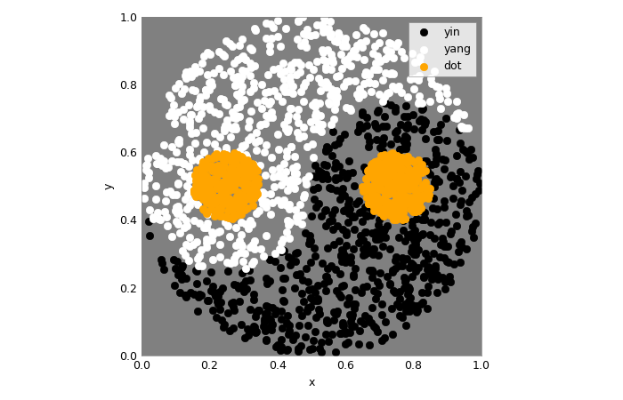
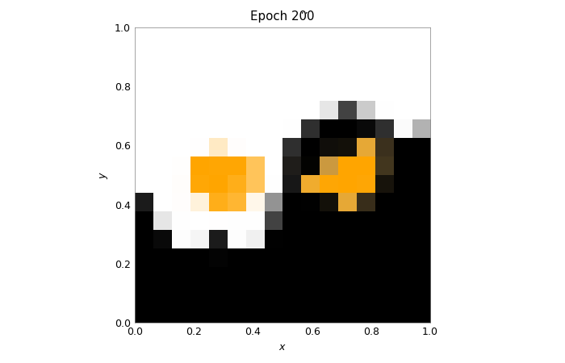

Train DNNs on BrainScaleS-2
===========================

This example uses the PyTorch extension ``hxtorch``, already presented in the
:doc:`introduction to the matrix multiplication <4-hagen_properties>`, to train
a deep neural network (DNN).

.. code:: ipython3

    import ipywidgets as w
    import numpy as np
    import torch
    import torch.nn.functional as F
    import hxtorch

    import matplotlib as mpl
    import matplotlib.pyplot as plt
    from contextlib import suppress
    with suppress(IOError):
        plt.style.use("_static/matplotlibrc")
    try:
        %matplotlib notebook
    except:
        %matplotlib inline
    from IPython.display import HTML
    display(HTML(""))

The Yin-Yang dataset
--------------------

.. code:: ipython3

    class YinYangDataset(torch.utils.data.dataset.Dataset):
        def __init__(self, r_small=0.1, r_big=0.5, size=1000, seed=42):
            super(YinYangDataset, self).__init__()
            # numpy RNG to allow compatibility to other learning frameworks
            self.rng = np.random.RandomState(seed)
            self.r_small = r_small
            self.r_big = r_big
            self.size = size

        def get_sample(self, goal=None):
            # sample until goal is satisfied
            found_sample_yet = False
            while not found_sample_yet:
                # sample x,y coordinates
                x, y = self.rng.rand(2) * 2. * self.r_big
                # check if within yin-yang circle
                if np.sqrt((x - self.r_big)**2 + (y - self.r_big)**2) > self.r_big:
                    continue
                # check if they have the same class as the goal for this sample
                c = self.which_class(x, y)
                if goal is None or c == goal:
                    found_sample_yet = True
                    break
            return x, y, c

        def which_class(self, x, y):
            # equations inspired by
            # https://link.springer.com/content/pdf/10.1007/11564126_19.pdf
            d_right = self.dist_to_right_dot(x, y)
            d_left = self.dist_to_left_dot(x, y)
            criterion1 = d_right <= self.r_small
            criterion2 = d_left > self.r_small and d_left <= 0.5 * self.r_big
            criterion3 = y > self.r_big and d_right > 0.5 * self.r_big
            is_yin = criterion1 or criterion2 or criterion3
            is_circles = d_right < self.r_small or d_left < self.r_small
            if is_circles:
                return 2
            return int(is_yin)

        def dist_to_right_dot(self, x, y):
            return np.sqrt((x - 1.5 * self.r_big)**2 + (y - self.r_big)**2)

        def dist_to_left_dot(self, x, y):
            return np.sqrt((x - 0.5 * self.r_big)**2 + (y - self.r_big)**2)

        def __getitem__(self, index):
            # keep num of class instances balanced by using rejection sampling
            # choose class for this sample
            goal_class = self.rng.randint(3)
            x, y, c = self.get_sample(goal=goal_class)
            sample = (torch.tensor([x, y, 1-x, 1-y], dtype=torch.float), c)
            return sample

        def __len__(self):
            return self.size

.. code:: ipython3

    colors = ('black', 'white', 'orange')
    class_names = ('yin', 'yang', 'dot')
    num_samples = 2000

    loader = torch.utils.data.DataLoader(
        dataset=YinYangDataset(size=num_samples),
        batch_size=num_samples)

    samples, labels = next(iter(loader))

    fig, ax = plt.subplots(1,1)
    for i in range(3):
        ax.scatter(
            *samples[labels==i][..., :2].t(),
            c=colors[i], label=class_names[i])
    ax.set_aspect('equal')
    ax.set_facecolor('gray')
    ax.set_xlim(0,1); ax.set_ylim(0,1)
    ax.set_xlabel("x"); ax.set_ylabel("y")
    _=ax.legend()

.. admonition:: References for further reading

    -  Kriener, L., Göltz, J., & Petrovici, M. A. (2021).
       The Yin-Yang dataset. arXiv preprint `arXiv:2102.08211 <https://arxiv.org/abs/2102.08211>`__.

Training with hardware in the loop
----------------------------------

.. code:: ipython3

    # initializes the hardware connection
    # and applies a default calibration
    hxtorch.init_hardware()

.. code:: ipython3

    def alpha_cmap(color):
        """
        Returns a colormap ranging from transparent to specified color
        """
        cmap = np.broadcast_to(mpl.colors.to_rgba(color), (256, 4)).copy()
        cmap[:, -1] = np.linspace(0, 1, 256)
        return mpl.colors.ListedColormap(cmap)

    def test_train_epoch(model: torch.nn.Module,
                         loader: torch.utils.data.DataLoader,
                         optimizer: torch.optim.Optimizer):
        """
        Test the model and train for a single epoch afterwards.
        :param model: The model
        :param loader: Data loader containing the train data set
        :param optimizer: Optimizer that handles the weight updates
        """
        # prepare test data (grid of equal spaced samples):
        gridsize = 16  # one dimension of the test grid
        x = y = torch.linspace(0, 1, gridsize)
        x, y = torch.meshgrid(x, y); x, y = x.flatten(), y.flatten()
        data_test = torch.tensor(list(zip(x, y, 1-x, 1-y)), requires_grad=True)
        data, target = next(iter(loader))
        data = torch.cat((data_test, data))  # prepend to train data
        # the actual training:
        model.train()
        optimizer.zero_grad()
        output = model(data)
        loss = F.cross_entropy(output[len(data_test):], target)
        loss.backward()
        optimizer.step()
        # get test data from output and reshape:
        with torch.no_grad():
            output_test = F.softmax(output[:len(data_test)], dim=-1)
        output_test = output_test.reshape(gridsize, gridsize, -1)
        return torch.transpose(output_test, 0, 1)

    def train(model: torch.nn.Module,
              loader: torch.utils.data.DataLoader,
              scheduler: torch.optim.lr_scheduler._LRScheduler,
              num_epochs: int = 200):
        """
        Train the model while displaying the test results.
        :param model: The model
        :param loader: Data loader containing the train data set
        :param scheduler: Scheduler that handles the weight updates
        :param num_epochs: Number of epochs to train
        """
        fig = plt.figure()
        ax = plt.gca()
        ax.grid(False)
        ax.set_title("Epoch 0")
        imgs = []
        for i, c in enumerate(colors):
            imgs.append(plt.imshow(
                torch.zeros((1, 1)), vmin=0, vmax=1,
                extent=(0, 1, 0, 1), origin='lower',
                cmap=alpha_cmap(c)))
        plt.xlabel("$x$"); plt.ylabel("$y$")

        for _ in range(num_epochs + 1):
            test_out = test_train_epoch(model, loader, scheduler.optimizer)
            for i, img in enumerate(imgs):
                img.set_data(test_out[..., i])
            ax.set_title(f"Epoch {scheduler.last_epoch}")
            fig.canvas.draw()
            scheduler.step()
        wout = w.Output(layout=w.Layout(height="450px")); display(wout)
        plt.close(); wout.layout=w.Layout(height="0px")

.. code:: ipython3

    class Model(torch.nn.Module):
        """
        Classify the YinYang dataset.
        """
        def __init__(self, mock: bool = False):
            super().__init__()
            self.classifier = torch.nn.Sequential(
                hxtorch.nn.Linear(4, 128, mock=mock),
                hxtorch.nn.ConvertingReLU(shift=1),
                hxtorch.nn.Linear(128, 3, avg=5, mock=mock),
            )

        def forward(self, *x):
            x = x[0] * 31.  # scale to the whole input range
            x = self.classifier(x)
            return x

.. code:: ipython3

    model_mock = Model(mock=True)
    model_mock

.. parsed-literal::
    :class: solution

    Model(
      (classifier): Sequential(
        (0): Linear(in_features=4, out_features=128, num_sends=20, mock=True)
        (1): ConvertingReLU(shift=1)
        (2): Linear(in_features=128, out_features=3, num_sends=4, mock=True)
      )
    )

.. code:: ipython3

    batch_size = 350
    lr = 1  # learning rate
    gamma = 0.99  # learning parameters decay

    loader = torch.utils.data.DataLoader(
        dataset=YinYangDataset(size=batch_size),
        batch_size=batch_size)
    scheduler = torch.optim.lr_scheduler.StepLR(
        torch.optim.Adam(model_mock.parameters(), lr=lr),
        step_size=1, gamma=gamma)

.. code:: ipython3

    train(model_mock, loader, scheduler, num_epochs=200)

.. code:: ipython3

    model_hw = Model(mock=False)
    # initialize with state of mock model
    model_hw.load_state_dict(model_mock.state_dict())
    model_hw

.. parsed-literal::
    :class: solution

    Model(
      (classifier): Sequential(
        (0): Linear(in_features=4, out_features=128, bias=None, num_sends=20)
        (1): ConvertingReLU(shift=1, mock=True)
        (2): Linear(in_features=128, out_features=3, bias=None, num_sends=4)
      )
    )

.. code:: ipython3

    lr = 0.2
    gamma = 0.9

    scheduler_hw = torch.optim.lr_scheduler.StepLR(
        torch.optim.Adam(model_hw.parameters(), lr=lr),
        step_size=1, gamma=gamma)

.. code:: ipython3

    train(model_hw, loader, scheduler_hw, num_epochs=15)

.. image:: _static/yin_yang_itl_out2.png
    :width: 90%
    :align: center
    :class: solution
