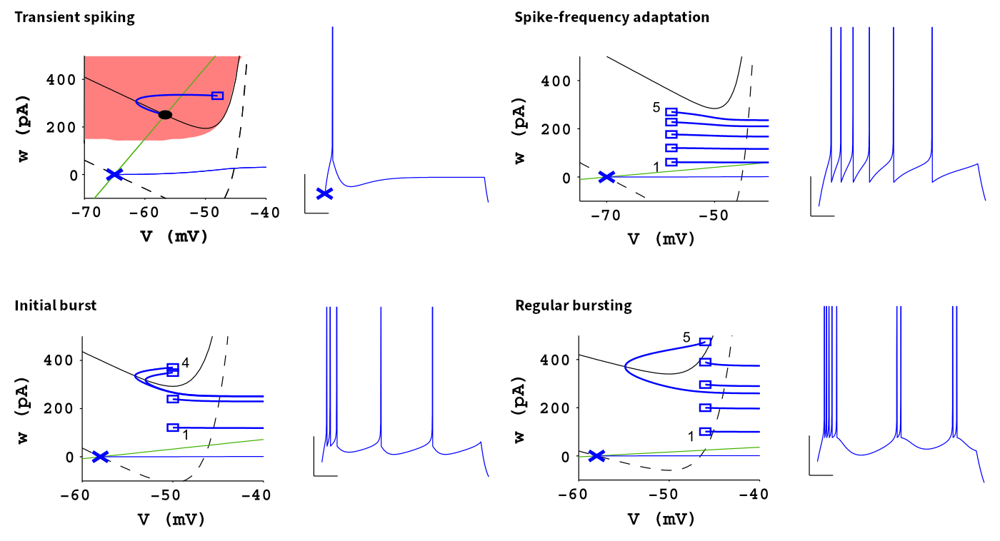

Complex Neuron Dynamics with a Silicon Adaptive Exponential Integrate-and-Fire Neuron
=====================================================================================

Biological neurons exhibit electrophysiological behavior beyond the
dynamics of the plain leaky integrate-and-fire model. These dynamics
include adaptation processes on vastly different time scales which may
act either as positive or as negative feedback, which can lead to
bistable behavior such as transient dynamics or bursting. A plethora of
more complex neuron models attempt to capture these higher-order
effects with a varying degree of biophysical detail.

The adaptive exponential integrate-and-fire model
-------------------------------------------------

The adaptive exponential integrate-and-fire (AdEx) equations address
this in a rather phenomenological manner and for that purpose simply
extend the leaky integrate-and-fire equation. It introduces an
exponential feedback current to mimic the onset of an action potential
and augments the membrane equation by a second differential equation for
an adaptation current :math:`w`:

.. math::
   C\frac{\operatorname{d} V}{\operatorname{d} t} &= -g_l\left(V-E_l\right)
                   \,+\, g_\text{l}\Delta_\text{T}\operatorname{exp}\left(\frac{V-V_\text{T}}{\Delta_\text{T}}\right)
                   \,-\, w
                   \,+\, I_\text{stim}\\[1em]
                   \tau_w \frac{\operatorname{d}w}{\operatorname{d}t} &= a\left(V-E_\text{l}\right) - w \,.

On top of the LIF model, these equations introduce the exponential slope
and threshold :math:`\Delta_\text{T}` and :math:`V_\text{T}`,
respectively, the adaptation current :math:`w`, its time constant
:math:`\tau_w`, the spike-triggered increment of the adaptation state
:math:`b`, and the subthreshold adaptation strength :math:`a`.

The silicon neuron possesses a set of additional, more technical
parameters, e.g. for the baseline of the adaptation state voltage.

A rather detailed analysis of the AdEx dynamics was performed by Naud et
al. (2008) and might be useful for the interested reader:

`Naud, Richard, Nicolas Marcille, Claudia Clopath, and Wulfram Gerstner.
“Firing patterns in the adaptive exponential integrate-and-fire model.”
Biological cybernetics 99 (2008):
335-347. <https://www.ncbi.nlm.nih.gov/pmc/articles/PMC2798047/>`__

The firing patterns of the AdEx model
-------------------------------------

The AdEx dynamics are capable of reproducing many of the firing patterns
whitnessed in electrophysiological recordings – only by means of
choosing suitable model parameters. Naud et al. (2008) analyzed these
different configurations in great detail. We will, in the following,
limit ourselves to the following four examples (adapted from Naud et
al. (2008)):

Each pattern is an AdEx neuron’s response to a constant step current. It
is characterized through the resulting spike times and the membrane
trace, which is shown next to the trajectory through the phase space of
both the membrane potential :math:`V` and the adaptation current
:math:`w`. These phase diagrams display the behavior of the complete
dynamical system including, e.g., the discontinuities at the respective
spike times. They also indiciate the nullclines, i.e. the curves where
:math:`\dot V (w) = 0` (black curves, solid: resting state, dashed:
during stimulus) and :math:`\dot w (V) = 0` (green line), respectively.
For a more detailed description, please refer to Naud et al. (2008).

Silicon neuron implementation
-----------------------------

The silicon neurons of BrainScaleS-2 attempt to faithfully implement the
AdEx dynamics as captured by the above system of differential equations.
Each model parameter can be tuned by means of either programmable
voltage references or bias currents.

Deviating from the original equations, the silicon neuron keeps track of
the adaptation state in form of a voltage, which is then converted into
a current flowing onto the membrane; the neuron consists of two coupled
leaky integrators. The resistive elements behind these RC circuits are
implemented from active, transistor-based (trans-)conductances and can
be tuned through bias currents (higher bias currents will result in
stronger conductances – corresponding to, e.g., lower time constants).
While cross-dependencies between different parameters have been reduced
to a minimum during the design phase, a direct one-to-one correspondence
between model and circuit parameters is not always guaranteed. The
following diagram attempts to highlight the fundamental dependencies and
all parameters revelant for a basic understanding of the AdEx circuits.

The two RC circuits representing the membrane and the adaptation term
are coupled through two voltage-controlled current sources with a
tunable transconductance (strength), which we use to, e.g., tune the
subthreshold adaptation strength.

.. code:: ipython3

    %matplotlib inline
    from _static.common.helpers import setup_hardware_client
    setup_hardware_client()

    import pynn_brainscales.brainscales2 as pynn

    from _static.tutorial.snn_adex_helpers import plot_membrane_dynamics, build_gui
    from ipywidgets import fixed

    import matplotlib.pyplot as plt

.. code:: ipython3

    import pyhalco_hicann_dls_vx_v3 as halco

    def adjust_calibration():
        for i in halco.iter_all(halco.CommonNeuronBackendConfigOnDLS):
            pynn.simulator.state.grenade_chip_config.neuron_block.backends[i].enable_clocks = True
            pynn.simulator.state.grenade_chip_config.neuron_block.backends[i].clock_scale_fast = 3
            pynn.simulator.state.grenade_chip_config.neuron_block.backends[i].clock_scale_slow = 3
            pynn.simulator.state.grenade_chip_config.neuron_block.backends[i].\
                clock_scale_adaptation_pulse = 7
            pynn.simulator.state.grenade_chip_config.neuron_block.backends[i].\
                clock_scale_post_pulse = 5

.. code:: ipython3

    def experiment(**kwargs):
        global last_configuration
        last_configuration = kwargs

        target_neuron = kwargs.pop("target_neuron", 0)

        pynn.setup(neuronPermutation=[target_neuron, target_neuron + 1])

        pop = pynn.Population(2, pynn.cells.HXNeuron())

        neuron = pop[0]
        readout_dummy = pop[1]

        neuron.reset_v_reset = 300
        neuron.reset_i_bias = 1022
        neuron.reset_enable_multiplication = True
        neuron.membrane_capacitance_capacitance = 63
        neuron.refractory_period_refractory_time = 30
        neuron.refractory_period_enable_pause = True

        neuron.threshold_v_threshold = 620
        neuron.threshold_enable = True

        # adaptation
        neuron.adaptation_enable_pulse = True
        neuron.adaptation_i_bias_b = 0

        neuron.multicompartment_connect_right = True

        neuron.exponential_enable = any([k.startswith("exponential") for k in kwargs.keys()])

        if any([k.startswith("adaptation") for k in kwargs.keys()]):
            enable_adaptation = False
            if "adaptation_i_bias_a" in kwargs.keys() and kwargs["adaptation_i_bias_a"] != 0:
                enable_adaptation = True
            if "adaptation_i_bias_b" in kwargs.keys() and kwargs["adaptation_i_bias_b"] != 0:
                enable_adaptation = True
            neuron.adaptation_enable = enable_adaptation

            if enable_adaptation:
                # the adaptation leak reference has to track the membrane leak to avoid offset currents
                neuron.adaptation_v_leak = 500 + kwargs["leak_v_leak"] - 700

        for k, v in kwargs.items():
            setattr(neuron, k, v)

        readout_dummy.membrane_capacitance_capacitance = 0
        readout_dummy.leak_i_bias = 0
        readout_dummy.leak_enable_division = True
        readout_dummy.threshold_enable = False

        pop[0:1].record(["adaptation", "spikes"])
        pop[1:2].record(["v"])

        adjust_calibration()

        # schedule and execute hardware run
        pop[0:1].set(constant_current_enable=False)
        pynn.run(0.1, pynn.RunCommand.APPEND)
        pop[0:1].set(constant_current_enable=True)
        pynn.run(0.6, pynn.RunCommand.APPEND)
        pop[0:1].set(constant_current_enable=False)
        pynn.run(0.3, pynn.RunCommand.EXECUTE)

        plot_membrane_dynamics(pop)
        plt.show()

        pynn.end()

Understanding subthreshold adaptation
-------------------------------------

1. Get accustomed with the shown neuron parameters and attempt to
   associate them with model parameters from the differential equations.
2. Observe the membrane and adaptation states and characterize their
   response to a change in the stimulus current and sub-threshold
   adaptation bias. (*Hint: It might be advantageous to start from a
   clean state, i.e. re-execute the cell to reset the parameters.*)

   - You should be able to observe a “ringing” at the transients,
     visible as an overshoot at the leading and trailing edges of the
     stimulus current.
   - Can you induce a (dampened) oscillatory behavior at the transients
     of the stimulus? Consider strengthening the sub-threshold adaptation
     and aligning the leak and adaptation time constants (by slowing down
     the membrane and increasing the speed of the adaptation state).

.. code:: ipython3

    build_gui(experiment, ["leak_i_bias", "leak_v_leak", "adaptation_v_ref", "adaptation_i_bias_tau", "adaptation_i_bias_a", "constant_current_i_offset"], {"target_neuron": fixed(1)}, defaults={"adaptation_i_bias_a": 10, "leak_enable_division": True})

Transient spiking
-----------------

3. Let’s now consider a few more neuron parameters (i.e. *reset
   potential*, *spike-triggered adaptation strength*, *exponential onset
   potential*, and *exponential slope bias*). Associate them with
   quantities from the differential equations.
4. Exploit the overshoot observed before to reach a configuration where
   the neuron only fires at the leading edge of the stimulus.

   - Gradually reduce the exponential onset potential until you oberve
     spikes. What’s the impact of this voltage and the reset potential
     on the spike count?
   - Configure the neuron to emit approximately three spikes marking
     the onset of the stimulus. Now increase the spike-triggered
     adaptation strength and observe its impact on the adaptation state
     and the spike count. Adjust it to enforce only a single spike.

.. code:: ipython3

    build_gui(experiment, ["leak_i_bias", "leak_v_leak", "reset_v_reset", "adaptation_v_ref", "adaptation_i_bias_tau", "adaptation_i_bias_a", "adaptation_i_bias_b", "exponential_v_exp", "exponential_i_bias", "constant_current_i_offset"], {"target_neuron": fixed(0)}, copy_configuration=True)

.. image:: _static/tutorial/adex-transient.png
   :width: 100%
   :class: solution

Spike-frequency adaptation
--------------------------

5. Let us now consider a state with dominating spike-triggered
   adaptation by reducing (or disabling) the strength of the
   sub-threshold component. Reduce the exponential onset potential until
   you observe approximately a dozen spikes during the stimulus (and
   only during the stimulus).
6. Now increase the spike-triggered adaptation strength and observe its
   impact on the inter-spike intervals. Also describe the impact of the
   adaptation time constant and vary the stimulus current strength.

.. code:: ipython3

    build_gui(experiment, ["leak_i_bias", "leak_v_leak", "reset_v_reset", "adaptation_v_ref", "adaptation_i_bias_tau", "adaptation_i_bias_a", "adaptation_i_bias_b", "exponential_v_exp", "exponential_i_bias", "constant_current_i_offset"], {"target_neuron": fixed(0)}, defaults={"adaptation_i_bias_a": 0, "adaptation_i_bias_b": 200}, copy_configuration=True)

Bursting
--------

7.  Using your freshly gained knowledge, configure the neuron for
    spike-frequency adaptation and roughly a dozen spikes. Now,
    carefully increase the reset potential such that it approaches the
    turning “point of no return” induced by the exponential current.
8.  Replicate “initial bursting”, characterized by a quick burst of
    spikes at the onset of the stimulus followed by regularly spaced
    individual action potentials. Have a closer look at the membrane
    potential. Can you discern a difference in the membrane’s trajectory
    after a spike within a burst and an individual spike?
9.  Continue slowly increasing the reset potential. Configure the neuron
    for regular bursting.
10. In both cases, explore the impact of the adaptation time constant
    and the spike-triggered adaptation strength.

.. code:: ipython3

    build_gui(experiment, ["leak_i_bias", "leak_v_leak", "reset_v_reset", "adaptation_v_ref", "adaptation_i_bias_tau", "adaptation_i_bias_a", "adaptation_i_bias_b", "exponential_v_exp", "exponential_i_bias", "constant_current_i_offset"], {"target_neuron": fixed(0)}, copy_configuration=True)

.. image:: _static/tutorial/adex-bursting.png
   :width: 100%
   :class: solution

