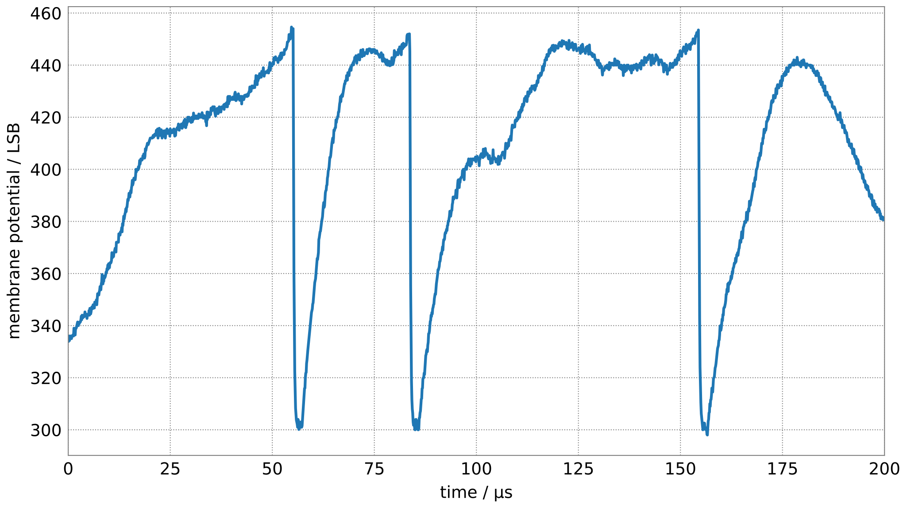
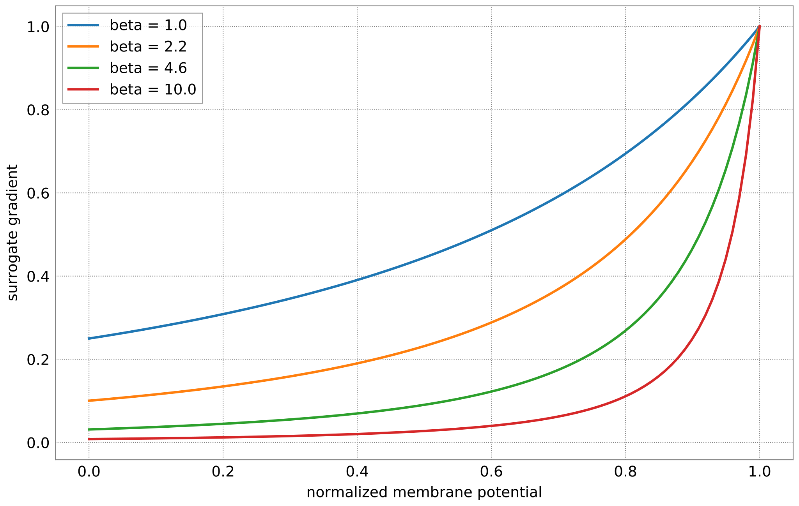
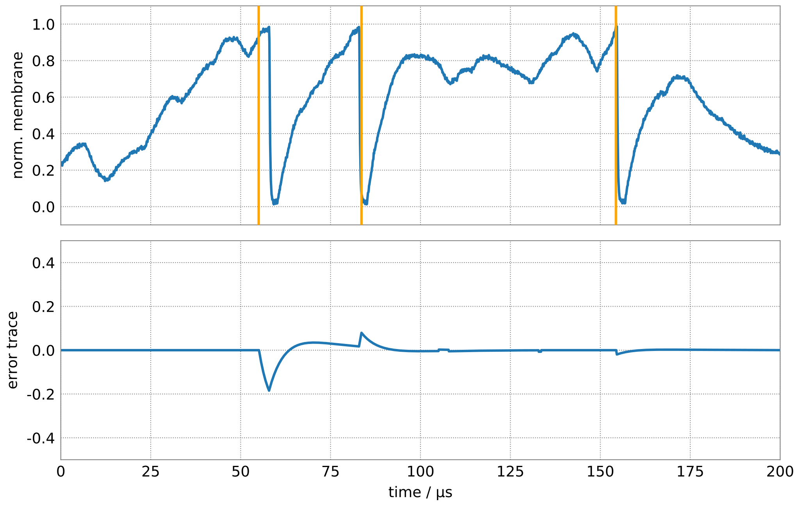
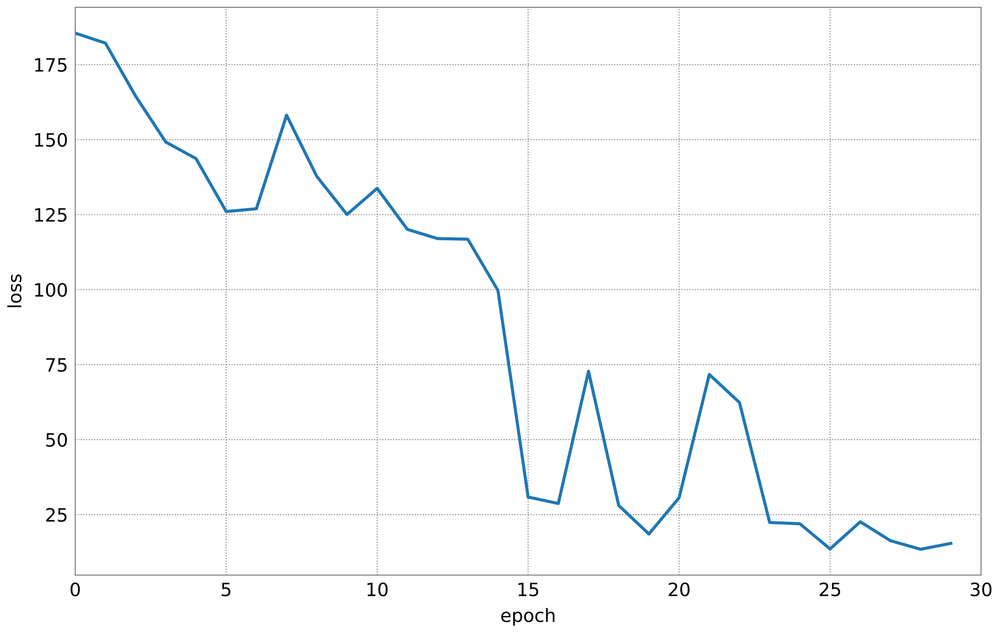

Learning with the SuperSpike rule
=================================

In the previous example, you accustomed yourself with BrainScaleS-2's
analog neuron circuit. Here, we will build on this knowledge and train a
single neuron to reproduce a pre-defined target spike train. For this
purpose, we will implement the SuperSpike learning rule [1] to minimize
the van Rossum distance between the targets and the spikes produced by
our neuron.

Specifically, we will

-  set up a network using PyNN,
-  generate a target spike train,
-  re-initialize the network’s weights,
-  and implement an in-the-loop training scheme directly in Python.

Training spiking networks with surrogate gradients
--------------------------------------------------

The discontinuity introduced by the spiking threshold presents
challenges when it comes to training networks of spiking neurons with
gradient-based methods, especially when employing sparse coding
techniques far away from the rate coding limit. Recently, efforts have
been made by “smoothing” out the true activation function for the
backward pass [1,2,3,4,5]. These “surrogate gradients” allow to easily
train feed-forward as well as recurrent SNNs on common benchmark datasets.

For BrainScaleS-2, we have developed a powerful in-the-loop training
scheme that allows to perform backpropagation through time using
auto-differentiation frameworks [6]. With a feed-forward network, we
reached 97.6 % test accuracy on the MNIST dataset. The accelerated
emulation allowed to classify more than 85k images per second with an energy
budget of only 2.4 μJ per image. Moreover, we trained a recurrent SNN on
natural language data from the SHD dataset [7].

In this example, we will not go that far. Instead, we will implement the
forward-integrated SuperSpike learning rule on a simple artifical input
pattern. In case you are interested, though, please refer to the original
publication.

.. admonition:: References for further reading

    1. Zenke, Friedemann, and Surya Ganguli. “Superspike: Supervised
       learning in multilayer spiking neural networks.” *Neural computation* 30.6 (2018): 1514-1541.
    2. Neftci, Emre O., Hesham Mostafa, and Friedemann Zenke. “Surrogate
       gradient learning in spiking neural networks: Bringing the power of
       gradient-based optimization to spiking neural networks.” IEEE Signal
       Processing Magazine 36.6 (2019): 51-63.
    3. Bellec, Guillaume, et al. “A solution to the learning dilemma for
       recurrent networks of spiking neurons.” Nature communications 11.1
       (2020): 1-15.
    4. Bohte, Sander M. “Error-backpropagation in networks of fractionally
       predictive spiking neurons.” International Conference on Artificial
       Neural Networks. Springer, Berlin, Heidelberg, 2011.
    5. Esser, Steven K., et al. “Convolutional networks for fast,
       energy-efficient neuromorphic computing.” Proceedings of the national
       academy of sciences 113.41 (2016): 11441-11446.
    6. Cramer, Benjamin, et al. “Surrogate gradients for analog neuromorphic
       computing” Proceedings of the national academy of sciences 119.4 (2022)
    7. Cramer, Benjamin, et al. “The Heidelberg Spiking Data Sets for the
       Systematic Evaluation of Spiking Neural Networks.” IEEE Transactions
       on Neural Networks and Learning Systems (2020).

In order to use the microscheduler we have to set some environment variables first:

.. include:: common_quiggeldy_setup.rst

.. code:: ipython3

    %matplotlib inline
    import numpy as np
    import ipywidgets as w
    import matplotlib.pyplot as plt
    from contextlib import suppress
    with suppress(IOError):
        plt.style.use("_static/matplotlibrc")

    import pynn_brainscales.brainscales2 as pynn
    np.random.seed(1234)

Helper functions
----------------

Let's define some helper functions for plotting.

.. code:: ipython3

    def create_figure():
        fig, axes = plt.subplots(2, 1)

        axes[0].set_ylabel("norm. membrane")
        axes[0].set_xlim(0, duration * 1e6)
        axes[0].set_xticklabels([])
        axes[0].plot([], [], c="C0")
        axes[0].set_ylim(-0.1, 1.1)

        axes[1].set_xlabel("time / μs")
        axes[1].set_ylabel("error trace")
        axes[1].set_xlim(0, duration * 1e6)
        axes[1].plot([], [], c="C0")
        axes[1].set_ylim(-0.5, 0.5)

        return fig, axes

    def update_figure(fig, *data):
        for ax, d in zip(fig.axes, data):
            ax.get_lines()[0].set_data(d[0] * 1e6, d[1])
        display(fig)

Define network in PyNN
----------------------

First, we will set up some variables determining the network structure. We will
furthermore define the binning of the stimuli and the later calculation of the
weight updates.

.. code:: ipython3

    n_inputs = 25

    duration = 200e-6  # s in wallclock time
    dt = 0.1e-6

    n_steps = int(duration / dt)

    time = np.arange(n_steps) * dt
    bins = np.arange(n_steps + 1) * dt

Before we define our network, we load the default calibration.

.. include:: common_nightly_calibration.rst

Now, we can define the network itself using PyNN.

.. code:: ipython3

    # setup PyNN and inect calibration data
    pynn.setup(initial_config=calib)

    # create output population (one neuron) and record its observables
    pop_output = pynn.Population(1, pynn.cells.HXNeuron())
    pop_output.record(["spikes", "v"])

    # create spike sources
    pop_input = pynn.Population(n_inputs, pynn.cells.SpikeSourceArray(spike_times=[]))

    # define two projections (excitatory + inhibitory) to allow signed weights
    synapse_exc = pynn.standardmodels.synapses.StaticSynapse(weight=42)
    synapse_inh = pynn.standardmodels.synapses.StaticSynapse(weight=-42)
    projection_io_inh = pynn.Projection(pop_input, pop_output,
                                 pynn.AllToAllConnector(),
                                 synapse_type=synapse_inh,
                                 receptor_type="inhibitory")
    projection_io_exc = pynn.Projection(pop_input, pop_output,
                                 pynn.AllToAllConnector(),
                                 synapse_type=synapse_exc,
                                 receptor_type="excitatory")

To work around Dale’s law, we have to merge two projections together to
form signed synapses. The following function assigns the signed weight
matrix to the two projections.

.. code:: ipython3

    def set_weights(weights, w_max=63):
        # limit weights to hw boundaries
        weights = weights.clip(-w_max, w_max)

        integer_weights = np.round(weights).astype(int)
        w_exc = integer_weights * (integer_weights >= 0).astype(int)
        w_inh = integer_weights * (integer_weights < 0).astype(int)

        projection_io_inh.set(weight=w_inh)
        projection_io_exc.set(weight=w_exc)

Construct Poisson input spike trains
------------------------------------

To generate (fixed-seed) random inputs, we calculate binned spike trains
according to a Bernoulli process.

.. code:: ipython3

    np.random.seed(123456)

    freq = 10e3  # Hz (remember the acceleration factor!)
    input_spikes = []
    stimuli_dense = np.random.rand(n_inputs, n_steps) < freq * dt
    stimuli_dense[:, (time > (duration - 20e-6))] = 0

    for s in stimuli_dense:
        input_spikes.append(np.where(s)[0] * dt * 1e3) # convert to ms for pyNN

    pop_input.set(spike_times=input_spikes)

Generating a taget spike train
------------------------------

Now, we can inject the previously defined input spike trains into our target
neuron. For this purpose, we first randomly initialize the synaptic weights.

The resulting output spikes will later be used as a target spike train.
The difficulty of the task will depend on the number and timing of target
spikes.

Exercises
~~~~~~~~~

- Play around with the mean and standard deviation of the weight distribution
  and observe the output of the neuron. Try to get the neuron to emit
  approximately 3 to 4 spikes. This spike train will later be used as a target
  spike train :math:`\hat S_i`.

.. code:: ipython3

    @w.interact(
        weight_mean=w.FloatSlider(
            27, min=0, max=40, continuous_update=False),
        weight_std=w.FloatSlider(
            1, min=0, max=10, continuous_update=False)
    )
    def experiment(weight_mean, weight_std):
        global v_mem, target_spikes
        np.random.seed(123)
        weights = np.random.normal(weight_mean, weight_std, size=(n_inputs, 1))
        set_weights(weights)
        pynn.run(duration * 1e3)

        data = pop_output.get_data()

        target_spikes = data.segments[-1].spiketrains[0] / 1e3  # convert ms to s

        membrane = data.segments[-1].irregularlysampledsignals[0]
        v_mem = np.interp(time, membrane.times / 1e3, membrane.magnitude[:, 0])

        fig = plt.figure()
        ax = fig.gca()
        ax.plot(time*1e6, v_mem)

        ax.set_xlim(0, duration*1e6)
        ax.set_xlabel("time / μs")
        ax.set_ylabel("membrane potential / LSB")
        pynn.reset()
    experiment(27, 1); plt.close()  # needed for testing

Extract the dynamic range from the above plot to normalize the membrane
potential for calculating the surrogate gradient.

.. code:: ipython3

    v_zero = v_mem.min()
    dynamic_range = v_mem.max() - v_zero

The SuperSpike learning rule
----------------------------

The SuperSpike learning rule was derived to perform gradient descent on
the van Rossum distance

.. math::  \mathcal{L} = \frac{1}{2} \int_{-\infty}^t \mathrm{d}s \, \left[ \left( \alpha * \hat S_i(s) - \alpha * S_i(s) \right) \right]^2 =: \frac{1}{2} \int_{-\infty}^t \mathrm{d}s \, e_i(s)^2

between the current spike train :math:`S_i` and the target spike train :math:`\hat S_i`.
Here, :math:`\alpha` is the kernel used to calculate the van Rossum distance and :math:`e_i(s)` the error signal.
The weight update rule can in the end be written as

.. math::  \Delta w_{ij}^k = \eta \int \mathrm{d}s \, e_i(s) \cdot \alpha * \left[ \sigma^\prime (v_i(s)) \cdot (\epsilon * S_j)(s) \right] \,

where :math:`\sigma^\prime` represents the
surrogate gradient of membrane potential :math:`v_i`, and
:math:`\epsilon` the exponentially decaying kernel of the synaptic
currents.

The integral consists of a Hebbian contribution which combines the
surrogate gradient of the membrane potential with the exponentially
decaying synaptic currents as eligibility traces. This term is augmented
by the error signal as a third factor, which can be calculated through
backpropagation for multi-layer networks.

The learning rule can be forward-integrated alongside the neuronal
dynamics, which makes it particularly interesting for online learning
applications.

Let's have a look at the surrogate function :math:`\sigma^\prime` as a function of
the steepness paramter :math:`\beta`.

.. code:: ipython3

    def superspike(v_m, beta=5.0):
        return np.power(1 + np.abs(beta * (v_m - 1.0)), -2)

    fig = plt.figure()
    ax = fig.gca()

    v = np.linspace(0, 1, 100)

    for beta in np.logspace(np.log10(1), np.log10(10), 4):
        ax.plot(v, superspike(v, beta=beta), label=f"beta = {beta:.1f}")

    ax.legend(loc="upper left")
    ax.set_xlabel("normalized membrane potential")
    ax.set_ylabel("surrogate gradient");

The SuperSpike learning rules requires estimates of the neuro-synaptic
time constants. Here, we use the same values as targeted for the deployed
calibration data.

.. code:: ipython3

    tau_mem = 10e-6
    tau_syn = 5e-6

Construct kernels for the learning rule, including the van Rossum
distance.

.. code:: ipython3

    n_kernel_steps = int(100e-6 / dt)
    n_kernel_steps = n_kernel_steps + (1 - n_kernel_steps % 2)

    kernel_psc = np.zeros(n_kernel_steps)
    kernel_psc[-int(kernel_psc.size / 2):] += np.exp(-np.arange(int(kernel_psc.size / 2)) / (tau_syn / dt))

    kernel_psp = kernel_psc.copy()
    kernel_psp[-int(kernel_psp.size / 2):] -= np.exp(-np.arange(int(kernel_psp.size / 2)) / (tau_mem / dt))

    kernel_vrd = kernel_psp.copy()

Training the network
--------------------

We can now implement above's weight update expression in Python and use it
to train our network to replicate the target spike train generated above.

Exercises
~~~~~~~~~

- Train the network for different target spike trains (:math:`\hat S_i`). For that purpose,
  modify above's cell for the target generation (e.g. seed, firing rate,
  weights, …).
- Play around with the hyper parameters such as the learning rate (`eta`).
- How does the steepness of the surrogate gradient (`beta`) affect learning
  performance?

.. code:: ipython3

    fig, axes = create_figure()
    plt.close()
    output = w.Output()
    display(output)

    # plot target spikes
    for t in target_spikes:
        axes[0].axvline(t * 1e6, c="orange", zorder=20)

    # define hyperparameters
    n_epochs = 100
    eta = 20.
    beta = 5.

    # initialize weights
    weights = np.random.normal(10, 20, size=(n_inputs, 1))

    # iterate over multiple training "epochs"
    loss = np.zeros(n_epochs)
    for e in range(n_epochs):
        # assign weights to PyNN projections
        set_weights(weights)

        # run the emulation
        pynn.run(duration * 1e3) # convert to ms for PyNN

        # retrieve data
        data = pop_output.get_data()
        spikes = data.segments[-1].spiketrains[0] / 1e3 # convert to SI units (s)
        membrane = data.segments[-1].irregularlysampledsignals[0]

        # resample and normalize mebrane trace
        v_mem = (np.interp(time, membrane.times / 1e3, membrane.magnitude[:, 0]) - v_zero) / dynamic_range

        # reset pyNN state
        pynn.reset()

        # compute van-Rossum distance as error signal
        error = np.convolve(
                np.histogram(target_spikes, bins)[0] - np.histogram(spikes, bins)[0],
                kernel_vrd, mode="same")

        output.clear_output(wait=True)
        with output:
            update_figure(fig, (time, v_mem), (time, error))

        # calculate weight updates
        dw = np.zeros((n_inputs, 1))
        for source in range(n_inputs):
            eligibility = np.convolve(stimuli_dense[source, :], kernel_psc, mode="same")
            integrand = error * np.convolve(
                superspike(v_mem, beta=beta) * eligibility,
                kernel_psp,
                mode="same")
            dw[source, 0] = eta * np.sum(integrand) / n_steps

        # save the loss for later plotting
        loss[e] = np.sum(np.abs(error))

        # apply weight update
        weights += dw

.. code:: ipython3

    fig = plt.figure()
    ax = fig.gca()

    ax.plot(loss)

    ax.set_xlim(0, n_epochs)
    ax.set_xlabel("epoch")
    ax.set_ylabel("loss");

