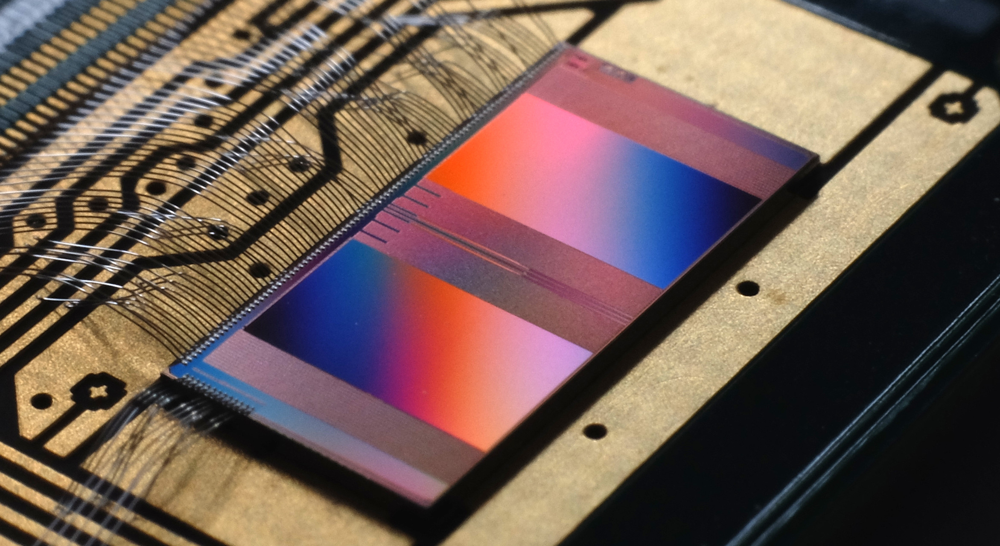

Welcome to the Advanced Physics Lab for Physicists by the Electronic Vision(s) Group
====================================================================================

Hello and welcome to this lab course!
You will learn about BrainScaleS-2, a neuromorphic platform developed in Heidelberg, and gain hands-on experience with the tools required to conduct experiments on this platform.
For that, we will familiarize you with concepts in neuromorphic computing and how they originated from neuroscience.
We start with an overview of the biological behavior of neurons and synapses and present models from literature that are useful in neuromorphic computing.
We then introduce the BrainScaleS-2 system and the software module used to interface with it.
In the experiment part, you will first investigate the behavior of silicon neurons using Lu.i, an analog electronic implementation of a simple neuron model.
Following this, you will learn how to set up and run experiments on BrainScaleS-2 and apply your knowledge in configuring a feedforward network and solving sudoku using neural networks.
We invite you to read the following material before you start the lab course.

.. toctree::
   :maxdepth: 2
   :titlesonly:

   fp_biological-background
   fp_neuromorphic-computing
   fp_brainscales
   fp_pynn_introduction
   fp_lui
   fp_singleNeuron
   fp_synfireChain
   fp_sudoku

.. only:: not latex

    Optional experiments
    ~~~~~~~~~~~~~~~~~~~~

     .. toctree::
        :maxdepth: 0
        :titlesonly:
     
        fp_calibration.rst
        fp_synapticInput.rst
        fp_adex_complex_dynamics.rst
        fp_multicompartment.rst
        fp_superspike.rst

.. only:: latex

    Optional experiments
    ~~~~~~~~~~~~~~~~~~~~

    There are further experiments that are not part of the usual course, but can be both very instructive and helpful in case you want to do a long/short report.
    These experiments include working on the calibration, studying the synaptic input, dealing with more complex neuron models, and training neural networks.
    If you are interested, you can have a look online at the `Electronic Visions github page <https://github.com/electronicvisions/brainscales2-demos/tree/jupyter-notebooks>`_.

.. only:: not html

   References
   ~~~~~~~~~~

.. only:: html

   .. rubric::
      References

If you are curious and want to learn more about the kind of work that has been done with the system, here are a few references that you can check out

* `The BrainScaleS-2 Accelerated Neuromorphic System With Hybrid Plasticity <https://www.frontiersin.org/articles/10.3389/fnins.2022.795876/full>`_
* `Surrogate gradients for analog neuromorphic computing <https://www.pnas.org/doi/full/10.1073/pnas.2109194119>`_
* `Versatile emulation of spiking neural networks on an accelerated neuromorphic substrate <https://ieeexplore.ieee.org/document/9180741>`_
* `hxtorch: PyTorch for BrainScaleS-2 – Perceptrons on Analog Neuromorphic Hardware <https://link.springer.com/chapter/10.1007/978-3-030-66770-2_14>`_
* `Control of criticality and computation in spiking neuromorphic networks with plasticity <https://www.nature.com/articles/s41467-020-16548-3>`_
* `Demonstrating Advantages of Neuromorphic Computation: A Pilot Study <https://www.frontiersin.org/articles/10.3389/fnins.2019.00260>`_
* `Fast and energy-efficient neuromorphic deep learning with first-spike times <https://www.nature.com/articles/s42256-021-00388-x>`_
* `Inference with Artificial Neural Networks on Analog Neuromorphic Hardware <https://link.springer.com/chapter/10.1007/978-3-030-66770-2_15>`_
* `Spiking neuromorphic chip learns entangled quantum states <https://arxiv.org/abs/2008.01039>`_
* `Structural plasticity on an accelerated analog neuromorphic hardware system <https://www.sciencedirect.com/science/article/pii/S0893608020303555>`_
* `Emulating dendritic computing paradigms on analog neuromorphic hardware <https://www.sciencedirect.com/science/article/pii/S0306452221004218>`_
