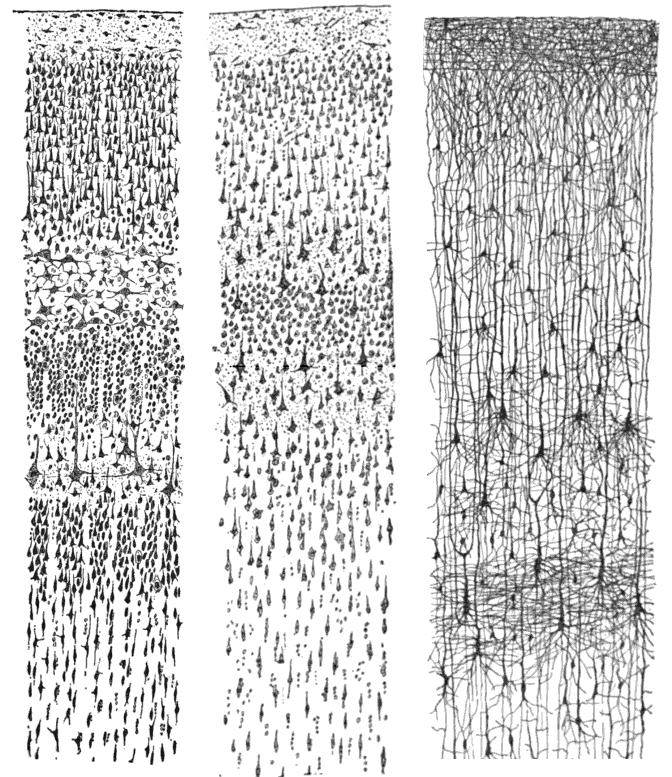
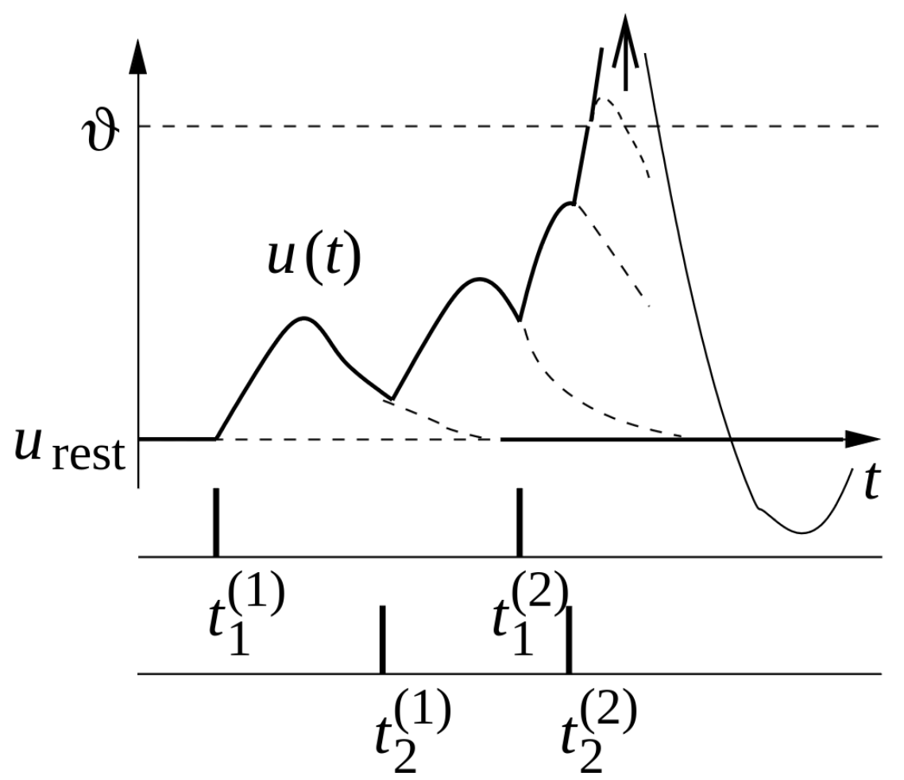
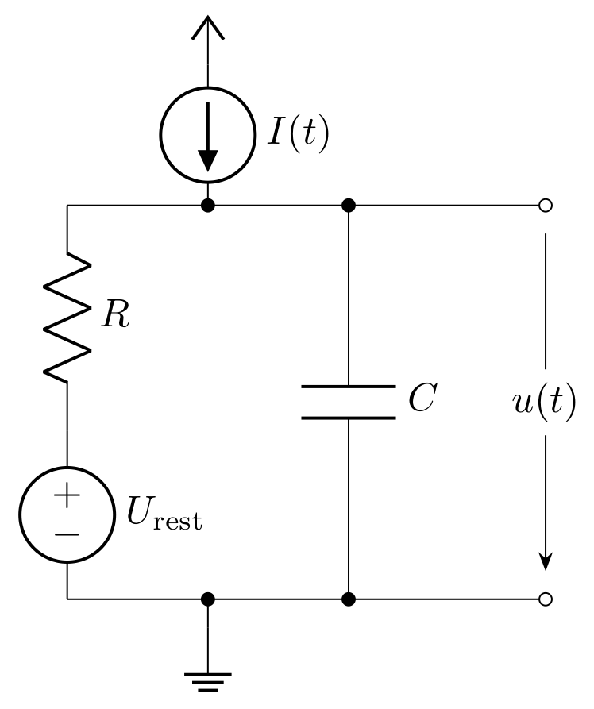

Biological background
=====================

Before digging into the field of neuromorphic computing, it is essential to understand concepts from the central nervous system, the source of inspiration behind this field.
The central nervous system is a highly complex system responsible for many functions in diverse life forms.
These functions include thinking, processing sensory data, and coordinating movements.
The field of neuroscience has explored the nervous system from different perspectives, including anatomy, behavior, and modeling.
In this section, we highlight the major components in the nervous system, and we mathematically describe their behavior.
Specifically, we deal with the concept of an ideal spiking neuron (`Gerstner (2014) <https://courses.edx.org/c4x/EPFLx/BIO465x/asset/nd_ch1.pdf>`_); the name will become clear after the introduction of its basic behavior.
Then, we present models from literature that mimic the neural behavior of interest.

Neurons in Biological Systems
~~~~~~~~~~~~~~~~~~~~~~~~~~~~~

The major building blocks of the nervous system are neurons.
Neurons come in a variety of morphologies or anatomical structures, but the basic structure can be described as consisting of three major parts which serve different functions.
The cell body of the neuron is called the soma, which is the central processing unit of the neuron.
The dendrites are extensions from the soma that carry input signals to the neuron.
The axon is also an extension from the soma that carries output signals to other neurons.
Neurons are connected through synapses, where transmission of signals takes place from a presynaptic neuron to a postsynaptic neuron.
Most synapses are chemical, in which signalling molecules called neurotransmitters are released by the presynaptic neuron.

The electrical signal of interest in the nervous system is the difference in the electrical potential between the interior of the neuron and the exterior of the neuron, referred to as the membrane potential.
This physical quantity is used to describe the state of a single neuron and the communication between neurons.
Originally, a presynaptic neuron receives inputs from synapses through the neurotransmitters.
These neurotransmitters can alter the membrane potential of the neuron either by increasing the potential (excitatory) or decreasing the potential (inhibitory).
Depending on the type and strength of the inputs, the membrane potential exceeds a threshold, and the neuron generates a signal.
This signal is referred to as an “action potential” or a “spike”.
A spike travels along the axon of the presynaptic neuron until it reaches the axon terminals where neurotransmitters are released to different synapses.
These neurotransmitters initiate specific biophysical mechanisms that induce postsynaptic currents in the postsynaptic neurons.
The postsynaptic currents can thus alter the membrane potential of the postsynaptic neurons.
The resulting signals influencing the membrane potential of the postsynaptic neurons are referred to as postsynaptic potentials.

Mathematical Formulation of Neuronal Behavior
~~~~~~~~~~~~~~~~~~~~~~~~~~~~~~~~~~~~~~~~~~~~~

We are interested in mathematically formulating the state of a single neuron and the communication between neurons.
For that, let's have a closer look at the physical behavior of a neuron, especially at the membrane potential of the soma.
In the absence of any stimulation, we observe a negative resting membrane potential of approximately :math:`-65` mV, a strongly negative polarized state.
A stimulation happening through the dendrites changes the membrane potential.
This can be formalized as follows:
At a given time :math:`t` the membrane potential of neuron :math:`i` is :math:`u_i(t)`.
When the neuron is not stimulated, for all times smaller than :math:`0`, the potential is :math:`u_i(t<0) = u_\text{rest}`.
At :math:`t=0`, a stimulation is triggered by a presynaptic neuron :math:`j`.
We define the postsynaptic potential (PSP) as

.. math::
    \epsilon_{ij}(t) := u_i(t) - u_\text{rest}.

To indicate the direction of change we define further

.. math::

    \epsilon_{ij} = u_i(t) - u_\text{rest}
    \begin{cases}
    >0 & \quad \text{excitatory PSP} \\
    <0 & \quad \text{inhibitory PSP}.
    \end{cases}

Typically, the membrane potential :math:`u_i(t)` does not stay at the same level.
In the absence of a stimulation, it decays to the resting potential :math:`u_\text{rest}`.

Now let's assume there are 2 presynaptic neurons :math:`j=1,2` to the postsynaptic neuron :math:`i`.
The presynaptic neurons stimulate the postsynaptic neuron, and PSPs are induced in the postsynaptic neuron at respective times :math:`t_j^{(m)}`, where :math:`m` states the :math:`m`-th signal peak coming from the :math:`j`-th neuron.
At each incoming signal peak, charges are deposited at the membrane and the potential rises.
If many excitatory inputs arrive at neuron :math:`i`, the membrane potential :math:`u_i` can reach a critical value, triggering the neuron to fire.
A sharp rise of the membrane potential (reaching a voltage of about :math:`+100 mV`) is observed, and the potential rise propagates down the axon.
The pulse is referred to as a "spike" and the neuron is said to have "spiked".

After such a pulse, the membrane potential drops below the resting potential, and later it returns to the resting state.
This final phase is called hyperpolarization or spike-afterpotential.
During the hyperpolarization, the neuron can hardly be stimulated.
The trajectory of such an event can be observed in following image.

On the x-axis is the time while on the y-axis is the membrane potential.
At given times :math:`t_i^{(n)}` the :math:`n\text{th}` spike from neuron :math:`i` arrives at our observed neuron.
Each spike leads to a rise of the membrane potential :math:`u`.
The dotted line indicates the assumed path if there hasn't been a change in current.
At the instance :math:`t_2^{(2)}`, stimulation from incoming spikes is enough for :math:`u` to cross :math:`\vartheta` (threshold), and the neuron by itself fires.
In case the threshold is not reached, i.e., when only a few presynaptic spikes occur, the membrane potential behaves as the sum of the individual PSPs:

.. math::
    :label: eq:psp_stacking

    u_i(t) \approx \left[
    \sum_j \sum_f \epsilon_{ij} \left(t - t_j^{(f)}\right)
    \right] + u_\text{rest}

This is also called PSP-Stacking (Image was taken from `Gerstner et al. 2014, Chapter 1.2 <ttps://courses.edx.org/c4x/EPFLx/BIO465x/asset/nd_ch1.pdf>`_).

In the next step, we want to use the equations to derive a concrete model of the neuron, so that it is possible to implement on a neuromorphic substrate.

Modeling Neuronal Behavior
~~~~~~~~~~~~~~~~~~~~~~~~~~~

The neuron is driven by biochemical and bioelectrical principles, involving various interactions (for a short overview see `Purves (2009) <http://www.scholarpedia.org/article/Neuroscience>`_).
We aim to find a suitable model that describes the basic behavior of neurons without necessarily incorporating all biological aspects.
The goal is to obtain a somewhat similar behavior as described in the previous section.

Leaky integrate-and-fire (LIF) model
^^^^^^^^^^^^^^^^^^^^^^^^^^^^^^^^^^^^

In this model, the following constraints are applied.
First, the spikes always have the same shape, i.e., the shape does not contain any information.
Instead, all information will be coded in the timings of the spikes.
Second, the membrane potential processes the information.
Another feature that needs to be modeled is when :math:`u_i(t)` reaches a critical voltage threshold :math:`\vartheta`, a spike has to be initiated, causing this neuron "to fire" at this time :math:`t_i^{(m)}`.
Such a model was proposed by `Lapique (1907) <https://link.springer.com/article/10.1007/s00422-007-0189-6>`_ and is called leaky fire-and-integrate (LIF).

Essentially, the cell membrane acts as a good insulator.
When a current :math:`I(t)` arrives at the membrane, additional charge is deposited.
This behavior is similar to that of a capacitor, so we abstract a cell membrane by a capacitor with capacitance :math:`C`.
As previously discussed, the membrane potential decays over time; therefore, the charge leaks.
This can be modeled by a resistance :math:`R`.
In addition, we require a source to define the resting potential.
This completes the basic circuitry for a neuron model:

If we analyze the electrical circuit, we can find a differential equation describing the behavior of the capacitor voltage:

.. math::
    :label: eq:lif
    
    \tau_m \frac{\mathrm{d} u_i(t)}{\mathrm{d} t} = - \left[u_i(t) -u_\text{rest} \right] + R \cdot I(t)

Here, :math:`\tau_m = R \cdot C` is also called the *membrane time constant*, and the index :math:`i` refers to the i-th neuron.
:math:`I(t)` in this equation represents a time dependent current flow onto (excitatory) or away from (inhibitory) the membrane.
In neuroscience, this equation, which describes a leaky integrator, is the equation of a passive neuron.
Currently, it fulfills the requirement of integrating incoming spikes (see equation :eq:`eq:psp_stacking`), but it lacks an active part in the form of a spiking mechanism.
For the basic model, we define a threshold value :math:`\vartheta`.
When this value is crossed from below, an additional circuit emits a voltage spike that propagates to all connected neurons.
At the same time, the potential of the capacitance is clamped to a defined value :math:`u_\text{reset}` and kept at this level for the *refractory period* :math:`\tau_\text{r}`.

Adaptive exponential (AdEx) model
^^^^^^^^^^^^^^^^^^^^^^^^^^^^^^^^^

The LIF-model captures only some basic dynamics of a real neuron.
Therefore, various models were proposed to include more interesting dynamics.
`Brette (2005) <https://journals.physiology.org/doi/full/10.1152/jn.00686.2005>`_ presented an improved LIF-model.
The main additions are an exponential and an adaptation term.
These terms are required to process high frequent synaptic input and model the spike initiation accurately.
Further, a recovery variable is introduced to capture adaptation and resonance properties.

.. math::
        :label: eq:adex
        :nowrap:

        \begin{align}
        \tau_m \frac{\mathrm{d}u_i}{\mathrm{d}t} &= - \left( u_i - u_\text{rest} \right) + R \left( I_\text{stim} - I_\text{ad} \right) + \Delta_\text{T} \mathrm{exp}\left( \frac{u_i-u_T}{\Delta_\text{T}} \right) \\ 
        \tau_w \frac{\mathrm{d}I_\text{ad}}{\mathrm{d}t} &= a \left( u_i - u_\text{rest} \right) - I_\text{ad}
        \end{align}

The equation above is arranged in such a way that the extension to the LIF-equation :eq:`eq:lif` is easily visible.
As new terms are introduced: 
:math:`I_\text{ad}` which is the adaptation current,
:math:`\Delta_\text{T}` is the threshold slope factor,
:math:`u_\text{T}` is the effective threshold potential.
Further, a second equation is introduced to describe the dynamics of the adaptation.
For the adaptation term, a conductance :math:`a` and a time constant for the adaptation current :math:`\tau_w` are required.
Another modification is the reset condition.
While previously only the membrane potential was set to a reset potential, now the adaptation current has to be modified as well.
The action of a spike is now described as

.. math::
      \text{if } u_i>\vartheta \text{ then } \begin{cases}
          u_i \rightarrow u_\text{reset} \\
          I_\text{ad} \rightarrow I_\text{ad} + b.
      \end{cases}

Here, an additional variable is used, the spike-triggered adaptation :math:`b`.

This model is called AdEx due to the adaptation and exponential terms.
Depending on the parametrization, it can describe different neuron types and model more sophisticated behaviors observed in biological neurons.
