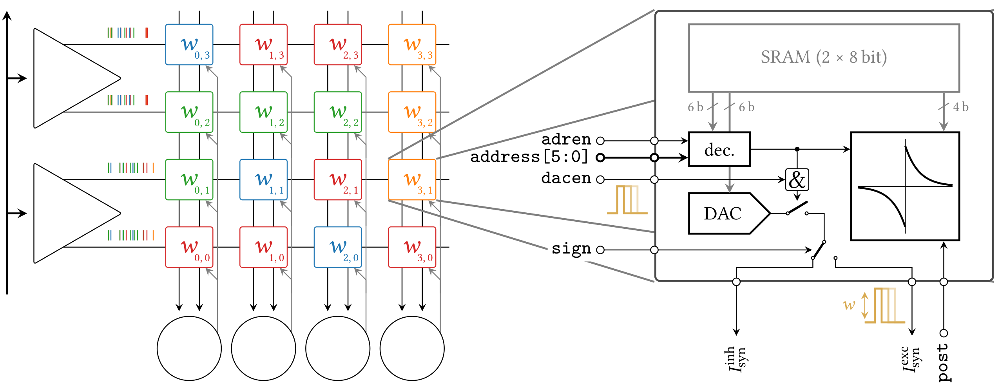
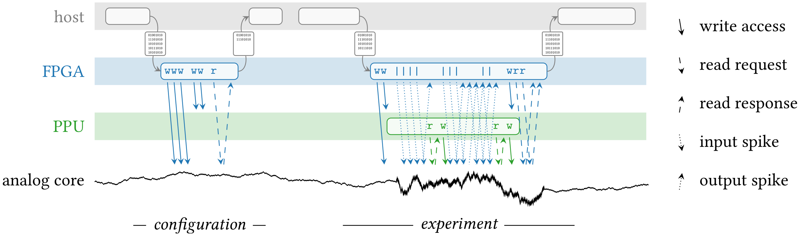

The BrainScaleS-2 system
========================

.. note::
   This chapter was taken from `Billaudelle, S. (2022). From Transistors to Learning Systems: Circuits and Algorithms for Brain-inspired Computing (Doctoral dissertation, Heidelberg University) <https://katalog.ub.uni-heidelberg.de/cgi-bin/titel.cgi?katkey=68941134&sess=cbc4363f59a962a6b4b8de4981e3ddaa&query=billaudelle%20transistors>`_ with only minor adaptations.
   It provides a comprehensive overview of the BrainScaleS-2 system for interested readers. However, to successfully complete this lab course, only a fundamental understanding of the core concepts, basic implementation details, and approximate orders of magnitude for relevant parameters is required.

BrainScaleS-2 is a spiking, accelerated mixed-signal neuromorphic platform:
It captures the dynamics of neurons and synapses in mostly analog integrated circuits and augments this physical emulation of the underlying differential equations by digital periphery.
The analog circuits exploit the native scale of capacitances and conductances to accelerate the neural dynamics by a factor of 1000.
Typical time constants of multiple milliseconds are therefore rendered at the scale of microseconds, the cybernetic interaction between actors and their simulated environment then take place on the order of milliseconds [#wunderlich2019demonstrating]_ [#schreiber2021accelerated]_, and learning can e.g. occur on the scale of seconds [#wunderlich2019demonstrating]_ [#billaudelle2021structural]_.
This acceleration also relies on the sheer parallelism and asynchronicity of the individual neurons and synapses the neuromorphic system inherits from its archetype, the nervous system.
The speed-up is relevant for applications in the two fields of machine intelligence and brain modelling which BrainScaleS-2 aims to cover both.
The emulated dynamics are flexibly configurable to target vastly different operating points.
They support simple, non-time-continuous artificial neurons as well as biologically realistic dynamics in structured multi-compartmental cells.

.. image:: _static/fp/bss2.jpg
   :width: 60%
   :align: center

BrainScaleS-2 expands on this static emulation of the neural dynamics and provides the means for implementing on-chip plasticity rules and advanced learning experiments.
For that purpose, it features custom embedded processor cores tailored for an efficient interaction with accelerated network dynamics.
These on-chip controllers can be freely programmed to dynamically reconfigure all aspects of the system, facilitating the implementation of learning rules and closed-loop cybernetic experiments directly on the chip itself.

Overview
--------

The BrainScaleS-2 ASIC is centered around an analog neuromorphic core housing the circuits emulating the neuronal and synaptic dynamics.
This conglomerate of mostly analog full-custom circuits evolves in continuous time, asynchronously to its periphery.
These dynamics can be configured and tuned through local SRAM exposed to the outside via individual memory controllers.
The synapse matrices, basically representing large in-memory compute arrays, are a prime example of this architecture.

The ASIC is optimized for event-based communication and to that end provides an on-chip spike router.
Spikes can be directly injected into the ASIC from the "outside", e.g. a host computer or -- in a multi-chip system -- other ASIC or potentially a sensor circuit.
In these cases, the events are relayed by an FPGA acting as a real-time communication interface.
For that purpose, the high-speed communication links provide dedicated event packages optimized for low latency and featuring a timed release mechanism.
In addition, background spike sources are directly provided on the ASIC itself [#schemmel2020accelerated]_.
They can be configured to emit regular or Poisson spike trains at a total bandwidth of 8 × 125 MEvent/s.
Finally, events can also be triggered via the on-chip configuration bus.
This can be used for debugging purposes or to directly inject stimuli from the custom embedded processors.
Events from all of these sources are merged together in an event routing module and then forwarded to the analog neuromorphic core, output spikes originating from the neuron circuits can travel in the opposite direction.
In both cases, the respective source of a spike is encoded in a 14 bit event label [#karasenko2020neumann]_.

The analog neuromorphic core
----------------------------

The analog core is segmented into multiple specialized subsystems for both the neuromorphic emulation itself and supporting roles.
While generally following the logical arrangement shown in the block-level overview, it's layout exploits multiple symmetries:
Most analog circuits are grouped in four quadrants, mainly to reduce adverse effects such as parasitic capacitances and propagation delays caused by otherwise excessively long metal routing.
The circuits within a quadrant also share a common block of analog parameter storage cells and thus a common reference current.
This symmetry is, however, broken by the logical organization of the synapse arrays, which rather propose a vertical symmetry.
The two resulting halves are, however, not completely independent, as the event readout of the neuron backend logic is partially shared between the upper and the lower neuron arrays.

The following paragraphs discuss the individual circuits one by one and in that process roughly follow the path of an event from the presynaptic synapse drivers to a neuron's membrane.

Synapse drivers
^^^^^^^^^^^^^^^

The primary purpose of the synapse driver circuits [#billaudelle2017design]_ is to accept events from the on-chip event router and to inject them into the synapse array.
In that process, they generate the control signals required by the synapses and ensure their correct timing.
These, most importantly, encompass an enable signal (``dacen``) of typically 4 ns to gate the current emitted by the synapse DACs.
Furthermore, the synapse drivers provide the 6 bit event address (``address[5:0]``), a corresponding enable signal (``adren``), and the "sign" of the whole row of synapses.
The synapse drivers are able to process events with a separation of 8 ns and can thus handle up to 125 MEvent/s.
Each synapse driver interfaces two rows of synapses, trading symmetry for a more area-efficient implementation.
On a full-size BrainScaleS-2 ASIC, both synapse arrays respectively host 256 rows and thus feature 128 synapse driver instances.
Each driver listens to one of four event interfaces and can be individually addressed via a 5 bit row select mask, corresponding to bits 6 to 10 of the event packages.
More detailed information on the interface and the addressing scheme are provided in the original circuit description [#billaudelle2017design]_.

.. \paragraph{Short-term plasticity}
.. 
.. The synapse drivers are also capable of modulating the synapse enable signals and can thus adapt the width, :math:`\delta t`, of the emitted current pulses [#billaudelle2017design]_.
.. We exploited this to implement short-term synaptic dynamics, namely a slightly simplified version of the short-term plasticity model by [#tsodyks1997neural]_.
.. The circuit can emulate short-term depression or facilitation of synaptic efficacies and can independently track the ``availability of neurotransmitters'' for all afferent sources.
.. 
.. \paragraph{Events with payloads}
.. 
.. This very same circuit can also be configured to more directly modulate the synaptic current pulses.
.. The synapse drivers can for that purpose interpret the lower five bit of the event label as a payload and translate that digital value into a pulse width.
.. This mode could allow for an implementation of \emph{graded spikes} but can also be straightforwardly used to stimulate the analog neuron circuits with numerical, non-binary activations.
.. % TODO: refer to Hagen

Synapses
^^^^^^^^

The synapse circuits [#friedmann2016demonstrating]_ take on one of the most central roles in the analog neuromorphic core.
They perform the actual in-memory computation, to a large part define the network topology, and feature sensor circuits facilitating the on-chip implementation of correlation-based, biology-inspired learning rules.

Synaptic efficacy
"""""""""""""""""

Their primary function is to convert afferent events into analog current pulses and for that purpose they each employ a 6 bit DAC.
The magnitude of the synaptic current is scaled by the respective weight value, :math:`w`, which is locally stored in 6 bit of full-custom SRAM.
The rather short pulse widths of 0 to 4 ns, correspondingly modulated by the synapse driver circuits, appear instantaneous when compared to the time scales of the emulated neural dynamics, which typically take place on orders of few to dozens of microseconds.
The resulting current pulses can thus be integrated and interpreted as instantaneously deposited charges proportional to both the synaptic efficacy :math:`w` and the potentially modulated pulse width:

.. math::  Q_\text{syn} = \int_{t_\text{0}}^{t_\text{0} + \delta t} I_\text{syn}w \operatorname{d}t = \delta t \cdot I_\text{syn}(w) \,.

The overall weight can be controlled via the digital 6 bit weight value and a global bias current provided by the analog parameter storage.
The amplitude results from the multiplicative factor of the synapse circuit's current DAC, and the bias current of 0 to 1 µA.
The sign of a synapse, i.e. its either excitatory or inhibitory nature, is determined by the synapse drivers as a row-wise property.

Event matching
""""""""""""""

The synapses themselves also play an important role in defining a network's topology:
While the physical matrix they form is obviously packed as densely as possible, it does feature an important mechanism to realize sparse connectomes.
The synapses of a row do not necessarily have to share the same source.
Instead, each synapse can individually attach to one of up to 64 different presynaptic partners.
For that purpose, they each store a 6 bit source address in their local SRAM alongside their weight.
This label is compared to the lower 6 bit  of an afferent event (``address[5:0]``) and only processed further in case these two match.

Being stored in local SRAM, these labels can be dynamically changed to alter the emulated network's topology during an experiment.
This feature was, e.g., exploited to implement a structural plasticity mechanism for a dynamical self-assembly of receptive fields [#billaudelle2021structural]_.

Correlation measurements
""""""""""""""""""""""""

The synapses, finally, also support the implementation of correlation-based plasticity rules and for that purpose implement local sensor circuits integrating the pair-wise correlation between pre- and postsynaptic firing activity:

.. math::
   :nowrap:

    \begin{align*}
    c_{+} &= \sum_{t_\text{post}^k} \eta_{+} \cdot \exp \left(- \frac{t_\text{post}^k - t_\text{pre}^{k}}{\tau_{+}} \right)  \,,  \text{ with}\quad
        t_\text{pre}^{k} = \max_{ t_\text{post}^{k-1} < t_\text{pre}^{l} < t_\text{post}^{k} } \left( t_\text{pre}^{l} \right) ,\, \\
        c_{-} &= \sum_{t_\text{pre}^l} \eta_{-} \cdot \exp \left(- \frac{t_\text{pre}^l - t_\text{post}^{l}}{\tau_{-}} \right) \,,  \text{ with}\quad
        t_\text{post}^{l} = \max_{ t_\text{pre}^{l-1} < t_\text{post}^{k} < t_\text{pre}^{l} } \left( t_\text{post}^{k} \right) ,\,
   \end{align*}

Here, :math:`\eta_{+/-}` indicate the scale of the respective weight increments, and :math:`\tau_{+/-}` the support of the exponential kernels.
The causal and anti-causal correlation traces, :math:`c_{+}` and :math:`c_{-}`, only consider pairs of spikes which obey a nearest-neighbor constraint.
When two postsynaptic events are interleaved by multiple presynaptic ones, only the last of them is considered for the causal correlation measurement.
In this example, the anti-causal branch would be incremented based on the pair of the first pre- and postsynaptic spike.

These sensors represent the accumulated correlation traces on two capacitors, which can be read out via dedicated parallel ADCs.
Their states can be specifically reset to start a new measurement interval.
4 bit of local SRAM allow to coarsely equalize production-induced fixed-pattern deviations across the synapse array.

Neurons
^^^^^^^

A full-size BrainScaleS-2 ASIC houses 512 neuron circuits, distributed over two horizontal rows of 256 neurons each.
They implement the AdEx model but can be reduced to the LIF model or even non-time-continuous integrators, e.g. for the realization of ANNs.
These dynamics are combined with current- or optionally conductance-based synaptic currents with exponentially decaying kernels.
Multiple instances can be merged to form larger logical neurons to, e.g., bundle the synaptic resources of the individual units and thus trade the total number of neurons for an increased fan-in.
This process also allows to connect compartments with finite and configurable conductances to form multi-compartment emulations of topologically more realistic neurons [#kaiser2021emulating]_.
These can be augmented by plateau potentials, modelling calcium- or NMDA-based spikes typically occurring in the dendritic tree of a neuron [#aamir2018mixed]_.

The differential model equations are emulated in fully analog circuits which are supported by digital backend logic to stream out action potentials and to derive crucial timing signals such as the refractory period [#kiene2017mixed]_.
The neuron circuit and its backend can be configured via a total of 64 bit of local SRAM and the analog components can be tuned through 8 reference voltages and 16 current parameters per neuron.
They allow to set the circuits up for a wide range of target dynamics and at the same time allow the equalization of production-induced variations between individual instances.

Analog parameter storage
^^^^^^^^^^^^^^^^^^^^^^^^

The analog neuromorphic circuits of BrainScaleS-2 can be tuned to emulate different target dynamics and calibrated to overcome fixed-pattern variability between instances of the same circuit.
Many of the bias currents and reference potentials relied on by the neuron circuits are for that purpose individually adjustable.
The 16 current and 8 voltage settings per neuron circuit accumulate to a total of 12288 neuron-specific analog parameters.
These are accompanied by another 128 currents and 64 voltages arranged in four quadrants and available as global or semi-global references.
Each parameter can be freely programmed as a digital 10 bit value stored in full-custom SRAM.

This highly parallel DAC is realized as an array of capacitive storage cells [#hock2014modern]_.
Each of the latter consists of a small capacitor and 10 bit of local SRAM.
Voltage cells are straightforwardly realized by tapping the potential across that capacitor to provide output potentials in the range from approximately 0.0 to 1.6 V, while current cells require an additional MOSFET to translate this potential into a current ranging from approximately 0.0 to 1.0 µA.
The cells are programmed based on a periodically cycling voltage ramp accompanied by a digital 10 bit counter.
The memory array basically functions as a content-addressable memory: whenever the counter value matches the content of an SRAM cell, the associated capacitor is, simply put, connected to the voltage ramp and in that process inherits the potential corresponding to that specific point of the ramp cycle.

Analog I/O
^^^^^^^^^^

Analogously to the flexible parameterization of the analog circuits BrainScaleS-2 attempts to provide far-reaching access to most of the internally evolving states.
It for that purpose allows to route many of these potentials across the ASIC and to apply them to one of two analog IO pads, making them available to external measurement equipment or reference potentials [#kiene2017mixed]_.
Two very different ADCs can, furthermore, digitize these signals directly on the chip itself.
These capabilities do not only facilitate lower level measurements and the commissioning of the neuromorphic circuits but are also crucial to more directly interact with the system and bridge the gap between the analog and digital domains to, e.g., implement advanced plasticity rules.

High-speed analog readout
"""""""""""""""""""""""""

Most of the neuromorphic circuits expose their internal states to the outside to allow low-level characterizations and visualizations of their dynamics.
Peripheral circuits such as the capacitive analog parameter storage, similarly, provide access to some of their internal mechanisms to facilitate the commissioning of the ASIC.
These include, e.g., short-term plasticity state voltages from within the synapse drivers, or access to the output lines of the synapse columns.
The readout chain [#kiene2017mixed]_ spans the analog core to collect these signals and expose them to internal as well as external measurement equipment.
One may generally differentiate between unidirectional readouts, many of which already buffered, and bidirectional IOs offering a low-impedance path to the internal circuits.
The membrane potential, can be accessed in both a non-destructive, buffered fashion or directly for, e.g., current measurements or voltage clamping.

The unidirectional readout of internal states, most notably the neuronal dynamics, is accomplished via two unity-gain voltage buffers powerful enough to drive external 50 Ω terminations [#kiene2017mixed]_.
Their inputs can be respectively attached to one of the sources via two independent input multiplexers.
An on-chip ADC, furthermore, allows to digitize these two channels directly on the ASIC.
An active multiplexer allows to either record one of these two potentials at the full sampling rate or interleave samples from both channels.
The ADC itself implements an successive-approximation register architecture and -- in the current setup -- permits sampling rates of 30 MSample/s.
The samples are streamed out via the high-speed communication links in the form of event packages [#karasenko2020neumann]_.

Two additional multiplexers, directly connected to two analog IO pads of the ASIC [#kiene2017mixed]_, allow to connect external devices and measurement equipment.
They allow to select not only the two buffered channels mentioned above but many other internal nodes either exceeding the 1.2 V supply range (and thus the ADC's input range) or requiring unbuffered, bidirectional access.
The two pads can be attached to DACs located on the experiment setup PCB or external laboratory equipment [#schreiber2021accelerated]_.
The latter encompass, e.g., oscilloscopes for more in-depth commissioning work.
As the readout chain features two mostly independent channels, it allows parallel access to many of the internal states.
One may, e.g., clamp one potential and measure the current from another node, enabling many advanced measurement scenarios.

Parallel analog-to-digital conversion
"""""""""""""""""""""""""""""""""""""

The analog emulation of neural states evolves asynchronously and fully parallel.
While quite apparent for the 512 neuronal membrane potentials, this high-degree of parallelism becomes even more precarious for reading out the analog correlation sensors located in each synapse circuit.
BrainScaleS-2, hence, features massively parallel ADCs to still be able to incorporate these states into plasticity calculations.

The two ADCs [#schreiber2021accelerated]_ -- one per vertical half of the ASIC -- each feature 512 channels, two per column of synapses to cover both the causal and anti-causal branches of the correlation sensors.
The ADCs employs a ramp-compare architecture to digitize the parallel channels at a resolution of 8 bit and a maximum sampling rate of 1.85 MSample/s per channel [#schreiber2021accelerated]_.

On-chip plasticity and embedded cybernetics
^^^^^^^^^^^^^^^^^^^^^^^^^^^^^^^^^^^^^^^^^^^

A significant body of work goes beyond static neural networks and focus on different learning paradigms or closed-loop setups where a simulated actor interacts with an artificial environment.
The 1000-fold acceleration of BrainScaleS-2, however, impedes a real-time interaction with an off-the-shelf host computer and stipulates a tightening of the control loop.

BrainScaleS-2 augments the accelerated dynamics of the analog neuromorphic core with custom embedded processors [#friedmann2016demonstrating]_ [#friedmann2013new]_, one per vertical half of the ASIC.
These PPUs implement the Power instruction set architecture and operate on 32 bit integers.
They are clocked at a configurable frequency defaulting to 250 MHz.
Each processor instance has access to 16 kiB of main SRAM collocating instructions as well as data.
They can, furthermore, transparently access a larger, shared memory region provided by the FPGA and made available via the high-speed communication links.
As the PPU can act as masters to the on-chip configuration bus, they have full read and write access to all on-chip components and can thus read out and operate on, e.g., the neuronal firing rates and, in addition, dynamically reparameterize all of the ASIC['s] subsystems.

The general purpose parts are accompanied by custom SIMD vector extensions [#friedmann2016demonstrating]_ [#friedmann2013new]_.
These coprocessors operate on 1024 bit-wide registers and are thus capable of calculating with 128 8 bit or 64 16 bit integers in parallel.
They allow to efficiently perform calculations based on vectorial data acquired from the analog neuromorphic core, e.g. for weight update calculations.
A full synaptic row of 256 synapses can be processed in only two separate steps.

The vector units directly attach to the synapse arrays' memory interfaces and can thus access the synaptic weights and address labels in a row-wise fashion.
They can similarly obtain the digitized correlation traces or membrane samples and incorporate them into the parallel computation.
Both, the synaptic sensor circuits as well as the neurons' membranes can be reset through memory-mapped commands via the same interface.

System integration and experiment flow
^^^^^^^^^^^^^^^^^^^^^^^^^^^^^^^^^^^^^^

It is definitely a challenge to design and build flexible yet reliable neuromorphic circuits -- and then another one to make them usable and accessible to a broader user base.
Our ASIC rely on an enormous stack of peripheral circuitry and software.
They are available in different form factors, from laboratory setups to smaller and portable [#stradmann2021demonstrating]_ as well as multi-chip systems [#thommes2022demonstrating]_.
All of them, however, share a very similar overall architecture:
The neuromorphic ASIC is supported by a set of PCBs providing necessary power supplies, analog references, and IO circuits.
The chip itself is interfaced via an FPGA bridging the available bandwidths and time scales of the accelerated emulation on one side (on the order of microseconds) and the comparably "sluggish" latencies of typical host computers and networking equipment (on the order of milliseconds) on the other.

The FPGA thus exposes a real-time interface to the neuromorphic ASIC.
The user code executed on the experiment host compiles *playback programs*, which are then asynchronously interpreted and executed by a state machine on the FPGA.
They support simple instructions to read from and write to memory locations on both the BrainScaleS-2 chip and its periphery and, furthermore, provide dedicated commands for the injection of spike events.
Playback programs can exploit a simple timing mechanism to schedule these instructions and by that reach a tight and reproducible timing.
This asynchronous execution is rather straightforward for write instructions but more involved for read accesses:
Responses to read requests are buffered and tracked on the FPGA.
The host computer holds uncompleted futures, which are populated as soon as the response data is available.
Similarly, spikes emitted by the ASIC are buffered on the FPGA and then sent to the experiment host.

The above figure visualizes an exemplary experiment and the data flow between the host machine and the neuromorphic system.
It includes the PPU, which can assume many of the functions of the experiment host and introduces another layer of asynchronicity. 
Typically, an experiment is broken up into multiple playback programs for the initialization and the actual real-time experiments.
The analog emulation, notably, does -- depending on the setup -- continue even without interaction with the outside.

This program flow and hardware abstraction is exposed by a sophisticated software stack [#muller2020extending]_.
It consists of multiple layers from communication protocols to high-level experiment descriptions.
A hardware abstraction layer represents each of the system's components and subsystems as a configuration container.
This collection of classes exposes the individual configuration options and implements the bit formatting of the associated configuration registers.
A hierarchical coordinate system allows to uniquely identify and address the individual circuit instances.

The software stack also boasts full compiler support for the embedded PPU, allowing to program these custom processors in standard C++ code.
To fully exploit the vector extension, however, some basic knowledge of assembly can be beneficial.

These lower layers can serve as exploratory interfaces for expert users.
A large fraction of the system's functionality is, however, also available through two high-level APIs:
PyNN allows the mostly backend-agnostic formulation of network topologies and protocols for computational neuroscience experiments [#davison2009pynn]_ [#czierlinski2020ba]_ [#spilger2021master]_.
A PyTorch-compatible interface, on the other hand, allows the emulation of arbitrary ANNs and convolutional networks [#paszke2019pytorch]_ [#spilger2020hxtorch]_.
Support for spiking neurons was underway at the time of writing.

.. [#wunderlich2019demonstrating] Wunderlich, T., Kungl, A. F., Müller, E., Hartel, A., Stradmann, Y., Aamir, S. A., ... & Petrovici, M. A. (2019). Demonstrating advantages of neuromorphic computation: a pilot study. Frontiers in neuroscience, 13, 260.
.. [#schreiber2021accelerated] Schreiber, K. (2021). Accelerated neuromorphic cybernetics (Doctoral dissertation).
.. [#billaudelle2021structural] Billaudelle, S., Cramer, B., Petrovici, M. A., Schreiber, K., Kappel, D., Schemmel, J., & Meier, K. (2021). Structural plasticity on an accelerated analog neuromorphic hardware system. Neural networks, 133, 11-20.
.. [#schemmel2006implementing] Schemmel, J., Grubl, A., Meier, K., & Mueller, E. (2006, July). Implementing synaptic plasticity in a VLSI spiking neural network model. In The 2006 ieee international joint conference on neural network proceedings (pp. 1-6). IEEE.
.. [#schemmel2010wafer] Schemmel, J., Brüderle, D., Grübl, A., Hock, M., Meier, K., & Millner, S. (2010, May). A wafer-scale neuromorphic hardware system for large-scale neural modeling. In 2010 IEEE International Symposium on Circuits and Systems (ISCAS) (pp. 1947-1950). IEEE.
.. [#hock2014modern] Hock, M. (2014). Modern semiconductor technologies for neuromorphic hardware (Doctoral dissertation).
.. [#friedmann2013new] Friedmann, S. (2013). A new approach to learning in neuromorphic hardware (Doctoral dissertation).
.. [#schemmel2020accelerated] Schemmel, J., Billaudelle, S., Dauer, P., & Weis, J. (2021). Accelerated analog neuromorphic computing. In Analog Circuits for Machine Learning, Current/Voltage/Temperature Sensors, and High-speed Communication: Advances in Analog Circuit Design 2021 (pp. 83-102). Cham: Springer International Publishing.
.. [#karasenko2020neumann] Karasenko, V. (2020). Von Neumann Bottlenecks in Non-von Neumann Computing Architectures: A Generic Approach (Doctoral dissertation, Heidelberg University).
.. [#billaudelle2017design] Billaudelle, S. (2017). Design and implementation of a short term plasticity circuit for a 65 nm neuromorphic hardware system. Masterarbeit, Universität Heidelberg.
.. [#tsodyks1997neural] Tsodyks, M. V., & Markram, H. (1997). The neural code between neocortical pyramidal neurons depends on neurotransmitter release probability. Proceedings of the national academy of sciences, 94(2), 719-723.
.. [#friedmann2016demonstrating] Friedmann, S., Schemmel, J., Grübl, A., Hartel, A., Hock, M., & Meier, K. (2016). Demonstrating hybrid learning in a flexible neuromorphic hardware system. IEEE transactions on biomedical circuits and systems, 11(1), 128-142.
.. [#kaiser2021emulating] Kaiser, J., Billaudelle, S., Müller, E., Tetzlaff, C., Schemmel, J., & Schmitt, S. (2022). Emulating dendritic computing paradigms on analog neuromorphic hardware. Neuroscience, 489, 290-300.
.. [#aamir2018mixed] Aamir, S. A., Müller, P., Kiene, G., Kriener, L., Stradmann, Y., Grübl, A., ... & Meier, K. (2018). A mixed-signal structured AdEx neuron for accelerated neuromorphic cores. IEEE transactions on biomedical circuits and systems, 12(5), 1027-1037.
.. [#kiene2017mixed] Kiene, G. (2017). Mixed-signal neuron and readout circuits for a neuromorphic system. Masterthesis, Universität Heidelberg.
.. [#aamir2018accelerated] Aamir, S. A., Stradmann, Y., Müller, P., Pehle, C., Hartel, A., Grübl, A., ... & Meier, K. (2018). An accelerated LIF neuronal network array for a large-scale mixed-signal neuromorphic architecture. IEEE Transactions on Circuits and Systems I: Regular Papers, 65(12), 4299-4312.
.. [#aamir2018thesis] Aamir, S. A. (2018). Mixed-signal circuit implementation of spiking neuron models.
.. [#stradmann2021demonstrating] Stradmann, Y., Billaudelle, S., Breitwieser, O., Ebert, F. L., Emmel, A., Husmann, D., ... & Schemmel, J. (2022). Demonstrating analog inference on the brainscales-2 mobile system. IEEE Open Journal of Circuits and Systems, 3, 252-262.
.. [#thommes2022demonstrating] Thommes, T., Bordukat, S., Grübl, A., Karasenko, V., Müller, E., & Schemmel, J. (2022, March). Demonstrating brainscales-2 inter-chip pulse-communication using extoll. In Proceedings of the 2022 Annual Neuro-Inspired Computational Elements Conference (pp. 98-100).
.. [#muller2020extending] Müller, E., Mauch, C., Spilger, P., Breitwieser, O. J., Klähn, J., Stöckel, D., ... & Schemmel, J. (2020). Extending brainscales OS for BrainScaleS-2. arXiv preprint arXiv:2003.13750.
.. [#davison2009pynn] Davison, A. P., Brüderle, D., Eppler, J. M., Kremkow, J., Muller, E., Pecevski, D., ... & Yger, P. (2009). PyNN: a common interface for neuronal network simulators. Frontiers in neuroinformatics, 2, 388.
.. [#czierlinski2020ba] Czierlinski, M. (2020). PyNN for BrainScaleS-2. Bachelor's thesis. Universität Heidelberg.
.. [#spilger2021master] Spilger, P. (2021). From neural network descriptions to neuromorphic hardware—a signal-flow graph compiler approach (Doctoral dissertation, Master’s thesis, Universität Heidelberg).
.. [#paszke2019pytorch] Paszke, A., Gross, S., Massa, F., Lerer, A., Bradbury, J., Chanan, G., ... & Chintala, S. (2019). Pytorch: An imperative style, high-performance deep learning library. Advances in neural information processing systems, 32.
.. [#spilger2020hxtorch] Spilger, P., Müller, E., Emmel, A., Leibfried, A., Mauch, C., Pehle, C., ... & Schemmel, J. (2020). hxtorch: PyTorch for BrainScaleS-2: perceptrons on analog neuromorphic hardware. In IoT Streams for Data-Driven Predictive Maintenance and IoT, Edge, and Mobile for Embedded Machine Learning: Second International Workshop, IoT Streams 2020, and First International Workshop, ITEM 2020, Co-located with ECML/PKDD 2020, Ghent, Belgium, September 14-18, 2020, Revised Selected Papers 2 (pp. 189-200). Springer International Publishing.
