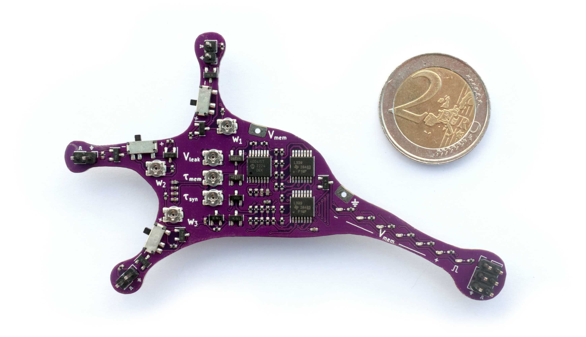
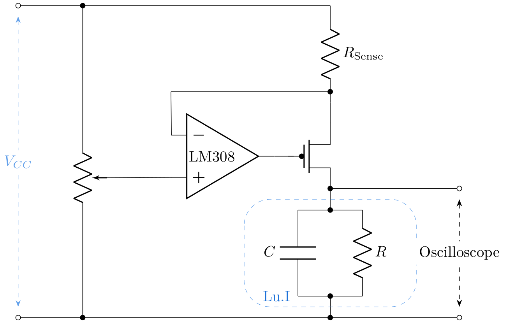

Lu.i experiment
===============

To get accustomed to the concept of neuromorphic computation, you will work with *Lu.i*.
Lu.i is an electronic neuron circuit mimicking and illustrating the basic dynamics of real, biological neurons.
The printed circuit board (PCB) features a configurable, fully analog implementation of the leaky integrate-and-fire model and visualizes the internal state, the membrane potential, through a VU-meter-style chain of LEDs.
The neuron emits a short pulse whenever the membrane potential crosses a predefined threshold voltage.
Neurons communicate by exchanging these spikes because multiple boards can be connected via jumper wires to form networks.

You may find additional information including schematics on the project's homepage, `giantaxon.org <http://giantaxon.org>`_.

Exercises
~~~~~~~~~

Getting familiar with Lu.i's parameters
^^^^^^^^^^^^^^^^^^^^^^^^^^^^^^^^^^^^^^^

Before you begin, connect Lu.i's membrane to the oscilloscope.

- Familiarize yourself with the parameters of the neuron emulation.
  What happens if you increase the leak potential?
  Can you observe the membrane time constant?
  Note the impact of the individual potentiometers.
- Connect two or multiple neurons to form a simple network and note how signals propagate across neurons, e.g., while playing with the synaptic weights and the synaptic time constant.
- Pick a configuration where you can approximately measure :math:`\tau_\text{ref}` and the threshold :math:`\vartheta`.
  Take notes of your results and your methods of determining the individual parameters.

.. note::
   Keep the setting for the membrane time constant :math:`\tau_\text{mem}` fixed for the following task.

Measuring of an f-I curve
^^^^^^^^^^^^^^^^^^^^^^^^^

Next, you will record your first f-I curve, i.e., the dependence of a neuron's firing rate on its stimulating current.
For this purpose, you will rely on a voltage-controlled current source.

The output current of this circuit is governed by the following equation:

.. math::
    I(U) = \frac{V_\text{CC}-U}{R_\text{sense}}

In the present case, :math:`R_\text{sense}` is 10 kΩ.

Make sure that Lu.i's membrane is connected to both the oscilloscope and the current source.
A second set of cables allows you to read out the voltage at the lower node of :math:`R_\text{sense}` at the same time such that you can calculate the voltage drop across the resistor and thus the current.

- Now measure about 20 firing frequencies as a function of the voltage drop in a range from :math:`1.75V` to :math:`5V` (here referring to the absolute potential).
- Plot your results.
- Derive an equation for :math:`f_\text{theo}(\vartheta, \tau_m, R, I)`.
  You might need to define your integration limits.
  (Hint 1: Consult equation :eq:`eq:lif` as a starting point; 
  hint 2: You'll find :math:`R\cdot I > \vartheta` as a condition)
- Fit the function to your measurements.
