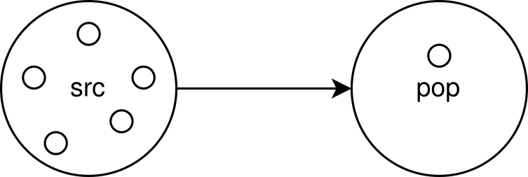

Introduction to PyNN
====================

The neuron circuits have a lot of tunable parameters. But how do we set
their values? For this the module PyNN can be used. It is a language
that allows you to form groups of neurons and to connect them in
different ways to each other. Also, the parameters of individual neurons
can be varied and the resulting dynamic can be observed.

In the following, we want to build a simple network in which a neuron is
stimulated by a group of five neurons.

.. include:: common_note_helpers.rst

.. only:: jupyter
   
    .. code:: ipython3
    
        # import the module PyNN
        import pynn_brainscales.brainscales2 as pynn
    
        # set the environment
        from _static.common.helpers import setup_hardware_client, get_nightly_calibration
    
        setup_hardware_client()
        calib = get_nightly_calibration()
        pynn.setup(initial_config=calib)

Groups of neurons are called `populations <http://neuralensemble.org/docs/PyNN/reference/populations.html#populations>`_.
Such a population is instantiated by setting the number of neurons it should contain, the cell type of these neurons and the values of the cell parameters.
The `cell type <http://neuralensemble.org/docs/PyNN/reference/neuronmodels.html>`_ of our artificial neurons is called ``HXNeuron``.
Its parameters are not expressed in the same units as for biological neurons, but in hardware units.
These two systems of units are not directly related.
Also within the hardware units there is no general translation to physical voltages and currents.
Furthermore, these values can have different meanings for the different parameters on a chip, for example, a threshold voltage of 300 may be higher than a leakage voltage of 400.
Especially in the comparison between chips, even though they are designed completely identical, the actual measured values can vary slightly.

.. code:: ipython3

    # define the neuron parameters of the population
    n_neurons = 1
    neuron_parameters = {                          # range
        "leak_v_leak": 400,                        # (300-1000)
        "leak_i_bias": 200,                        # (0-1022)
        "threshold_v_threshold": 400,              # (0-600)
        "threshold_enable": True,                  #
        "refractory_period_refractory_time": 100,  # (0-255)
        "reset_v_reset": 300,                      # (300-1000)
        "reset_i_bias": 1000,                      # (0-1022)
        "membrane_capacitance_capacitance": 63     # (0-63)
    }

    neuron_type = pynn.cells.HXNeuron(**neuron_parameters)

    # save the configured neuron in the population 'pop'
    pop = pynn.Population(n_neurons, neuron_type)

The spikes of all neurons that have been stored in populations can be recorded.
Furthermore, it is also possible to record the membrane potential of a single neuron.
Consequently, for this purpose the population must have a size of one.

.. warning::

   We can only record one neuron at the time. Make sure to use
   populations of size one or use views to select a single neuron, see.
   `PyNN documentation
   <http://neuralensemble.org/docs/PyNN/reference/populations.html#views-sub-populations>`_.

.. code:: ipython3

    # record spikes and membrane potential 'v' of the neuron in the
    # population 'pop'
    pop.record(["spikes", "v"])

Different populations can be connected by so-called `projections <http://neuralensemble.org/docs/PyNN/reference/projections.html>`_.
For this, firstly it must be specified which is the pre-synaptic (source) and which the post-synaptic (receiver) population. Furthermore, the way in which the neurons within the populations are exactly connected to each other is specified, e.g., all neurons are connected, or only a certain percentage of the neurons are connected to each other.
In addition, the synaptic weight which describes the strength of the connection and the `synapse type <http://neuralensemble.org/docs/PyNN/reference/plasticitymodels.html>`_ are specified.
This can either be excitatory, meaning that the membrane voltage increases in case of stimulation, or it is inhibitory, which causes the membrane voltage to decrease.

.. code:: ipython3

    # create a source population that generates spikes at given times
    spike_times = [0.01, 0.03, 0.05, 0.07, 0.09]
    src = pynn.Population(5, pynn.cells.SpikeSourceArray(spike_times=spike_times))

    # define a synapse and its weight
    synapse_weight = 63
    synapse = pynn.synapses.StaticSynapse(weight=synapse_weight)

    # connect the pre-synaptic population 'src' to the post-synaptic
    # neuron in 'pop'
    pynn.Projection(src, pop, pynn.AllToAllConnector(),
                    synapse_type=synapse, receptor_type="excitatory")

The created network of populations and projections can now be emulated
for a selected time.

.. code:: ipython3

    # the duration is given in ms,
    # this is in the hardware domain, not in the biological
    # (the hardware is faster by a factor of approx. 1000
    # compared to biology)
    duration = 0.1
    pynn.run(duration)

Thereafter, the recorded behavior of the neurons can be read out.

.. code:: ipython3

    # read out the spikes of the neuron in 'pop'
    spiketrain = pop.get_data("spikes").segments[0].spiketrains[0]
    print(f"The neuron spiked {len(spiketrain)} times.")
    print(f"The spike times were: {spiketrain}")

    # plot its membrane potential
    mem_v = pop.get_data("v").segments[0].irregularlysampledsignals[0]

    import matplotlib.pyplot as plt
    %matplotlib inline
    plt.figure()
    plt.plot(mem_v.times, mem_v)
    plt.xlabel("time [ms]")
    plt.ylabel("membrane potential [LSB]")
    plt.show()
