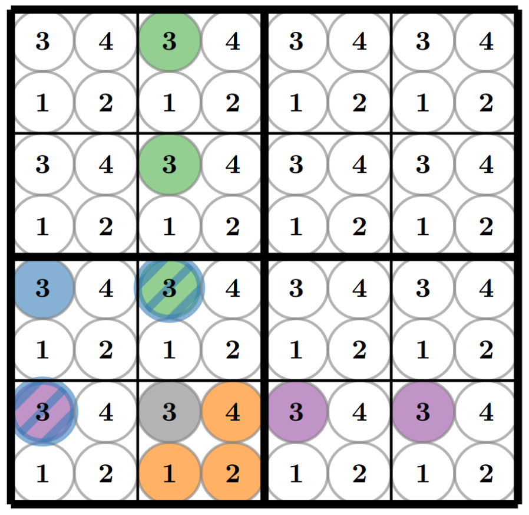

Solving sudokus with BrainScaleS-2
==================================

In this task we want to apply our newly gained knowledge to well-known problem:
We will deal with solving a sudoku on spiking hardware.

If you never before encountered this logic puzzle from 1984, let's define the rules.
Usually you have a 9x9 square grid and the goal is to fill in numbers from 1 to 9, given crucial constraints:

1. In each row, each number is only allowed exactly once.
2. In each column, each number is only allowed exactly once.
3. In each 3x3 sub grid, each number is only allowed exactly once.

To find a valid solution, hints are given in form of given, fixed numbers.
An obvious strategy for solving a sudoku is to, sequentially, find a square where only one number is allowed.
This seems trivial but due to the high dimensionality finding a solution is a non-trivial task.
However, checking the correctness of a potential solution is a simple task.
To circumvent the slowness of a brute-force solution one can resort to a stochastic strategy.
In fact, a spiking neuronal network (SNN) can accomplish this task in this manner quickly and with high precision.

The basic idea in creating a sudoku solver with an SNN is to assign to each possible number in each field one neuron, called one-hot encoding.
In our case, each field would have four neurons representing the numbers 1 to 4, respectively.
A neuron being active is interpreted as that field being filled with the respective number, consequently a given, hinted number is represented by a continuously spiking neuron.
An excluding constraint will be realised with an inhibitory synapse due to the suppressing effect on the activity.
To allow the network to explore different states, a random Poisson-distributed background noise is applied to all neurons.
In addition, each neuron is excitatorily connected to themselves to maintain possible activity.

Let's start with a simplified version of a sudoku with a 4x4 grid, as shown in the figure.
Assume the grey three is given, applying the previously mentioned constraints we obtain:

* Due to 1, the purple threes are not allowed.
* Due to 2, the green threes are not allowed.
* Due to 3, the blue threes are not allowed.
* Due to the choice of our encoding, the orange numbers are not allowed (in each field only one number is allowed to be active)

    Representation of a 4x4 sudoku with one-hot encoding:
    In each small square, each number from 1 to 4 has one respective neuron;
    four small squares, framed by the thick line, make one block in the original sudoku;
    there are four such blocks to complete the 4x4 sudoku.

For further information read into `Solving the Constraint Satisfaction Problem Sudoku on Neuromorphic Hardware (MA Thesis) <https://www.kip.uni-heidelberg.de/Veroeffentlichungen/download.php/6118/temp/3666.pdf>`_.

Experiment setup
----------------

.. only:: jupyter

    Initially we have to connect to the scheduling service and load required packages

    .. include:: common_quiggeldy_setup.rst

    .. code:: ipython3

        from collections import OrderedDict
        from functools import partial
        from typing import Callable
        from itertools import product
    
        import numpy as np
	import matplotlib
        import matplotlib.pyplot as plt
	plt.style.use("_static/matplotlibrc")
	from matplotlib.gridspec import GridSpec
	from matplotlib.patches import Rectangle

        import pynn_brainscales.brainscales2 as pynn
        from pynn_brainscales.brainscales2.standardmodels.synapses import StaticSynapse
        from pynn_brainscales.brainscales2.standardmodels.cells import \
                    SpikeSourceArray, HXNeuron,SpikeSourcePoisson

        from IPython.display import display
        from ipywidgets import interactive, IntSlider, FloatSlider, Layout,\
            VBox, Box, HTML

        from _static.common.helpers import get_nightly_calibration

        calib = get_nightly_calibration()
        pynn.setup(initial_config=calib)

        %matplotlib inline

We start by creating a population of neurons satisfying the required number and additionally creating a view for each field to later access them easier
``pops_collector[row][field][neuron]``

.. code:: ipython3

    # Defining total runtime and dimensionality of sudoku
    runtime = 0.5
    dimension = 4

    # -> we need 4 (rows) * 4 (columns) * 4 (numbers) = 4^3 neurons
    pop = pynn.Population(dimension**3, HXNeuron())
    pop.record("spikes")

    # to define the connections easier, we save a "view" of each neuron in a list
    pops_collector = []
    for row in range(dimension):
        pops_row = []
        for field_in_row in range(dimension):
            pops_field = []
            for number_in_field in range(dimension):
                neuron = pynn.PopulationView(
                    pop,
                    [row * dimension**2 + field_in_row * dimension
                    + number_in_field])
                pops_field.append(neuron)
            pops_row.append(pops_field)
        pops_collector.append(pops_row)

.. code:: ipython3

    # Create background noise
    poisson_source = pynn.Population(dimension**3,
        SpikeSourcePoisson(duration=runtime - 0.01, rate=5e5, start=0.01))

    # connect random sources with neurons
    # additionally each neuron is connected to itself excitatorily to
    # sustain possible activity

    pynn.Projection(pop,
                    pop,
                    pynn.OneToOneConnector(),
                    synapse_type=StaticSynapse(weight=20),
                    receptor_type='excitatory')

    pynn.Projection(poisson_source,
                    pop,
                    pynn.OneToOneConnector(),
                    synapse_type=StaticSynapse(weight=30),
                    receptor_type='excitatory')

.. code:: ipython3

    # create stimulation for clues and connect to according neurons
    stim_given_numbers = pynn.Population(
        1, SpikeSourceArray(spike_times=np.linspace(0.0, runtime, 500)))

    clue_projections = []

    for row in range(4):
        clues_row = []
        for column in range(4):
            clues_field = []
            for number in range(4):
                clues_field.append(pynn.Projection(
                    stim_given_numbers,
                    pops_collector[row][column][number],
                    pynn.AllToAllConnector(),
                    synapse_type=StaticSynapse(weight=0),
                    receptor_type='excitatory'))
            clues_row.append(clues_field)
        clue_projections.append(clues_row)

.. code:: ipython3

    # functions to solve the sudoku:

    def set_clues(clues=None):
        """Sets the clues in the network."""
        if clues is None:
            clues = np.zeros((4, 4), dtype=int)
        for row, row_clues in enumerate(clue_projections):
            for col, field_clues in enumerate(row_clues):
                for number, clue_projection in enumerate(field_clues, start=1):
                    for connection in clue_projection:
                        connection.weight = 63. if clues[row,col] == number else 0.

    def hide_solution(grid, num_clues, seed=None):
        """Hides the solution and only leaves `num_clues` hints."""
        indices = np.argwhere(np.logical_and(grid > 0, grid <= 4))
        if len(indices) < num_clues:
            raise RuntimeError(
                f"The sudoku has less than {num_clues} clues, which is the number of required clues :(")
        np.random.seed(seed)
        indices = indices[np.random.choice(len(indices), num_clues, replace=False)]
        clues = np.zeros_like(grid)
        clues[(indices.T[0], indices.T[1])] = grid[(indices.T[0], indices.T[1])]
        return clues

    def get_solution(runtime, clues):
        """Executes the network ad returns the current solution."""
        set_clues(clues)
        grid = np.zeros((4, 4), dtype=int)

        # Define duration of poisson spikes 
        poisson_source.set(duration=runtime - 0.01)

        # emulate the network
        pynn.run(runtime)
        # read back solution
        for row, row_populations in enumerate(pops_collector):
            for col, field_populations in enumerate(row_populations):
                num_spikes = [
                    len(num_population.get_data("spikes").segments[0].spiketrains[0])
                    for num_population in field_populations
                ]
                grid[row, col] = np.argmax(num_spikes) + 1
        return grid

.. only:: not Solution

    .. code:: ipython3

        # Constraints

        # create inhibitory connections to neurons in the same field
        # representing different numbers

        # create inhibitory connections to neurons in the same row
        # representing the same number

        # create inhibitory connections to neurons in the same column
        # representing the same number

        # create inhibitory connections to neurons in the same block
        # representing the same number

.. only:: Solution

    .. code:: ipython3

        # create inhibitory connections to neurons in the same field
        # representing different numbers
        inh_weight = -50
        for row in range(4):
            for field in range(4):
                for neuron in range(4):
                    pynn.Projection(pops_collector[row][field][neuron % 4],
                                    pops_collector[row][field][(neuron+1)%4],
                                    pynn.OneToOneConnector(),
                                    synapse_type = StaticSynapse(weight = inh_weight),
                                    receptor_type = "inhibitory")
                    pynn.Projection(pops_collector[row][field][neuron % 4],
                                    pops_collector[row][field][(neuron+2)%4],
                                    pynn.OneToOneConnector(),
                                    synapse_type = StaticSynapse(weight = inh_weight),
                                    receptor_type = "inhibitory")
                    pynn.Projection(pops_collector[row][field][neuron % 4],
                                    pops_collector[row][field][(neuron+3)%4],
                                    pynn.OneToOneConnector(),
                                    synapse_type = StaticSynapse(weight = inh_weight),
                                    receptor_type = "inhibitory")
                            
                            
        # create inhibitory connections to neurons in the same row
        # representing the same number
        w_inh_row = -50
        for row in range(4):
            for field in range(4):
                for neuron in range(4):
                    pynn.Projection(pops_collector[row][field][neuron],
                                    pops_collector[row][(field+1)%4][neuron],
                                    pynn.OneToOneConnector(),
                                    synapse_type = StaticSynapse(weight = w_inh_row),
                                    receptor_type = "inhibitory")
                    pynn.Projection(pops_collector[row][field][neuron],
                                    pops_collector[row][(field+2)%4][neuron],
                                    pynn.OneToOneConnector(),
                                    synapse_type = StaticSynapse(weight = w_inh_row),
                                    receptor_type = "inhibitory")
                    pynn.Projection(pops_collector[row][field][neuron],
                                    pops_collector[row][(field+3)%4][neuron],
                                    pynn.OneToOneConnector(),
                                    synapse_type = StaticSynapse(weight = w_inh_row),
                                    receptor_type = "inhibitory")

        # create inhibitory connections to neurons in the same column
        # representing the same number
        w_inh_col = -50
        for row in range(4):
            for field in range(4):
                for neuron in range(4):
                    pynn.Projection(pops_collector[row][field][neuron],
                                    pops_collector[(row+1)%4][field][neuron],
                                    pynn.OneToOneConnector(),
                                    synapse_type = StaticSynapse(weight = w_inh_col),
                                    receptor_type = "inhibitory")
                    pynn.Projection(pops_collector[row][field][neuron],
                                    pops_collector[(row+2)%4][field][neuron],
                                    pynn.OneToOneConnector(),
                                    synapse_type = StaticSynapse(weight = w_inh_col),
                                    receptor_type = "inhibitory")
                    pynn.Projection(pops_collector[row][field][neuron],
                                    pops_collector[(row+3)%4][field][neuron],
                                    pynn.OneToOneConnector(),
                                    synapse_type = StaticSynapse(weight = w_inh_col),
                                    receptor_type = "inhibitory")

        # create inhibitory connections to neurons in the same block
        # representing the same number
        # - which connections actually need to be still realized?
        w_inh_block = -50
        for row_offset in [0, 2]:
            for column_offset in [0, 2]:
                for row in range(2):
                    for column in range(2):
                        for number in range(4):
                            pynn.Projection(
                                pops_collector[row+row_offset][column+column_offset][number],
                                pops_collector[
                                    (row+1)%2+row_offset][(column+1)%2+column_offset][number],
                                pynn.AllToAllConnector(),
                                synapse_type=StaticSynapse(weight=w_inh_block),
                                receptor_type='inhibitory')

.. only:: not latex

   .. include:: _static/fp/sudoku_tools.rst

   .. include:: _static/fp/sudoku_plotter.rst

.. code:: ipython3

    SP: SudokuPlotter = SudokuPlotter(dimension, pop, set_clues, hide_solution, get_solution)

    # this sudoku shall be solved
    global sudoku
    sudoku = np.array([
        [3, 2, 4, 1],
        [1, 4, 3, 2],
        [2, 3, 1, 4],
        [4, 1, 2, 3]
    ])

.. code:: ipython3

    # The below will only work, of course, if you implemented the correct constraints above.
    # Red/green frame show (in)correctness of the proposed solution (consistency with the given sudoku).

    def experiment(**kwargs):
        SP.solve_sudoku(sudoku, kwargs["runtime"], kwargs["num_clues"], kwargs["random_seed"])
        SP.plot()
        # plt.savefig("solved_sudoku.png", backend="png", bbox_inches="tight")

    build_gui(experiment, ["num_clues", "random_seed", "runtime"])

The hardware will try to solve the given sudoku.
If you want to implement your own sudoku with unknown numbers you can enter `0` as an empty field.
(*Hint:*: When you change the sudoku, rerun the cell)

The hints are chosen randomly. By varying the seed you vary the position of the clue and by changing the number the sudoku changes the difficulty. 

Exercises
---------

- **Task 1:**
  Run the network without any constrains, observe the spike pattern and the solution of the sudoku.
  Try to explain.

.. only:: Solution
    
    The sudoku is not solved correctly.
    In the spike pattern one can observe the neurons that are related to the clues due to their regular spiking.
    All other neurons are on their own and therefore the resulting numbers depend on calibration and thermodynamics. 
    The numbers in the fields are related to the neurons, that spiked the most in the runtime 

- **Task 2:**
  Now implement the four constrains rules discussed above.
  If they are correctly implemented you should get a solved sudoku (keep number of hints and seed).

Now you have a working sudoku solver. Let's test it:

- **Task 3:**
  Vary the number of clues.
  If the solver fails can you find an explanation for that behavior?
  Can you think of possible strategies to reduce such errors?
  (*It might help to inspect the code and numpy documentation*)

.. only:: Solution

    In some cases (especially in when the number of clues decreases) the solver can fail
    If one closely observes the firing pattern, it looks like the solver converged to right number (right neuron was firing last) but due to the implementation of winning strategy in `get_solution()`, the wrong number is chosen.
    The winning strategy in this case is given by 

    .. code:: ipython3

        # num_spikes = [
        #     len(num_population.get_data("spikes").segments[0].spiketrains[0])
        #     for num_population in field_populations
        # ]
        # grid[row, col] = np.argmax(num_spikes) + 1

    and therefore the neuron is chosen who fired most in runtime.
    Possible solutions to tackle this problem are:
    - Have longer runtime
    - Look at last spike (not quite reliable)
    - Look at a fraction of time before runtime and count their the spikes

- **Task 4:**
  What do you expect to happen, if you set the number of clues to zero?
  Check your hypothesis.
  Can you explain your observation?

.. only:: Solution

    The sudoku is solved correctly (most of the time?)
    Random noise and thermodynamics choose some neurons and their numbers are fixed. From that all other related neurons are inhibited.
    That's why a valid solution is generated.
    It might be, that the solution doesn't change. This is hardware related (although the calibration should take care of it)

- **Task 5:**
  Now, investigate how the success rate is related to the number of clues.
  For this, vary the number of clues from four to ten.
  Repeat each configuration ten times, while keeping the sudoku fixed.
  Visualize your result.

- **Task 6:**
  Is there a constraint that is not necessarily required?
  Why?

.. only:: Solution

    Actually this is a good question, have to investigate (1 or 4 or both (more likely the latter))

- **Task 7:**
  Crunching some numbers:
  How many neurons and how many synaptic connections were required in this task?
  How many would be required for a 9x9 sudoku?

.. only:: Solution

    4x4
    Number Neurons = 4**3 = 64
    Number Synapses = 1 self + 1 BG + 1 Clue + 3 ownField + 3 row + 3 column + localSquare = 13 (24 if outgoing connections are counted as well)

    9x9
    Number Neurons = 9**3 = 729
    Number Synapses = 73 (144)
