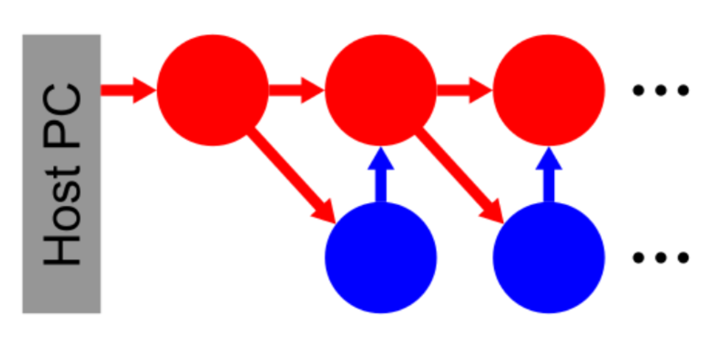

A simple feedforward network
==============================

In this task we consider a so-called synfire chain, an illustration of which can be seen in the next image:
A synfire chain is a chain of ``numb_pops`` "excitatory" populations (red), each consisting of :math:`n_\text{exc}` neurons, which are connected via excitatory connections, such that events in a prior population excite the neurons in the following population.
So, if the first population is activated, the activity begins traveling through the chain.
In order to stop a population from firing as soon as it has excited the next population it is also connected to an "inhibitory" population (blue) of :math:`n_\text{inh}` neurons via inhibitory synapses.
This inhibitory population is excited by the spike events from the previous excitatory population.

The number of neurons in the "excitatory" and "inhibitory" populations, as well as the strength of the connections in between needs to be chosen carefully in order for the activity to travel neatly.
The chain can also be closed by connecting the last population to the first one, making the activity travel through the chain repetitively.

.. include:: common_note_helpers.rst

.. only:: jupyter

    Setup
    ~~~~~~~~~~~

    .. include:: common_quiggeldy_setup.rst

    .. include:: common_nightly_calibration.rst

    A Synfire Chain
    ~~~~~~~~~~~~~~~

    We start by importing the relevant python packages we need for our experiment and setting up the environment for experiment execution.

    .. code:: ipython3

        %matplotlib inline

        from typing import Dict, Tuple, List, Union
        import quantities as pq

        import time
        import matplotlib.pyplot as plt
        import numpy as np
        import neo

        import pynn_brainscales.brainscales2 as pynn
        from pynn_brainscales.brainscales2.standardmodels.cells import \
            SpikeSourceArray, HXNeuron
        from pynn_brainscales.brainscales2.standardmodels.synapses import StaticSynapse

Experiment setup
~~~~~~~~~~~~~~~~

You are given a scaffold to run the experiment where populations are created and connected, and finally also stimulated.
This scaffold can be used to investigate the behaviour of a synfire chain and answer the questions below.

.. only:: not latex

    .. code:: ipython3

        ProjCollType = Dict[str, Union[List[pynn.Projection], pynn.Projection]]
        PopCollType = Dict[str, Union[List[pynn.Population], pynn.Population]]

        def setup_network(numb_pops: int, pop_sizes: Dict[int, np.array],
                          closed: bool = False) -> Tuple[ProjCollType, PopCollType]:
            """
            This function generates a synfire chain network
            Attention: You need to run 'pynn.end()' before a re-setup of a network
                       is possible!

            :param numb_pops: chain length
            :param pop_sizes: number of neurons in the excitatory ('exc') and
                              inhibitory ('inh') populations
            :param closed: indicates if the chain is closed, defaults to False
            :return: projections (as dict) and populations (as dict)
            """
            # The refractory period needs to be small to allow regular spiking
            neuron_params = {"refractory_period_refractory_time": 50}

            # Setup pyNN with a calibration
            pynn.setup(initial_config=calib)

            #############################
            # create neuron populations #
            #############################
            pop_collector = {'exc': [], 'inh': []}

            for syn_type in ['exc', 'inh']:
                for _ in range(numb_pops):
                    pop = pynn.Population(pop_sizes[syn_type],
                                          HXNeuron(**neuron_params))
                    pop.record(['spikes'])
                    pop_collector[syn_type].append(pop)

            # record membrane potential from first neuron of first excitatory
            # population of chain
            pop1exc = pop_collector['exc'][0]
            pop1exc[[0]].record('v', device='pad_0_buffered')
            pop1exc[[0]].record('v', device='madc')

            # kick starter input pulse at t = 0
            stim_pop = pynn.Population(pop_sizes['exc'],
                                       SpikeSourceArray(spike_times=[0]))

            #################################################
            # connect neuron populations to a synfire chain #
            #################################################
            proj_collector = {'exc_exc': [], 'exc_inh': [], 'inh_exc': []}

            # connect stim -> exc
            proj_collector['stim_exc'] = pynn.Projection(
                stim_pop, pop_collector['exc'][0], pynn.AllToAllConnector(),
                synapse_type=StaticSynapse(weight=0), receptor_type='excitatory')

            # connect stim -> inh
            proj_collector['stim_inh'] = pynn.Projection(
                stim_pop, pop_collector['inh'][0], pynn.AllToAllConnector(),
                synapse_type=StaticSynapse(weight=0), receptor_type='excitatory')

            for pop_index in range(numb_pops):
                # connect inh -> exc
                proj_collector['inh_exc'].append(pynn.Projection(
                    pop_collector['inh'][pop_index],
                    pop_collector['exc'][pop_index],
                    pynn.AllToAllConnector(), synapse_type=StaticSynapse(weight=0),
                    receptor_type='inhibitory'))

                # if synfire chain is not closed, the last exc -> exc and exc -> inh
                # that connects back to the first population needs to be skipped
                if (pop_index == numb_pops - 1) and not closed:
                    continue

                # connect exc -> exc
                proj_collector['exc_exc'].append(pynn.Projection(
                    pop_collector['exc'][pop_index],
                    pop_collector['exc'][(pop_index + 1) % numb_pops],
                    pynn.AllToAllConnector(), synapse_type=StaticSynapse(weight=0),
                    receptor_type='excitatory'))

                # connect exc -> inh
                proj_collector['exc_inh'].append(pynn.Projection(
                    pop_collector['exc'][pop_index],
                    pop_collector['inh'][(pop_index + 1) % numb_pops],
                    pynn.AllToAllConnector(), synapse_type=StaticSynapse(weight=0),
                    receptor_type='excitatory'))
            return proj_collector, pop_collector

        # Initially setup a network
        projs, pops = setup_network(
            numb_pops=8,                     # chain length
            pop_sizes={'exc': 7, 'inh': 7})  # size of each chain link

    With the network setup we can configure and run it.

    .. code:: ipython3

        def set_network_weights(weights: Dict[str, int],
                                projections: ProjCollType):
            """
            Sets weights in the network.

            :param weights: unsigned weights to be set
            :param projections: projections where the weights should be applied

            :raise ValueError: if field name in weights can't be found in
                projections
            """
            for name, weight in weights.items():
                if name not in projections:
                    raise ValueError(f"Invalid field name in weights: '{name}'."
                                     f"Possible fields: {list(projections.keys())}")
                if type(projections[name]) == list:
                    for proj in projections[name]:
                        proj.setWeights(weight)
                else:
                    projections[name].setWeights(weight)

        def run(populations: PopCollType, duration: pq.Quantity) \
            -> Tuple[Dict[str, np.ndarray], np.ndarray]:
            """
            Perform the configured experiment.

            :param populations: population collector to extract some network information
            :param duration: emulation time in ms
            :return: spikes of all neurons and membrane trace of the first exc. neuron
            """
            # emulate the network
            pynn.reset()
            pynn.run(float(duration.rescale(pq.ms)))

            # read back all recorded spikes
            spike_collector = {'exc': np.zeros(len(populations['exc']), dtype=object),
                               'inh': np.zeros(len(populations['inh']), dtype=object)}
            for syn_type in ['exc', 'inh']:
                for pop_index, pop in enumerate(populations[syn_type]):
                    spike_collector[syn_type][pop_index] = \
                        pop.get_data("spikes").segments[-1].spiketrains

            # read back the membrane potential
            mem_v = populations['exc'][0][[0]].get_data("v").segments[-1].irregularlysampledsignals[0]
            return spike_collector, mem_v

.. only:: jupyter

    Visualize data
    --------------

    .. code:: ipython3

        def plot_data(populations: PopCollType, result_spikes: Dict[str, np.ndarray],
                      result_v: neo.IrregularlySampledSignal):
            """
            Plots the data and shows as well as saves these figures.

            :param populations: population collector to extract some network information
            :param result_spikes: spikes of all neurons
            :param result_v: membrane trace of the first exc. neuron
            """
            pop_size_exc = populations['exc'][0].size
            pop_size_inh = populations['inh'][0].size
            no_pops = len(populations['exc'])

            # visualize the result
            ax = plt.subplot(211)
            for synapse_type in result_spikes:
                for population_index in range(no_pops):
                    for spike_train in result_spikes[synapse_type][population_index]:
                        neuron_id = spike_train.annotations['source_id']
                        ax.plot(spike_train, np.ones_like(spike_train) * neuron_id,
                                c='k', marker="o", ls="None", ms=1)
            ax.set_xlim(0, max(result_v.times))
            ax.set_xticklabels([])
            ax.set_ylim(-0.5, (pop_size_exc + pop_size_inh) * no_pops - 0.5)
            ax.set_ylabel('neuron ID')
            ax.axhspan(-0.5, pop_size_exc * no_pops - 0.5, color='r', alpha=0.2)
            ax.axhspan(pop_size_exc * no_pops - 0.5,
                       (pop_size_exc + pop_size_inh) * no_pops - 0.5,
                       color='b', alpha=0.2)

            axmem = plt.subplot(212)
            axmem.plot(result_v.times, result_v)
            axmem.set_xlim(0, max(result_v.times))
            axmem.set_xlabel('time [ms]')
            axmem.set_ylabel('membrane potential [LSB]')

            figname = f'fp_task5_synfire_chain_{time.strftime("%Y%m%d-%H%M%S")}.png'
            plt.savefig(figname, dpi=300)
            print(f"Result plot saved under {figname}")

Exercises
~~~~~~~~~

Adjusting weights
-----------------

- Tune the weights below to obtain a synfire chain behavior as seen in the figure above.
- Which connection is the most sensitive one?
- What happens if you disable inhibition?
- Make comments in your lab book.

After executing the cells above, you can execute this cell as oft as you want.

.. only:: not Solution

    .. code:: ipython3

        synapse_weights = dict(
            stim_exc=...,  # int in range 0 - 63
            stim_inh=...,  # int in range 0 - 63
            exc_exc=...,   # int in range 0 - 63
            exc_inh=...,   # int in range 0 - 63
            inh_exc=...    # int in range -63 - 0
        )
        set_network_weights(weights=synapse_weights, projections=projs)

        results = run(pops, 0.2 * pq.ms)

        plot_data(pops, *results)

.. only:: Solution

    .. code:: ipython3

        from ipywidgets import interact, IntSlider
        from functools import partial
        IntSlider = partial(IntSlider, continuous_update=False)

        @interact(
            stim_exc=IntSlider(min=0, max=63, step=1, value=32),
            stim_inh=IntSlider(min=0, max=63, step=1, value=32),
            exc_exc=IntSlider(min=0, max=63, step=1, value=20),
            exc_inh=IntSlider(min=0, max=63, step=1, value=30),
            inh_exc=IntSlider(min=-63, max=0, step=1, value=-20)
        )
        def experiment(stim_exc, stim_inh, exc_exc, exc_inh, inh_exc):
            synapse_weights = dict(
                stim_exc=stim_exc,  # int in range 0 - 63
                stim_inh=stim_inh,  # int in range 0 - 63
                exc_exc=exc_exc,   # int in range 0 - 63
                exc_inh=exc_inh,   # int in range 0 - 63
                inh_exc=inh_exc    # int in range -63 - 0
            )
            set_network_weights(weights=synapse_weights, projections=projs)
            results = run(pops, 0.2 * pq.ms)
            plot_data(pops, *results)

Adjusting the number of neurons per population
----------------------------------------------

Reduce the number of neurons in each population and use the free neurons to increase the chain size.
Which hardware feature limits the minimal number of neurons in each population?
What is the maximal chain length that you can produce?
Make comments in your lab book.

.. only:: not Solution

    .. code:: ipython3

        projs, pops = setup_network(
            numb_pops=...,                       # chain length
            pop_sizes={'exc': ..., 'inh': ...})  # size of each chain link

        # we reuse the weights from the exercise above
        set_network_weights(weights=synapse_weights, projections=projs)

        results = run(pops, 0.2 * pq.ms)

        plot_data(pops, *results)

.. only:: Solution

    .. code:: ipython3

        projs, pops = setup_network(
            numb_pops=8,                     # chain length
            pop_sizes={'exc': 7, 'inh': 7})  # size of each chain link

        # just some values
        synapse_weights = dict(
            stim_exc=63,  # int in range 0 - 63
            stim_inh=63,  # int in range 0 - 63
            exc_exc=60,   # int in range 0 - 63
            exc_inh=20,   # int in range 0 - 63
            inh_exc=-15    # int in range -63 - 0
        )

        # we reuse the weights from the exercise above
        set_network_weights(weights=synapse_weights, projections=projs)

        results = run(pops, 0.2 * pq.ms)

        plot_data(pops, *results)

Closing the loop
-----------------

Close the loop from the last to the first population.
Does the neurons still fire after the software has completed?
Make comments in your lab book.

.. only:: Solution

    **Solution: The activity is sustained even after the software run completed.**

Hint: For this part it might be easier to switch to a smaller chain with larger populations.

Hint: Take a look into the code above.
The closed loop is already implemented and just need to be activated.

.. only:: not Solution

    .. code:: ipython3

        projs, pops = setup_network(...)

        set_network_weights(weights=..., projections=projs)

        results = run(pops, 0.2 * pq.ms)

        plot_data(pops, *results)

.. only:: Solution

    .. code:: ipython3

        projs, pops = setup_network(
            numb_pops=20,
            pop_sizes={'exc': 8, 'inh': 8},
            closed=True)

        synapse_weights = dict(
            stim_exc=63,  # int in range 0 - 63
            stim_inh=63,  # int in range 0 - 63
            exc_exc=60,   # int in range 0 - 63
            exc_inh=20,   # int in range 0 - 63
            inh_exc=-15    # int in range -63 - 0
        )

        set_network_weights(weights=synapse_weights, projections=projs)

        results = run(pops, 0.2 * pq.ms)

        plot_data(pops, *results)

.. only:: jupyter

    After all, we need to shut down pyNN again.

    .. code:: ipython3

        pynn.end()
