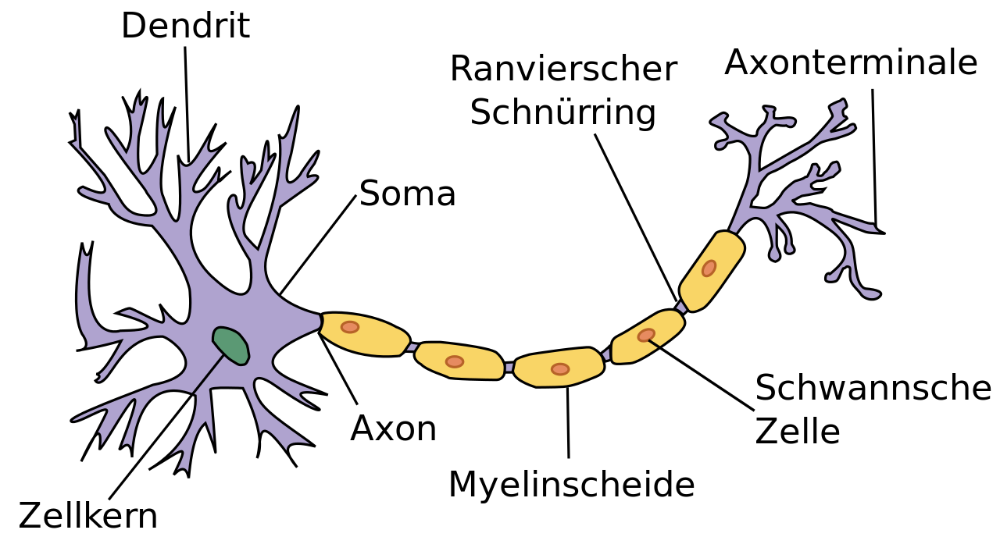
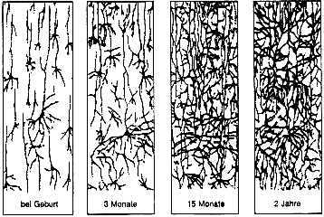
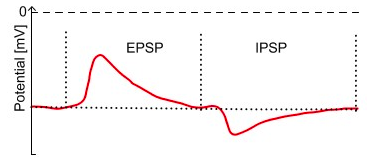

Wie verarbeitet unser Gehirn Informationen?
===========================================

Was seht ihr auf diesem Bild?

(https://portal.gastfreund.net/bremen/262230)

Woher wisst ihr, was hier dargestellt ist, beziehungsweise woran konntet
ihr es erkennen? Diese Frage klingt jetzt vielleicht etwas komisch, aber
wenn man einen Computer fragt, was auf diesem Bild zu sehen ist, dann
wird dieser damit Probleme haben. Was für Schwierigkeiten fallen euch
ein, die dieser dabei haben könnte?

Angenommen, wir bringen dem Computer bei, dass auf diesem Bild die
Bremer Stadtmusikanten zu sehen sind. Selbst dann wird er
Schwierigkeiten haben zu erkennen, dass die folgenden Bilder diese auch
darstellen.

(https://de.wikipedia.org/wiki/Datei:Die_Bremer_Stadtmusikanten.jpg)
(https://www.bremen-tourismus.de/bremen/package/detail1/DEU99999990021103028?lang=de)
(https://www.geo.de/geolino/buechertipps/die-bremer-stadtmusikanten_30122522-30166320.html)
(https://www.echtkind.de/ostheimer-holztiere-set-bremer-stadtmusikanten-4-teilig-2630.html)

Selbst ein Kind, das nie ein Bild der Bremer Stadmusikanten gesehen hat,
aber das Märchen kennt, könnte für jedes Bild sagen, was dargestellt
ist. Wie kommt es, dass Computer die schwierigsten Berechnungen im
Bruchteil einer Sekunde ausführen können, aber bei solchen für Menschen
einfachen Aufgaben scheitern? Dem zugrunde liegt eine grundsätzlich
unterschiedliche Art der Informationsverarbeitung. Unser Gehirn arbeitet
nämlich nicht mit Nullen und Einsen, wie klassische Computer es tun.
Aber wie funktioniert die Verarbeitung von Informationen im Gehirn
eigentlich?

Das Neuron
----------

Unser Gehirn besteht aus ungefähr 100 Milliarden Nervenzellen. Diese
werden auch als Neuronen bezeichnet. Sie können mit Zehntausenden
anderen Neuronen verbunden sein und fungieren dadurch als
Informationssammler und Weitergeber. Ein Neuron bekommt Input von vielen
anderen Neuronen über seine Dendriten. Dieser wird in den Zellkörper,
den sogenannten Soma, geleitet. Wenn der dort gesammelte Input
ausreichend stark ist und damit als informationshaltig angesehen wird,
erzeugt die Nervenzelle selbst ein Signal, ein sogenanntes
Aktionspotential. Dieses läuft entlang des Axons zu den Axonterminalen,
von wo aus es dann wiederum an viele andere Neuronen weitergegeben
werden kann.

(https://de.wikipedia.org/wiki/Datei:Neuron_(deutsch)-1.svg)

Die Verbindungen zwischen Neuronen werden Synapsen genannt. Diese sind
allerdings nicht statisch, sondern ändern sich die ganze Zeit. Dabei
können ganz neue Synapsen entstehen, andere die nicht verwendet werden
verschwinden oder das synaptische Gewicht, also die Stärke einer
Verbindung, kann geändert werden. Wenn zum Beispiel ein Neuron immer ein
Aktionspotential generiert, nachdem es Input von einem anderen bekommen
hat, dann scheint eine gewisse Kausalität zwischen diesen Ereignissen
vorzuliegen und die jeweilige Synapse wird gestärkt. Andersherum wird
beispielsweise die Verbindung zu einem Neuron, das nichts zum Erzeugen
des Aktionspotential beiträgt, geschwächt oder verworfen. Das Entstehen
von Synapsen zwischen Neuronen und das Anpassen ihrer Gewichte
ermöglicht es dem Menschen, neue Dinge zu lernen. Durch dieses
dynamische Netzwerk aus Billiarden von Verbindungen können wir unter
anderem den Informationsgehalt aus Fotos extrahieren und diesen dann auf
ähnliche Bilder anwenden.

(https://arbeitsblaetter.stangl-taller.at/GEHIRN/Gehirn-Neuronen.shtml)

Das Aktionspotential
--------------------

Wie entscheidet die Zelle nun aber, ab wann ein Eingangsignal
informationshaltig ist und es ein Aktionspotential erzeugen soll und wie
sieht dieses aus? Dafür gibt es verschiedene Kriterien und das gehört
wie ein Großteil der Neurowissenschaften zum Gegenstand aktueller
Forschung. Hier wollen wir nun ein simples Kriterium betrachten, nämlich
das der Schwellenspannung. Im Ruhezustand ist das Zellinnere im
Vergleich zur Umgebung aufgrund anderer Ionenkonzentrationen negativ
geladen. Die Ruhespannung, die an der Zellmembran anliegt, beträgt in
etwa -70mV. Bekommt das Neuron nun Input von anderen Nervenzellen,
ändert sich dieses Potential. Für exzitatorischen (anregenden) Input
steigt die Spannung. Es gibt aber auch inhibitorische (hemmende)
Synapsen, die dafür sorgen, dass dies nicht passiert oder dass das
Membranpotential sogar nach unten gezogen wird. Der entstehende Verlauf
in der Membranspannung wird exzitatorisches bzw. inhibitorisches
postsynaptisches Potential (EPSP/IPSP) genannt.

(http://www.chemgapedia.de/vsengine/vlu/vsc/de/ch/8/bc/vlu/neurotransmission/neuro_modul.vlu.html)

Damit ein Aktionspotential erzeugt wird, muss ausreichend
exzitatorischer Input vorliegen. Was in diesem Fall ausreichend
bedeutet, wird über eine Schwellenspannung definiert, die bei etwa -55mV
liegt. Wird dieser Wert erreicht, so entsteht das typische
Aktionspotential: Die Spannung steigt sehr schnell sehr stark an (bis zu
einem Wert von +40mV), daraufhin fällt sie wieder rasch ab, ist
kurzzeitig sogar niedrieger als im Ruhezustand und nähert sich danach
wieder ihrem Ruhewert an. Der Bereich, in dem das Membranpotential
niedriger als die Ruhespannung ist, wird als Hyperpolarisation
bezeichnet und dauert die sogenannte Refraktärzeit an. Währenddessen
kann weiterer Input kein neues Aktionspotential bewirken. Der ganze
Prozess dauert nur wenige Millisekunden und da der Spannungsverlauf wie
eine dünne Spitze aussieht, wird das Aktionspotential auch als Spike
(englisch für Spitze) bezeichnet.

.. image:: _static/girlsday/girlsday_actionpotential.png
    :width: 500

(https://de.wikipedia.org/wiki/Nervenzelle#/media/Datei:Aktionspotential.svg)
