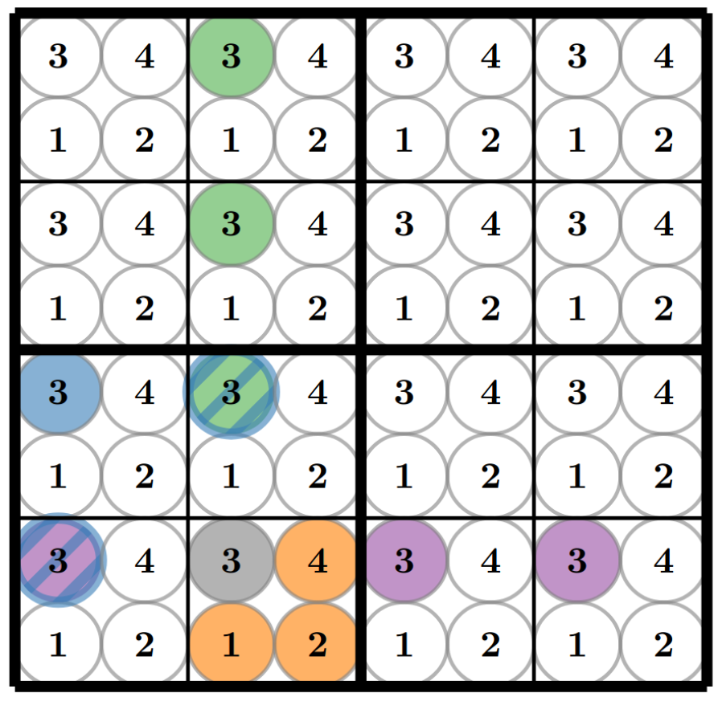

Experimente mit mehreren Nervenzellen Teil 2
============================================

Sudoku
------

Eine weitere Aufgabe, die man den künstlichen Nervenzellen beibringen
kann, ist das Lösen eines Sudokus. Da die Anzahl der Neuronen auf dem
Chip begrenzt ist, betrachten wir hier nur ein 4x4 Sudoku.

(Quelle: https://www.kip.uni-heidelberg.de/Veroeffentlichungen/download.php/6118/temp/3666.pdf)

Jedes Feld besitzt vier Neuronen, welche die verschiedenen Zahlen
repräsentieren, die darin stehen können. Wenn eine Zahl vorgegeben ist,
verbietet sie damit nach den Sudoku Regeln bestimmte Kombinationen.
Betrachten wie beispielsweise die graue 3. Da diese feststeht, können in
dem selben Feld nicht mehr die Zahlen 1, 2 oder 4 stehen (orange).
Außerdem darf in der gleichen Reihe (lila) und in der gleichen Spalte
(grün) keine 3 mehr vorkommen. Gleiches gilt für den unteren linken
Block (blau). Diese verbotenen Kombinationen werden durch inhibitorische
Synapsen realisiert. Das bedeutet, wenn eine Zahl in einem Feld
feststeht, dann feuert das zugehörige Neuron. Alle daraus resultierenden
verbotenen Möglichkeiten werden durch die inhibitorischen Verbindungen
so stark unterdrückt, dass die jeweiligen Neuronen nicht feuern können.
Damit die übrigen erlaubten Neuronen zum Feuern gebracht werden,
bekommen alle Nervenzellen leichten Input durch ein zufälliges
Hintergrundrauschen. Außerdem sind alle Neuronen mit sich selbst
exzitatorisch verbunden, um eine mögliche Aktivität aufrecht zu
erhalten.

.. code:: ipython3

    from math import sqrt
    import ipywidgets as w
    from ipycanvas import Canvas, hold_canvas

    import numpy as np
    import matplotlib.pyplot as plt
    import pynn_brainscales.brainscales2 as pynn
    from pynn_brainscales.brainscales2.standardmodels.synapses import StaticSynapse
    from pynn_brainscales.brainscales2.standardmodels.cells import \
                SpikeSourceArray, HXNeuron,SpikeSourcePoisson

    neuron_params = {
        "membrane_capacitance_capacitance": 5,
        "refractory_period_refractory_time": 2
    }
    runtime = 0.5

    # Die Ruhe- und Umkehrspannung wird erhöht, um Neuronen zum regelmäßigen
    # Feuern zu bringen.
    v_leak_offset = 110
    v_reset_offset = 45 + v_leak_offset

    atomic, inject = pynn.helper.filtered_cocos_from_nightly()
    config_injection = pynn.InjectedConfiguration(
        post_non_realtime=inject)
    pynn.setup(injected_config=config_injection)

    # Alle Neuronen die eine Zahl in einem Feld repräsentieren werden als
    # Populationen der Größe 1 erstellt.
    print("Die Neuronen werden angelegt... (1/4)")
    pops_collector = []
    for row in range(4):
        pops_row = []
        for field_in_row in range(4):
            pops_field = []
            for number_in_field in range(4):
                neuron = pynn.Population(1, HXNeuron(atomic, **neuron_params))
                neuron.leak_v_leak = neuron.get('leak_v_leak') + v_leak_offset
                neuron.reset_v_reset = neuron.get('reset_v_reset') + v_reset_offset
                neuron.record(["spikes"])
                pops_field.append(neuron)
            pops_row.append(pops_field)
        pops_collector.append(pops_row)

    # Das Hintergrundrauschen für alle Neuronen wird erzeugt.
    # Dabei bekommt jedes Neuronen individuellen Input, der einer gemeinsamen
    # Zufallsverteilung (genauer gesagt einer Poissonverteilung) folgt.
    print("Das Hintergrundrauschen wird erzeugt... (2/4)")
    stim_collector = []
    for row in range(4):
        stim_row = []
        for field_in_row in range(4):
            stim_field = []
            for number_in_field in range(4):
                poisson_source = pynn.Population(
                    1, SpikeSourcePoisson(duration=runtime-0.01,rate=5e5,start=0.01))
                stim_field.append(poisson_source)
            stim_row.append(stim_field)
        stim_collector.append(stim_row)

    # Diese Zufallsquellen werden nun mit den Neuronen verbunden.
    # Zusätzlich wird jedes Neuron mit sich selbst exzitatorisch verbunden,
    # um seine mögliche Aktivität zu erhalten.
    for row in range(4):
        for column in range(4):
            for number in range(4):
                pynn.Projection(
                    pops_collector[row][column][number],
                    pops_collector[row][column][number],
                    pynn.AllToAllConnector(),
                    synapse_type=StaticSynapse(weight=60),
                    receptor_type='excitatory')
                pynn.Projection(
                    stim_collector[row][column][number],
                    pops_collector[row][column][number],
                    pynn.AllToAllConnector(),
                    synapse_type=StaticSynapse(weight=60),
                    receptor_type='excitatory')

    print("Die Regeln werden implementiert... (3/4)")

    # Die inhibitorischen Verbindungen zu den anderen Neuronen im selben Feld werden erstellt.
    print("  - Es darf nur eine Zahl pro Feld geben")
    for row in range(4):
        for column in range(4):
            for number_pre in range(4):
                for number_post in range(1,4):
                    pynn.Projection(
                        pops_collector[row][column][number_pre],
                        pops_collector[row][column][(number_pre+number_post)%4],
                        pynn.AllToAllConnector(),
                        synapse_type=StaticSynapse(weight=63),
                        receptor_type='inhibitory')

    # Die inhibitorischen Verbindungen zu den Neuronen der selben Nummer
    # in der selben Reihe werden erstellt.
    print("  - Jede Zahl darf nur einmal pro Reihe vorkommen")
    for row in range(4):
        for column in range(4):
            for number in range(4):
                for column_post in range(1,4):
                    pynn.Projection(
                        pops_collector[row][column][number],
                        pops_collector[row][(column+column_post)%4][number],
                        pynn.AllToAllConnector(),
                        synapse_type=StaticSynapse(weight=63),
                        receptor_type='inhibitory')

    # Die inhibitorischen Verbindungen zu den Neuronen der selben Nummer
    # in der selben Spalte werden erstellt.
    print("  - Jede Zahl darf nur einmal pro Spalte vorkommen")
    for row in range(4):
        for column in range(4):
            for number in range(4):
                for row_post in range(1,4):
                    pynn.Projection(
                        pops_collector[row][column][number],
                        pops_collector[(row+row_post)%4][column][number],
                        pynn.AllToAllConnector(),
                        synapse_type=StaticSynapse(weight=63),
                        receptor_type='inhibitory')

    # Die inhibitorischen Verbindungen zu den Neuronen der selben Nummer
    # im selben Block werden erstellt.
    # Dabei sind tatsächlich nur die diagonalen Verbindungen notwendig,
    # da die anderen bereits in der selben Reihe oder Spalte sind.
    print("  - Jede Zahl darf nur einmal pro Block vorkommen")
    for row_offset in [0, 2]:
        for column_offset in [0, 2]:
            for row in range(2):
                for column in range(2):
                    for number in range(4):
                        pynn.Projection(
                            pops_collector[row+row_offset][column+column_offset][number],
                            pops_collector[
                                (row+1)%2+row_offset][(column+1)%2+column_offset][number],
                            pynn.AllToAllConnector(),
                            synapse_type=StaticSynapse(weight=63),
                            receptor_type='inhibitory')

    # Der Stimulus für die vorgegebenen Zahlen wird erstellt und
    # mit den jeweiligen Neuronen verbunden.
    print("Die Tipps werden vorbereitet (4/4)")
    stim_given_numbers = pynn.Population(
        2, SpikeSourceArray(spike_times=np.linspace(0.0, runtime, 500)))
    clue_projections = []
    for row in range(4):
        clues_row = []
        for column in range(4):
            clues_field = []
            for number in range(4):
                clues_field.append(pynn.Projection(
                    stim_given_numbers,
                    pops_collector[row][column][number],
                    pynn.AllToAllConnector(),
                    synapse_type=StaticSynapse(weight=0),
                    receptor_type='excitatory'))
            clues_row.append(clues_field)
        clue_projections.append(clues_row)

    print("Das Sudoku ist fertig erstellt!")

.. code:: ipython3

    def canvas_leer(N=4, size=36):
        canvas = Canvas(
            width=size*N, height=size*N,
            layout=w.Layout(border=f'solid {size/15}px', margin='5px'))
        canvas.font = '0.7px sans-serif'
        canvas.text_align = 'center';
        canvas.text_baseline = 'middle'
        canvas.scale(size)
        return canvas

    def canvas_sudoku_leer(N=4, size=36):
        """Erstellt ein leeres Sudoku. Nur die Zahlen fehlen :)"""
        Ns = int(sqrt(N))
        canvas = canvas_leer(N, size)
        with hold_canvas(canvas):
            for i in range(0, N+1):
                canvas.line_width = 1/15 if i % Ns == 0 else 1/30
                canvas.stroke_line(0, i, N, i)
                canvas.stroke_line(i, 0, i, N)
        return canvas

    def solve_sudoku(num_clues, repetitions=5):
        test=True
        # Alle Tipps zurücksetzen
        for row in range(4):
            for column in range(4):
                for number in range(4):
                    for connection in clue_projections[row][column][number]:
                        connection.weight = 0.

        canvas_sudoku_start = canvas_sudoku_leer()
        # Tipps einschalten und anzeigen
        for i in range(num_clues):
            row, column, number = (int(clues[i][j]) - 1 for j in range(3))
            canvas_sudoku_start.fill_style = 'black'
            canvas_sudoku_start.fill_text(number+1, column+.5, row+.5)
            canvas_sudoku_start.fill_style = '#00000022'
            canvas_sudoku_start.fill_rect(column, row, 1, 1)
            for connection in clue_projections[row][column][number]:
                    connection.weight = 63.

        output = w.HBox()
        display(output)

        rate_list = []
        for k in range(repetitions):
            # neues Sudoku anzeigen
            canvas = canvas_leer()
            canvas.draw_image(canvas_sudoku_start, width=4, height=4)
            output.children += (canvas,)

            # Das Netzwerk wird emuliert.
            pynn.run(runtime)

            # Die Spikes werden verglichen.
            correct = 0
            for row in range(4):
                for column in range(4):
                    best_guess = '?'
                    canvas.fill_style = "#000000cc"
                    len_best_guess = 9  # erst ab 10 Spikes werden diese gezählt
                    for number in range(4):
                        for spike_train in pops_collector[row][column][number]\
                            .get_data("spikes").segments[0].spiketrains:
                            if len(spike_train) > len_best_guess:
                                best_guess = str(number+1)
                                len_best_guess = len(spike_train)
                    if solution[row*4 + column] == best_guess:
                        correct += 1
                        if test: canvas.fill_style = "darkgreen"
                    elif best_guess != "?" and test:
                        canvas.fill_style = "darkred"
                    canvas.fill_text(best_guess, column+.5, row+.5)
            rate_list.append(correct)
        if repetitions == 1:
            if test: print(f"Erfolg: {correct/16*100:.2f}%")
            return
        return np.mean(rate_list), np.std(rate_list)

.. code:: ipython3

    # Dies ist die Lösung des Sudokus:
    solution = (
        '3241'
        '1432'
        '2314'
        '4123'
    )

    # Die gegebenen Startnummern des Sudokus sind folgenderweise angegeben: 'Reihe Spalte Zahl'
    # Dabei kann jeder Eintrag Werte von 1 bis 4 annehmen.
    clues = ['113','141','211','432','233','323','134','312','421','224','344','443']

    from functools import partial
    w.interactive(
        solve_sudoku, dict(manual=True, manual_name="Los!"),
        num_clues=w.IntSlider(7, 0, len(clues), continuous_update=False, description="Anzahl Tipps"),
        repetitions=w.fixed(1))

Wie hängt der Erfolg mit der Anzahl der vorgegebenen Zahlen zusammen?
---------------------------------------------------------------------

Im nächsten Schritt soll diese Frage einmal systematischer untersucht werden:

.. code:: ipython3

    results = []
    number_clues = np.arange(4, 11)
    for num_clues in number_clues:
        print(f"\nDas Sudoku wird mit {num_clues} vorgegebenen Zahlen gelöst:")
        correct, correct_err = solve_sudoku(num_clues)
        print(f"Mittlerer Erfolg: {correct/16*100:.2f}%")
        results += [correct, correct_err]
    results = np.array(results).reshape(-1, 2)

    # Die Erfolgsrate wird visualisiert.
    plt.figure(figsize=(8, 5))
    plt.errorbar(number_clues, results[:,0], yerr=results[:,1], fmt='o')
    plt.xlabel("Anzahl der zum Start vorgegebenen Zahlen")
    plt.ylabel("Anzahl der korrekt gelösten Felder")
    plt.show()

