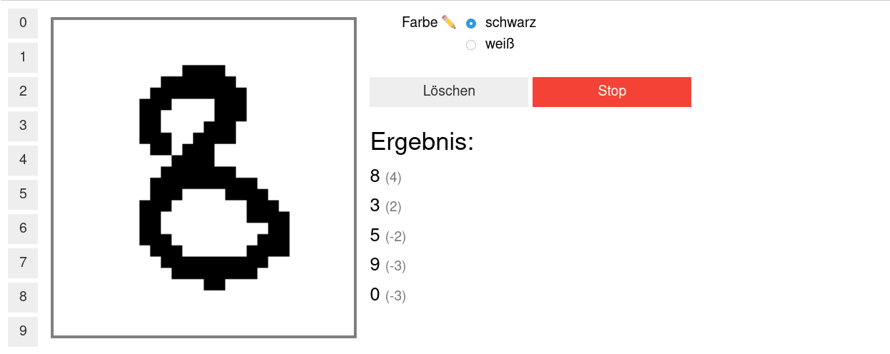

Maschinelles Lernen
===================

In diesem Teil soll es um ein einfaches Beispiel für maschinelles Lernen gehen.  
Maschinelles Lernen bedeutet, dass ohne menschliches Zutun neues Wissen aus
bestehenden Daten erhalten und dieses verallgemeinert wird. Dadurch sollen
Zusammenhänge und Muster erkannt werden, die auch auf unbekannte Beispieledaten
anwendbar sind.

Ein paar Beispiele, wo maschinelles Lernen sehr praktisch sein kann:

* Schrifterkennung
* Texte übersetzen
* Spotify / YouTube Vorschläge
* Aktivitätserkennung
* Werbung filtern
* Facebook Timeline
* ...

Fallen euch noch mehr ein?

Was ist ein neuronales Netz?
----------------------------

Herkömmliche neuronale Netze, wie sie beim maschinellen Lernen verwendet
werden, sind aus mehreren Lagen aus Neuronen aufgebaut (orange), welche
unterschiedlich stark verbunden sein können. Diese Stärke dieser
Verbindungen, die Gewichte, enthalten das "Wissen" und werden beim
Trainieren automatisch angepasst.

Wie viele Neuronen und Gewichte sind nötig?
~~~~~~~~~~~~~~~~~~~~~~~~~~~~~~~~~~~~~~~~~~~

Die Wahl eines geeigneten Modells ist gar nicht so einfach. Ist das
Modell zu klein, also enthält es zu wenig Neuronen und Gewichte, dann
kann es die zu lernenden Zusammenhänge nicht richtig abbilden. Ist es
aber zu komplex, also enthält es zu viele Neuronen, so ist dies
ebenfalls schlecht. Es können dann zwar die meisten Beispiele, die zum
Lernen verwendet wurden, richtig erkannt werden, bei Unbekanntem
scheitert das Modell aber. Man sagt, dass solch ein Modell nicht genug
verallgemeinern kann. Es hat zwar alle Beispiele auswendig gelernt, kann
aber die zu Grunde liegenden Zusammenhänge nicht verstehen.

Umgebung vorbereiten
--------------------

Bevor wir mit unseren Experimenten beginnen können, müssen wir erneut unsere Umgebung vorbereiten:

.. code:: ipython3

    from _static.common.helpers import setup_hardware_client, save_nightly_calibration
    setup_hardware_client()

Beispiel: Erkennung von handgeschriebenen Ziffern
-------------------------------------------------

Dies ist ein sehr beliebtes Beispiel für den Einsatz von maschinellem
Lernen: In einem Briefzentrum sollen die Postleitzahlen der Briefe in
der Sortieranlage automatisch gelesen werden, damit die Briefe in die
richtigen Fahrzeuge verladen werden können. Um dieses Problem zu lösen,
wurden viele verschiedene Bilder gesammelt und jeweils der richtigen Ziffer
zugeordnet.

.. code:: ipython3

    # Hier werden erstmal alle Dinge importiert, die wir später brauchen.
    import threading
    import traceback
    import time
    from functools import partial
    import numpy as np
    import torch
    from torchvision import datasets, transforms
    import hxtorch
    import ipywidgets as w
    from ipycanvas import Canvas, hold_canvas
    from IPython import get_ipython
    from tqdm.auto import tqdm

    %matplotlib inline
    import matplotlib.pyplot as plt

    save_nightly_calibration('hagen_cocolist.pbin')
    hxtorch.init_hardware(hxtorch.CalibrationPath('hagen_cocolist.pbin'))
    hxtorch.set_mock_parameter(hxtorch.measure_mock_parameter())

Im maschinellen Lernen ist das klassifizieren von Bildern ein beliebtes Beispiel, sodass eine große Sammlung von Bildern, welche Zahlen darstellen, frei verfügbar ist.
Diese Sammlung laden wir im folgenden runter:

.. code:: ipython3

   # Ort, an dem das Set von Bildern gespeichert werden soll:
   data_path = 'mnist'
   

.. code-block:: ipython3
    :class: test, html-display-none

    # use stored MNIST data for tests
    data_path = '/loh/data/mnist'

.. code:: ipython3

    transform = transforms.Compose([
        transforms.ToTensor(),
        transforms.Lambda(lambda x: x.round())
    ])
    train_transform = transforms.Compose([
        transforms.RandomResizedCrop(28),
        transform,
    ])
    
    # Die Bilder der Ziffern werden geladen.
    # Mit `train_data` wird trainiert, mit `test_data` kann nachher überprüft
    # werden, wie gut das Netzwerk verallgemeinern kann.
    train_data = datasets.MNIST(data_path, train=True, transform=train_transform,
                                download=True)
    test_data = datasets.MNIST(data_path, train=False, transform=transform,
                               download=True)
    
    numbers = {n: [] for n in range(10)}
    for img, n in test_data:
        numbers[n].append(img)
    
    train_loader = torch.utils.data.DataLoader(
        dataset=train_data, batch_size=200, shuffle=True)
    test_loader = torch.utils.data.DataLoader(
        dataset=test_data, batch_size=200)
    

Nun stellen wir einige, zufällige Bilder aus dem Set dar:

.. code:: ipython3

    fig, axs = plt.subplots(2, 2, constrained_layout=True)
    N = len(test_data)
    for ax in axs.flatten():
        image = test_data[np.random.randint(0, N-1)][0][0]
        ax.imshow(image, cmap='Greys')
        ax.set_axis_off()

Um diese Bilder jetzt auch automatisch richtig zu erkennen, wird
zunächst eine Beschreibung eines neuronalen Netzwerks benötigt. Der
folgende Programmcode definiert ein Netzwerk mit einer einzelnen
verstecken Lage mit 128 Neuronen.

.. code:: ipython3

    class Model(torch.nn.Module):
        """
        Ein sehr einfaches neuronales Netzwerk mit einer einzigen
        Lage aus versteckten Neuronen.
        """
        def __init__(self, mock=True):
            super().__init__()
            self.mock = mock
            num_hidden = 256  # die Anzahl der versteckten Neuronen
            self.classifier = torch.nn.Sequential(
                # Diese Lage verbindet jeden Pixel des Bildes
                # mit jedem versteckten Neuron:
                hxtorch.nn.Linear(
                    in_features=28 * 28,  # die Bilder sind 28x28 Pixel groß
                    out_features=num_hidden,
                    mock=mock), hxtorch.nn.ConvertingReLU(shift=1, mock=True),
                hxtorch.nn.Linear(
                    in_features=num_hidden,
                    out_features=num_hidden,
                    mock=mock), hxtorch.nn.ConvertingReLU(shift=1, mock=True),
                # Diese Lage verbindet jedes der verstecken Neuronen
                # mit einem der 10 möglichen Ausgänge:
                hxtorch.nn.Linear(
                    in_features=num_hidden,
                    out_features=10,  # es gibt 10 verschiedene Ziffern
                    mock=mock) 
            )
    
        def forward(self, x):
            x = x.view(-1, 28 * 28) * 31.
            x = self.classifier(x)
            return x

Dieses Modell ist aber noch “dumm”, d.h. es kann die Zahlen noch nicht
richtig erkennen. Das können wir direkt mal ausprobieren:

.. code:: ipython3

    class ZahlenMalen:
        """
        Einfache Oberfläche, um MNIST-Bilder zu malen.
        """
    
        def __init__(self, model, numbers, *, 
                     scale: int = 10, line_width: float = 2.5, autostop: bool = True):
            self.down = False
            self.erase = False
            self.changes_pending = True
            self.running = False
            self.model = model
            self.numbers = numbers
            self.scale = scale
            self.line_width = line_width
            self.autostop = autostop
            self.started_at = get_ipython().execution_count
    
            # Elemente der Oberfläche vorbereiten
            self.canvas = Canvas(
                width=scale * 28, height=scale * 28,
                sync_image_data=True,
                layout=w.Layout(border='solid gray', margin='10px'))
            self.color_chooser = w.RadioButtons(
                description='Farbe ✏️', options=['schwarz', 'weiß'])
            self.clear_button = w.Button(description='Löschen', button_style='')
            self.submit_button = w.Button()
            self.result_text = w.HTML()
            height = (scale * 28 + 0) / 10
            b_layout = w.Layout(width=f"{height}px", height=f"{height}px")
            self.number_buttons = [
                w.Button(description=str(n),layout=b_layout) for n in range(10)]
    
            # Events für die Maus-/Touchsteuerung registrieren
            self.canvas.on_mouse_down(self.start_draw)
            self.canvas.on_mouse_up(self.stop_draw)
            self.canvas.on_mouse_out(self.stop_draw)
            self.canvas.on_mouse_move(self.draw)
            self.canvas.on_touch_start(self.start_draw)
            self.canvas.on_touch_end(self.stop_draw)
            self.canvas.on_touch_cancel(self.stop_draw)
            self.canvas.on_touch_move(self.draw)
            self.submit_button.on_click(self.toggle_worker)
            self.clear_button.on_click(self.clear)
            w.interactive(self.choose_color, color=self.color_chooser)
            for n, button in enumerate(self.number_buttons):
                button.on_click(partial(self.draw_number, n))
    
            self.start_worker()
    
        def display(self):
            display(w.HBox([w.VBox(self.number_buttons),
                            self.canvas,
                            w.VBox([self.color_chooser,
                                    w.HBox([self.clear_button, self.submit_button]),
                                    self.result_text])]))
    
        def draw(self, x, y):
            if self.down:
                x = (round(x/self.scale) - self.line_width / 2) * self.scale
                y = (round(y/self.scale) - self.line_width / 2) * self.scale
                lw = self.scale * self.line_width
                func = self.canvas.clear_rect if self.erase else self.canvas.fill_rect
                func(x, y, lw, lw)
                self.changes_pending = True
    
        def draw_number(self, n: int, *_):
            assert 0<=n and n<10
            self.clear()
            self.put_image_data(
                self.numbers[n][np.random.randint(0, len(self.numbers[n]))])
    
        def start_draw(self, x, y):
            self.down = True
            self.draw(x, y)
    
        def stop_draw(self, x, y):
            self.down = False
    
        def choose_color(self, color):
            self.erase = (color == 'weiß')
    
        def clear(self, *args):
            self.canvas.clear()
            self.changes_pending = True
    
        def get_image_data(self):
            try:
                s = slice(round(self.scale/2), None, self.scale)
                image_data = self.canvas.get_image_data()[s, s, -1]
            except:
                image_data = self.canvas.create_image_data(
                    self.canvas.width//self.scale, self.canvas.height//self.scale)[..., -1]
            return image_data / 255
    
        def put_image_data(self, image_data):
            d = self.canvas.create_image_data(
                    self.canvas.width, self.canvas.height)
            d[:, :, -1] = image_data.repeat_interleave(
                    self.scale, -2).repeat_interleave(self.scale, -1) * 255
            self.canvas.put_image_data(d)
            self.changes_pending = True
    
        def inference(self):
            try:
                if self.model.mock:
                    time.sleep(0.5)
                data = torch.tensor(
                    self.get_image_data(), dtype=torch.float).unsqueeze(0)
                results_p = self.model(data.unsqueeze(0)).detach().flatten()
                results = reversed(results_p.argsort())
                results_t = [f"<h4>{i} <small>({results_p[i]:.0f})</small></h4>" for i in results]
                text = "<h3>Ergebnis:</h3>"
                text += ''.join(results_t[:5])
                self.result_text.value = text
            except:
                self.print_traceback()
    
        def print_traceback(self):
            """
            Zeigt eventuelle Fehler als roten Text auf der Oberfläche
            https://github.com/martinRenou/ipycanvas/issues/61
            """
            self.canvas.fill_style = '#ff8888'
            self.canvas.fill_rect(10, 10, 300, 300)
            self.canvas.fill_style = '#000000'
            s = traceback.format_exc()
            for i, si in enumerate(s.split('\n')):
                self.canvas.fill_text(si, 20, 30+15*i) 
    
        def start_worker(self, *_):
            """ Startet einen neuen Hintergrundprozess """
            self.started_at = get_ipython().execution_count
            self.running = True
            self.submit_button.description = "Stop"
            self.submit_button.button_style = "danger"
    
            def work(zm: ZahlenMalen):
                while zm.running:
                    if zm.changes_pending or True:
                        zm.changes_pending = False
                        zm.inference()
                    else:
                        time.sleep(0.2)
                    if self.autostop and get_ipython().execution_count > zm.started_at + 1:
                        zm.stop_worker()
    
            thread = threading.Thread(target=work, args=(self,))
            thread.start()
    
        def stop_worker(self, *_):
            # stop and update button
            self.running = False
            self.submit_button.description = "Start"
            self.submit_button.button_style = "success"
    
        def toggle_worker(self, *_):
            if self.running:
                self.stop_worker()
            else:
                self.start_worker()
    
    # Anzeigen der Oberfläche zum Malen
    model = Model()
    zm1 = ZahlenMalen(model, numbers, line_width=2)
    zm1.display()

.. image:: _static/girlsday/girlsday_mnist_output2.png
   :width: 100%
   :class: solution

In dem weißen Bereich kann man selber malen oder mit den Knöpfen auf der
linken Seite eine Zahl malen lassen. Unter **Ergebnis** sollte dann ganz
oben die wahrscheinlich richtige Ziffer erscheinen, darunter kommen die
Ziffern, die das Modell als etwas weniger wahrscheinlich vorschlägt. Da
herrscht jetzt vermutlich noch ein ziemliches Durcheinander, aber es
wurde ja auch noch nicht trainiert!

Training des Modells
~~~~~~~~~~~~~~~~~~~~

In diesem Teil soll nun ein Modell so trainiert werden, dass es möglichst
gut handgeschreibene Ziffern erkennen kann. Dazu werden im Folgenden zwei
Funktionen benötigt:

* ``train`` zeigt dem Netzwerk nacheinander jedes
  Trainingsbeispiel und passt dabei die Gewichte, die Verbindungen zwischen
  den Neuronen, an.
* ``test`` testet, wie gut das Netzwerk verallgemeinern
  kann. Dafür wird versucht die Testbeispiele (die nicht zum Trainieren
  verwendet wurden) zuzuordnen und das Ergebnis mit den richtigen Ziffern
  verglichen.

.. code:: ipython3

    zm1.stop_worker()
    
    def train(model: torch.nn.Module,
              loader: torch.utils.data.DataLoader,
              optimizer: torch.optim.Optimizer):
        """
        Diese Funktion trainiert das Modell.

        :param model: Das Modell
        :param loader: Die zu verwendenden Beispielbilder
        :param optimizer: Der Optimierer, der zum Anpassen des Modells 
            verwendet werden soll
        """
        model.train()
        pbar = tqdm(
            total=len(loader), unit="batch", postfix=" " * 11, leave=False)
        for data, target in loader:
            optimizer.zero_grad()
            output = model(data)
            loss = torch.nn.functional.cross_entropy(output, target) / 64
            loss.backward()
            optimizer.step()  # automatisches Anpassen der Gewichte
            pbar.set_postfix(loss=f"{loss.item():.4f}")
            pbar.update()
        pbar.close()
    
    
    def test(model: torch.nn.Module, loader: torch.utils.data.DataLoader) -> float:
        """
        Diese Funktion testet das Modell.

        :param model: Das zu testende Modell
        :param loader: Die zu verwendenden Beispielbilder
        :return: Die erreichte Genauigkeit
        """
        model.eval()
        loss = 0
        n_correct = 0
        n_total = len(loader.dataset)
        pbar = tqdm(total=len(loader), unit="batch", leave=False)
        with torch.no_grad():
            for data, target in loader:
                output = model(data)
                pred = output.argmax(dim=1, keepdim=True)
                n_correct += pred.eq(target.view_as(pred)).sum().item()
                pbar.update()
        pbar.close()
        accuracy = n_correct / n_total
        return accuracy

.. code:: ipython3

    # Dieses Modell soll trainiert werden
    model = Model()
    print(model)
    
    # Dieser Optimierer wird für das Training benötigt
    # und übernimmt die Anpassung der Gewichte.
    optimizer = torch.optim.Adam(
        model.parameters(),  # es sollen alle Gewichte trainiert werden
        lr=0.25,  # Geschwindigkeit, mit der gelernt werden soll
    )

Trainiert wird nun in sogenannten Epochen, das heißt es werden die
gleichen Beispiele immer wieder gezeigt. Dabei sollte das Netzwerk
immer besser werden.

.. code:: ipython3

    num_epochs = 4  # Die Anzahl der Trainingsepochen
    for epoch in range(num_epochs):
        train(model, train_loader, optimizer)
        accuracy = test(model, test_loader)
        print(f"Genauigkeit: {accuracy*100:.2f}%")

.. image:: _static/girlsday/girlsday_mnist_output3.png
   :width: 100%
   :class: solution

Jetzt sollte das Netzwerk die gemalten Ziffern auch erkennen können:

.. code:: ipython3

    zm2 = ZahlenMalen(model, numbers, line_width=2)
    zm2.display()

* Ihr werdet feststellen, das manche Ziffern einfacher erkannt werden
  als andere. Woran könnte das liegen?
* Reicht es auch, nur eine halbe Ziffer zu malen?

.. code:: ipython3

    zm2.stop_worker()
