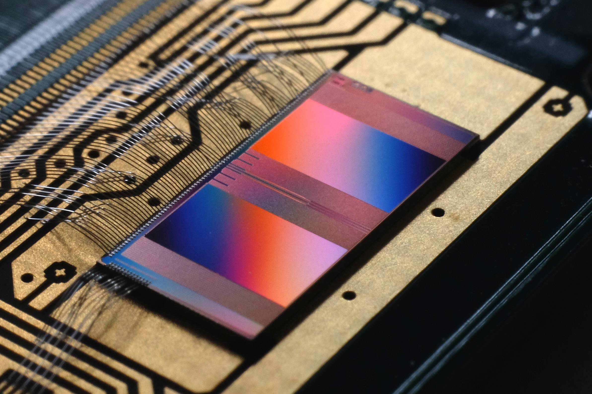
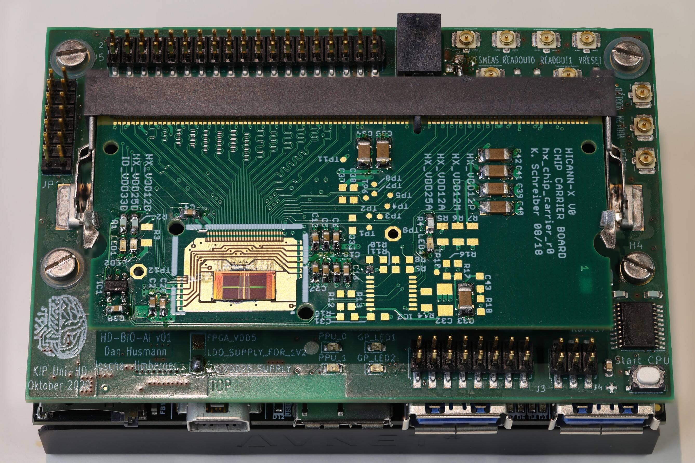
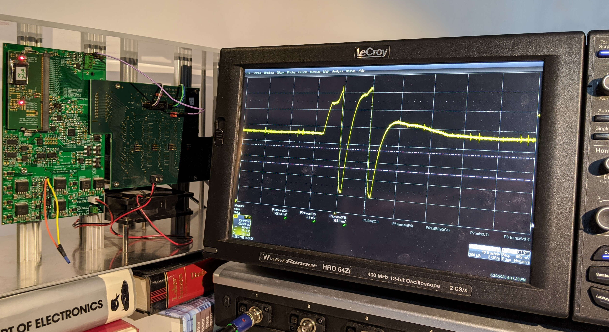

Unsere neuromorphe Hardware
===========================

Zwar ist der Name dieses Workshops “Neuromorphe Computer - Das Gehirn
aus dem Labor”, allerdings ist unsere Hardware deutlich kleiner als das,
was man sich typischerweise unter einem Computer vorstellt. Auch was die
Anzahl der Neuronen und Synapsen angeht, sind wir
größenordnungstechnisch weit von dem entfernt, was unser Gehirn besitzt.
Also schauen wir uns diesen Namen mal genauer an:

“Neuromorph” bedeutet soviel wie “am Nervensystem orientiert”. Das
heißt, dass die Hardware, die wir entwickeln, nicht wie ein klassischer
Computer mit Nullen und Einsen arbeitet, sondern das Verhalten
biologischer Nervenzellen nachahmt. Genauer gesagt gibt es künstliche
Neuronen, die mit vielen anderen verbunden sein können, und
Informationen mithilfe von Spikes austauschen.

Beim Begriff “Computer” denkt man vielleicht zuerst an einen großen
Kasten, der unter dem Schreibtisch steht und an einem Bildschirm
angeschlossen ist. Oder auch schon an etwas kleineres wie einen Laptop,
ein Tablet oder gar ein Smartphone. Allerdings kann man unter diesem
Begriff auch alles fassen, was etwas berechnet (englisch: compute =
berechen). Dabei sind nicht nur mathematische Aufgaben gemeint, sondern
die Verarbeitung von Informationen insgesamt. Unsere neuromorphen
Computer sind kleine Chips, die gerade mal 4mm x 8mm groß sind.

Und dann haben wir noch “Das Gehirn aus dem Labor”. Wie bereits erwähnt
besitzt das menschliche Gehirn um die 100 Milliarden Neuronen, welche
durch ungefähr eine Billiarden (das ist eine Eins mit 15 Nullen)
Synapsen miteinander verbunden sind. Auf einem unserer Chips befinden
sich gerade mal 512 Neuronen, die Input von jeweils 256 anderen Neuronen
bekommen können, also ca. 131.000 Synapsen. Das kommt noch nicht einmal
dem Gehirn einer Fliege nahe, das im Durchschnitt 250.000 Nervenzellen
besitzt. Trotzdem können wir mit diesen 512 Neuronen schon spannende
Experimente machen.

Es gibt ein paar Hauptmerkmale, in denen sich unsere künstlichen
Neuronen von biologischen unterscheiden. Im Körper funktioniert vieles
mit Ionen, also geladenen Atomen und Molekülen, was Zusammenschlüsse aus
diesen sind. In der Technik hingegen sind hauptsächlich Elektronen von
Bedeutung. Diese sind viel kleiner und schneller als Ionen. Dadurch sind
unsere künstlichen Nervenzellen 1000 mal schneller als ihre biologischen
Gegenstücke. Außerdem ist das Aktionspotential stereotypisch, was
bedeutet, dass es immer gleich aussieht. Darin selbst ist also keine
weitere Information enthalten. Einzig die Tatsache, dass es auftritt,
ist wichtig. Deswegen bilden wir nicht den gesamten Verlauf des
Aktionspotentials ab, sondern sobald die Schwellenspannung erreicht ist,
wird ein digitaler Spike erzeugt. Das Membranpotential wird dann direkt
zur Umkehrspannung gezogen, welche es bei der Hyperpolarisation annimmt,
dort für die Refraktärzeit festgehalten und darf dann wieder zurück zur
Ruhespannung. Dieses Verhalten werdet ihr in den Experimenten beobachten
können.

