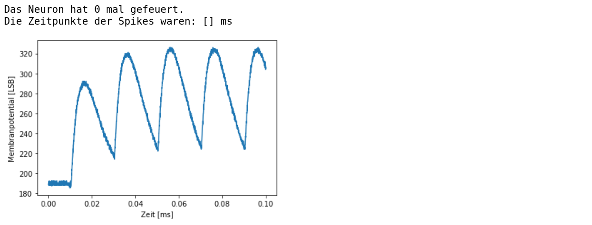

Wie können wir mit den künstlichen Nervenzellen kommunizieren?
==============================================================

Einführung in PyNN
------------------

Die künstlichen Neuronen haben viele einstellbare Parameter. Aber wie
sagen wir ihnen nun, welche Werte sie annehmen sollen? Dafür gibt es das
Modul PyNN. Dabei handelt es sich um eine Sprache, mit der man Gruppen
aus Neuronen bilden und diese auf verschiedene Weisen miteinander
verbinden kann. Man kann auch die Parameter eines einzelnen Neurons
verändern und die sich daraus ergebende Dynamik beobachten.

Im Folgenden wollen wir ein simples Netzwerk bauen, in dem ein künstliches 
Neuron von einer Gruppe aus fünf Neuronen stimuliert wird.

.. image:: _static/common/pynn_simple_network.png
    :width: 400px

.. code:: ipython3

    # Das Modul PyNN wird geladen.
    import pynn_brainscales.brainscales2 as pynn
    
    # Die Umgebung wird vorbereitet.
    from _static.common.helpers import setup_hardware_client, get_nightly_calibration

    setup_hardware_client()
    calib = get_nightly_calibration()
    pynn.setup(initial_config=calib)

Gruppen aus Neuronen werden Populationen genannt. Man erstellt solch
eine Population, indem man ihr sagt, wie viele Neuronen sie beinhalten
soll, von welchem Zelltyp diese Neuronen sind und was die Werte für die
Zellparameter sind. Den Zelltyp unser künstlichen Neuronen haben wir
``HXNeuron`` genannt. Seine Parameter werden nicht in den selben
Einheiten wie für biologische Nervenzellen angegeben, sondern in
Hardware Einheiten. Diese beiden Einheitensysteme hängen erstmal nicht
direkt zusammenhängen. Auch innerhalb der Hardware Einheiten gibt es
keine allgemein gültige Übersetzung zu tatsächlich messbaren Spannungen
und Strömen. Diese Werte können zum einen andere Bedeutungen für die
verschiedenen Parameter auf einem Chip haben, beispielsweise kann eine
Schwellenspannung von 300 höher sein als eine Ruhespannung von 400. Aber
auch im Vergleich zu anderen Chips, die im Prinzip identischen sind,
können die tatsächlichen Messwerte leicht variieren.

.. code:: ipython3

    # Die Parameter der Population werden definiert.
    numb_neurons = 1
    neuron_parameters = {                          #                         Bereich
        "leak_v_leak": 400,                        # Ruhepotential          (300-1000)
        "leak_i_bias": 200,                        # Ruhestrom              (0-1022)
        "threshold_v_threshold": 400,              # Schwellenspannung      (0-600)
        "threshold_enable": True,                  # Vergleichsaktivierung
        "refractory_period_refractory_time": 100,  # Refraktärzeit          (0-255)
        "reset_v_reset": 300,                      # Umkehrspannung         (300-1000)
        "reset_i_bias": 1000,                      # Umkehrstrom            (0-1022)
        "membrane_capacitance_capacitance": 63     # Membrankapazität       (0-63)
        }
    
    neuron_type = pynn.cells.HXNeuron(**neuron_parameters)
    
    # Das konfigurierte Neuron wird in der Population 'pop' abgespeichert.
    pop = pynn.Population(numb_neurons, neuron_type)

Von allen Neuronen, die in Populationen abgespeichert wurden, kann man
die Spikes aufnehmen. Des Weiteren ist es auch möglich, das
Membranpotential eines einzelnen Neurons aufzuzeichnen. Dafür darf die
Population also nur ein einziges Neuron besitzen.

.. code:: ipython3

    # Die Spikes und die Membranspannung 'v' des Neurons in der Population 'pop'
    # werden aufgenommen.
    pop.record(["spikes", "v"])

Verschiedene Populationen können durch sogenannte Projektionen
miteinander verbunden werden. Dafür muss zuerst festgelegt werden, was
die Sender und Empfänger Populationen sind. Außerdem wird die Art
angegeben, wie die Neuronen innerhalb der Populationen genau miteinander
verbunden werden, z.B. werden alle mit allen oder nur ein bestimmter
Prozentsatz der Neuronen miteinander verbunden. Zusätzlich wird das
synaptische Gewicht, was die Stärke der Verbindung beschreibt, und der
Synapsentyp vorgegeben. Dieser kann entweder exzitatorisch sein, was
bedeutet, dass die Membranspannung durch die Stiumulierung steigt, oder
er ist inhibitorisch, was die Membranspannung sinken lässt.

.. code:: ipython3

    # Eine Sender Population wird erstellt, die zu vorgegebenen Spike Zeiten 
    # einen Stimulus generiert.
    spike_times = [0.01, 0.03, 0.05, 0.07, 0.09]
    src = pynn.Population(5, pynn.cells.SpikeSourceArray(spike_times=spike_times))
    
    # Die Synapse und ihr Gewicht werden definiert.
    synapse_weight = 63
    synapse = pynn.synapses.StaticSynapse(weight=synapse_weight)
    
    # Die Sender Population 'src' wird mit dem Neuron in 'pop' verbunden.
    pynn.Projection(src, pop, pynn.AllToAllConnector(), 
                    synapse_type=synapse, receptor_type="excitatory")

Das erstellte Netzwerk aus Populationen und Projektionen kann nun für
eine gewählte Zeit emuliert werden.

.. code:: ipython3

    # Die Einheit der Laufzeit sind Millisekunden. 
    # Wir geben hier die Hardware Zeit an und keine biologische.
    duration = 0.1
    pynn.run(duration)

Anschließend kann das aufgenommene Verhalten der Neuronen ausgelesen
werden.

.. code:: ipython3

    # Die Spikes des Neurons in 'pop' können ausgegeben werden.
    spiketrain = pop.get_data("spikes").segments[0].spiketrains[0]
    print(f"Das Neuron hat {len(spiketrain)} mal gefeuert.")
    print(f"Die Zeitpunkte der Spikes waren: {spiketrain}")

    # Auch sein Membranpotential kann geplottet werden.
    mem_v = pop.get_data("v").segments[0].irregularlysampledsignals[0]

    # Ein Modul zur grafischen Darstellung wird geladen.
    %matplotlib inline
    import matplotlib.pyplot as plt

    # Die Grafik wird erstellt.
    # Das Membranpotential ist in Hardware Einheiten gegeben.
    plt.figure()
    plt.plot(mem_v.times, mem_v)
    plt.xlabel("Zeit [ms]")
    plt.ylabel("Membranpotential [LSB]")
    plt.show()

