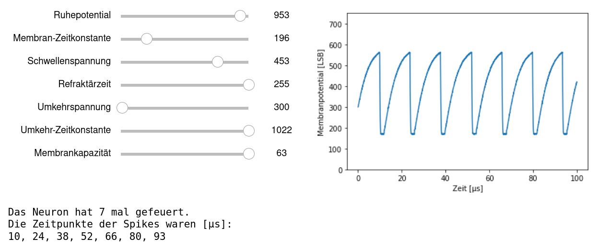
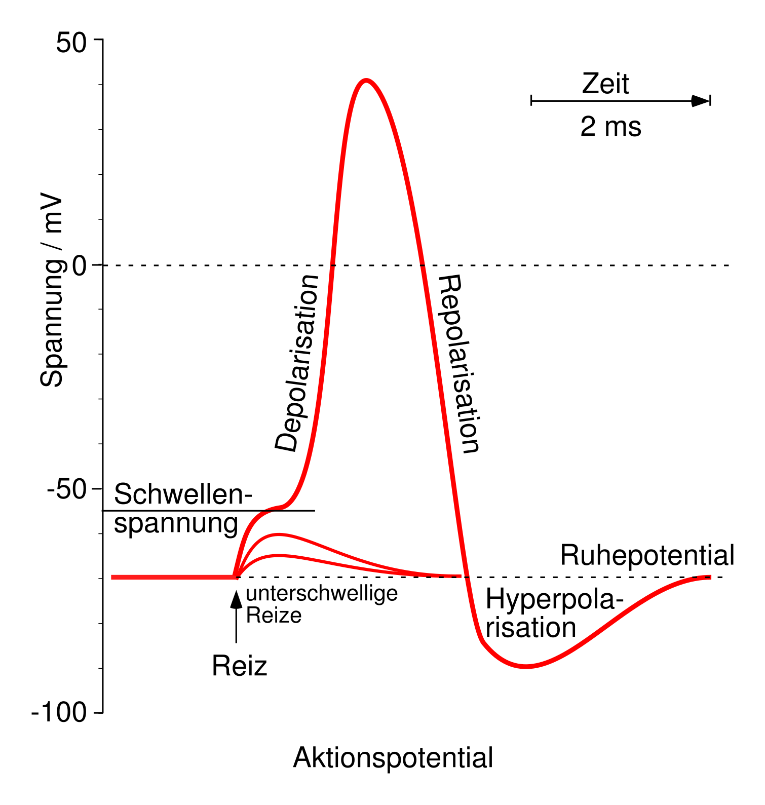
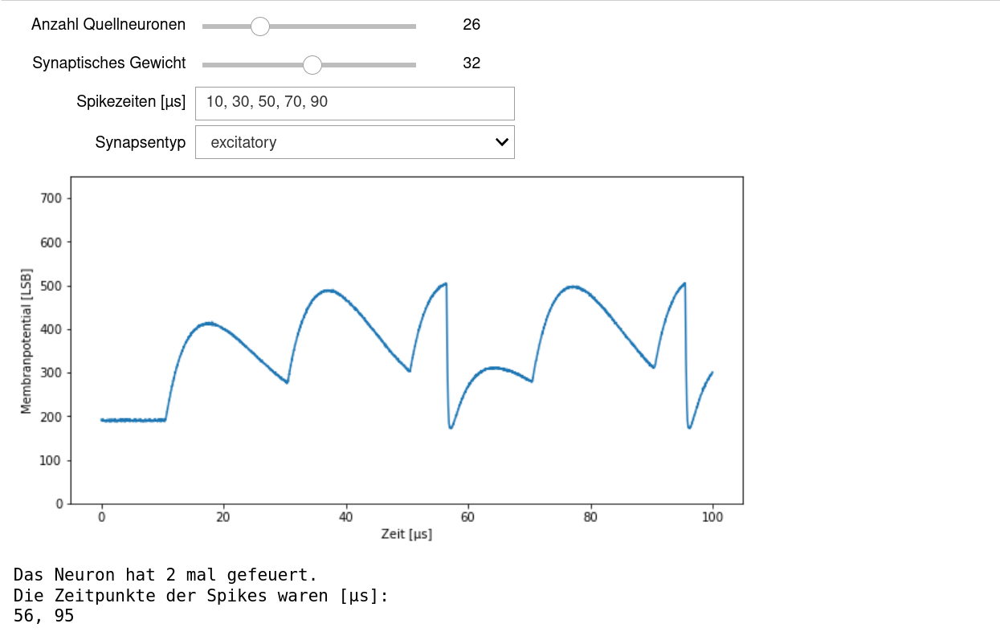

Experimente mit einer einzelnen Nervenzelle
===========================================

0. Umgebung vorbereiten
-----------------------

Bevor wir mit unseren Experimenten beginnen können, müssen wir erneut unsere Umgebung vorbereiten:

.. code:: ipython3

    from _static.common.helpers import setup_hardware_client
    setup_hardware_client()

1. Einfluss der Zellparameter
-----------------------------

Zuerst wollen wir uns genauer mit der Dynamik einer einzelnen
Nervenzelle auseinandersetzen. Dazu verändern wir ihre Zellparameter und
schauen uns das resultierende Membranpotential an.

.. code:: ipython3

    import pynn_brainscales.brainscales2 as pynn
    %matplotlib inline
    import matplotlib.pyplot as plt
    from IPython.display import HTML
    import ipywidgets as w
    from functools import partial
    import quantities as pq

    from _static.common.helpers import get_nightly_calibration

    Slider = partial(w.IntSlider, continuous_update=False)

    display(HTML('''
    '''))

    neuron_parameters = dict(
        leak_v_leak=Slider(400, 300, 1000, description="Ruhepotential"),
        leak_i_bias=Slider(200, 0, 1022, description="Membran-Zeitkonstante"),
        threshold_v_threshold=Slider(400, 0, 600, description="Schwellenspannung"),
        threshold_enable=w.fixed(True), #w.Checkbox(True, description="Vergleichsaktivierung"),
        refractory_period_refractory_time=Slider(100, 0, 255, description="Refraktärzeit"),
        reset_v_reset=Slider(300, 300, 1000, description="Umkehrspannung"),
        reset_i_bias=Slider(1000, 0, 1022, description="Umkehr-Zeitkonstante"),
        membrane_capacitance_capacitance=Slider(63, 0, 63, description="Membrankapazität")
    )
    plot_output = w.Output()
    text_output = w.Output()

    def experiment(**neuron_parameters):
        calib = get_nightly_calibration()
        pynn.setup(initial_config=calib)

        pop = pynn.Population(1, pynn.cells.HXNeuron(**neuron_parameters))
        pop.record(["spikes", "v"])

        # Die Laufzeit kann auch angepasst werden.
        pynn.run(0.1)

        spiketrain = pop.get_data("spikes").segments[0].spiketrains[0]

        mem_v = pop.get_data("v").segments[0].irregularlysampledsignals[0]
        text_output.clear_output()
        plot_output.clear_output()
        with plot_output:
            plt.figure()
            plt.plot(mem_v.times.rescale(pq.us), mem_v)
            plt.xlabel("Zeit [µs]")
            plt.ylabel("Membranpotential [LSB]")
            plt.ylim(0, 750)
            plt.show()
        with text_output:
            print(f"Das Neuron hat {len(spiketrain)} mal gefeuert.")
            if len(spiketrain) > 0:
                spiketimes = ", ".join(f"{x*1000:.0f}" for x in spiketrain)
                print(f"Die Zeitpunkte der Spikes waren [µs]:\n{spiketimes}")

        pynn.end()

    sliders = w.interactive(experiment, **neuron_parameters)
    display(w.VBox([w.HBox([sliders, plot_output]), text_output]))

a) Was ist zu sehen? Wieso ist das so? Was erwartet ihr zu sehen?
   Beachtet dabei, dass auf allen Signalen auch ein Rauschen vorliegen
   kann. Dieses kann Veränderungen im Bereich von etwa 20 Hardware
   Einheiten bewirken, ohne dass diese jedoch etwas bedeuten.
b) Welche Spannung ist dargestellt? Überlegt euch, welche Werte das
   Membranpotential beeinflussen und überprüft eure Vermutungen.
   Dazu ist es hilfreich, sich das Aktionspotential nochmal
   anzuschauen.

c) Nun soll das Ruhepotential auf seinen Maximalwert gesetzt werden, der
   über der Schwellenspannung liegt. Überlegt euch vorher, was für einen
   Verlauf ihr dafür erwartet.
d) Beobachtet in diesem Modus die Auswirkungen, welche die einzelnen
   Parameter auf die Dynamik haben.

2. Stimulierung einer Nervenzelle
---------------------------------

Nun wird unsere Nervenzelle mit anderen Neuronen verbunden, deren
Feuerverhalten wir einstellen können. Wir wollen beobachten, wie sich
Spikes der Senderpopulation auf die empfangende Nervenzelle auswirken.
Neben den Spikezeiten der Sender Population, kann die Anzahl der
Neuronen, die sie beinhaltet variiert werden. Des Weiteren kann das
synaptische Gewicht, also die Stärke der Verbindung, eingestellt werden.
Eine wichtige Rolle spielt auch die Art, wie der Stimulus interpretiert
wird, ob exzitatorisch oder inhibitorisch.

.. code:: ipython3

    import pynn_brainscales.brainscales2 as pynn
    %matplotlib inline
    import matplotlib.pyplot as plt
    import quantities as pq

    from _static.common.helpers import get_nightly_calibration

    # Nun muss das Ruhepotential wieder unter die Schwellenspannung gesetzt werden.
    neuron_parameters = {                          #                         Bereich
        "leak_v_leak": 400,                        # Ruhepotential          (300-1000)
        "leak_i_bias": 200,                        # Ruhestrom              (0-1022)
        "threshold_v_threshold": 400,              # Schwellenspannung      (0-600)
        "threshold_enable": True,                  # Vergleichsaktivierung
        "refractory_period_refractory_time": 100,  # Refraktärzeit          (0-255)
        "reset_v_reset": 300,                      # Umkehrspannung         (300-1000)
        "reset_i_bias": 1000,                      # Umkehrstrom            (0-1022)
        "membrane_capacitance_capacitance": 63     # Membrankapazität       (0-63)
        }

    @w.interact(
        src_size=Slider(5, 0, 100, description="Anzahl Quellneuronen"),
        synapse_weight=Slider(32, 0, 63, description="Synaptisches Gewicht"),
        spike_times=w.Text("10, 30, 50, 70, 90",
                           continuous_update=False,
                           description="Spikezeiten [µs]"),
        receptor_type=w.Dropdown(
            options=["excitatory", "inhibitory"], description="Synapsentyp")
    )
    def experiment(src_size, synapse_weight, spike_times, receptor_type):
        calib = get_nightly_calibration()
        pynn.setup(initial_config=calib)
        # Das ist das Neuron, das wir beobachten werden.
        pop = pynn.Population(1, pynn.cells.HXNeuron(**neuron_parameters))
        pop.record(["spikes", "v"])

        # Das ist die Sender Population, die zu vorgegebenen Spikezeiten einen Stimulus generiert.
        # Die Spikezeiten und die Populationsgröße sollen verändert werden.
        spike_times = [float(x)/1000 for x in spike_times.split(',')]
        src = pynn.Population(src_size, pynn.cells.SpikeSourceArray(spike_times=spike_times))

        weight = synapse_weight if receptor_type == 'excitatory' else -synapse_weight
        synapse = pynn.synapses.StaticSynapse(weight=weight)

        # Die Sender Population 'src' wird mit dem Neuron in 'pop' verbunden.
        pynn.Projection(src, pop, pynn.AllToAllConnector(),
                        synapse_type=synapse, receptor_type=receptor_type)
        pynn.run(0.1)

        # Das Ergebnis wird ausgegeben.
        mem_v = pop.get_data("v").segments[0].irregularlysampledsignals[0]
        plt.figure(figsize=(10, 5))
        plt.plot(mem_v.times.rescale(pq.us), mem_v)
        plt.xlabel("Zeit [µs]")
        plt.ylabel("Membranpotential [LSB]")
        plt.ylim(0, 750)
        plt.show()
        spiketrain = pop.get_data("spikes").segments[0].spiketrains[0]
        print(f"Das Neuron hat {len(spiketrain)} mal gefeuert.")
        if len(spiketrain) > 0:
            spiketimes = ", ".join(f"{x*1000:.0f}" for x in spiketrain)
            print(f"Die Zeitpunkte der Spikes waren [µs]:\n{spiketimes}")

        pynn.end()

a) Ist zu den eingestellten Spikezeiten der Senderpopulation eine
   Reaktion im Membranpotential der beobachteten Nervenzelle zu sehen?
   Feuert es selbst auch schon?
b) Was geschieht, wenn man in der Projektion den Synapsentyp auf
   ``inhibitory`` stellt?
c) Nun wollen wir das Neuron zum Feuern bringen. Dazu wird der
   Synapsentyp wieder auf ``excitatory`` gestellt. Ein erster
   Ansatz um das Neuron zum Feuern zu bringen ist die Anzahl der
   Partner, von denen es Spikes erhält, zu erhöhen. Ab welcher Größe der
   Sender Population treten die ersten Spikes auf?
d) Eine weitere Möglichkeit ist das synaptische Gewicht anzupassen.
   Stellt dazu wieder eine kleinere Populationsgröße ein und testet, ob
   ihr durch Erhöhung des synaptischen Gewichts das Neuron zum Feuern
   bringen könnt.
e) Als letztes soll noch untersucht werden, was für Auswirkungen es hat,
   wenn man die Spikezeiten der Sender Population näher zusammen
   schiebt. Probiert hier auch unterschiedliche Abstände zwischen den
   einzelnen Spikes aus. Gegebenfalls müsst ihr hier auch nochmal die
   Neuronparameter anpassen, um einen schönen Verlauf der
   Membranspannung zu bekommen.
