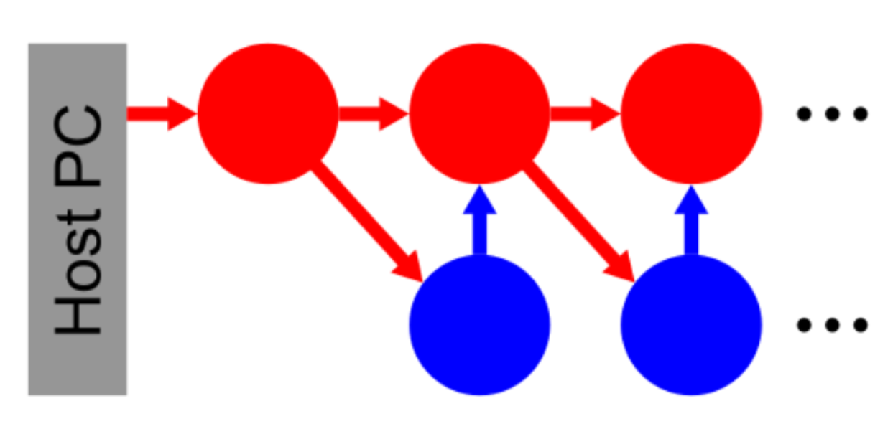

Experimente mit mehreren Nervenzellen Teil 1
============================================

Umgebung vorbereiten
--------------------

Bevor wir mit unseren Experimenten beginnen können, müssen wir erneut unsere Umgebung vorbereiten:

.. code:: ipython3

    from _static.common.helpers import setup_hardware_client
    setup_hardware_client()

Die Feuerkette
--------------

Nun wollen wir beobachten, wie sich mehrere Neuronen gemeinsam
verhalten. Dazu gruppieren wir sie zu Populationen und verbinden diese
zu einer Kette. Jede exzitatorische Population (rot) besitzt dabei eine
inhibitorische Partner Population (blau). Auf diese Weise soll ein
Signal durch eine möglichst lange Kette gereicht werden.

.. code:: ipython3

    import pynn_brainscales.brainscales2 as pynn
    %matplotlib inline
    import matplotlib.pyplot as plt
    import numpy as np
    import ipywidgets as w
    from IPython.display import HTML
    from functools import partial

    from _static.common.helpers import get_nightly_calibration

    Slider = partial(w.IntSlider, continuous_update=False)

    display(HTML('''
    '''))

    @w.interact(
        inh_exc=Slider(40, 0, 63, description='Synaptisches Gewicht "inh_exc"'),
        exc_exc=Slider(60, 0, 63, description='Synaptisches Gewicht "exc_exc"'),
        exc_inh=Slider(20, 0, 63, description='Synaptisches Gewicht "exc_inh"'),
    )
    def experiment(inh_exc, exc_exc, exc_inh):
        # Diese Parameter sind im Prinzip auch verstellbar, haben so aber gute Werte.
        # Alle Gewichte können Werte im Bereich 0-63 annehmen.
        weights = {"stim_exc": 30,
                   "stim_inh": 15}
        numb_pops = 7
        pop_sizes = {"exc": 7,
                     "inh": 7}
        runtime = 0.1
        closed = False
        
        # Die Refraktärzeit muss auf einen kleinen Wert gestellt werden, um regelmäßiges
        # Feuern prinzipiell zu erlauben.
        neuron_parameters = {"refractory_period_refractory_time": 5}
        
        # Die Umgebung wird vorbereitet.
        calib = get_nightly_calibration()
        pynn.setup(initial_config=calib)
        
        # Die angelegten Populationen werden in einem Verzeichnis gespeichert,
        # das zu Beginn leere Listen enthält.
        pop_collector = {"exc": [],
                         "inh": []}
        
        # Hier werden die Populationen erstellt.
        for synapse_type in ["exc", "inh"]:
            for _ in range(numb_pops):
                pop = pynn.Population(pop_sizes[synapse_type],
                                      pynn.cells.HXNeuron(**neuron_parameters))
                pop.record(["spikes"])
                pop_collector[synapse_type].append(pop)
        
        # Zuerst wird ein Stimulus zum Zeitpunkt t=0 an die jeweils erste Population gegeben.
        stim_pop = pynn.Population(pop_sizes['exc'],
                                   pynn.cells.SpikeSourceArray(spike_times=[0]))
        
        pynn.Projection(stim_pop, pop_collector['exc'][0],
                        pynn.AllToAllConnector(),
                        synapse_type=pynn.synapses.StaticSynapse(weight=weights["stim_exc"]),
                        receptor_type='excitatory')
        pynn.Projection(stim_pop, pop_collector['inh'][0],
                        pynn.AllToAllConnector(),
                        synapse_type=pynn.synapses.StaticSynapse(weight=weights["stim_inh"]),
                        receptor_type='excitatory')
        
        # Nun werden alle exzitatorischen Populationen in einer Kette miteinander verbunden.
        # Außerdem besitzt jede exzitatorische Population eine inhibitorische Partnerpopulation.
        
        # Wenn die Kette offen ist, müssen die exzitatorischen Verbindungen einmal weniger
        # iteriert werden.
        lastiter = numb_pops
        if not closed:
            lastiter -= 1
            pynn.Projection(pop_collector['inh'][lastiter],
                            pop_collector['exc'][lastiter],
                            pynn.AllToAllConnector(),
                            synapse_type=pynn.synapses.StaticSynapse(weight=-inh_exc),
                            receptor_type='inhibitory')
            
        for pop_index in range(lastiter):
            pynn.Projection(pop_collector['exc'][pop_index],
                            pop_collector['exc'][(pop_index + 1) % numb_pops],
                            pynn.AllToAllConnector(),
                            synapse_type=pynn.synapses.StaticSynapse(weight=exc_exc),
                            receptor_type='excitatory')
            pynn.Projection(pop_collector['exc'][pop_index],
                            pop_collector['inh'][(pop_index + 1) % numb_pops],
                            pynn.AllToAllConnector(),
                            synapse_type=pynn.synapses.StaticSynapse(weight=exc_inh),
                            receptor_type='excitatory')
            pynn.Projection(pop_collector['inh'][pop_index],
                            pop_collector['exc'][pop_index],
                            pynn.AllToAllConnector(),
                            synapse_type=pynn.synapses.StaticSynapse(weight=-inh_exc),
                            receptor_type='inhibitory')
        
        # Jetzt wird das Netzwerk emuliert.
        pynn.run(runtime)
        
        # Die Spikes werden ausgelesen.
        spike_collector = {'exc': np.zeros(numb_pops, dtype=object),
                           'inh': np.zeros(numb_pops, dtype=object)}
        for syn_type in ['exc', 'inh']:
            for pop_index in range(numb_pops):
                spike_collector[syn_type][pop_index] =\
                    pop_collector[syn_type][pop_index].get_data("spikes").segments[0].spiketrains
        
        # Das Ergebnis wird visualisiert.
        ax = plt.subplot(211)
        for syn_type in spike_collector:
            for pop_index in range(numb_pops):
                for spike_train in spike_collector[syn_type][pop_index]:
                    neuron_id = spike_train.annotations['source_id']
                    ax.plot(spike_train, np.ones_like(spike_train) * neuron_id,
                            c='k', marker="o", ls="None", ms=1)
        ax.set_xlim(0, runtime)
        ax.set_xlabel("Zeit [ms]")
        ax.set_ylim(-0.5, (pop_sizes['exc'] + pop_sizes['inh']) * numb_pops - 0.5)
        ax.set_ylabel('Neuron ID')
        ax.axhspan(-0.5, pop_sizes['exc'] * numb_pops - 0.5, color='r', alpha=0.2)
        ax.axhspan(pop_sizes['exc'] * numb_pops - 0.5, (pop_sizes['exc'] +
            pop_sizes['inh']) * numb_pops - 0.5, color='b', alpha=0.2)
        ax.figure.set_size_inches(12, 15)
        
        pynn.end()

.. image:: _static/girlsday/girlsday_feuerkette_output.png
   :width: 100%
   :class: solution

Jeder aufgetretene Spike ist durch einen Punkt gekennzeichnet. Unten im
roten Bereich sind die Spikes der exzitatorischen Populationen
aufgetragen, oben im blauen Bereich die der inhibitorischen
Populationen. Diese sind dafür da, um das Feuern der exzitatorischen
Populationen zu begrenzen.

a) Möglicherweise seht ihr zu Beginn ein eher aufgefächertes Bild. Das
   entsteht, wenn die Aktivität der Neuronen nicht stark genug
   unterdrückt wird. Um dies zu erreichen, kann entweder das Gewicht der
   inhibitorischen Synapsen ``"inh_exc"`` erhöht werden.

b) Wenn die exzitatorischen Populationen mehrfach feuern, bekommen sie
   zu viel Anregungen. Dann könnt ihr das Gewicht ``"exc_exc"``
   niedriger machen, was das weiterzugebene Signal abschwächt.
   Allerdings darf es nicht zu klein werden, da sonst die Kette
   abbricht.

c) Es kann auch vorkommen, dass nur die Spikes der inhibitorischen
   Populationen verschwinden. Dann muss das Gewicht ``"exc_inh"`` erhöht
   werden. Auch hier kommt es auf die Feineinstellung an: Werden die
   inhibitorischen Synapsen zu stark gewählt, unterdrücken sie das
   Signal zu sehr und die Kette bricht wieder ab.

Durch ein gutes Zusammenspiel dieser drei Gewichte ist es möglich, eine
recht saubere Treppenform im roten Bereich bei den exzitatorischen
Neuronen zu bekommen. Was bedeutet die Anzahl der Stufen, was ihre Höhe?
Fällt euch eine Erklärung ein, warum die inhibitorischen Spikes
verteilter sind?

Falls ihr die Anzahl der Populationen oder ihre Größen verändert, könnte
ein Fehler auftreten. Dies ist der Fall, wenn das Limit der zur
Ansteuerung verfügbaren Neuronen und Verbindungen erreicht ist. Dann
müssen die Populationsgrößen einfach reduziert werden.
