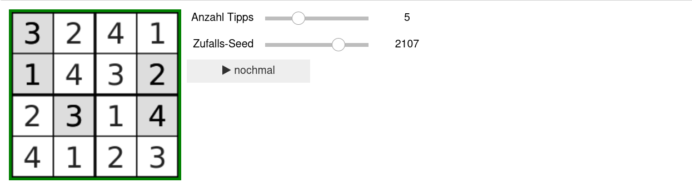
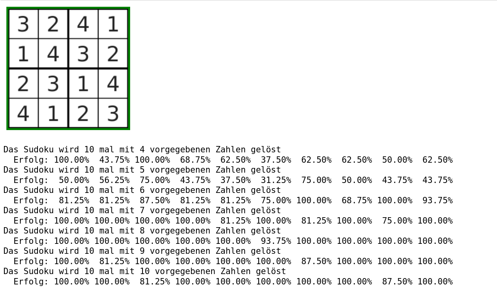
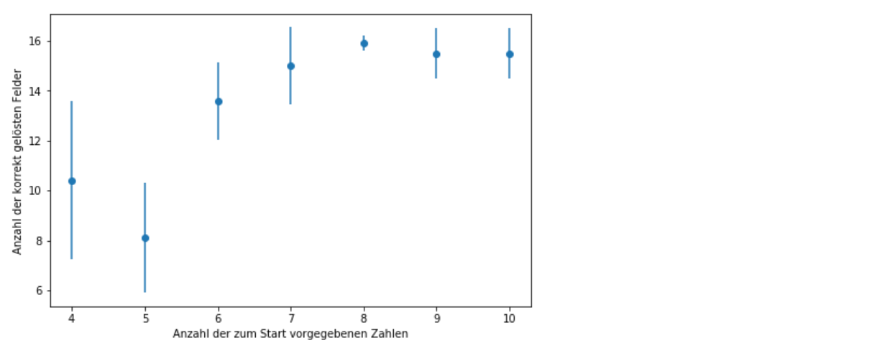

Experimente mit mehreren Nervenzellen Teil 2
============================================

Umgebung vorbereiten
--------------------

Bevor wir mit unseren Experimenten beginnen können, müssen wir erneut unsere Umgebung vorbereiten:

.. code:: ipython3

    from _static.common.helpers import setup_hardware_client
    setup_hardware_client()

Sudoku
------

Eine weitere Aufgabe, die man den künstlichen Nervenzellen beibringen
kann, ist das Lösen eines Sudokus. Da die Anzahl der Neuronen auf dem
Chip begrenzt ist, betrachten wir hier nur ein 4x4 Sudoku.

.. image:: _static/common/sudoku.png
    :align: center
    :width: 500px

(Quelle: https://www.kip.uni-heidelberg.de/Veroeffentlichungen/download.php/6118/temp/3666.pdf)

Jedes Feld besitzt vier Neuronen, welche die verschiedenen Zahlen
repräsentieren, die darin stehen können. Wenn eine Zahl vorgegeben ist,
verbietet sie damit nach den Sudoku Regeln bestimmte Kombinationen.
Betrachten wie beispielsweise die graue 3. Da diese feststeht, können in
dem selben Feld nicht mehr die Zahlen 1, 2 oder 4 stehen (orange).
Außerdem darf in der gleichen Reihe (lila) und in der gleichen Spalte
(grün) keine 3 mehr vorkommen. Gleiches gilt für den unteren linken
Block (blau). Diese verbotenen Kombinationen werden durch inhibitorische
Synapsen realisiert. Das bedeutet, wenn eine Zahl in einem Feld
feststeht, dann feuert das zugehörige Neuron. Alle daraus resultierenden
verbotenen Möglichkeiten werden durch die inhibitorischen Verbindungen
so stark unterdrückt, dass die jeweiligen Neuronen nicht feuern können.
Damit die übrigen erlaubten Neuronen zum Feuern gebracht werden,
bekommen alle Nervenzellen leichten Input durch ein zufälliges
Hintergrundrauschen. Außerdem sind alle Neuronen mit sich selbst
exzitatorisch verbunden, um eine mögliche Aktivität aufrecht zu
erhalten.

.. code:: ipython3

    from math import sqrt
    import ipywidgets as w
    from functools import partial
    IntSlider = partial(w.IntSlider, continuous_update=False)
    from ipycanvas import Canvas, hold_canvas

    import numpy as np
    import pynn_brainscales.brainscales2 as pynn
    from pynn_brainscales.brainscales2.standardmodels.synapses import StaticSynapse
    from pynn_brainscales.brainscales2.standardmodels.cells import \
                SpikeSourceArray, HXNeuron,SpikeSourcePoisson

    from _static.common.helpers import get_nightly_calibration

    runtime = 0.5
    dimension = 4

    calib = get_nightly_calibration()
    pynn.setup(initial_config=calib)

    # Wir erstellen ein Neuron für jedes Zahl in jedem Feld. Wir brauchen also
    # 4 (Reihen) * 4 (Spalten) * 4 (Zahlen) = 4^3 Neuronen
    print("Die Neuronen werden angelegt... (1/4)")
    pop = pynn.Population(4**3, HXNeuron())
    pop.record(["spikes"])

    # Damit wir die Verbindungen in zwischen den Neuronen leichter definieren
    # können speichern wir eine "Ansicht" auf einzelne Neuronen in einer Liste
    pops_collector = []
    for row in range(dimension):
        pops_row = []
        for field_in_row in range(dimension):
            pops_field = []
            for number_in_field in range(dimension):
                neuron = pynn.PopulationView(
                    pop,
                    [row * dimension**2 + field_in_row * dimension
                     + number_in_field])
                pops_field.append(neuron)
            pops_row.append(pops_field)
        pops_collector.append(pops_row)

    # Das Hintergrundrauschen für alle Neuronen wird erzeugt.
    # Dabei bekommt jedes Neuronen individuellen Input, der einer gemeinsamen
    # Zufallsverteilung (genauer gesagt einer Poissonverteilung) folgt.
    print("Das Hintergrundrauschen wird erzeugt... (2/4)")
    poisson_source = pynn.Population(dimension**3,
        SpikeSourcePoisson(duration=runtime - 0.01, rate=5e5, start=0.01))

    # Diese Zufallsquellen werden nun mit den Neuronen verbunden.
    # Zusätzlich wird jedes Neuron mit sich selbst exzitatorisch verbunden,
    # um seine mögliche Aktivität zu erhalten.
    pynn.Projection(pop,
                    pop,
                    pynn.OneToOneConnector(),
                    synapse_type=StaticSynapse(weight=20),
                    receptor_type='excitatory')
    pynn.Projection(poisson_source,
                    pop,
                    pynn.OneToOneConnector(),
                    synapse_type=StaticSynapse(weight=30),
                    receptor_type='excitatory')

    print("Die Regeln werden implementiert... (3/4)")

    # Die inhibitorischen Verbindungen zu den anderen Neuronen im selben Feld werden erstellt.
    print("  - Es darf nur eine Zahl pro Feld geben")
    for row in range(4):
        for column in range(4):
            for number_pre in range(4):
                for number_post in range(1,4):
                    pynn.Projection(
                        pops_collector[row][column][number_pre],
                        pops_collector[row][column][(number_pre+number_post)%4],
                        pynn.AllToAllConnector(),
                        synapse_type=StaticSynapse(weight=-63),
                        receptor_type='inhibitory')

    # Die inhibitorischen Verbindungen zu den Neuronen der selben Nummer
    # in der selben Reihe werden erstellt.
    print("  - Jede Zahl darf nur einmal pro Reihe vorkommen")
    for row in range(4):
        for column in range(4):
            for number in range(4):
                for column_post in range(1,4):
                    pynn.Projection(
                        pops_collector[row][column][number],
                        pops_collector[row][(column+column_post)%4][number],
                        pynn.AllToAllConnector(),
                        synapse_type=StaticSynapse(weight=-63),
                        receptor_type='inhibitory')

    # Die inhibitorischen Verbindungen zu den Neuronen der selben Nummer
    # in der selben Spalte werden erstellt.
    print("  - Jede Zahl darf nur einmal pro Spalte vorkommen")
    for row in range(4):
        for column in range(4):
            for number in range(4):
                for row_post in range(1,4):
                    pynn.Projection(
                        pops_collector[row][column][number],
                        pops_collector[(row+row_post)%4][column][number],
                        pynn.AllToAllConnector(),
                        synapse_type=StaticSynapse(weight=-63),
                        receptor_type='inhibitory')

    # Die inhibitorischen Verbindungen zu den Neuronen der selben Nummer
    # im selben Block werden erstellt.
    # Dabei sind tatsächlich nur die diagonalen Verbindungen notwendig,
    # da die anderen bereits in der selben Reihe oder Spalte sind.
    print("  - Jede Zahl darf nur einmal pro Block vorkommen")
    for row_offset in [0, 2]:
        for column_offset in [0, 2]:
            for row in range(2):
                for column in range(2):
                    for number in range(4):
                        pynn.Projection(
                            pops_collector[row+row_offset][column+column_offset][number],
                            pops_collector[
                                (row+1)%2+row_offset][(column+1)%2+column_offset][number],
                            pynn.AllToAllConnector(),
                            synapse_type=StaticSynapse(weight=-63),
                            receptor_type='inhibitory')

    # Der Stimulus für die vorgegebenen Zahlen wird erstellt und
    # mit den jeweiligen Neuronen verbunden.
    print("Die Tipps werden vorbereitet (4/4)")
    stim_given_numbers = pynn.Population(
        2, SpikeSourceArray(spike_times=np.linspace(0.0, runtime, 500)))
    clue_projections = []
    for row in range(4):
        clues_row = []
        for column in range(4):
            clues_field = []
            for number in range(4):
                clues_field.append(pynn.Projection(
                    stim_given_numbers,
                    pops_collector[row][column][number],
                    pynn.AllToAllConnector(),
                    synapse_type=StaticSynapse(weight=0),
                    receptor_type='excitatory'))
            clues_row.append(clues_field)
        clue_projections.append(clues_row)

    print("Das Sudoku ist fertig erstellt!")

.. code:: ipython3

    # Funktionen, um das Sudoku zu lösen:

    def set_clues(clues=None):
        """ Setzt die gegebenen Tipps in das Netzwerk """
        if clues is None:
            clues = np.zeros((4, 4), dtype=int)
        for row, row_clues in enumerate(clue_projections):
            for col, field_clues in enumerate(row_clues):
                for number, clue_projection in enumerate(field_clues, start=1):
                    for connection in clue_projection:
                        connection.weight = 63. if clues[row,col] == number else 0.

    def hide_solution(grid, num_clues, seed=None):
        """ Versteckt die Lösung und lässt nur `num_clues` Tipps übrig """
        indices = np.argwhere(np.logical_and(grid > 0, grid <= 4))
        if len(indices) < num_clues:
            raise RuntimeError(
                f"Das Sudoku enthält weniger als die {num_clues} erforderlichen Zahlen :(")
        np.random.seed(seed)
        indices = indices[np.random.choice(len(indices), num_clues, replace=False)]
        clues = np.zeros_like(grid)
        clues[(indices.T[0], indices.T[1])] = grid[(indices.T[0], indices.T[1])]
        return clues

    def get_solution(clues):
        """ Führt das Netzwerk aus und gibt die aktuelle Lösung zurück """
        set_clues(clues)
        # Das Netzwerk wird emuliert
        pynn.run(runtime)
        # Die Lösung wird ausgelesen
        spikes = pop.get_data().segments[-1].spiketrains
        pynn.reset()
        spike_counts = np.zeros(len(spikes))
        for idx, train in enumerate(spikes):
            spike_counts[idx] = len(train)
        # Finde die höchste Feuerrate für jede Sudoku Zelle und speichere
        # den Index, also die erkannte Zahl
        grid = spike_counts.reshape(-1, 4).argmax(axis=1)
        # Python zählt ab 0, Sudoku ab 1
        grid = grid + 1
        # Formatiere das Ergebnis in das 4x4 Sudoku um
        grid = grid.reshape((4, 4))
        return grid

    # Funktionen, um das Sudoku anzuzeigen:

    def canvas_leer(N=4, size=50, canvas=None):
        """ Erstellt eine leere Zeichenfläche für das Sudoku """
        if canvas is None:
            canvas = Canvas(
                width=size*N, height=size*N,
                layout=w.Layout(margin='5px'))
            canvas.scale(size)
        canvas.clear()
        canvas.layout.border=f'solid {size/15}px black'
        canvas.font = '0.7px sans-serif'
        canvas.text_align = 'center';
        canvas.text_baseline = 'middle'
        return canvas

    def canvas_sudoku_leer(N=4, size=50, canvas=None):
        """ Erstellt ein leeres Sudoku. Nur die Zahlen fehlen """
        Ns = int(sqrt(N))
        canvas = canvas_leer(N, size, canvas=canvas)
        with hold_canvas(canvas):
            for i in range(0, N+1):
                canvas.line_width = 1/15 if i % Ns == 0 else 1/30
                canvas.stroke_line(0, i, N, i)
                canvas.stroke_line(i, 0, i, N)
        return canvas

    def mark_clues(canvas, grid):
        with hold_canvas(canvas):
            for row, row_fields in enumerate(grid):
                for col, field in enumerate(row_fields):
                    if field > 0:
                        canvas.fill_style = '#00000022'
                        canvas.fill_rect(col, row, 1, 1)

    def check_solution(grid, N=4):
        """ Überprüft, ob die Sudoku-Regeln erfüllt werden """
        Ns = int(sqrt(N))
        for i in range(N):
            # j, k index top left hand corner of each 3x3 tile
            j, k = (i // Ns) * Ns, (i % Ns) * Ns
            if len(set(grid[i,:])) != N or len(set(grid[:,i])) != N\
                       or len(set(grid[j:j+Ns, k:k+Ns].ravel())) != N:
                return False
        return True

    def display_solution(canvas, grid):
        with hold_canvas(canvas):
            for row, row_fields in enumerate(grid):
                for col, field in enumerate(row_fields):
                    if field > 0:
                        canvas.fill_style = '#000000dd'
                        canvas.fill_text(int(field), col+.5, row+.5)
            canvas.layout.border = canvas.layout.border.rsplit(' ', 1)[0] \
                + (' green' if check_solution(grid) else ' darkred')

    def display_sudoku_solver(sudoku):
        """ Sudoku und Slider anzeigen """
        canvas = canvas_sudoku_leer()
        num_clues_slider = IntSlider(
            7, 0, len(np.argwhere(sudoku)), description="Anzahl Tipps")
        seed_slider = IntSlider(
            1234, 0, 3000, description="Zufalls-Seed")
        run_button = w.Button(description='nochmal',icon='play')

        def solve_sudoku(num_clues, seed):
            """ Versucht das Sudoku zu lösen und zeigt das Ergebnis an """
            with hold_canvas(canvas):
                canvas_sudoku_leer(canvas=canvas)
            clues = hide_solution(sudoku, num_clues, seed)
            mark_clues(canvas, clues)
            display_solution(canvas, get_solution(clues))

        interactive = w.interactive(
            solve_sudoku, num_clues=num_clues_slider, seed=seed_slider)
        run_button.on_click(interactive.update)
        display(w.HBox([canvas, w.VBox([num_clues_slider, seed_slider, run_button])]))
        interactive.update()

.. code:: ipython3

    # Dieses Sudoku soll gelöst werden
    sudoku = np.array([
        [3, 2, 4, 1],
        [1, 4, 3, 2],
        [2, 3, 1, 4],
        [4, 1, 2, 3]
    ])

    display_sudoku_solver(sudoku)

Wir haben hier eine sehr vielseitige Sudokumaschine gebaut, die einiges
kann:

*  Ihr arbeitet für eine Rätselzeitschrift und braucht ganz viele
   verschiedene Sudokus? Kein Problem! Einfach den Regler für *Anzahl
   Tipps* auf **0** stellen, dann erfindet das Netzwerk Sudokus für euch.

*  Ihr habt ein schwieriges Sudoku und wollt es nicht selbst
   Lösen? Kein Problem! Ihr könnt das Sudoku oben auch ändern,
   das Netzwerk löst es für euch. Für die Zahlen, die ihr nicht
   wisst, könnt ihr dabei einfach eine **0** schreiben.

Probiert es einfach mal aus!

Bonus: Wie hängt der Erfolg mit der Anzahl der vorgegebenen Zahlen zusammen?
----------------------------------------------------------------------------

Hier soll untersucht werden, wie viele Tipps das Netzwerk
typischerweise benötigt, um ein vorgegebenes Sudoku zu lösen. Dazu wird
für eine zunehmende Anzahl an Tipps mehrere Male eine Lösung gesucht.

.. code:: ipython3

    # Dieses Sudoku soll gelöst werden.
    sudoku = np.array([
        [3, 2, 4, 1],
        [1, 4, 3, 2],
        [2, 3, 1, 4],
        [4, 1, 2, 3]
    ])

    # Liste mit Anzahlen der Tipps
    nums_clues = np.arange(4, 10 + 1)  # hier: 4 bis 10 Tipps
    # Anzahl Wiederholungen
    repetitions = 10

    # Anzeigen des Sudokus
    canvas = canvas_sudoku_leer()
    display(canvas)
    display_solution(canvas, sudoku)

    # Hier wird jetzt wiederholt gelöst und die Lösung mit
    # dem Ziel-Sudoku verglichen.
    results = []
    for num_clues in nums_clues:
        print(f"Das Sudoku wird {repetitions} mal "
              f"mit {num_clues} vorgegebenen Zahlen gelöst")
        nums_correct = []
        print("  Erfolg:", end="")
        for i in range(repetitions):
            clues = hide_solution(sudoku, num_clues)
            solution = get_solution(clues)
            nums_correct.append((solution==sudoku).sum())
            print(f"{nums_correct[-1]/16*100:7.2f}%", end="", flush=True)
        print()
        results += [np.mean(nums_correct), np.std(nums_correct)]
    results = np.array(results).reshape(-1, 2)

.. code:: ipython3

    # Die Erfolgsrate wird visualisiert.
    %matplotlib inline
    import matplotlib.pyplot as plt

    plt.figure(figsize=(8, 5))
    plt.errorbar(nums_clues, results[:,0], yerr=results[:,1], fmt='o')
    plt.xlabel("Anzahl der zum Start vorgegebenen Zahlen")
    plt.ylabel("Anzahl der korrekt gelösten Felder")
    plt.show()

