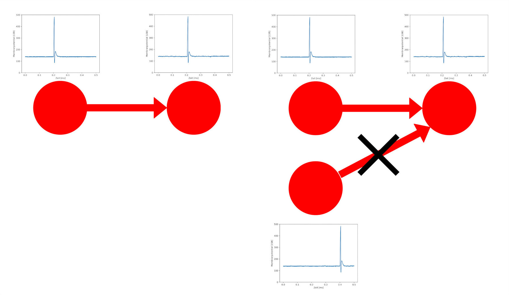
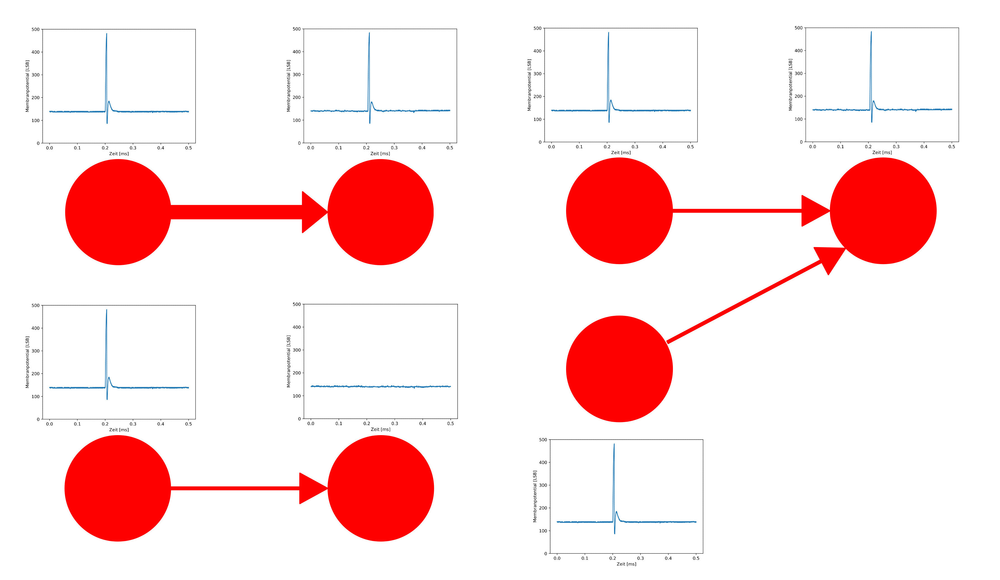
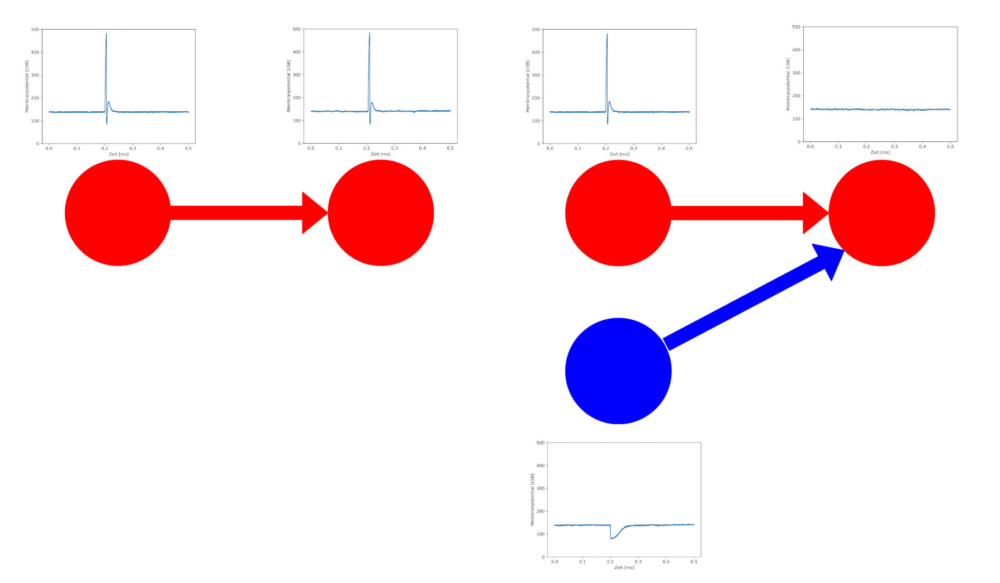
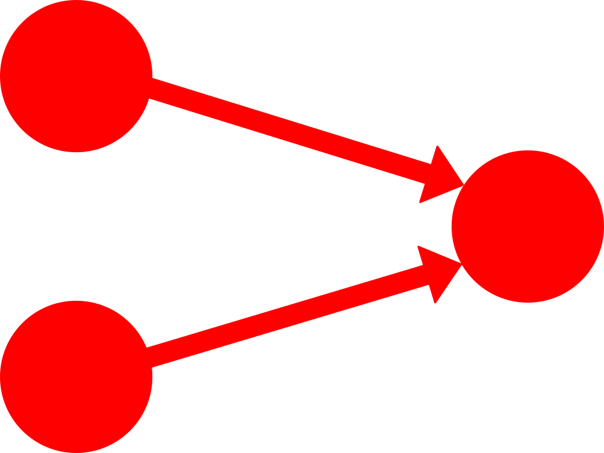

Neuronenverbindungen - Synapsen
===============================

Unser Wissen ist also in den Verbindungen zwischen den Neuronen
gespeichert. Diese Verbindungen heißen Synapsen. Dabei sind drei Dinge
entscheidend:

1. Wo sitzen Synapsen, also welche Neuronen sind miteinander verbunden?
2. Wie stark sind die Verbindungen, also was ist ihr synaptisches
   Gewicht?
3. Was ist die Art der Synapse, ist sie also anregend oder hemmend?

1. Synapsen Position
~~~~~~~~~~~~~~~~~~~~

Eine Synapse verbindet immer ein Senderneuron mit einem Empfängerneuron.
Wenn das Senderneuron ein Aktionspotential generiert, man sagt auch es
feuert, dann wird dieses Signal durch die Synapse an das Empfängerneuron
weitergegeben. Synapsen entstehen dort, wo ein kausaler Zusammenhang
vorliegt. Das bedeutet, wenn ein Empfängerneuron das Signal eines
bestimmten Senderneuron braucht, um seine Funktion zu erfüllen, benötigt
es an dieser Stelle eine Synapse. Wenn es andererseits eine Synapse zwischen
zwei Neuronen gibt, das Empfängerneuron aber den Reiz des Senderneurons nicht
braucht, um seine Aufgabe zu erfüllen, dann besteht an dieser Stelle
kein kausaler Zusammenhang zwischen den Neuronen und die Synapse wird
verschwinden.

2. Synaptisches Gewicht
~~~~~~~~~~~~~~~~~~~~~~~

Das Entstehen und Verschwinden von Synapsen geschieht nicht plötzlich,
sondern ist ein Prozess, bei dem das synaptische Gewicht eine große
Rolle spielt. Dieses bestimmt, wie stark der Reiz des Senderneurons beim
Empfängerneuron ankommt. Ist das synaptische Gewicht hoch, so handelt es
sich um eine starke Neuronenverbindung und das Aktionspotential des
Senderneurons bewirkt eine starke Reaktion beim Empfängerneuron.
Andersherum beeinflusst der Reiz bei einer Synapse mit niedrigem Gewicht
das Empfängerneuron nur schwach. Die Neuronen und ihre Verbindungen
bilden ein regelrechtes Netz, weshalb man auch von einem Netzwerk der
Synapsen sprechen kann. Dieses ist keineswegs statisch, sondern
verändert sich dauerhaft. Es entstehen neue Synapsen, wenn sie Neuronen
verbinden, die im kausalen Zusammenhang zueinander stehen, erhöht sich
ihr Gewicht, wo andere Verbindungen keine Informationen mehr
übermitteln, sinkt das synaptische Gewichte oder die Synapsen
verschwinden vollkommen. Das Zusammenspiel aus mehreren Neuronen und
Synapsen erlaubt das Lösen von komplexeren Problemen.

3. Synapsen Art
~~~~~~~~~~~~~~~

Beim letzten Punkt gibt es zwei Hauptgruppen, in die sich die Synapsen
unterteilen lassen: exzitatorische (anregende) und inhibitorische
(hemmende) Synapsen. Exzitatorisch Synapsen bewirken, dass beim Feuern
des Senderneurons das Empfängerneuron auch zum Feuern angeregt wird.
Damit das Empfängerneuron allerdings tatsächlich feuert, benötigt es ein
hohes synaptisches Gewicht oder viele Reize, die von mehreren Neuronen
oder auch vom selben Senderneuron in kurz aufeinanderfolgenden
Zeitabständen kommen. Inhibitorische Synapsen bewirken das Gegenteil.
Wenn das Senderneuron feuert, unterdrückt dieser Reiz die Bildung eines
Aktionspotentials beim Empfängerneuron. Eine inhibitorische Verbindung
alleine hat daher keine große Auswirkung auf das Empfängerneuron,
gemeinsam mit anderen exzitatorischen Verbindungen kann sie das
Geschehen aber merklich beeinflussen. So kann eine exzitatorische
Verbindung, die das Empfängerneuron alleine zum Feuern bringen würde,
durch eine inhibitorische Verbindung ausgeglichen werden, was dazu
führt, dass mit dieser weiteren Verbindung das Neuron nicht mehr feuert.

Synapsennetzwerke
=================

Mit diesen einfachen Prinzipien lassen sich ziemlich interessante
Netzwerke bauen. Wir wollen uns im Folgenden mit binären
Logikoperationen beschäftigen. Binär bedeutet, dass es nur zwei
Möglichkeiten gibt. Hier ist es, entweder das Neuron feuert oder es
feuert nicht.

Die Oder-Operation
~~~~~~~~~~~~~~~~~~

Für die Oder-Operation betrachten wir ein Netzwerk aus drei Neuronen,
wobei zwei Eingangsneuronen mit einem Ausgangsneuron verbunden sind. Das
Ausgangsneuron soll dann feuern, wenn Neuron 1 oder Neuron 2 feuert.
Dieses Oder ist dabei nicht exklusiv, also wie ein und/oder zu
verstehen. Das Ausgangsneuron feuert also genau dann, wenn Neuron 1,
Neuron 2 oder beide feuern. Diese Logik ist auch noch einmal in einer
Wahrheitstabelle dargestellt.

.. list-table::
    :header-rows: 1
    :align: right

    * - Neuron 1
      - Neuron 2
      - Ausgangsneuron
    * - \-
      - \-
      - \-
    * - x
      - \-
      - x
    * - \-
      - x
      - x
    * - x
      - x
      - x

.. unused internal ref is needed as a workaround for broken tabels in jupyter
.. _oder:

Die Umsetzung ist nun ziemlich simpel. Wir brauchen zwei exzitatorische
Synapsen und ihr Gewicht muss so gewählt werden, dass ein Reiz, der von
Neuron 1 oder 2 kommt, ausreicht, um das Ausgangsneuron zum Feuern zu
bringen.

Doch bevor wir mit unseren Experimenten beginnen können, müssen wir unsere Umgebung vorbereiten:

.. code:: ipython3

    from _static.common.helpers import setup_hardware_client
    setup_hardware_client()

Jetzt können wir mit dem Experiment beginne:

.. code:: ipython3

    # Module zum Modellieren feuernder neuronaler Netzwerke und zur graphischen Darstellung werden geladen.
    import pynn_brainscales.brainscales2 as pynn
    %matplotlib inline
    import matplotlib.pyplot as plt

    from _static.common.helpers import get_nightly_calibration
    
    
    # Die Umgebung wird vorbereitet.
    calib = get_nightly_calibration()
    pynn.setup(initial_config=calib)
    
    # Die Eingangsneuronen werden erstellt.
    # Sie erzeugen ein Aktionspotential zu dem Zeitpunkt, der in `spike_time` steht.
    
    ########## Hier ändern ##########
    spike_time1 = [0.2]
    spike_time2 = []
    #################################
    
    neuron1 = pynn.Population(4, pynn.cells.SpikeSourceArray(spike_times=spike_time1))
    neuron2 = pynn.Population(4, pynn.cells.SpikeSourceArray(spike_times=spike_time2))
    
    # Das Ausgangsneuron wird erstellt.
    output_neuron = pynn.Population(1, pynn.cells.HXNeuron())
    
    # Die Aktivität des Ausgangsneurons wird aufgezeichent.
    output_neuron.record(["spikes", "v"])
    
    # Die Synapsen und ihre Gewichte werden definiert. Das Gewicht kann einen Wert zwischen 0-63 haben.
    
    ########## Hier ändern ##########
    synapse_weight1 = 63
    synapse_weight2 = 32
    #################################
    
    synapse1 = pynn.synapses.StaticSynapse(weight=synapse_weight1)
    synapse2 = pynn.synapses.StaticSynapse(weight=synapse_weight2)
    
    # Die Neuronenverbindungen werden erstellt.
    pynn.Projection(neuron1, output_neuron, pynn.AllToAllConnector(), 
                    synapse_type=synapse1, receptor_type="excitatory")
    pynn.Projection(neuron2, output_neuron, pynn.AllToAllConnector(), 
                    synapse_type=synapse2, receptor_type="excitatory")
    
    # Das Netzwerk wird für eine spezifizierte Zeit laufen gelassen.
    # Diese wird in Millisekunden angegeben.
    duration = 0.5
    pynn.run(duration)
    
    # Nun kann zurückgelesen werden, ob das Ausgangsneuron gefeuert hat.
    spiketrain = output_neuron.get_data("spikes").segments[0].spiketrains[0]
    print(f"Das Neuron hat {len(spiketrain)} mal gefeuert.")
    print(f"Die Zeitpunkte der Spikes waren: {spiketrain}")
    
    # Auch das Membranpotential des Ausgangsneurons kann visualisiert werden.
    mem_v = output_neuron.get_data("v").segments[0].irregularlysampledsignals[0]

    plt.figure()
    plt.plot(mem_v.times, mem_v)
    plt.xlabel("Zeit [ms]")
    plt.ylabel("Membranpotential [LSB]")
    plt.show()
    
    pynn.end()

Testet ob dieses Netzwerk funktioniert. Probiert dafür verschiedene
Kombinationen an Stimuli von den Eingangsneuronen und verschiedene
synaptische Gewichte aus.

Die Nicht-Operation
~~~~~~~~~~~~~~~~~~~

Nun sollt ihr selbst zum Einsatz kommen. Die nächste Operation, die wir
betrachten wollen, ist die Nicht-Operation. Hier haben wir nur ein
Eingangsneuron, desses Signal das Ausgangsneuron verneinen soll. Konkret
bedeutet das, wenn das Eingangsneuron feuert, soll das Ausgangsneuron
nicht feuern und wenn das Eingangsneuron nicht feuert, dann soll das
Ausgangsneuron feuern.

.. image:: _static/common/network1in.png
    :class: align-left
    :width: 300px

.. list-table::
    :header-rows: 1
    :align: right

    * - Eingangsneuron
      - Ausgangsneuron
    * - \-
      - x
    * - x
      - \-

.. unused internal ref is needed as a workaround for broken tabels in jupyter
.. _nicht:

Überlegt euch zuerst, wie das Netzwerk aussehen muss, das diese
Operation implementiert. Betrachtet dann den obigen Code, erkennt, was
die einzelnen Stellen tun und ergänzt die nötigen Befehle an die
passenden Stellen im unteren Code.

Hinweis: Hier wird ein Hilfsneuron benötigt.

.. code:: ipython3

    # Module zum Modellieren feuernder neuronaler Netzwerke und zur graphischen Darstellung werden geladen.
    import pynn_brainscales.brainscales2 as pynn
    %matplotlib inline
    import matplotlib.pyplot as plt

    from _static.common.helpers import get_nightly_calibration
    
    
    # Die Umgebung wird vorbereitet.
    calib = get_nightly_calibration()
    pynn.setup(initial_config=calib)
    
    ''' Beginn eurer Anpassungen (diese Zeile löschen)

    # Das Eingangsneuron wird erstellt.
    # Es erzeugt ein Aktionspotential zu dem Zeitpunkt, der in `spike_time1` steht.
    spike_time1 = 
    neuron1 = 
    
    # Ein Hilfsneuron wird erstellt.
    # Es erzeugt ein Aktionspotential zu dem Zeitpunkt, der in `spike_time_help` steht.
    spike_time_help = 
    neuron_help = 
    
    # Das Ausgangsneuron wird erstellt.
    output_neuron = 
    
    # Die Aktivität des Ausgangsneurons wird aufgezeichent.
    
    # Die Synapsen und ihre Gewichte werden definiert. Das Gewicht kann einen Wert zwischen 0-63 haben.
    synapse_weight1 =
    synapse_weight_help =
    
    synapse_type1 =
    synapse_type_help =
    
    # Die Neuronenverbindungen werden erstellt.
    
    # Das Netzwerk wird für eine spezifizierte Zeit laufen gelassen.
    # Diese wird in Millisekunden angegeben.
    
    # Nun kann zurückgelesen werden, ob das Ausgangsneuron gefeuert hat.
    
    # Auch das Membranpotential des Ausgangsneurons kann visualisiert werden.
    
    Ende eurer Anpassungen (diese Zeile löschen)'''

    pynn.end()

Die Und-Operation
~~~~~~~~~~~~~~~~~

Betrachten wir noch die Und-Operation. Ähnlich wir bei der
Oder-Operation haben wir wieder zwei Eingangsneuronen und ein
Ausgangsneuron. Diesmal soll letzteres aber nur genau dann feuern, wenn
Neuron 1 und Neuron 2 feuern.

.. list-table::
    :header-rows: 1
    :align: right

    * - Neuron 1
      - Neuron 2
      - Ausgangsneuron
    * - \-
      - \-
      - \-
    * - x
      - \-
      - \-
    * - \-
      - x
      - \-
    * - x
      - x
      - x

.. unused internal ref is needed as a workaround for broken tabels in jupyter
.. _und:

Die einfachste Art diese Operation umzusetzen, ist indem man sich die
synaptischen Gewichte zu Nutze macht. Überlegt euch, wie das Netzwerk
aussehen kann, und versucht es mithilfe des vorherigen Codes komplett
selbst zu programmieren.

.. code:: ipython3

    # Module zum Modellieren feuernder neuronaler Netzwerke und zur graphischen Darstellung werden geladen.
    import pynn_brainscales.brainscales2 as pynn
    %matplotlib inline
    import matplotlib.pyplot as plt

    from _static.common.helpers import get_nightly_calibration
    

    # Die Umgebung wird vorbereitet.
    calib = get_nightly_calibration()
    pynn.setup(initial_config=calib)
    
    # Euer Code

    pynn.end()

Diese Operationen sind recht simpel, aber sehr mächtig. Schaltet man sie
richtig hintereinander, lässt sich mit ihnen jeder noch so komplizierte
Logikausdruck umsetzen. Dies ist die Grundlage für das, was moderne
Prozessoren machen. Wir sehen also, dass Neuronen prinzipiell alles können,
was ein Computer auch kann.
