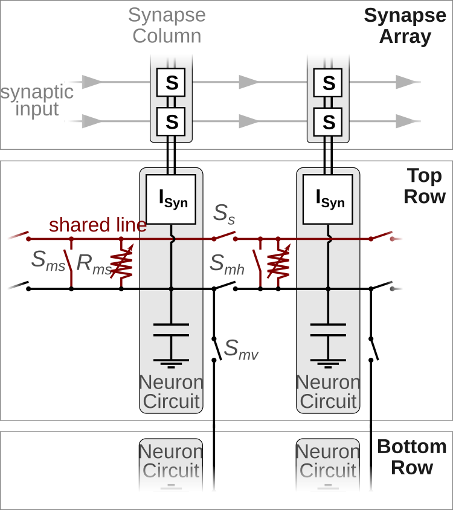
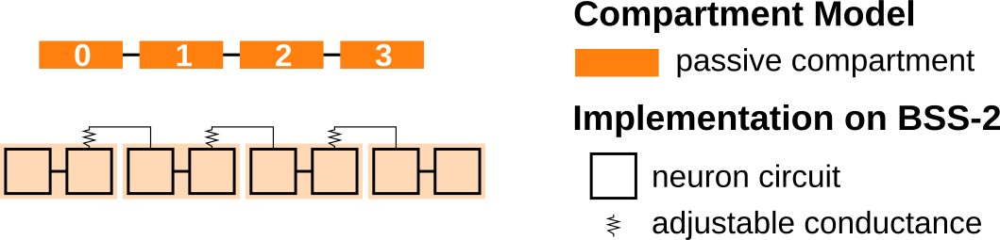
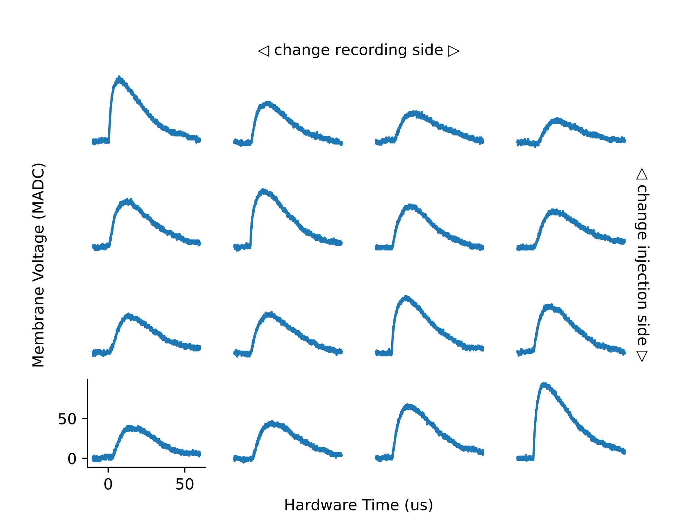

Structured Neurons
==================

In the previous demonstrations we considered point neuron models.
However, biological neurons often posses elaborate dendritic trees, which allow them to pre-process the synaptic inputs before they reach the somatic spike initiation zone near the axon initial segment.
Taking dendrites as well as their passive and active properties into account can greatly enhance the computational power of neurons [1-3].

In order to investigate the features of structured neurons, BrainScaleS-2 offers the possibility to connect several neuron circuits to form multi-compartmental neuron models.
The following figure shows a sketch of two neuron circuits and the electronic (**not** synaptic) connections they can establish.

Horizontal switches :math:`S_{mh}` and vertical switches :math:`S_{mv}` allow to connect neighboring neuron circuits directly -- they form a single, isopotential compartment.
This can be useful to increase the fan-in of a single compartment as it is now connected to several columns of the synapse array or might be needed to realize certain multi-compartmental models (see the code example below).

In addition to these "membrane connections" each neuron circuit can also connect either directly (:math:`S_{ms}`) or via a conductance :math:`R_{ms}` to a "shared line".
This offers the possibility to connect several compartments via conductances and to form various multi-compartmental neuron models.
multi
We will demonstrate the implementation of a multi-compartmental model by the example of a compartment chain and will investigate how excitatory postsynaptic potentials propagate along the chain.
The following figure displays a sketch of a chain with four compartments in the top part; in the bottom the hardware implementation is illustrated.

The rest of this demo will motivate why we chose this hardware implementation and will show how this model can be emulated on the BrainScaleS-2 system.
You can find more detailed information about the multi-compartmental capabilities, example configurations and experiments with structured neurons in Kaiser et al. 2021 [4].

.. admonition:: References for further reading

    1. Poirazi, P., Brannon, T., Mel, B.W., 2003. Pyramidal neuron as two-layer neural network. Neuron 37, 989–999. doi:`10.1016/s0896-6273(03)00149-1 <https://www.doi.org/10.1016/s0896-6273(03)00149-1>`_
    2. London, M., Häusser, M., 2005. Dendritic computation. Annu. Rev. Neurosci.  28, 503–532. doi:`10.1146/annurev.neuro.28.061604.135703  <https://www.doi.org/10.1146/annurev.neuro.28.061604.135703>`_
    3. Major, G., Larkum, M.E., Schiller, J., 2013. Active properties of neocortical pyramidal neuron dendrites. Annual Review of Neuroscience 36, 1–24. doi:`10.1146/annurev-neuro-062111-150343 <https://www.doi.org/10.1146/annurev-neuro-062111-150343>`_
    4. Kaiser, J., Billaudelle, S., Müller, E., Tetzlaff, C., Schemmel, J., and Schmitt, S., 2022. Emulating dendritic computing paradigms on analog neuromorphic hardware. Neuroscience. doi:`10.1016/j.neuroscience.2021.08.013 <https://www.doi.org/10.1016/j.neuroscience.2021.08.013>`_

Imports and Calibration
-----------------------

Once again we have to set some environment variables for our microscheduler first:

.. include:: common_quiggeldy_setup.rst

We continue by importing several Python packages, which we need to perform our experiment.

.. code:: ipython3

    %matplotlib inline
    from functools import partial
    from typing import List, Optional
    import numpy as np
    import ipywidgets as widget
    import matplotlib.pyplot as plt
    import quantities as pq

    import pynn_brainscales.brainscales2 as pynn
    from pynn_brainscales.brainscales2.morphology import create_mc_neuron, \
        Compartment, SharedLineConnection

.. include:: common_nightly_calibration.rst

Now we can start setting up our network:

.. code:: ipython3

    # setup PyNN and inject calibration data
    pynn.setup(initial_config=calib)

Furthermore, we define some global parameters which we need for the construction of the chain and the external stimulus.

.. code:: ipython3

   length = 4  # Number of compartments in the chain
   inputs = 10 # Number of concurrent input spikes

Constructing a Compartment Chain
--------------------------------

We will now create a chain of compartments, which are connected via conductances.
Each compartment in the middle of the chain has two neighbors.
Therefore, these compartments have to establish two connections via the somatic line.
As a consequence each is made up of two neuron circuits: the first will connect to the somatic line via the conductance and the second via the switch.

The PyNN interface allows us to define compartments and the connections between them.
Once we defined all compartments and connections, we can create a new neuron type.

.. code:: ipython3

    assert length >= 2
    compartments = []
    for n_comp in range(length):
        positions = [2 * n_comp, 2 * n_comp + 1]
        # use direct connection to connect to the right
        connect_shared_line = None if n_comp == 0 else [positions[0]]
        # use resistor to connect to the right
        connect_conductance = None if n_comp == (length - 1) else \
            [(positions[1], 200)]
        compartments.append(
            Compartment(positions=positions,
                        label=f'comp_{n_comp}',
                        connect_conductance=connect_conductance,
                        connect_shared_line=connect_shared_line))

    # close shared line between neighboring compartments
    connections = []
    for n_comp in range(length - 1):
        # start at second circuit in first compartment
        start = 2 * n_comp + 1
        connections.append(
            SharedLineConnection(start=start, stop=start + 1, row=0))

    # create new neuron type
    CompartmentChain = create_mc_neuron('CompartmentChain',
                                        compartments=compartments,
                                        connections=connections,
                                        single_active_circuit=True)

    # disable spiking since we want to observe the attenuation of PSPs
    pop = pynn.Population(1, CompartmentChain(threshold_enable=False))

External Input and Experiment Definition
----------------------------------------

We create stimulus neurons which inject synaptic inputs in one compartment after another.

.. code:: ipython3

    isi = 0.2  # ms (hw): time between inputs
    spike_times = np.arange(length) * isi + 0.5 * isi  # ms (hw)
    # Inject stimulus in one compartment after another
    projections = []
    for n_comp, spike_time in enumerate(spike_times):
        pop_in = pynn.Population(inputs, pynn.cells.SpikeSourceArray(
            spike_times=[spike_time]))

        # Note: the weight will be set later
        synapse_type = pynn.standardmodels.synapses.StaticSynapse()
        projections.append(
            pynn.Projection(pop_in, pop,
                            pynn.AllToAllConnector(location_selector=f'comp_{n_comp}'),
                            synapse_type=synapse_type))

Now we define a function which runs the experiment on the BrainScaleS-2 system.
Since we use a single ADC (analog-to-digital converter) to record the membrane potential of each compartment, we have to perform ``length`` hardware runs.

.. code:: ipython3

    def record_membrane_traces(weight: int, conductance: int) -> List:
        """
        Run emulation on BSS-2 and record membrane traces of each compartment.

        :param weight: Weight of stimulus projection. Value range: [0, 63].
        :param conductance: Conductance between compartments. Value range
            [0, 1022].

        :return List of recorded membrane traces.
        """

        # Set parameters
        pop.set(multicompartment_i_bias_nmda=conductance)
        for proj in projections:
            proj.set(weight=weight)

        # Run on hardware and record mebrane potentials
        membrane_traces = []
        for n_comp in range(length):
            pop.record(['v'], locations=[f'comp_{n_comp}'])

            pynn.run(length * isi)

            membrane_traces.append(pop.get_data(clear=True).segments[-1].irregularlysampledsignals[0])

            pop.record(None)
            pynn.reset()

        return membrane_traces

Furthermore, we define a function which plots the defined membrane traces.
For that purpose we create a grid of size ``length x length``.
Each cell in this grid will contain a subplot which displays the membrane response in a single compartment to a single input.
We will change the recording site in the x-axis and the injection site on the y-axis.

.. code:: ipython3

    def plot_membrane_traces(membrane_traces: List, old_traces: Optional[List]):
        """
        Display recorded membrane traces.

        Split the recorded membrane trace of each compartment and create a grid of
        reponses in which the recording site changes in the horizontal direction
        and the injection site in the vertical direction.

        :param membrane_traces: List of recorded membrane traces of the different
            compartments.
        """
        length = len(membrane_traces)
        fig, axs = plt.subplots(length, length, sharex=True, sharey=True,
                                figsize=(10,8))

        def plot_single(traces: List, **kwargs):
            '''
            Helper function to plot membrane traces recorded in a single experiment.
            '''
            for injected in range(length):
                for measured in range(length):
                    membrane_trace = traces[measured]
                    input_time = spike_times[injected] * pq.ms

                    signal = membrane_trace.time_slice(
                        t_start=input_time - 0.01 * pq.ms,
                        t_stop=input_time + 0.06 * pq.ms)

                    # Normalize voltage and times
                    signal.times = (signal.times - input_time).rescale(pq.us)
                    signal = signal - signal[:100].mean()

                    axs[injected, measured].plot(signal.times, signal, **kwargs)

        plot_single(membrane_traces, c='k')
        if old_traces is not None:
            plot_single(old_traces, c='k', alpha=0.3)

        # Hide all but one axis
        for ax in np.delete(axs, -length):
            ax.axis('off')

        axs[-1, 0].spines['right'].set_visible(False)
        axs[-1, 0].spines['top'].set_visible(False)

        # Add "global" axis with annotations
        ax = fig.add_subplot(111, frameon=False)
        ax.tick_params(labelcolor='none', top=False, bottom=False, left=False,
                       right=False)
        ax.minorticks_off()
        ax.set_ylabel('Membrane Voltage (MADC)')
        ax.set_xlabel('Hardware Time (us)')

        pad = 8
        ax.annotate(r'$\triangleleft$ change recording site $\triangleright$',
                    xy=(0.5, 1), xytext=(0, pad),
                    xycoords='axes fraction', textcoords='offset points',
                    ha='center', va='center')
        ax.annotate(r'$\triangleleft$ change injection site $\triangleright$',
                    xy=(1, 0.5), xytext=(pad, 0),
                    xycoords='axes fraction', textcoords='offset points',
                    ha='center', va='center', rotation=270)

        fig.show()

Performing the Experiment
-------------------------

Finally, we can execute the experiment on the BrainScaleS-2 system.
For that purpose we use the functions defined in the previous section.

.. code:: ipython3

    old_traces = None

    Slider = partial(widget.IntSlider, continuous_update=False)
    @widget.interact(weight=Slider(min=0, max=63, step=1, value=31),
                     conductance=Slider(min=0, max=1022, step=10, value=500))
    def run_experiment(weight, conductance):
        global old_traces
        membrane_traces = record_membrane_traces(weight, conductance)
        plot_membrane_traces(membrane_traces, old_traces)
        old_traces = membrane_traces

Questions
~~~~~~~~~
- How does the conductance influence the attenuation of the EPSP?
  How does it affect the height of the EPSP in the compartment in which it was injected?
- Do you see an effect due to the finite chain length?

Last but not least, we tell PyNN that we finished all our experiments.
Uncomment and execute the following line once you want to finish the experiment.

.. code:: ipython3

    # pynn.end()
