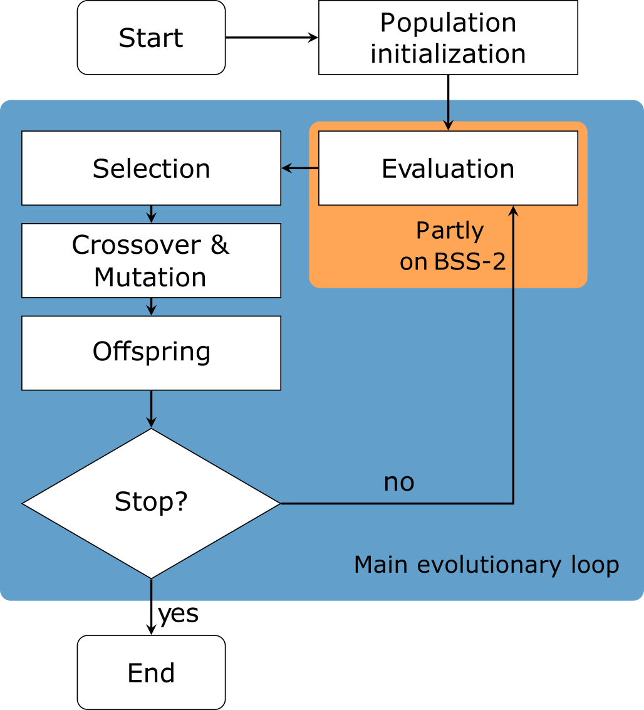

How to use Genetic Algorithms to automatically parameterize BrainScaleS-2
=========================================================================

In simulations of compartmental neurons it is a non-trivial task to find a suitable parameterization of the model [VB99]_, such that it matches observations from real neurons, like found in [BLL01]_.
In this tutorial, we’ll present an approach using genetic algorithms to automate this parameterization.
The presented approach can be used to configure the analog neurons of BrainScaleS-2 such that they can replicate experimental data.

In particular, we will

*  create a linear chain of compartments using PyNN

*  visualize the attenuation of an excitatory postsynaptic potential
   (EPSP) along the compartment chain

*  investigate how the leak conductance and the inter-compartment
   conductance influence the attenuation of the EPSP

*  use genetic algorithms to automatically find appropriate parameters
   for the neuron circuits to replicate a given observation

To execute experiments on BrainScaleS-2 we use a microscheduler for whom we first have to set some environment variables:

.. code:: ipython3

    from __future__ import annotations
    from _static.common.helpers import setup_hardware_client
    setup_hardware_client()

We’ll also configure matplotlib and import some tools.

.. code:: ipython3

    %matplotlib inline
    from typing import Container, List, Tuple, Sequence, Union
    from functools import partial
    import numpy as np
    import quantities as pq
    import neo
    import ipywidgets as widget
    import matplotlib.pyplot as plt
    import matplotlib.style as mplstyle
    from scipy.optimize import curve_fit
    import deap
    from deap import algorithms, base, creator, tools
    from tqdm.contrib.itertools import product

    import pynn_brainscales.brainscales2 as pynn

    # Use default style such that colors in plots and texts match
    mplstyle.use('default')

As a next preparation step, we load the default calibration, which is generated for every BrainScaleS-2 chip every night.
It is saved in a variable such that we can use it later when we define our experiment.

.. code:: ipython3

    from _static.common.helpers import get_nightly_calibration
    calib = get_nightly_calibration()

Constructing the Compartment Chain in PyNN
------------------------------------------

In the tutorial :doc:`ts_03-multicompartment`, the concept of multi-compartment neurons was introduced, which are spatially structured neurons.
Here we will continue with the compartment chain experiments.
Therefore, we first create a compartment chain class, summarizing the experiments of the :doc:`ts_03-multicompartment` tutorial and extending it with further functionality for the experiments of this tutorial.
Upon initialization the class creates a compartment chain of provided length.
Additionally, the first compartment is connected to an external population (refer to `figure 1`_) that will spike at a specified point in time.
This causes an EPSP that travels along the chain.

.. _figure 1:

    Figure 1: Compartment chain of length 5 and external population connecting to the first compartment.

The class functions are summarized in the following:

*  ``create_input_projection``: Generates an external population of size ``inputs`` and connects it to the first compartment.
   All neurons of the external population will spike simultaneously, introducing an EPSP in the compartment chain.

*  ``set_conductances``: Sets the leak and inter-compartment conductance to the provided values.

*  ``record_membrane``: Records the experiment, i.e. the EPSP traveling along the compartment chain.

*  ``extract_psp_amplitudes``: Extracts the amplitudes of the EPSP in each compartment.

*  ``fit_length_constant``: Fit an exponential function to the EPSP amplitudes.

*  ``run_and_eval``: This function executes the experiment and returns the fit parameters and the amplitudes.

*  ``evaluate``: This function calls ``run_and_eval`` and compares the extracted length constant to a target.

*  ``fitfunc``: Defines an exponential function of the form :math:`f(x) = A \cdot \exp\left(-\frac{x}{\lambda}\right) + c`.

.. code:: ipython3

    class CompartmentChain():
        '''
        Creates a compartment chain of provided length upon initialization and
        supplies further functionalities to run and evaluate experiments.

        :ivar length: Lenght of the compartment chain.
        :ivar compartments: Compartments of the chain.
        :ivar runtime: Experiment runtime in ms.
        :ivar spike_time: Time of input spike.
        :ivar projection: Projections between external population and first
            compartment of the chain.
        '''
        def __init__(self, length: int, weight: int = 63):
            self.length = length
            self.compartments = self._create_chain()
            self.runtime = 0.15 * pq.ms  # (hw)
            self.spike_time = self.runtime / 2  # (hw)
            self.projection = self.create_input_projection()
            self.projection.set(weight=weight)

        def _create_chain(self) -> List[pynn.PopulationView]:
            '''
            Create linear compartment chain.

            A compartment will be constructed out of two neuron circuits.
            Thereby, one neuron circuit will handle the parameters of a
            compartment.

            :returns: List containing every compartment of the chain.
            '''
            pop = pynn.Population(self.length * 2, pynn.cells.HXNeuron())

            # Combine two neuron circuits to one compartment; "disable" second
            # neuron circuit
            pynn.PopulationView(pop, np.arange(0, 2 * self.length, 2)).set(
                multicompartment_connect_right=True,
                leak_i_bias=0,
                leak_enable_division=True,
                membrane_capacitance_capacitance=0)

            # Enable direct connection to somatic line for even neuron circuits
            # (don't connect first neuron circuit)
            pynn.PopulationView(pop, np.arange(2, 2 * self.length, 2)).set(
                multicompartment_connect_soma=True)

            # Connect resistor to somatic line and close connection to the right
            # for uneven circuits (don't connect last neuron circuit)
            # Note: We enable both leak division and inter-compartment
            # conductance division here since it results in larger length
            # constants. This allows the EPSP to travel further down the chain
            # and is chosen for the sake of this tutorial. Real neurons might
            # exhibit different dynamical properties which might need other
            # settings for those two parameters.
            pynn.PopulationView(pop, np.arange(1, 2 * self.length - 1, 2)).set(
                multicompartment_enable_conductance=True,
                multicompartment_i_bias_nmda=600,
                multicompartment_connect_soma_right=True,
                multicompartment_enable_conductance_division=True,
                leak_enable_division=True)

            # Disable spiking
            pop.set(threshold_enable=False)

            # Every uneven neuron circuit controls the capacitance, resistance,
            # leak, ... of a single compartment. Return views on these circuits
            # as compartments
            return [pynn.PopulationView(pop, [n]) for n in
                    range(1, 2 * self.length, 2)]

        def create_input_projection(self, inputs: int = 5) -> pynn.Projection:
            '''
            Set projection from an external population of size `inputs`, which
            elicits a spike at the time defined by spike_time, to the first
            compartment.

            :param inputs: Size of external population.
            :returns: Projection from input population to first compartment.
            '''
            # Inject stimulus in first compartment
            pop_in = pynn.Population(inputs, pynn.cells.SpikeSourceArray(
                spike_times=[float(self.spike_time.rescale(pq.ms))]))

            # Note: the weight will be set later
            synapse_type = pynn.standardmodels.synapses.StaticSynapse()
            return pynn.Projection(
                pop_in, self.compartments[0], pynn.AllToAllConnector(),
                synapse_type=synapse_type)

        def set_conductances(self, leak_conductance: int,
                             inter_compartment_conductance: int) -> None:
            '''
            Set leak and inter-compartment conductance of the chain.

            Both the leak_conductance and the inter_compartment_conductance
            have a parameter range from 0 to 1022.

            :param leak_conductance: Leak conductance that will be set.
            :param inter_compartment_conductance: Inter-compartment conductance
                that will be set.
            '''
            for comp in self.compartments:
                self.g_leak = leak_conductance
                self.g_ic = inter_compartment_conductance
                comp.set(
                    multicompartment_i_bias_nmda=inter_compartment_conductance)
                comp.set(leak_i_bias=leak_conductance)

        def record_membrane(self) -> List[neo.IrregularlySampledSignal]:
            '''
            Record the membrane of each compartment of the chain.

            The experiment is repeated `self.length` times since the MADC can only
            record one neuron circuit's membrane at a time.

            :returns: Membrane traces of each compartment.
            '''
            # Run on hardware and record membrane potentials
            membrane_traces = []
            for n_comp, comp in enumerate(self.compartments):
                comp.record(['v'])

                pynn.run(self.runtime.rescale(pq.ms).magnitude)
                pynn.reset()

                sig = comp.get_data().segments[-1].irregularlysampledsignals[0]
                sig.annotate(compartment=n_comp, spike_time=self.spike_time)

                membrane_traces.append(sig)

                comp.record(None)

            return membrane_traces

        @staticmethod
        def extract_psp_amplitudes(
                membrane_traces: List[neo.IrregularlySampledSignal]) -> np.ndarray:
            '''
            Extract the PSP amplitudes from membrane recordings.

            :param traces: Analog signal for each compartment in the chain.
            :returns: Amplitudes of PSP (difference between maximum and baseline).
                The amplitudes are calculated for each compartment.
            '''
            amplitudes = []
            for sig in membrane_traces:
                spike_time = sig.annotations['spike_time'].rescale(pq.ms)

                # use membrane voltage before first spike as baseline
                baseline = sig.time_slice(sig.t_start, spike_time).mean()

                amplitudes.append(sig.max() - baseline)
            return np.asarray(amplitudes)

        @classmethod
        def fit_length_constant(
                cls, amplitudes: np.ndarray) -> Tuple[np.ndarray, np.ndarray]:
            '''
            Fit an exponential decay to the PSP amplitudes in the compartments.

            :param amplitudes: Amplitudes of the EPSP for each compartment in the
                chain.
            :returns: Fit parameters and covariance matrix for the fit to the
                exponential.
            '''
            norm_amp = amplitudes / amplitudes[0]
            compartments = np.arange(len(amplitudes))

            # initial guess for fit parameters
            guessed_lambda = np.argmin(np.abs(norm_amp - 1 / np.e))
            p_0 = {'lambda_': guessed_lambda, 'offset': norm_amp[-1],
                   'scale': norm_amp[0] - norm_amp[-1]}
            bounds = {'lambda_': [0, np.inf],
                      'offset': p_0['offset'] + np.array([-1, 1]),
                      'scale': [0, np.inf]}

            popt, pcov = curve_fit(
                cls.fitfunc, compartments, norm_amp,
                p0=[p_0['lambda_'], p_0['offset'], p_0['lambda_']],
                bounds=([bounds['lambda_'][0], bounds['offset'][0],
                         bounds['scale'][0]],
                        [bounds['lambda_'][1], bounds['offset'][1],
                         bounds['scale'][1]]))

            return popt, pcov

        def run_and_eval(self, leak_conductance: int,
                         inter_compartment_conductance: int) -> Tuple[
                np.ndarray, np.ndarray, np.ndarray]:
            '''
            Executes the experiment and fits an exponential to the maximum
            amplitude of the EPSP in each compartment.

            The fit parameters and the extracted amplitudes are then returned.

            :param leak_conductance: Leak conductance that will be set.
            :param inter_compartment_conductance: Inter-compartment conductance
                that will be set.
            :returns: Fit parameters, estimated covariance of fit parameters
                and amplitudes of the EPSP in each compartment.
            '''

            self.set_conductances(
                leak_conductance=leak_conductance,
                inter_compartment_conductance=inter_compartment_conductance)

            membrane_traces = self.record_membrane()
            amplitudes = self.extract_psp_amplitudes(membrane_traces)
            popt, pcov = self.fit_length_constant(amplitudes)
            return popt, pcov, amplitudes

        def evaluate(
                self, individual: Sequence, target: float) -> float:
            '''
            Evaluation function used for the genetic algorithm.

            Executes the experiment and fits an exponential to the maximum
            amplitude of the EPSP in each compartment.

            :param individual: Individual representing the settings of the leak and
                inter-compartment conductance.
            :param target: Target length constant.
            :returns: The absolute difference between the target and the
                individual's length constant.
            '''
            popt = self.run_and_eval(
                leak_conductance=individual[0],
                inter_compartment_conductance=individual[1])[0]
            return (abs(popt[0] - target),)

        @staticmethod
        def fitfunc(location: Union[float, np.ndarray], length_const: float,
                    offset: float, scale: float) -> Union[float, np.ndarray]:
            '''
            Exponential function with offset.

            :param location: Numerator inside the exponential.
            :param length_const: Denominator inside the exponential.
            :param offset: Y-offset of the exponential.
            :param scale: Amplitude at Y-intercept.
            :returns: Function evaluation provided the parameters.
            '''
            return scale * np.exp(- location / length_const) + offset

Overview of the experiment
~~~~~~~~~~~~~~~~~~~~~~~~~~

We run the experiment and visualize the attenuation of the EPSP along the chain.
All plotting functions used in this tutorial are defined in this `helper file`_.

.. _`helper file`: _static/tutorial/ga_mc_helpers.py

.. code:: ipython3

    import _static.tutorial.ga_mc_helpers as helpers

    pynn.setup(initial_config=calib)
    compartment_chain = CompartmentChain(length=5)
    compartment_chain.set_conductances(
        leak_conductance=200,
        inter_compartment_conductance=1000)
    membrane_traces = compartment_chain.record_membrane()
    helpers.plot_membrane_traces(membrane_traces, compartment_chain)

Clearly, the attenuation of the EPSP with increasing distance from the EPSP initiation zone can be seen.
The red dashed lines indicate the maximal amplitude :math:`U_\mathrm{max}` of the EPSP in the respective compartment.
Please note that the baseline was subtracted in the second row of the figure since each neuron circuit has an individual recording offset.

Next, we want to observe how the attenuation is affected by the two following parameters:

*  the leak conductance :math:`g_\mathrm{leak}`

*  the inter-compartment conductance :math:`g_\mathrm{ic}`.

By varying those two parameters, we can see how the maximal EPSP amplitudes change.
Furthermore, we fit an exponential function :math:`U_\mathrm{max}(x)=\exp(-x/\lambda_\mathrm{emp})+c` to the decay of the EPSP amplitudes normed to the amplitude of the first compartment.
The function parameter :math:`\lambda_\mathrm{emp}` is the empirically determined length constant and approximately describes at which distance a signal decays to :math:`1/e` of its original amplitude.

.. code:: ipython3

    old_data = []

    Slider = partial(widget.IntSlider, continuous_update=False)
    BoundedInt = partial(widget.BoundedIntText, continuous_update=False)

    @widget.interact(
        g_leak=Slider(min=0, max=1022, step=10, value=500,
                      description=r'$g_{\mathrm{leak}}$'),
        g_ic=Slider(min=0, max=1022, step=10, value=500,
                    description=r'$g_{\mathrm{ic}}$'))
    def run_experiment(g_leak, g_ic):
        popt, pcov, amplitudes = compartment_chain.run_and_eval(g_leak, g_ic)
        helpers.visualize_experiment(
            popt, pcov, amplitudes, compartment_chain, old_data)

In the following cell, you can compare the attenuation behavior of different parameterizations:
1. Set "Old runs" to the number of configurations you want to compare.
1. Use the sliders from the previous cell to set :math:`g_\mathrm{leak}` and :math:`g_\mathrm{ic}` to a configuration you want to investigate.
1. Repeat from 2. for the next configuration you want to compare.
1. Press "Display old runs" to display the "Old runs" last configurations.

.. code:: ipython3

    w = widget.interact_manual.options(manual_name="Display old runs")

    w(helpers.display_old_runs, archive=widget.fixed(old_data),
      n_last_runs=BoundedInt(min=1, max=10, step=1, value=1,
                             description='Old runs'))

In order to get a better understanding of how the conductances influence the length constant :math:`\lambda_\mathrm{emp}`, we sweep both parameters in a grid search.
Note that depending on the ``GRID_LENGTH`` this might take a few minutes.

.. code-block:: ipython3

    GRID_LENGTH = 8

.. code-block:: ipython3
   :class: test, html-display-none

    GRID_LENGTH = 2

.. code-block:: ipython3

    lambdas = np.empty((GRID_LENGTH, GRID_LENGTH))

    conductances = np.linspace(0, 1000, GRID_LENGTH, dtype=int)

    for idx, [g_leak, g_ic] in enumerate(product(conductances, conductances)):
        popt = compartment_chain.run_and_eval(
            leak_conductance=g_leak, inter_compartment_conductance=g_ic)[0]
        lambdas[idx % GRID_LENGTH, idx // GRID_LENGTH] = popt[0]

Finally, we visualize the dependency of :math:`\lambda_\mathrm{emp}` on :math:`g_\mathrm{leak}` and :math:`g_\mathrm{ic}`.

.. code:: ipython3

    fig, axes = plt.subplots(2, figsize=(4, 4 * 1.1), tight_layout=True,
                             gridspec_kw={'height_ratios': [1, 0.05]})
    helpers.plot_grid_search(fig, axes, lambdas, conductances)

From the visualization of the grid search we can observe that a higher :math:`g_\mathrm{ic}` will result in a larger :math:`\lambda_\mathrm{emp}`.
Furthermore, decreasing :math:`g_\mathrm{leak}` can also result in larger :math:`\lambda_\mathrm{emp}`, as the charge leaks more slowly from the membrane and therefore the EPSP can travel further down the chain.

Through the grid search, we already obtained an estimate of how to choose our parameters :math:`g_\mathrm{leak}` and :math:`g_\mathrm{ic}` to obtain a certain :math:`\lambda_\mathrm{emp}`.
However, if we want to find a precise setting, this brute force approach will become slow as a higher grid resolution will be necessary.
Further, when adding more dimensions, the algorithm scales with :math:`N^d`, where :math:`N` is the number of grid steps and :math:`d` the number of dimensions.
So when searching only one operating point, we can save a lot of computation time by not measuring all combinations but applying a genetic algorithm.
Note that in contrast to the usual algorithms we use for calibration, like a binary search, this does not require assumptions about the hardware.

We will now introduce genetic algorithms and use one to optimize :math:`g_\mathrm{leak}` and :math:`g_\mathrm{ic}` such that they result in a desired :math:`\lambda_\mathrm{emp}`.
Note that this is only an illustration, as an operating point may usually be constrained by more target parameters, like a desired membrane time constant or given amplitudes per compartment.
We will use the module deap [For+12]_ to implement the genetic algorithm.

Genetic Algorithm
-----------------

Genetic algorithms can be used for derivative-free optimizations and search tasks.
The name is inspired by natural evolution as the algorithm borrows concepts from it [Gol89]_.

First, the algorithm creates a population of initial solutions.
Every solution - referred to as an individual - is composed of genes that can be represented as numerical values.
The numerical values are chosen randomly at the beginning of the algorithm.
In an iterative procedure, individuals are mutated, recombined and selected, based on their fitness, i.e. how well they solve the problem.
The iterations of this procedure are also called generations.
This process stops if a satisfactory solution is found or until a predefined number of generations is reached.

In the following, we will implement the genetic algorithm sketched in `figure 2`_ below.
For our problem our individuals will consist out of two genes, which will be integer values describing the leak and inter-compartment conductance, bound to their respective limits.

The population is initialized by randomly creating :math:`n=`\ ``POPSIZE`` individuals by drawing their genes from a uniform distributions over the search-boundaries.

The evaluation-step is then done on BrainScaleS-2, where we configure the conductances according to an individual and run our above defined experiment.
The fitness of that individual is then calculated by taking the absolute difference between the measured length constant :math:`\lambda_\mathrm{emp}` and a predefined target length constant :math:`\hat{\lambda}_\mathrm{emp}`.
Next, individuals of the population are selected based on their fitness.
Here we use tournament selection, which randomly picks ``TOURNSIZE`` individuals and selects the fittest of those.
All individuals [#]_ of the tournament are then put back to the original population and the next tournament is started.
Overall ``POPSIZE`` tournaments are run such that ``POPSIZE`` individuals are selected.

Subsequently, the selected individuals are mutated and recombined.
For recombination each individual is picked with probability ``CXPB`` and then from pairs of those picked individuals offspring is generated by mixing their genes (for details see `table 1`_).
This functionality is provided by the ``deap`` method ``tools.cxOnePoint``.
An individual is mutated using ``deap``'s ``tools.mutUniformInt`` method.
This will happen with the probability ``MUTPB`` where each gene is randomly altered with probability ``INDPB`` (see `table 2`_).

Finally, after those steps we end up with the next generation.
Then the whole process - starting from the evaluation-step - repeats until the ``NGEN``-th generation is reached.
Ultimately, the fittest individual approximates a solution to our problem.

.. [#] Including the just picked individuals.
   Note: This way the same individual can be picked multiple times for generating the next generation.
   Therefore ``TOURNSIZE`` should not be chosen too large to maintain exploration of the solution space.

.. _figure 2:

    Figure 2: Flowchart of a genetic algorithm.

.. _table 1:
.. list-table:: Table 1: Recombination of two parents creating two offspring individuals.
   :header-rows: 1

   * - Individual
     - Gene :math:`g_\mathrm{l}`
     - Gene :math:`g_\mathrm{ic}`
   * - Parent 1
     - 64
     - 852
   * - Parent 2
     - 263
     - 37
   * - Offspring 1
     - 64
     - 37
   * - Offspring 2
     - 263
     - 852

.. _table 2:
.. list-table:: Table 2: Mutation of an individual.
   :header-rows: 1

   * - Individual
     - Gene :math:`g_\mathrm{l}`
     - Gene :math:`g_\mathrm{ic}`
   * - Parent     
     - 64
     - 852
   * - Offspring  
     - 64
     - 663

.. only:: jupyter

    .. raw:: html

        

Most of functionality we need is already provided by ``deap`` and we only have to pick the desired functions and hyper-parameters.

.. code:: ipython3

    # parameter limits g_leak and g_ic
    limits = np.array([(0, 1022), (0, 1022)]).T

    # number of individuals which will be picked for tournament selection
    TOURNSIZE = 2
    MUTPB = 0.2  # probability that individual is mutated
    # probability that a gene is mutated if individual is picked for mutation
    INDPB = 0.5
    CXPB = 0.3  # probability that this individual will be picked for crossover
    NGEN = 10  # number of generations until algorithm stops
    POPSIZE = 25  # number of individuals within each generation

    # container for various tools
    toolbox = deap.base.Toolbox()

    # define individual if not yet done
    if not hasattr(deap.creator, "FitnessMin"):
        deap.creator.create("FitnessMin", deap.base.Fitness, weights=(-1.0,))
        deap.creator.create("Individual", list, fitness=deap.creator.FitnessMin)

    def create_individual(lower_limit: np.ndarray,
                          upper_limit: np.ndarray) -> Sequence:
        '''
        Creates an array of random integers of size 2 bounded to the provided
        limits.

        Values are drawn from a uniform distribution within
        [lower_limit, upper_limit] for the respective gene.

        :param lower_limit: Lower limits.
        :param upper_limit: Upper limits.
        :returns: Individual.
        '''
        ind = np.random.randint(lower_limit, upper_limit + 1)
        return deap.creator.Individual(ind.tolist())

    toolbox.register("individual", create_individual, limits[0], limits[1])
    toolbox.register("population", deap.tools.initRepeat, list, toolbox.individual)

    # define evolutionary operators
    toolbox.register("select", deap.tools.selTournament, tournsize=TOURNSIZE)
    toolbox.register("mate", deap.tools.cxOnePoint)
    toolbox.register("mutate", deap.tools.mutUniformInt, low=list(limits[0]),
                     up=list(limits[1]), indpb=INDPB)

.. code-block:: ipython3
   :class: test, html-display-none

   NGEN = 2
   POPSIZE = 4

We just defined the hyper-parameters of the genetic algorithm and how our individuals are generated and altered by the evolutionary operators.

Now, we only need to define the target length constant and the evaluation function.
The execution of experiments will suffer from trial-to-trial variations, which originate from the analog nature of the hardware.
Therefore, the measured length constants might vary from run to run even though the configuration is the same.
In order to later have the chance to interpret the results with respect to those trial-to-trial variations we define our target to be the averaged observed length constant found in 10 initial experiment runs using a fixed parameterization for :math:`g_\mathrm{l}` and :math:`g_\mathrm{ic}`.
From those 10 measurements we can calculate the standard deviation of the measured length constants, which can function as a rough estimation of the expected trial-to-trial variation during the experiment.

.. code:: ipython3

    # fixed conductance parameters to generate target
    g_leak = 500
    g_ic = 500

    targets = []
    for _ in range(10):
        popt = compartment_chain.run_and_eval(g_leak, g_ic)[0]
        targets.append(popt[0])

    print(f"Average target value: {np.mean(targets):.3f} +- "
          f"{np.std(targets):.3f} compartments")

    # evaluation function
    toolbox.register("evaluate", compartment_chain.evaluate,
                     target=np.mean(targets))

Note that we are interested in the individuals which reproduce our desired target length constant :math:`\hat{\lambda}` as precise as possible.
Therefore, our evaluation function calculates the deviation from an individual's length constant :math:`\lambda_{\mathrm{emp}}` to our desired target length constant :math:`\hat{\lambda}`:

.. math::
   f = | \lambda_{\mathrm{emp}} - \hat{\lambda} | .

This value is called fitness and for our task we want to minimize it.
Here, this is achieved by choosing a negative weight in deap's fitness function.
During selection, this ensures, that individuals with a smaller fitness value are favored over those with a larger one.

In the following, we define more visualization functions that will show how the population evolves in time and consequently run the genetic algorithm with the hyper-parameters defined above.

.. code:: ipython3

    fig, axes = plt.subplots(2, 2, figsize=(8, 4 * 1.1), tight_layout=True,
                             gridspec_kw={'height_ratios': [1, 0.05]})
    helpers.plot_fitness_population(axes[0, 1], POPSIZE, np.std(targets))
    helpers.plot_grid_search(fig, axes[:, 0], lambdas, conductances)
    # create empty scatter plot to later visualize the distribution of the
    # population over the grid plot
    scat = axes[0, 0].scatter([], [], c='C1', edgecolor='black', marker='X',
                              s=200, alpha=0.4)
    # hide plot in bottom right
    axes[1, 1].axis('off')

    plt.close()
    output = widget.Output()
    display(output)

    def mean_fitness(population: Sequence) -> float:
        """
        Calculate the mean fitness of a population.

        :param population: Population containing individuals.
        :returns: Mean fitness of population.
        """
        return np.mean([ind.fitness.values[0] for ind in population])

    def min_fitness(population: Sequence) -> float:
        """
        Find minimum fitness of a population.

        :param population: Population containing individuals.
        :returns: Minimal fitness within a population.
        """
        return np.min([ind.fitness.values[0] for ind in population])

    stats = deap.tools.Statistics(lambda ind: ind)
    stats.register("mean fitness", mean_fitness)
    stats.register("min fitness", min_fitness)
    stats.register("", helpers.visualization, fig=fig, scat=scat,
                   output=output)
    pop, log = deap.algorithms.eaSimple(
        toolbox.population(POPSIZE), toolbox, cxpb=CXPB, mutpb=MUTPB, ngen=NGEN,
        stats=stats, verbose=False)

In the right plot above, the gray lines represent the single individuals, the black line denotes the average performance of a generation and the blue line indicates the performance of the best individual within each generation.
The horizontal black dashed line indicates the expected trial-to-trial variations of the experiment results with the parameterization from which we created our target length constant.
We can see, that with increasing generations the average deviation from our target length constant is decreasing.
Furthermore, we can see, that the best individuals are fluctuating and the deviation from the target value increases from time to time.
This can have two reasons.
First, mutation and recombination can alter the best performing individual such that its performance worsens, and second, since we work on an analog system, there are trial-to-trial variations.
Consequently not every hardware run will yield the same result.
However, both of this problems can be limited.

By employing a so called elitism-mechanism [De75]_ to our genetic algorithm, one can ensure that the best performing individual of a generation is guaranteed to be unaltered passed on to the next generation.
Therefore, the best fitness is preserved over the generations.

Trial-to-trial variations of the hardware can be reduced by repeating the experiment and averaging the resulting EPSPs.

Nevertheless, the above method should still provide us a sufficient chip parameterisation which results in our desired target length constant :math:`\hat{\lambda}_\mathrm{emp}`.
Finally, we execute the experiment 10 times with the configuration provided by the best individual of the last generation of the genetic algorithm.
From the 10 runs we can get an estimate of the trial-to-trial variations.

.. code:: ipython3

    best_ind_index = np.argmin([ind.fitness.values[0] for ind in pop])
    print(f"Found parameters:\nleak conductance:\t\t{pop[best_ind_index][0]}\n"
          + f"inter-compartment conductance:\t{pop[best_ind_index][1]}")
    lambdas_repeated = []
    for _ in range(10):
        popt = compartment_chain.run_and_eval(*pop[best_ind_index])[0]
        lambdas_repeated.append(popt[0])
    print(f"Average measured length constant: {np.mean(lambdas_repeated):.3f} +- "
          + f"{np.std(lambdas_repeated):.3f}")
    print(f"Target length constant: {np.mean(targets):.3f}"
          + f" +- {np.std(targets):.3f}")

References
----------

.. [VB99] Michael C Vanier and James M Bower. A comparative survey
   of automated parameter-search methods for compartmental
   neural models. J Comput Neurosci, 7(2):149–171, 1999.
   doi: 10.1023/a:1008972005316.
.. [BLL01] Thomas Berger, Matthew E. Larkum, and Hans-R. Lüscher.
   High I(h) channel density in the distal apical dendrite of
   layer V pyramidal cells increases bidirectional attenuation
   of EPSPs. J. Neurophysiol., 85(2):855–868, 2001. doi:
   10.1152/jn.2001.85.2.855.
.. [For+12] Félix-Antoine Fortin, François-Michel De Rainville, Marc-
   André Gardner, Marc Parizeau, and Christian Gagné. DEAP:
   Evolutionary algorithms made easy. Journal of Machine
   Learning Research, 13:2171–2175, July 2012.
.. [Gol89] David E. Goldberg. Genetic Algorithms in Search, Optimization
   and Machine Learning. Addison Wesley Longman Inc.,
   1989. ISBN 0-201-15767-5.
.. [De75] Kenneth Alan De Jong. An analysis of the behavior of a class
   of genetic adaptive systems. PhD thesis, 1975.
