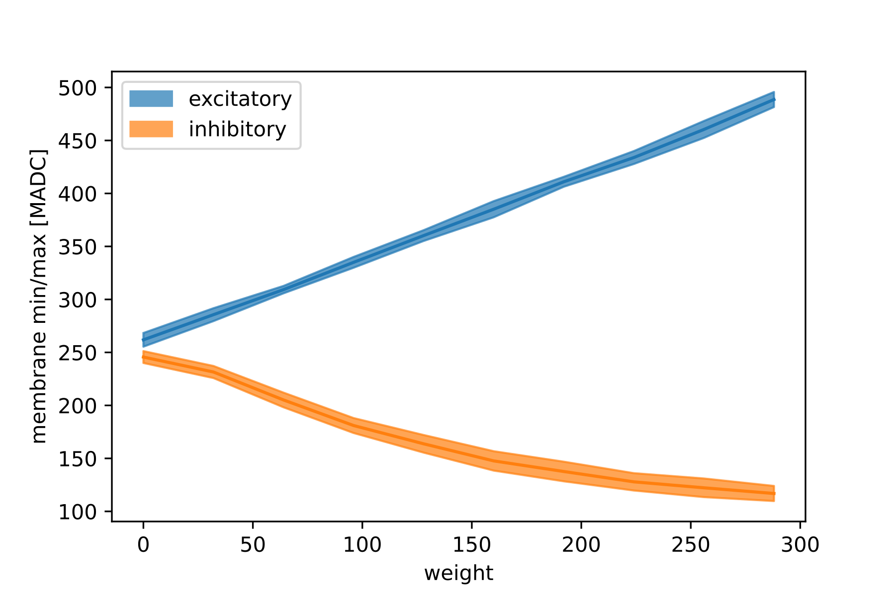

.. _dynamic_range:

Exploring the dynamic range
===========================

In this example we'll explore the dynamic range of synaptic stimulation.

We will

- set up a network using PyNN
- incrementally add more and more synaptic stimulation
- quantify the effect of the synaptic stimulation on the membrane of different neurons for excitatory and inhibitory stimulation

In order to use the microscheduler we have to set some environment variables first:

.. include:: common_quiggeldy_setup.rst

We'll also configure matplotlib and import some tools.

.. code:: ipython3

    %matplotlib inline
    import numpy as np
    import pandas as pd
    import itertools
    import matplotlib.pyplot as plt
    from contextlib import suppress
    with suppress(IOError):
        plt.style.use("_static/matplotlibrc")

    import pynn_brainscales.brainscales2 as pynn

Before we define our network, we load the default calibration.

.. include:: common_nightly_calibration.rst

Define network in PyNN
----------------------

First, we will set up some variables determining the sweep we want to perform.
The maximum weight of a single synapse is 63.
Therefore we will add more projections if we exceed this maximum.

.. code:: ipython3

    neurons = range(0, 512, 64)
    max_weight = 63
    max_number_of_projections = 5
    weights = range(0, max_number_of_projections * max_weight, 32)
    receptor_types = ["inhibitory", "excitatory"]

We will store the results in a dictionary.

.. code:: ipython3

    from collections import defaultdict
    results = defaultdict(list)

We configure the logger to print some output during the run.

.. code:: ipython3

    log = pynn.logger.get("dynamic_range")
    pynn.logger.set_loglevel(log, pynn.logger.LogLevel.INFO)

Next we run the network multiple times with various configurations.

.. code:: ipython3

    from dlens_vx_v3 import hxcomm

    # to speed things up, we keep the connection alive between experiments
    with hxcomm.ManagedConnection() as connection:

        for neuron, receptor_type in itertools.product(neurons, receptor_types):

            # the neuronPerm
            pynn.setup(connection=connection,
                       neuronPermutation=[neuron],
                       initial_config=calib)

            # always have only 1 neuron
            number_of_neurons = 1

            population = pynn.Population(number_of_neurons,
                                         pynn.cells.HXNeuron())

            # disable spiking
            population.set(threshold_enable=False)

            # record the membrane voltage
            population.record("v")

            input_spiketimes = [0.5]
            stimulus = pynn.Population(1,
                                       pynn.cells.SpikeSourceArray(spike_times=input_spiketimes))

            projections = []

            # Adjust weights of existing projections and add new projections if the desired weight
            # exceeds the maximum weight which can currently be implemented.
            for w in weights:

                needed_projections = int(np.ceil(w / max_weight))
                new_projections = needed_projections - len(projections)

                for _ in range(new_projections):
                    proj = pynn.Projection(stimulus,
                                           population,
                                           pynn.AllToAllConnector(),
                                           receptor_type=receptor_type,
                                           synapse_type=pynn.standardmodels.synapses.StaticSynapse(weight=0))
                    projections.append(proj)

                sign = 1 if receptor_type == "excitatory" else -1

                # projections with maximum weight
                for proj in projections[:(w // max_weight)]:
                    proj.set(weight=sign * max_weight)

                # projection with the remaining weight
                if projections:
                    projections[-1].set(weight=sign * (w % max_weight))

                pynn.run(1) # ms (hw)
                membrane = population.get_data().segments[-1].irregularlysampledsignals[0]

                min_membrane = float(membrane[10:].min())
                max_membrane = float(membrane[10:].max())

                results["weight"].append(w)
                results["receptor_type"].append(receptor_type)
                results["neuron"].append(neuron)
                results["membrane_min"].append(min_membrane)
                results["membrane_max"].append(max_membrane)

                log.info(f"{neuron=} {receptor_type=} {w=} "
                         f"{min_membrane=} {max_membrane=}")

                pynn.reset()

            pynn.end()

        log.info("experiment done")

        df = pd.DataFrame.from_dict(results)

        log.info("DataFrame created")

Now, all results are stored in the Pandas DataFrame that we can analyse with the code below.
For the excitatory stimulation we plot the mean of the maximum of the membrane trace and the variance over the neurons.
We do the same for the inhibitory stimulation but take the minimum of the membrane trace this time.

First we aggregate over the neurons and create convience columns for the analysis:

.. code:: ipython3

    def aggregate(df):
        return (df
                .groupby(['receptor_type', 'weight'])
                .agg(**{f"{method}_{col}" : (col, method) for col, method
                                   in itertools.product(["membrane_min", "membrane_max"],
                                                        ['mean', 'std'])})
                .reset_index()
        )
    df_agg = aggregate(df)

Next we define a helper function to plot the variance over the neurons as an error band:

.. code:: ipython3

    def plot_with_errorband(ax, x, y, error, label, color):
        ax.plot(x, y, '-', color=color)
        ax.fill_between(x, y-error, y+error, label=label, color=color, alpha=0.7)

Now we can do the final plot:

.. code:: ipython3

    fig, ax = plt.subplots()

    lookup = {'excitatory_color' : "tab:blue",
              'inhibitory_color' : "tab:orange",
              'excitatory_column' : "membrane_max",
              'inhibitory_column' : "membrane_min"}

    for receptor_type in ['excitatory', 'inhibitory']:

        df_ = df_agg[df_agg.receptor_type==receptor_type]

        color = lookup[f"{receptor_type}_color"]
        column = lookup[f"{receptor_type}_column"]

        plot_with_errorband(ax=ax,
                            x=df_["weight"],
                            y=df_[f"mean_{column}"],
                            error=df_[f"std_{column}"],
                            label=receptor_type,
                            color=color)

    ax.set_xlabel("weight")
    ax.set_ylabel("membrane min/max [MADC]")
    ax.legend()

