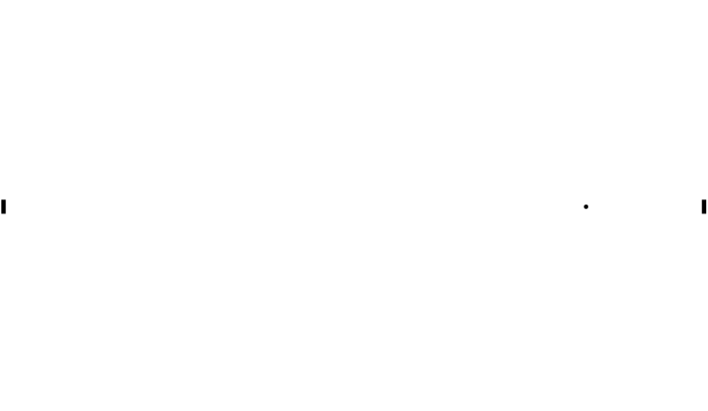
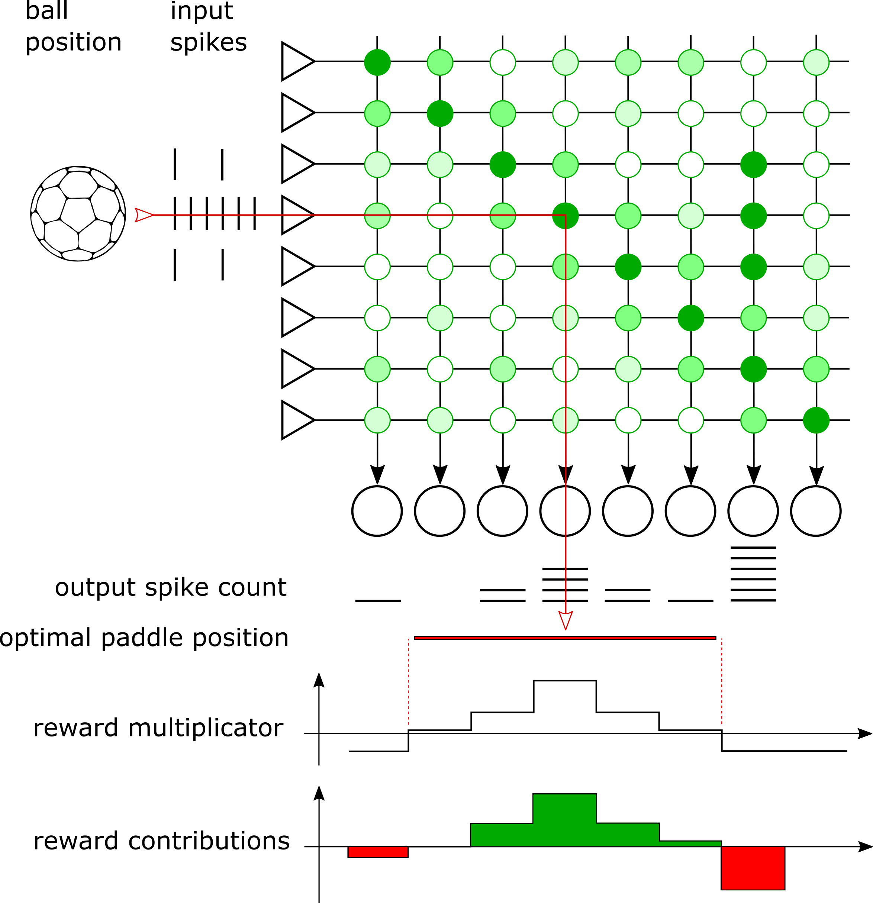
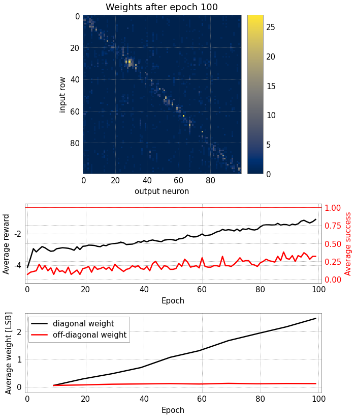
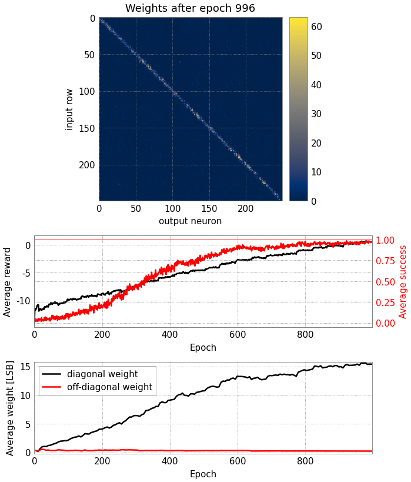

.. code:: ipython3

    %matplotlib inline

    import enum
    from typing import Tuple, Optional
    from dataclasses import dataclass
    import textwrap
    import pickle
    import struct
    import time
    import ipywidgets as widgets
    import IPython.display

    import numpy as np
    import quantities as pq
    import matplotlib
    import matplotlib.pyplot as plt

    from dlens_vx_v3 import halco, hal, sta, lola

    import pynn_brainscales.brainscales2 as pynn

    from _static.common.helpers import save_nightly_calibration
    from _static.tutorial.pong_demo_helpers import Parameters, ExperimentData, PongGame

    from contextlib import suppress
    with suppress(IOError):
        plt.style.use("_static/matplotlibrc")

    # setup shared connection to hardware
    from _static.common.helpers import setup_hardware_client
    setup_hardware_client()

Pong
====

This notebook aims at learning the Pong game. A ball is played between
two players, mimicking table tennis. Each player controls a paddle that
reflects the ball, as shown below. We will train a neural network that
controls the right player.

.. code:: ipython3

    # display a perfectly played pong game - without any neural network so far.
    pong_game = PongGame(demo=True)
    pong_game.run()  # runs a perfect game
    pong_game.animate()



Encoding
~~~~~~~~

BrainScaleS-2 will learn to control one of the paddles to track the
pong ball at all times, thus learning to play the game.
The chip is supplied with the vertical
position of the ball - encoded by a uniform spiketrain to an input
neuron (left column “input spikes” in figure below). A matrix of
excitatory synapses densely connects the input to output neurons (shown
as green dots in figure below, the intensity represents the weight of
the synapse). The paddle moves to the position encoded by the
most-active output neuron (row “output spikes” below the neurons in
figure below). The network does not have a concept of time, it will only
return a paddle position for an input ball position. Thus, we will query
thet network regularly to have the paddle track the ball. Both the ball
and the paddle have a certain size, i.e. the input spikes are
distributed to more than one synapse row and the most-active neuron can
be a bit besides the center of the ball.

The ball and paddle positions are mapped to the synapse matrix linearly,
so a diagonal matrix will be able to play the game perfectly - that is,
as long as the paddle moves quickly with respect to the ball, which we
allow here. In the figure below, we indicate this perfect paddle
position by the red arrow through the synapse matrix. In this example
however, the most-active neuron is outside the paddle size, so the
paddle would move further to the right and would miss the ball.



Learning rule
~~~~~~~~~~~~~

We use reward-modulated spike timing dependent plasticity (R-STDP)
`[Michael and Fairhall,
2007] <https://journals.physiology.org/doi/full/10.1152/jn.00364.2007>`__
to learn the game, as described in the following. This implementation is
close to `Timo Wunderlich et
al. (2019) <https://www.frontiersin.org/articles/10.3389/fnins.2019.00260/full>`__,
but here we do not go as far as implementing the whole pong game on the
chip’s digital microprocessor, we will only execute the learning
algorithm locally on chip. Furthermore, the network now runs on a much
larger synapse matrix, which has required a few changes.

Training is controlled by maximizing a reward. The reward is a metric
for the performance of the player in a given scenario, i.e. the spike
counts per neuron for a certain ball position. Spikes of neurons closer
to the center of the paddle are rewarded more strongly, spikes of neurons
that still result in the ball hitting the paddle increase the
reward only slightly, and spikes outside the width of the paddle
decrease the reward. In the
figure above, we plot the reward multiplicator, which yields positive
rewards only in the region where the paddle should have moved to. And
below that we show the contributions of the individual neurons to the
total reward, which are the product of the spike count and the reward
multiplier.

For each network run, we calculate the instantaneous reward and compare
it to an exponentially weighted expected reward from the previous runs.
The strength of the weight update is scaled with this reward delta,
which can be positive or negative. If the network performs better than
before, the weights will be updated according to the measured
correlation between pre- and postsynaptic spikes (STDP). In case the
network performs worse than before, the weight update is inverted. The
weight update :math:`\Delta w_{ij}` is given by the following learning
rule, where :math:`\beta` is the learning rate, :math:`R` the
instantaneous reward, :math:`\bar{R}` the expected reward from previous
runs, the index :math:`k` denotes the ball position, and
:math:`\text{corr}_{ij}` is the causal correlation observed by each
synapse:

.. math:: \Delta w_{ij} = \beta \cdot (R_k - \bar{R_k}) \cdot \text{corr}_{ij}

During training, we present all possible ball positions once in what we
call an epoch. For all individual ball positions, we apply random noise
to the neurons, implemented as a synapse row with randomly drawn
weights. This allows for exploring all options within the synapse
matrix. The reward and correlation are calculated based on all
postsynaptic spikes, including those injected by noise - so the weights
will increase in case the random noise pattern matches the desired
outcome.

Noise is required for this training algorithm to work, as it allows
exploration in the beginning of the training. During the training, we
linearly decrease the injected noise amplitude. This is implemented as
decreasing the standard deviation of the noise weights, which are drawn
from approximately a normal distribution. In order to have a rather
sparse noise distribution, its mean is shifted to below zero, and all
weights below zero are clipped. During initial training, the output
spikes are mainly generated by noise, while finally, they are mainly
generated by trained weights.

Lastly, at the end of an epoch, we employ a homeostasis rule to control
the total number of spikes. In case a neuron spikes too often within an
epoch, all weights of its column of input synapses will be decreased (or
increased if it spikes not often enough). In the beginning of the
training, we exceed the homeostasis target spike count already as a
result of noise input. This means that only fast-growing weights will be
able to persist initially.

To summarize, within one epoch, we present all possible input ball
positions once. For each ball position, a new set of noise weights is
drawn, the network is run, the weights are updated based on the
reward-modulated STDP rule, and the expected reward is updated with the
newly observed reward. Finally, the homeostasis rule is applied based on
the total spike counts within the epoch.

Implementation
~~~~~~~~~~~~~~

The following code implements this learning rule in PyNN. We send the
spike inputs for an epoch from the host, but handle the learning rule on
the plasticity-processing unit (PPU), locally on the chip. The PPU will
read the spike counters, calculate a reward, compare it to the
previously obtained rewards to get a weight update rate, and update the
weights based on measured causal correlation. Before processing the next
input sample, the PPU draws new random weights for the noise row, and
resets spike counters and correlation data.

Since the PPU handles all training, we train multiple epochs
in one PyNN call. The number of epochs trained in one hardware run is
only limited by the maximum runtime of PyNN. There is no reason to keep
the host computer in the loop, we only read back the updated weights
from the chip after each PyNN run.

In the following cell, we define parameters for the experiment. Feel
free to modify them and explore! The default parameters should learn the
game rather quickly, within some 300 epochs. (After changing parameters,
you need to re-execute all cells in the rest of the notebook, for the
changes to be effective.)

.. code:: ipython3

    # Create an instance of the dataclass `Parameters`, which is used
    # throughout this notebook. The values are set in this cell.
    parameters = Parameters()

    # Number of total epochs, in which noise is reduced from start to end.
    # The notebook will not execute all those by default, we will train
    # only a few hundred epochs at the end.
    parameters.noise_range_epochs = 500

    # Number of input rows.
    parameters.n_inputs = 100

    # Number of output neurons.
    # Fundamentally, the pong task works with an equal number of inputs
    # and outputs. In case you add more outputs, the weights of
    # synapses in the additional columns will remain low.
    parameters.n_outputs = 100

    # Select distribution of input events across multiple rows.
    # In order to not depend on all correlation sensors etc. working
    # perfectly, we distribute the input events across multiple synapse
    # rows. This list contains the relative event rates for further
    # rows. Example: A configuration `input_distribution = [1, 0.7, 0.3]`
    # will send the full rate to the middle row, 0.7 times the full rate
    # to the rows one above and below, and 0.3 times the full rate to the
    # rows two above and below.
    parameters.input_distribution = [1, 0.8, 0.5, 0.1]

    # Number of input events sent to middle ("target") input row.
    parameters.n_events = 140

    # Inter-spike interval for input events in middle input row.
    parameters.wait_between_events = 4.20 * pq.us

    # Inter-spike interval for noise events. The noise is applied for
    # the same time-duration as the inputs.
    parameters.wait_between_noise = 3.5 * pq.us

    # Standard deviation of noise weight distribution. The noise weights
    # are drawn from an approximated normal distribution. The standard
    # deviation is reduced linearly during training, from the configured
    # start to end values.
    parameters.noise_range_start = 15
    parameters.noise_range_end = 4

    # Reward for each neuron depending on the distance from the target
    # neuron. The number of spikes of each neuron is multiplied with the
    # factor given here, and the sum of these products is the reward for
    # an experiment run.
    parameters.rewards = {  # dict key: distance from target; value: reward factor
        0: 4,  # at target neuron
        1: 3,  # 1 left or right of target
        2: 2,  # 2 left or right of target
        3: 2,  # ...
        4: 1,
        5: 1,
        6: 0,
        "elsewhere": -1
        # Reward "elsewhere" must be below 0. All rewards below zero are
        # assumed to have missed the paddle, zero and greater rewards are
        # assumed to have hit the paddle.
    }

    # Learning rate.
    parameters.learning_rate = 0.01

    # Target spikes per column in an epoch for homeostasis.
    parameters.homeostasis_target = 3 * parameters.n_inputs

    # Update rate for homeostasis, in weight LSB.
    parameters.homeostasis_rate = 1. / parameters.homeostasis_target

    # Reward decay: Update rate of average reward in each epoch. The reward
    # is updated with the new, instantaneous reward in each epoch. A high
    # decay means that the average reward closely follows the state in each
    # epoch, a low decay means that the average reward changes only slowly
    # with the new results in each epoch.
    parameters.reward_decay = 0.5

    # Number of epochs that are executed initially without learning, in
    # order to initialize the average reward.
    parameters.reward_initialization_phase = 10

    ### Timing properties - expect broken results when reducing them below the required time!
    # Scheduled time for initialization, such as correlation resets
    parameters.init_duration = 1 * pq.ms

    # Scheduled time for handling plasticity kernel
    # You may need to increase this value when using a higher number of inputs.
    parameters.plasticity_duration = 2.5 * pq.ms

    # Number of epochs executed within one pynn.run() call.
    # Note: learning rate is only updated at compile-time, i.e.
    # will not be updated during the epochs within a PyNN run.
    parameters.epochs_per_run = 10

    # set variables that will be used later in this script
    epoch = 0
    rewards = np.ones(parameters.n_inputs)
    logical_weights = None
    data = ExperimentData(epochs_per_run=parameters.epochs_per_run)

We now define two plasticity rules: ``NoiseSynapseRule`` handles
initialization and draws a new random distribution of noise weights,
while ``PlasticityRule`` handles the reward-modulated STDP learning
rule.

Both plasticity rules are Python classes that generate and return a
``c++`` code snippet that will be compiled and executed on the PPU. For
readability, we print the returned code with ``c++`` syntax highlighting
below the cell.

.. code:: ipython3

    class NoiseSynapseRule(pynn.PlasticityRule):
        """
        Draw a new set of noise weights after each input row, and do further
        initialization tasks.
        """

        def generate_kernel(self) -> str:
            """
            Generate plasticity rule kernel to be compiled into PPU program.

            :return: PPU-code of plasticity-rule kernel as string.
            """
            return textwrap.dedent(f"""
            #include "grenade/vx/ppu/synapse_array_view_handle.h"
            #include "grenade/vx/ppu/neuron_view_handle.h"
            #include "libnux/vx/correlation.h"
            #include "libnux/vx/dls.h"
            #include "libnux/vx/vector_row.h"
            #include "libnux/vx/vector_if.h"
            #include "libnux/vx/parallel_rng.h"
            #include "libnux/vx/reset_neurons.h"
            #include "stadls/vx/v3/ppu/write.h"

            using namespace grenade::vx::ppu;
            using namespace libnux::vx;

            // PPU currently executing this code (top/bottom).
            extern volatile PPUOnDLS ppu;

            /**
             * Initialize the random number generator by selecting a seed
             * and drawing a few random numbers initially.
             */
            class RNGInit
            {{
                public:
                RNGInit()
                {{
                    parallel_rng_seed(VectorRowMod8({np.random.randint(1, 256)}));
                    for (size_t i = 0; i < 234 + {epoch}; ++i)
                        parallel_rng_rand<VectorRowMod8>();
                }}
            }};
            RNGInit rng_init;

            void PLASTICITY_RULE_KERNEL(
                std::array<SynapseArrayViewHandle, 1>& synapses,
                std::array<NeuronViewHandle, 0>& /* neurons */)
            {{
                // only continue if code is executed on the correct PPU
                if (synapses[0].hemisphere != ppu) {{
                    return;
                }}

                // pick a new row of random weights:
                // Use 12 random vectors with a uniform distribution and summarize
                // them as approximation of a normal distribution. After bit-shifting,
                // the sum of the vectors represents a distribution with roughly
                // a mean of -4.5 and a standard deviation of 32.
                VectorRowFracSat16 accumulator;
                for (size_t i = 0; i < 12; ++i)
                {{
                    accumulator += VectorRowFracSat16(
                        parallel_rng_rand<VectorRowFracSat8>() >> 3);
                    // Draw more vectors to avoid summarizing correlated ones:
                    // Draw at least the number of used bits, since we only
                    // get one new random bit per draw
                    for (size_t j = 0; j < 13; ++j)
                        parallel_rng_rand<VectorRowFracSat8>();
                }}
                VectorRowFracSat8 accumulator_8 = VectorRowFracSat8(accumulator - 6);
                VectorRowFracSat8 random = VectorRowFracSat8(
                    accumulator_8 * ({parameters.get_noise_range(epoch)} * 4));

                random = vector_if(
                    random, VectorIfCondition::lesser, VectorRowFracSat8(0), random);
                random = vector_if(
                    random - 63, VectorIfCondition::greater, VectorRowFracSat8(63), random);
                for (size_t row = 0; row < synapses[0].rows.size(); ++row) {{
                    synapses[0].set_weights(VectorRowMod8(random), row);
                }}

                // prepare for next correlation experiment:
                reset_neurons();

                // reset spike counters
                for (size_t i = 0; i < {parameters.n_outputs}; ++i)
                {{
                    auto coord = halco::hicann_dls::vx::v3::AtomicNeuronOnDLS(
                        halco::hicann_dls::vx::v3::NeuronColumnOnDLS(i),
                        halco::hicann_dls::vx::v3::NeuronRowOnDLS()
                    ).toSpikeCounterResetOnDLS();
                    stadls::vx::v3::ppu::write(
                        coord, haldls::vx::v3::SpikeCounterReset());
                }}

                reset_all_correlations();
            }}
            """)

    # create a timer that controls when this plasticity rule is executed
    init_timer = pynn.Timer(
        start=0,
        period=parameters.row_duration.rescale(pq.ms).magnitude,
        num_periods=parameters.n_inputs * parameters.epochs_per_run)

    # print returned PPU kernel code with c++ syntax highlighting
    class DemoRule(NoiseSynapseRule):
        def __init__(self):
            pass

    ppu_code = DemoRule().generate_kernel()
    IPython.display.display_markdown(IPython.display.Markdown(f"``` c++ \n{ppu_code}\n```"))

.. code:: ipython3

    class PlasticityRule(pynn.PlasticityRule):
        """
        Update synapse weights according to STDP learning rule.
        """

        def __init__(self, timer: pynn.Timer, same_id: int):
            """
            Initialize plastic synapse with execution timing information,
            hyperparameters and initial weight.
            """

            observables = {
                "rewards": pynn.PlasticityRule.ObservableArray(),
                "success": pynn.PlasticityRule.ObservableArray()
            }
            observables["rewards"].type = \
                pynn.PlasticityRule.ObservableArray.Type.uint8
            observables["rewards"].size = 4
            observables["success"].type = \
                pynn.PlasticityRule.ObservableArray.Type.uint8
            observables["success"].size = 1

            super().__init__(
                timer=timer, observables=observables, same_id=same_id)

        def generate_kernel(self) -> str:
            """
            Generate plasticity rule kernel to be compiled into PPU program.

            :return: PPU-code of plasticity-rule kernel as string.
            """

            ppucode = textwrap.dedent(f"""
            #include <algorithm>
            #include "grenade/vx/ppu/synapse_array_view_handle.h"
            #include "grenade/vx/ppu/neuron_view_handle.h"
            #include "libnux/vx/correlation.h"
            #include "libnux/vx/dls.h"
            #include "libnux/vx/vector_row.h"
            #include "libnux/vx/vector_if.h"
            #include "libnux/vx/mailbox.h"
            #include "libnux/vx/time.h"
            #include "stadls/vx/v3/ppu/read.h"

            using namespace grenade::vx::ppu;
            using namespace libnux::vx;

            /**
             * PPU currently executing this code (top/bottom).
             */
            extern volatile PPUOnDLS ppu;

            /**
             * Mean rewards, updated exponentially each epoch
             */
            float mean_rewards[{parameters.n_inputs}] = {{
                {", ".join(rewards.astype(str))}
            }};

            /**
             * Baseline reads from correlation sensors, one per column.
             */
            VectorRowMod8 get_baselines()
            {{
                reset_all_correlations();

                VectorRowMod16 accumulator(0);
                for (size_t row = 0; row < 256; ++row)
                {{
                    VectorRowMod8 result;
                    get_causal_correlation(&result.even.data, &result.odd.data, row);
                    accumulator += static_cast<VectorRowMod16>(result);
                }}

                return VectorRowMod8(accumulator >> 8);
            }}
            VectorRowMod8 correlation_baselines = get_baselines();

            /**
             * Accumulated spikes per neuron (per epoch).
             */
            uint16_t all_spikes[{parameters.n_outputs}] = {{
                {", ".join(["0" for _ in range(parameters.n_outputs)])} }};

            /**
             * Currently active input row.
             */
            size_t current_row = 0;

            VectorRowFracSat8 check_boundaries(VectorRowFracSat8 vec)
            {{
                vec = vector_if(
                    vec, VectorIfCondition::greater,
                    vec, VectorRowFracSat8(0));
                vec = vector_if(
                    vec - 63, VectorIfCondition::greater,
                    VectorRowFracSat8(63), vec);

                return vec;
            }}

            void PLASTICITY_RULE_KERNEL(
                std::array<SynapseArrayViewHandle, 1>& synapses,
                std::array<NeuronViewHandle, 0>& /* neurons */,
                Recording& recording)
            {{
                // only continue if code is executed on the correct PPU
                if (synapses[0].hemisphere != ppu) {{
                    return;
                }}

                recording.time = 0;

                // generate reward vector for current row
                int reward_array[{parameters.n_outputs}];
                for (size_t i = 0; i < {parameters.n_outputs}; ++i)
                {{""")

            # generate code for reward vector based on dict in parameters
            first_branch = True
            for key, value in parameters.rewards.items():
                if key == "elsewhere":
                    continue
                branching = "else if" if not first_branch else "if"
                ppucode += textwrap.indent(textwrap.dedent(f"""
                    {branching} ((i == current_row - {key}) || (i == current_row + {key}))
                        reward_array[i] = {value};"""), "\t\t")
                first_branch = False

            ppucode += textwrap.dedent(f"""
                    else
                        reward_array[i] = {parameters.rewards["elsewhere"]};
                }}

                // read out spike counters
                size_t spike_counts[{parameters.n_outputs}];
                for (size_t i = 0; i < {parameters.n_outputs}; ++i)
                {{
                    auto coord = halco::hicann_dls::vx::v3::AtomicNeuronOnDLS(
                        halco::hicann_dls::vx::v3::NeuronColumnOnDLS(i),
                        halco::hicann_dls::vx::v3::NeuronRowOnDLS()
                    ).toSpikeCounterReadOnDLS();
                    haldls::vx::v3::SpikeCounterRead container =
                        stadls::vx::v3::ppu::read<
                        haldls::vx::v3::SpikeCounterRead>(coord);
                    spike_counts[i] = container.get_count();
                    if (current_row > 0)
                        all_spikes[i] += spike_counts[i];
                }}

                // calculate reward and weight update rate
                int accumulator = 0;
                for (size_t i = 0; i < {parameters.n_outputs}; ++i)
                    accumulator += reward_array[i] * spike_counts[i];
                float reward = accumulator / 100.;
                float update_rate = (reward - mean_rewards[current_row])
                    * {parameters.get_learning_rate(epoch)};

                // update weights
                for (size_t row = 0; row < synapses[0].rows.size(); ++row) {{
                    VectorRowMod8 weights = synapses[0].get_weights(row);
                    VectorRowMod8 result;
                    get_causal_correlation(&result.even.data, &result.odd.data, synapses[0].rows[row]);

                    // shift result by 1 bit to stay in signed 8-bit int range
                    VectorRowFracSat8 result_fracsat =
                        (result >> 1).convert_contiguous();
                    VectorRowFracSat8 baselines_fracsat =
                        (correlation_baselines >> 1).convert_contiguous();
                    VectorRowFracSat8 correlation_fracsat =
                        baselines_fracsat - result_fracsat;

                    // multiplication of fracsat type scales down by 128 to
                    // ensure we stay in value range, hence we multiply
                    // the update_rate by 128
                    VectorRowFracSat8 weight_update =
                        correlation_fracsat * static_cast<int8_t>(update_rate * 128);

                    // truncate weight update, i.e. round symetrically to zero:
                    // for negative updates, we want to add 1.
                    weight_update = vector_if(
                        weight_update, VectorIfCondition::lesser,
                        weight_update + 1, weight_update);
                    VectorRowFracSat8 new_weights =
                        static_cast<VectorRowFracSat8>(weights)
                        + weight_update;

                    // clip weights to hardware range limits
                    new_weights = check_boundaries(new_weights);
                    weights = static_cast<VectorRowMod8>(new_weights);

                    synapses[0].set_weights(weights, row);
                }}

                // update mean rewards
                mean_rewards[current_row] =
                    ({1 - parameters.get_reward_decay(epoch)} * mean_rewards[current_row])
                    + ({parameters.get_reward_decay(epoch)} * reward);

                // record mean reward:
                // The float value is casted to a char array to be passed to an
                // observable, since we have no float observables in PyNN yet.
                unsigned char array[4];
                *reinterpret_cast<float*>(array) = mean_rewards[current_row];
                for (size_t i = 0; i < 4; ++i)
                    recording.rewards[i] = array[i];

                // record success
                unsigned int paddle_position =
                    std::max_element(&spike_counts[0],
                                     &spike_counts[{parameters.n_outputs}])
                    - &spike_counts[0];
                if (reward_array[paddle_position] >= 0)
                    recording.success[0] = 1;
                else
                    recording.success[0] = 0;

                // apply homeostasis at end of epoch
                if (current_row == {parameters.n_inputs - 1})
                {{
                    VectorRowFracSat8 update(0);

                    for (size_t column = 0; column < {parameters.n_outputs}; ++column)
                    {{
                        int16_t deviation =
                            {parameters.homeostasis_target} - all_spikes[column];
                        update[column] =
                            deviation * {parameters.homeostasis_rate};
                    }}

                    for (size_t row = 0; row < synapses[0].rows.size(); ++row) {{
                        VectorRowMod8 weights = synapses[0].get_weights(row);
                        VectorRowFracSat8 new_weights =
                            static_cast<VectorRowFracSat8>(weights) + update;

                        new_weights = check_boundaries(new_weights);
                        weights = static_cast<VectorRowMod8>(new_weights);

                        synapses[0].set_weights(weights, row);
                    }}

                    // reset row counter and spike accumulators
                    current_row = 0;
                    for (size_t i = 0; i < {parameters.n_outputs}; ++i)
                        all_spikes[i] = 0;
                }}
                else
                    current_row++;
            }}
            """)

            return ppucode

    # create a timer that controls when this plasticity rule is executed
    plasticity_timer = pynn.Timer(
        start=(parameters.input_duration + parameters.init_duration
               ).rescale(pq.ms).magnitude,
        period=parameters.row_duration.rescale(pq.ms).magnitude,
        num_periods=parameters.n_inputs * parameters.epochs_per_run)

    # print returned PPU kernel code with c++ syntax highlighting
    class DemoRule(PlasticityRule):
        def __init__(self):
            pass

    ppu_code = DemoRule().generate_kernel()
    IPython.display.display_markdown(IPython.display.Markdown(f"``` c++ \n{ppu_code}\n```"))

We will now create all necessary objects for PyNN to handle the
training.

More specifically, we...
* load a calibration for neurons and correlation sensors
* create populations and projections
* create input spiketrains handling multiple desired epochs in one run

.. code:: ipython3

    # download latest calibration
    save_nightly_calibration(
        filename="correlation_calix-native.pkl", source_folder="latest-weekly")

    # load calibration
    with open("correlation_calix-native.pkl", "rb") as calibfile:
        calib_result = pickle.load(calibfile)

    # The correlation voltages are set on the board and therefore
    # are not contained in lola.Chip(), so we inject them as a builder
    injected_config = pynn.InjectedConfiguration()
    calib_builder = sta.PlaybackProgramBuilder()
    calib_result.apply(calib_builder)
    injected_config.pre_static_config = calib_builder

    calib_dumper = sta.PlaybackProgramBuilderDumper()
    calib_result.apply(calib_dumper)
    calib_dumper = calib_dumper.done()
    calib = sta.convert_to_chip(calib_dumper, lola.Chip())

    # disable neuron readout to CADC (observe correlation instead)
    for cadc_config in calib.cadc_readout_chains:
        for channels in [cadc_config.channels_causal,
                         cadc_config.channels_acausal]:
            for channel_config in channels:
                channel_config.enable_connect_neuron = False

    injected_readout = pynn.InjectedReadout()
    injected_readout.post_realtime.add(halco.SynramOnDLS())

    pynn_config = {"initial_config": calib,
                   "injected_config": injected_config,
                   "injected_readout": injected_readout}

.. code:: ipython3

    # generate input spiketrains:
    # spiketrain for noise row
    single_spiketrain_noise = np.arange(
        parameters.init_duration.rescale(pq.ms).magnitude,
        (parameters.init_duration + parameters.input_duration
         ).rescale(pq.ms).magnitude,
        parameters.wait_between_noise.rescale(pq.ms).magnitude)
    spiketrains_noise = [
        np.concatenate([
            single_spiketrain_noise
            + i * parameters.row_duration.rescale(pq.ms).magnitude
            for i in range(parameters.n_inputs * parameters.epochs_per_run)])]

    # spiketrain for each (target) input row
    spiketrains_per_input = []
    for input_row in range(parameters.n_inputs):
        input_spikes = []
        for row in range(parameters.n_inputs):
            try:
                wait_between_events = parameters.wait_between_events \
                    / parameters.input_distribution[np.abs(row - input_row)]
                input_spikes.append(np.arange(
                    0,
                    parameters.input_duration.rescale(pq.ms).magnitude,
                    wait_between_events.rescale(pq.ms).magnitude))
            except IndexError:
                input_spikes.append(np.array([]))
        spiketrains_per_input.append(input_spikes)

    # shift spiketrains to appropriate start time, concatenate them
    spiketrains_per_epoch = []
    for row in range(parameters.n_inputs):
        input_spikes = [
            spiketrains_per_input[i][row]
            + i * parameters.row_duration.rescale(pq.ms).magnitude
            + parameters.init_duration.rescale(pq.ms).magnitude
            for i in range(parameters.n_inputs)]
        spiketrains_per_epoch.append(np.concatenate(input_spikes))

    # repeat spiketrains for multiple epochs
    spiketrains_multiple_epochs = []
    for row in range(parameters.n_inputs):
        input_spikes = [
            spiketrains_per_epoch[row]
            + i * parameters.epoch_duration.rescale(pq.ms).magnitude
            for i in range(parameters.epochs_per_run)]
        spiketrains_multiple_epochs.append(np.concatenate(input_spikes))

We’re now ready to start training. Executing the following cell will
train 100 epochs (default). This will take a few minutes. You can re-run
that cell (or select more epochs per cell execution) as long as you
desire and the training should yield better and better results. After
some 2000 epochs, the learned diagonal matrix will result in an (almost)
perfect pong game. But even after a few hundred epochs, you should be
able to observe an onset of the diagonal in the weights.

.. code:: ipython3

    # select the number of epochs to train when executing the next cell:
    N_EPOCHS_TO_TRAIN = 100

.. code-block:: ipython3
   :class: test, html-display-none

   N_EPOCHS_TO_TRAIN = parameters.epochs_per_run

.. code:: ipython3

    # initialize PyNN
    pynn.setup(**pynn_config)

    # setup input and output populations and projections
    pop_output = pynn.Population(
        parameters.n_outputs, pynn.cells.HXNeuron())
    pop_input = pynn.Population(
        parameters.n_inputs, pynn.cells.SpikeSourceArray(spike_times=spiketrains_multiple_epochs))
    pop_noise = pynn.Population(
        1, pynn.cells.SpikeSourceArray(spike_times=spiketrains_noise))

    synapses = pynn.standardmodels.synapses.PlasticSynapse(
        plasticity_rule=PlasticityRule(timer=plasticity_timer, same_id=0),
        weight=logical_weights if logical_weights is not None
        else np.ones((parameters.n_inputs, parameters.n_outputs), dtype=int))
    projection = pynn.Projection(
        pop_input, pop_output, pynn.AllToAllConnector(),
        synapse_type=synapses, receptor_type="excitatory")

    synapses_noise = pynn.standardmodels.synapses.PlasticSynapse(
        plasticity_rule=NoiseSynapseRule(timer=init_timer, same_id=1),
        weight=63)
    projection_noise = pynn.Projection(
        pop_noise, pop_output, pynn.AllToAllConnector(),
        synapse_type=synapses_noise, receptor_type="excitatory")

    output = widgets.Output()
    display(output)

    for epoch_id in range(N_EPOCHS_TO_TRAIN // parameters.epochs_per_run):
        epoch = data.n_epochs_trained
        if epoch >= parameters.noise_range_epochs:
            print("Training finished!")
            plot_data = data.generate_plot(logical_weights)
            plt.close()
            output.clear_output(wait=True)
            with output:
                data.update_plot(plot_data, logical_weights)
            break

        pynn.run(parameters.epoch_duration.rescale(pq.ms).magnitude
                 * parameters.epochs_per_run)

        # look up routing:
        # The order of placed input rows on chip differs from the logical
        # order of inputs. When looking at the weights read back from
        # hardware, we need to adjust to the order of placed connections.
        # We fill the array `routing` to contain the placed coordinate
        # for each logical connection, based on the data from PyNN.
        if epoch == 0:
            connections = projection.connections
            placed_connections = projection.placed_connections
            routing = np.empty(
                (parameters.n_inputs, parameters.n_outputs, 2), dtype=int)
            for index, _ in enumerate(connections):
                routing[connections[index].pop_pre_index,
                        connections[index].pop_post_index] = \
                    np.array([placed_connections[index][0].synapse_row,
                              placed_connections[index][0].synapse_on_row])

        post_realtime_reads = pynn.get_post_realtime_read()
        weights = post_realtime_reads[halco.SynramOnDLS()].weights.to_numpy()

        for run_epoch in range(parameters.epochs_per_run):
            rewards = np.empty(parameters.n_inputs)
            success = np.empty(parameters.n_inputs, dtype=bool)
            for row in range(parameters.n_inputs):
                # extract rewards and success from recording
                data_index = row + parameters.n_inputs * run_epoch
                success[row] = synapses.plasticity_rule.get_observable_array(
                    "success")[0][data_index].data[0]

                # The reward was saved as a char array and needs to be
                # converted back to a float:
                raw_data = synapses.plasticity_rule.get_observable_array(
                    "rewards")[0][data_index].data
                packed_data = struct.pack("4B", *raw_data[:4][::-1])
                rewards[row] = struct.unpack("f", packed_data)[0]

            data.reward_archive.append(rewards)
            data.success_archive.append(success)

        logical_weights = weights[routing[:, :, 0], routing[:, :, 1]]
        data.mean_diagonal_weight.append(
            np.mean(logical_weights[parameters.diagonal_entries()]))
        data.mean_off_diagonal_weight.append(
            np.mean(logical_weights[parameters.off_diagonal_entries()]))

        projection.set(weight=logical_weights)

        if epoch_id == 0:
            with output:
                plot_data = data.generate_plot(logical_weights)
                plt.close()
        output.clear_output(wait=True)
        with output:
            data.update_plot(plot_data, logical_weights)

        pynn.reset()

    pynn.end()

In the plot above, a diagonal matrix should be visible after rougly a
hundred epochs of training. Also, the success (red), indicating the
performance of the network in the Pong game, should start to increase
slightly.

Now that the network has trained a bit, we can use the trained weights
for an actual game of pong. The left player is controlled by an ideal
weight matrix on a second set of hardware neurons, while the right
player uses the weights trained above. To keep the animation fluent, the
game is run in advance and animated only later, in a separate cell, so
you can replay the same game multiple times.

The performance of the agent on the right may be better than the
accuracy reported above, since we don’t add any noise here - but need
the noise during traing to enable exploration. Still, after 100 epochs,
the right player will lose the game rather quickly, and after some 300
epochs, it will play for quite some time, possibly reaching the end of
the pre-computed game (where we report the game ended in a tie).

You can switch between training and animation as you like.

.. code:: ipython3

    # initialize a new pong game - this clears the scores!
    pong_game = PongGame(
        parameters=parameters, pynn_config=pynn_config,
        spiketrains_per_input=spiketrains_per_input)



.. code:: ipython3

    # run a pong game using the weights trained above. This takes a few seconds since we run it on chip.
    pong_game.run(learned_weights=logical_weights)

.. code:: ipython3

    # Display the animation of the game - re-executing will replay the same game.
    if len(pong_game.spiketrains_per_input) == 0:
        raise AssertionError("In order to run the game on chip, please run the two cells above!")
    else:
        pong_game.animate()

Finally, we want to show you that this setup is capable of training even
a larger matrix with smaller paddles - a more difficult task than with the
default parameters above. Here, we need to train longer, and training for
about 1000 epochs takes around an hour - hence we provide a plot of that here.
But feel free to tweak a few of the parameters (defined at the start of
the notebook), and continue training the network after the tutorial!
This plot was generated using the unmodified
``parameters = Parameters()``, i.e. without the adjustments in the
default notebook.



Credits
~~~~~~~

The notebook was developed in the Electronic Vision(s) group in 2023.
The main author is Johannes Weis.
