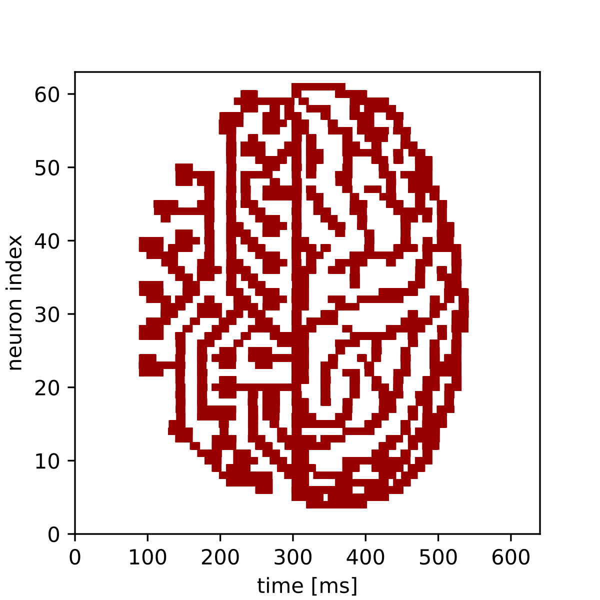

Demonstration of inside realtime hook
=====================================

This modification of the :doc:`plasticity experiment <ts_02-plasticity_rate_coding>` showcases a use
of the AbsoluteTimePlaybackProgramBuilder (ATPPB) in constructing an experiment as an experienced
user of BrainScaleS-2. The ATPPB is a tool for queueing command sequences, which are to be executed
in the experiment. It distinguishes itself from the PlaybackProgramBuilder (PPB), a lower level
command scheduler, through maintaining an absolute time order over all listed commands. This allows
identifying each command with a certain point in time, which is required for mergeing two separate
command-queues of an AbsoluteTimePlaybackProgramBuilder.
This enables a user to add arbitrary commands, e.g. commands for changing some synaptic weights, to
the output of the automatic spike generator and merge them to one singular command queue, which
then can be executed as the "inside realtime section", i.e. the main part of the experiment.

.. code:: ipython3

    %matplotlib inline
    from os.path import join
    import numpy as np
    import matplotlib.pyplot as plt

    import pynn_brainscales.brainscales2 as pynn
    from dlens_vx_v3 import hal, lola, halco, sta

    # setup shared connection to hardware
    from _static.common.helpers import setup_hardware_client
    setup_hardware_client()

The Experiment
--------------

The goal of this experiment is to take a picture as an input, adjust the weights of some specific
synapses to match the pixel values, and send spike-trains through these synapses, so that the
according neurons can detect these pixel values again and we can use the measured data in the end,
to recreate the image.
For this example, we used the 64 x 64 Pixel "visions.png" image:

Therefore we read in the pixel values of the image as the first step of our program:

.. code:: ipython3

    def read_image(path: str) -> np.array:
        """
        Read image from file and scale it to the weight range.
        :param path: Path to image file
        :return: Image data as numpy array normalised to hardware weight range
        """
        image = np.asarray(plt.imread(path))
        # Scale to weight range [0, 63]
        image = image / image.max() * hal.SynapseWeightQuad.Value.max
        return image

    # Read image into 2d numpy array
    image = read_image(join("_static", "tutorial", "visions.png"))

Setup of the Experiment
-----------------------

We now have a 2d numpy array ``image`` that has the (scalar) pixel values of our black-and-white
image. Before we can assign these values to the according synapses, we need to declare our
AbsoluteTimePlaybackProgramBuilder instance, where we later want to write the weight changing
commands to. Also we can directly inject it into the inside real time section, even before writing
the commands to it.

.. code:: ipython3

    # Initialize AbsoluteTimePlaybackProgramBuilder for queueing the synapse weight commands
    builder = sta.AbsoluteTimePlaybackProgramBuilder()

    # Inject it into the inside realtime section of the program
    configuration = pynn.InjectedConfiguration()
    configuration.inside_realtime = builder
    pynn.setup(enable_neuron_bypass=True, injected_config = configuration)

In order to make sure, that the synaptic weights directly translate to the intensity of the measured
signal by a neuron, we need a continuous highly frequent spike train as an input:

.. code:: ipython3

    # Specify spike train as input for our synapses
    bg_props = dict(
        start=0,  # ms
        rate=4000,  # Hz
        duration=640  # ms
    )
    external_input = pynn.Population(64, pynn.cells.SpikeSourcePoisson(**bg_props))

To define our configuration of 64 neurons, each getting input from only one synapse, we construct a
population of 64 neurons and a one-to-one projection from the external input to the recording
neurons.

.. code:: ipython3

    # Configure population and projection
    neurons = pynn.Population(64, pynn.cells.HXNeuron())
    neurons.record(["spikes"])

    synapse = pynn.standardmodels.synapses.StaticSynapse(weight=0)
    projection = pynn.Projection(external_input,
                    neurons,
                    pynn.OneToOneConnector(),
                    synapse_type=synapse)

    # Finish configuration
    pynn.preprocess()

Construction of the inside realtime hook
----------------------------------------

The only thing now left to do is to change the weights of the right synapses to the right values at
the right times. For that we need to get the coordinates of the synapses, which were assigned for
the projection to know the weights of which synapses we actually need to change:

.. code:: ipython3

    synapse_coordinates = projection.placed_connections

The plan is now to take the picture column by column and have our 64 synapse weights taking the 64
pixel values of each column. Because we have 64 columns and also scheduled the ``external_input``
of spikes to last 640ms, we want to change the spike weights 64 times every 10ms, so we get a long
enough time for the signal to be correctly measured by the neurons.
For each of these columns we construct a ``lola.SynapseWeightRow()`` container, in which we fill in
the pixel values of the whole column and write it all with one construction to the according
synapses.

.. code:: ipython3

    for j in range(64):
        row_values = lola.SynapseWeightRow()
        for i,coordinate in enumerate(synapse_coordinates):
            row_values.values[coordinate[0].synapse_on_row] = int(image[-i,j])
        builder.write(hal.Timer.Value(j*int(hal.Timer.Value.fpga_clock_cycles_per_us)*10000),
            coordinate[0].synapse_row.toSynapseWeightRowOnDLS(), row_values)

Execution and evaluation
------------------------

Finally, we can run our experiment and read out the results into a list and plot our received
picture:

.. code:: ipython3

    pynn.run(640) # ms

    #read out results
    spikes = neurons.get_data("spikes").segments[0]
    spiketrains = []
    for spiketrain in spikes.spiketrains:
        spiketrains.append(spiketrain.base)

    #plot results
    fig = plt.gcf()
    fig.set_size_inches(4, 4)

    plt.eventplot(spiketrains, color='#990000')
    plt.xlim(0,640)
    plt.ylim(0,63)
    plt.xlabel("time [ms]")
    plt.ylabel("neuron index")
    fig.show()

And that's our final result:

