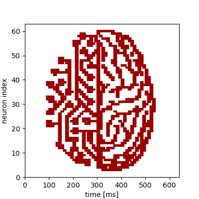

Demonstration of multiple chip-reconfigurations during an experiment
====================================================================

This modification of the :doc:`plasticity experiment <ts_02-plasticity_rate_coding>` showcases the
dynamic reconfiguration of the chip by using the new append functionality of pynn.brainscales. This
example only changes synaptic weights during the experiment, but any arbitrary changes to the chip
configuration can be applied this way.

.. code:: ipython3

    %matplotlib inline
    from os.path import join
    import numpy as np
    import matplotlib.pyplot as plt
    import pynn_brainscales.brainscales2 as pynn
    from dlens_vx_v3 import hal

    # setup shared connection to hardware
    from _static.common.helpers import setup_hardware_client
    setup_hardware_client()

The Experiment
--------------

The goal of this experiment is to take a picture as an input, adjust the weights of some specific
synapses to match the pixel values, and send spike-trains through these synapses, so that the
according neurons can detect these pixel values again and we can use the measured data in the end,
to recreate the image.
For this example, we used the 64 x 64 Pixel "visions.png" image:

.. image:: _static/tutorial/visions.png
    :width: 30%
    :align: center

Therefore we read in the pixel values of the image as the first step of our program:

.. code:: ipython3

    def read_image(path: str) -> np.array:
        """
        Read image from file and scale it to the weight range.
        :param path: Path to image file
        :return: Image data as numpy array normalised to hardware weight range
        """
        image = np.asarray(plt.imread(path))
        # Scale to weight range [0, 63]
        image = image / image.max() * hal.SynapseWeightQuad.Value.max
        return np.flipud(image).T

    # Read image into 2d numpy array
    image = read_image(join("_static", "tutorial", "visions.png"))

Setup of the Experiment
-----------------------

We now have a 2d numpy array ``image`` that has the (scalar) pixel values of our black-and-white
image. Our network consists of two populations: An input population of one neuron, that feeds the
input spikes into the synapse array and a recording population of 64 neurons.
The projection projects the signal of the input neuron with an ``AllToAllConnector`` to all 64
recording neurons across individual synapses, the weights of which can be modified according to the
pixel values of the picture throughout the experiment. The input neuron will send 100 spikes onto
the chip, linearly spaced in time over the duration of our runtime, which is 10ms.
To ensure, that our recording neurons spike when receiving input spikes, we pass the argument
``enable_neuron_bypass=True`` when setting up our simulator object with ``pynn.setup()``.

.. code:: ipython3

    pynn.setup(enable_neuron_bypass=True)

    runtime = 10  # runtime per configuration in ms
    n_spikes = 100
    spikes = np.linspace(0, runtime, n_spikes)

    input_population = pynn.Population(1, pynn.cells.SpikeSourceArray(spike_times = spikes))
    recording_population = pynn.Population(64, pynn.cells.HXNeuron())
    recording_population.record('spikes')

    synapse = pynn.standardmodels.synapses.StaticSynapse(weight=32)
    projection = pynn.Projection(input_population,
                    recording_population,
                    pynn.AllToAllConnector(),
                    receptor_type="excitatory",
                    synapse_type=synapse)

Reconfiguration and Execution
-----------------------------

We want to reconfigure our projection every 10ms to represent the weights of the next row of our
image. In order to do this, we iterate over all rows of our image and set the synapse weights
accordingly inside the loop followed by a call of ``pynn.run()`` with the append command, which
appends a new snippet with the current configuration and a duration of ``runtime`` to the
experiment. After we have scheduled our complete experiment, we call ``pynn.run()`` with the
execute command to trigger the execution of the experiment on hardware. In the performed hardware
run, all our staged configurations are being executed one after another for the given runtime each.

.. code:: ipython3

    for i in range(64):
        projection.set(weight=image[i])
        # Append a snippet of duration 'runtime' with the currently described network configuration
        # to the experiment
        pynn.run(runtime, pynn.RunCommand.APPEND)

    # Trigger the execution of a hardware run without scheduling another snippet
    pynn.run(None, pynn.RunCommand.EXECUTE)

Evaluation
----------

We firstly retrieve all recorded spiketrains from the ``recording_population``. These are 64*64 in
total, because we get one per neuron per snippet. However, all spiketrains of each neuron, according
to the different realtime snippets, are ordered by the number of the realtime snippets, i.e. by
time.
In order to plot our result, we need one continuous spiketrain per neuron. Therefore, we need to
filter the returned list of spiketrains by the neuron index, i.e. the cell id and concatenate the
times of all spiketrains belonging to the same neuron.
By showing now the times, where we a spike was recorded for each neuron, we should get the image
from the beginning again.

.. code:: ipython3

    #read out results
    spiketrains = recording_population.get_data('spikes').segments[0].spiketrains
    spiketrains_concatenated = [ [] for _ in range(64) ]
    for spiketrain in spiketrains:
        spiketrains_concatenated[spiketrain.annotations["source_id"]-1].extend(spiketrain.times)

.. code:: ipython3

     #plot results
     fig = plt.gcf()
     fig.set_size_inches(4, 4)

     plt.eventplot(spiketrains_concatenated, color='#990000')
     plt.xlim(0,640)
     plt.ylim(0,63)
     plt.xlabel("time [ms]")
     plt.ylabel("neuron index")
     fig.show()

We see a replicated version of the original image encoded in the time evolution of
the neurons' firing rates.

