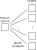
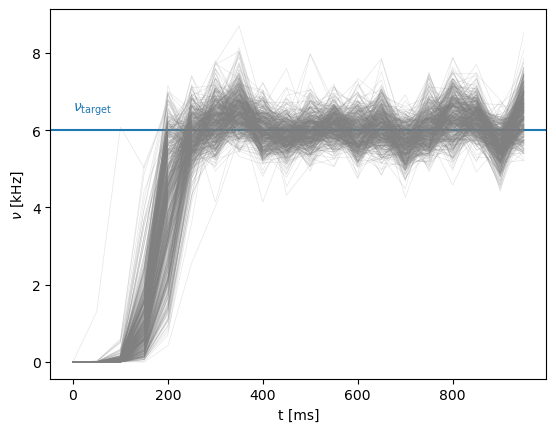
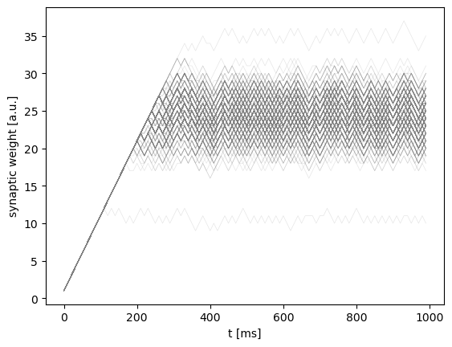

BrainScaleS-2 on-chip plasticity experiment
===========================================

In this tutorial we will show how to define a custom plasticity rule and how to execute it during run-time on the BrainScaleS-2 system.
In addition to the analog neural network core, BrainScaleS-2 features two embedded general-purpose processors, called PPUs (Plasticity Processing Units).
They can be used for experiment control and alterations of configuration during the run-time of an experiment.
This example makes use of this feature by show-casing synaptic plasticity for a simple homeostatic rule stabilizing the firing frequency of neurons.

.. code:: ipython3

    %matplotlib inline
    from os.path import join
    import numpy as np
    import matplotlib.pyplot as plt
    import pynn_brainscales.brainscales2 as pynn
    from dlens_vx_v3 import hal, lola, halco, sta

.. include:: common_quiggeldy_setup.rst

We initialize the system using a nightly-generated default calibration for the neurons.

.. include:: common_nightly_calibration.rst

.. code:: ipython3

    pynn.setup(initial_config=calib)

The network
-----------

Our network topology looks like follows:

Our network consists of one Poisson source and a number of target neurons.
The Poisson stimulus is generated with a constant rate.

.. code:: ipython3

    runtime = 1000.  # ms

    bg_props = dict(
        seed=1234,
        rate=120e3,  # Hz
    )
    poisson_input = pynn.Population(1, pynn.cells.SpikeSourcePoissonOnChip(**bg_props))

We now want to use local plasticity to tune the weights between the Poisson source and the target neurons for them to stabilize around a target firing rate.
The weights are updated according to:

.. math::  \Delta w = \mathrm{sign}\left(\nu_\mathrm{target} - \nu \right)

Controlling the on-chip plasticity processor
--------------------------------------------

During the experiment, the PPUs execute an earliest-deadline-first scheduler for tasks to be performed.
It periodically fetches new tasks to be performed and executes the task with the earliest deadline first.
In PyNN, execution of a plasticity rule is such a task.
A plasticity rule is applied onto a projection or population via the synapse type or the cell type respectively.
The plasticity rule features a method yielding C++-code to be executed as a task on the PPU.
Tasks can be executed periodically, for which a timer object is to be supplied.

The plasticity kernel
---------------------

We now define the plasticity rule type with the C++-code which stabilizes the neurons' firing rate by alteration of the synaptic weights.
We need the neurons' firing rate as observables in the plasticity rule function.
Therefore, we require the rule to operate on both the synaptic weights as well as the target neurons.
The entry point of the plasticity task is called ``PLASTICITY_RULE_KERNEL`` and is supplied with information about the synapse and neuron locations.
This information corresponds to the projections and populations in PyNN.

Within the task function, the program accesses synaptic weights row-wise via ``set_weights(weight_values, row)`` and ``get_weights(row)``.
The neurons' firing rates are accessed via ``get_rate_counters(reset)``.
The task, which corresponds to the execution of the plasticity rule, is scheduled periodically.
Over time, this leads to the a stabilization of  the neurons' firing rate.

.. code:: ipython3

    import textwrap

    class PlasticityRule(pynn.PlasticityRule):
        def __init__(self, timer: pynn.Timer, target: int):
            """
            :param timer: Timing information for the execution of the rule
            :param target: Target firing rate of the neurons in number of spikes per execution
                           period
            """
            observables = {
                "w": pynn.PlasticityRule.ObservablePerSynapse(
                    pynn.PlasticityRule.ObservablePerSynapse.Type.uint8,
                    pynn.PlasticityRule.ObservablePerSynapse.LayoutPerRow.packed_active_columns)
            }

            pynn.PlasticityRule.__init__(self, timer, observables)
            if target < 0 or target > 256:
                raise ValueError("The target factor must be in [0, 256).")
            self._target = target

        def _set_target(self, new_target):
            if new_target < 0 or new_target > 256:
                raise ValueError("The target factor must be in [0, 256).")
            self._target = new_target
            # needed for differential updates of the experiment description
            self.changed_since_last_run = True

        def _get_target(self):
            return self._target

        target = property(_get_target, _set_target)

        def generate_kernel(self) -> str:
            """
            Generate plasticity rule kernel to be compiled into PPU program.

            :return: PPU-code of plasticity-rule kernel as string.
            """
            return textwrap.dedent("""
            #include "grenade/vx/ppu/synapse_array_view_handle.h"
            #include "grenade/vx/ppu/neuron_view_handle.h"
            #include "grenade/vx/ppu/time.h"
            #include "libnux/vx/vector_if.h"
            #include "hate/tuple.h"

            using namespace grenade::vx::ppu;
            using namespace libnux::vx;
            extern volatile PPUOnDLS ppu;

            /**
             * Get the sign for each entry of a SIMD vector row (with 256 elements, one for each
             * neuron column).
             * We use signed fractional saturating SIMD arithmetics to express the sign.
             */
            VectorRowFracSat8 sign(VectorRowFracSat8 const& value)
            {{
                // (value == 0) ? 0 : ((value >= 0) ? 1 : -1);
                // vector_if applies a conditional selection for each SIMD vector entry
                return vector_if(
                    value,
                    VectorIfCondition::equal,
                    VectorRowFracSat8(0),
                    vector_if(
                        value,
                        VectorIfCondition::greater_equal,
                        VectorRowFracSat8(1),
                        VectorRowFracSat8(-1)));
            }}

            /**
             * The plasticity rule function, which will be invoked at the requested times during the
             * experiment.
             *
             * @tparam N Number of handles to synapses of the projection and neurons of the
             *           population. The handles contain all synapses or neurons, which reside on
             *           one hemisphere of the chip, therefore these can here be one or two.
             */
            template <size_t N>
            void PLASTICITY_RULE_KERNEL(
                std::array<SynapseArrayViewHandle, N>& synapses,
                std::array<NeuronViewHandle, N>& neurons,
                Recording& recording)
            {{
                // record the current time of the experiment
                recording.time = now();

                // for each part (synapses placed on the top or bottom hemisphere of the chip)
                // of the projection perform the plasticity update
                hate::for_each(
                    [&ppu](SynapseArrayViewHandle const& local_synapses,
                        NeuronViewHandle& local_neurons,
                        auto& local_recording_w) {{
                        // Both PPUs execute the same code, we therefore check that we only apply
                        // weight updates to the hemisphere/PPU-local synapses
                        if (local_synapses.hemisphere != ppu) {{
                            return;
                        }}

                        // get the number of spikes for each neuron in the population residing on
                        // this hemisphere since the last rule execution (and reset the counter)
                        auto const neuron_counters = local_neurons.get_rate_counters(true);

                        // iterate over all synapse rows, which contain plastic synapses:
                        //  - get the weights
                        //  - calculate weight update
                        //  - set updated weights
                        //  - record current weight values
                        for (size_t j = 0; j < local_synapses.rows.size(); ++j) {{
                            auto weights = static_cast<VectorRowFracSat8>(local_synapses.get_weights(j));

                            weights += sign(
                                VectorRowFracSat8({target})
                                - static_cast<VectorRowFracSat8>(neuron_counters));

                            // ensure positive weight
                            // (weights > 0) ? weights : 0
                            weights = vector_if(
                                weights,
                                VectorIfCondition::greater,
                                weights,
                                VectorRowFracSat8(0));

                            // ensure weight in hardware range
                            // (weights > 63) ? 63 : weights
                            weights = vector_if(
                                weights -63,
                                VectorIfCondition::greater,
                                VectorRowFracSat8(63),
                                weights);

                            local_synapses.set_weights(static_cast<VectorRowMod8>(weights), j);

                            for (size_t c = 0; c < local_synapses.columns.size(); ++c) {{
                                local_recording_w[j][c] = weights[local_synapses.columns[c]];
                            }}
                        }}
                    }}, synapses, neurons, recording.w);
            }}
            """.format(target=self._target))

The experiment
--------------

We have already constructed the Poisson source.
We now construct the plasticity rule with a target firing rate.

.. code:: ipython3

    # plasticity execution timing
    period = 10.  # ms
    timer = pynn.Timer(
        start=0., # ms
        period=period,
        num_periods=int(runtime / period))

    target_rate = 6.  # kHz

    plasticity_rule = PlasticityRule(timer=timer, target=target_rate * period)

The target population consists of ``num_neurons`` neurons, of which spikes are recorded.
The plasticity rule is supplied as an argument to the celltype, which is an argument to the initialized neuron population.
This allows to define a neuron population that is accessible to the plasticity rule under consideration and therefore to access these neurons' firing rates.

.. code:: ipython3

    num_neurons = 512
    neurons = pynn.Population(num_neurons, pynn.cells.HXNeuron(plasticity_rule=plasticity_rule))
    neurons.record(["spikes"])

A all-to-all connector is used as a projection between the Poisson stimulus and the target neurons.
Initially the weights are set to zero, the PPU will alter them during the experiment.

.. code:: ipython3

    synapse = pynn.standardmodels.synapses.PlasticSynapse(
        plasticity_rule=plasticity_rule, weight=0)

    projection = pynn.Projection(poisson_input,
                    neurons,
                    pynn.AllToAllConnector(),
                    synapse_type=synapse)

We run the experiment for 1000 ms, during which we expect a plasticity execution every 10 ms
leading to convergence of the neurons firing rates towards the target rate.

.. code:: ipython3

    pynn.run(runtime)

To plot the neurons' firing rate, we count spikes in bins:

.. code:: ipython3

    import neo

    def calculate_firing_rates(spikes: neo.SpikeTrain, runtime: float, bins: int = 100) -> np.array:
        """
        Get the neurons' firing rates by counting spikes in time intervals.

        :param spikes: Spikes of the neurons
        :param runtime: Total experiment runtime in ms
        :param bins: Number of bins to divide runtime into
        :return: Firing rate of neurons in each bin across the runtime and left limits of the bins.
        """
        counts, times = np.histogram(spikes, bins=bins, range=[0., runtime])
        return counts * (bins / runtime), times[:-1]

We visualize the recorded spike-trains.
The neurons' firing rates converge towards the target firing rate.

.. code:: ipython3

    # Plot data
    plt.figure()
    plt.xlabel("t [ms]")
    plt.ylabel("$\\nu$ [kHz]")
    plt.axhline(target_rate)
    plt.text(0, target_rate + 0.5, "$\\nu_\\mathrm{target}$", color="C0")

    for spikes in neurons.get_data("spikes").segments[0].spiketrains:
        nus, times = calculate_firing_rates(spikes, runtime, 20)
        plt.plot(times, nus, color="gray", alpha=0.2, lw=0.5)

    plt.show()

Last, we visualize the synaptic weights, which were recorded as observables of the plasticity rule.
The weights are altered such that the neurons' firing rate approaches the target firing rate.
Since the update rule uses the `sign` function, the weights are always either increased or decreased in each update step and therefore oscillating.

.. code:: ipython3

    # get batch entry 0 here, currently in PyNN we don't support batch size larger one
    weights = projection.get_data("w")[0]
    weight_times = []
    weight_values = []
    for i in range(len(weights)):
        # times are not yet converted to ms, but are given in FPGA clock cycles (with 125MHz clock)
        weight_times.append(weights[i].time.value() / 125 / 1000)
        weight_values.append(weights[i].data)
    weight_times = np.array(weight_times)
    weight_values = np.array(weight_values).squeeze()

    plt.plot(weight_times, weight_values, color="gray", alpha=0.2, lw=0.5)
    plt.ylabel("synaptic weight [a.u.]")
    plt.xlabel("t [ms]")

    plt.show()

