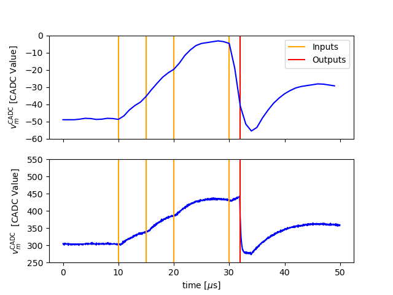
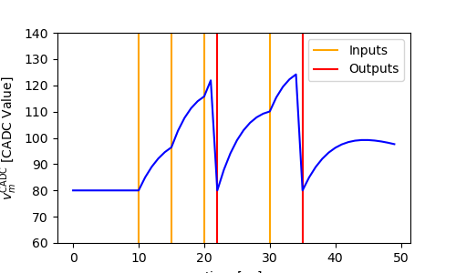
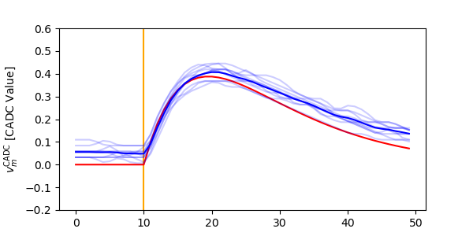
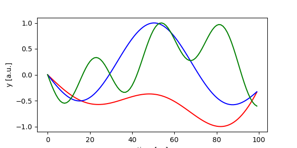
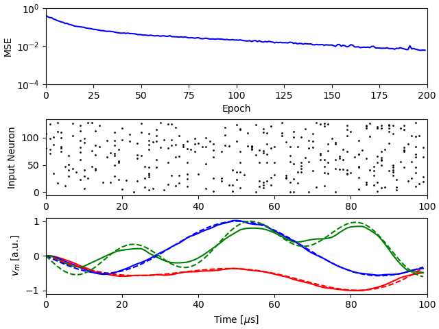

hxtorch.snn Introduction
========================

In this tutorial we will explore the ``hxtorch.snn`` framework used to train networks of spiking neurons on the BrainScaleS-2 platform in a machine-learning-inspired fashion.

.. code:: ipython3

    %matplotlib inline
    from _static.tutorial.hxsnn_intro_plots import plot_training, plot_compare_traces, plot_mock, plot_scaled_trace, plot_targets
    from _static.common.helpers import setup_hardware_client, save_nightly_calibration
    setup_hardware_client()

.. code:: ipython3

    from functools import partial
    import matplotlib.pyplot as plt
    import numpy as np

    import torch
    import hxtorch
    import hxtorch.snn as hxsnn

Emulate a network on BSS-2
--------------------------

To start, we create a small network with a single spiking leak-integrate and fire (LIF) ``Neuron``, receiving inputs through a linear ``Synapse`` layer.
Network layers in ``hxtorch`` are derived from a parent class ``HXModule`` (similar to ``torch.nn.Module`` in PyTorch), requiring an instance of ``Experiment`` which keeps track of all network layers to be run within the same experiment on BSS-2.
While ``Neuron``\ s can be parameterized individually, we keep the default parameters for now.

Next we create some input spikes and emulate the network.
The membrane potential of the LIF is measured using the columnar ADC (CADC) and the membrane (MADC).
While the first allows sampling all neuron potentials on the chip in parallel, the latter can only sample two neurons at the benefit of having a higher temporal resolution.
The units are CADC / MADC Values, which in principle are translatable to mV (which will be implemented in the future).
When modules are called to infere the networks topology, they return ``Handles`` (e.g. ``g``, ``z``) which act as promises to future hardware data which get filled after the hardware experiment is run.
Note that in ``hxtorch`` the returned hardware data is mapped to a dense time grid of shape ``(batch_size, time_steps, population_size)`` of resolution ``dt``.

.. code:: ipython3

    save_nightly_calibration('spiking_calix-native.pkl')

    hxtorch.init_hardware()

    # Experiment
    exp = hxsnn.Experiment(dt=1e-6)
    # To avoid time consuming implict calibration we load a prepared calibration
    exp.default_execution_instance.load_calib("spiking_calix-native.pkl")

    # Modules
    syn = hxsnn.Synapse(
        in_features=1,
        out_features=1,
        experiment=exp)
    lif = hxsnn.Neuron(
        size=1,
        experiment=exp,
        enable_cadc_recording=True,
        enable_madc_recording=True,
        enable_spike_recording=True,
        record_neuron_id=0,
        cadc_time_shift=-1)

    # Weights on hardware are between -63 to 63
    syn.weight.data.fill_(63)

    # Some random input spikes
    inputs = torch.zeros((50, 1, 1))
    inputs[[10, 15, 20, 30]] = 1  # in dt

    # Forward
    g = syn(hxsnn.NeuronHandle(inputs))
    z = lif(g)

    print(z.spikes, z.membrane_cadc)

    hxsnn.run(exp, 50)  # dt

    print(z.spikes.shape, z.membrane_cadc.shape)

    # Display
    plot_compare_traces(inputs, z)

    hxtorch.release_hardware()

Great, we have now seen how easily spiking neural networks are emulated on BSS-2.
In order to train them, each layer instance of ``HXModule`` has a PyTorch-differentiable numerical representation defined in a member function ``forward_func``.
This function allows backpropagating gradients but also to simulate networks.
Simulation is enabled by setting ``mock=True`` in the ``Experiment`` instance:

.. code:: ipython3

    # Experiment
    exp = hxsnn.Experiment(dt=1e-6, mock=True)

    # Modules
    syn = hxsnn.Synapse(1, 1, exp)
    syn.weight.data.fill_(50)  # weights are between -63 to 63
    lif = hxsnn.Neuron(1, exp)

    # Forward
    g = syn(hxsnn.NeuronHandle(inputs))
    z = lif(g)

    # Simulate
    hxsnn.run(exp, 50)  # dt

    # Display
    plot_mock(inputs, z)

Since the dynamics of the numerics is used to compute gradients it is important to align them to the dynamics of the neurons on hardware.
If you compare the y-axes between the first and the second plot you see, that this is not the case here.
There are two scalings which can be used to align the dynamics.
First there is the ``trace_scaling`` which is applied to the measured membrane trace, this allows to scale the hardware values into the expected simulated range.
Additionally, the measured traces can be offset either by setting ``shift_to_fist=True`` which uses the first measured value as baseline, or setting a ``trace_offset`` specifically.
The second scaling is the scaling between the weights used in the sofware model and the weights used on hardware, since the “strength” of the weights on BSS-2 depend on the calibration.

First we want to align the membrane ranges.
For this, we assume ``leak=0``, ``reset=0`` and ``threshold=1`` for the LIF neuron in the numerics.
``Neuron``\ s can be parameterized with different values for the ``model`` in software which is used for gradient computation and the neuron on ``hardware`` using a ``MixedHXModelParameter``:

.. code:: ipython3

    from hxtorch.snn.transforms.weight_transforms import linear_saturating

    hxtorch.init_hardware()

    # Model parameters
    model_threshold = 1.
    model_leak = 0.
    model_reset = 0.

    # BSS-2 parameters
    bss2_threshold = 125
    bss2_leak = 80
    bss2_reset = 80

    # Post-processing
    # These values are measured in the following
    trace_scale = 1.
    trace_offset = 0.
    weight_scale = 1.

    def run(inputs, mock=False, weight_scale=63., trace_offset=0., trace_scale=1., n_runs=10):
        """ """
        traces = []
        for i in range(n_runs):
            # Experiment
            exp = hxsnn.Experiment(dt=1e-6, mock=mock)
            exp.default_execution_instance.load_calib("spiking_calix-native.pkl")

            # Modules
            syn = hxsnn.Synapse(
                in_features=1,
                out_features=1,
                experiment=exp,
                transform=partial(linear_saturating, scale=weight_scale))
            lif = hxsnn.Neuron(
                size=1,
                experiment=exp,
                leak=hxsnn.MixedHXModelParameter(model_leak, bss2_leak),
                reset=hxsnn.MixedHXModelParameter(model_reset, bss2_reset),
                threshold=hxsnn.MixedHXModelParameter(model_threshold, bss2_threshold),
                cadc_time_shift=-1,
                trace_offset=trace_offset,
                trace_scale=trace_scale)
            syn.weight.data.fill_(1.)
            # Forward
            g = syn(hxsnn.NeuronHandle(inputs))
            z = lif(g)
            hxsnn.run(exp, 50)  # dt
            traces.append(z.membrane_cadc.detach().numpy().reshape(-1))
        return traces

    # Measure baseline
    inputs = torch.zeros((50, 1, 1))
    traces = run(inputs)
    baselines = np.stack(traces).mean()
    print("CADC membrane baseline: ", baselines)

    # Measure hardware threshold
    # We send a lot input spikes to excite the membrane potential towards the threshold potential
    # This will allow us to measure the real threshold value on hardware
    inputs = torch.ones((50, 1, 1))
    traces = run(inputs, trace_offset=baselines)
    bss2_threshold_real = np.stack(traces).max(1).mean()
    trace_scale = model_threshold / bss2_threshold_real
    print("Leak - Threshold on BSS-2: ", bss2_threshold_real)
    print("Trace scaling: ", trace_scale)

    # Next we tune the weight_scaling such that the PSP in the software model and on hardware look the same.
    # For this, we send exactly one input to compare the PSPs
    weight_scaling = 55.

    inputs = torch.zeros((50, 1, 1))
    inputs[10] = 1

    mock_trace = run(inputs, mock=True, n_runs=1)[0]
    bss2_traces = run(inputs, trace_offset=baselines, trace_scale=trace_scale, weight_scale=weight_scaling)

    # Display
    plot_scaled_trace(inputs, bss2_traces, mock_trace)

    hxtorch.release_hardware()

Now that we have aligned the dynamics on hardware and in the numerics, we can use the hardware to emulate out network and use the numerics to compute gradients for a given task.
Training networks on BSS-2 using ``hxtorch.snn`` works the same as for plain PyTorch.
Its easy… sometimes.

In the remainder of this demo we will train a non-spiking leak-integrator (LI) output neuron to resemble a target trace.
LI neuron layers are created by using ``ReadoutNeurons``.

As the target pattern we use a sine:

.. code:: ipython3

    def get_target(n_out):
        targets = torch.zeros(100, 1, 3)
        for n in range(n_out):
            for i in range(3):
                targets[:, 0, n] += torch.sign(torch.rand(1)-0.5)*torch.sin(
                    torch.linspace(0, (2 * torch.pi) / ((0.3 - 2) * torch.rand(1).item() + 2), 100))
        norm = np.abs(targets).max(0)
        return targets / norm.values

    targets = get_target(3)

    # Display
    plot_targets(targets)

.. code:: ipython3

    import ipywidgets as w

    hxtorch.init_hardware()

    EPOCHS = 200

    exp = hxsnn.Experiment(mock=False)
    exp.default_execution_instance.load_calib("spiking_calix-native.pkl")

    lin1 = hxsnn.Synapse(128, 3, exp, transform=partial(
                linear_saturating, scale=55))
    li = hxsnn.ReadoutNeuron(
        3,
        exp,
        tau_mem=10e-6,
        tau_syn=10e-6,
        leak=hxsnn.MixedHXModelParameter(0., 80.),
        shift_cadc_to_first=True,
        trace_scale=trace_scale,
        trace_offset=baselines)

    inputs = (torch.rand((100, 1, 128)) < 0.03).float()

    optimizer = torch.optim.Adam(lin1.parameters(), lr=2e-3)
    loss_fn = torch.nn.MSELoss()

    update_plot = plot_training(inputs, targets, EPOCHS)
    plt.close()
    output = w.Output()
    display(output)

    for i in range(EPOCHS):
        optimizer.zero_grad()

        # Forward
        g = lin1(hxsnn.NeuronHandle(inputs))
        y = li(g)

        # Run on BSS-2
        hxsnn.run(exp, 100)

        # Optimize
        loss = loss_fn(y.membrane_cadc, targets)
        loss.backward()
        optimizer.step()

        # Plot
        output.clear_output(wait=True)
        with output:
            update_plot(loss.item(), y)

    hxtorch.release_hardware()

