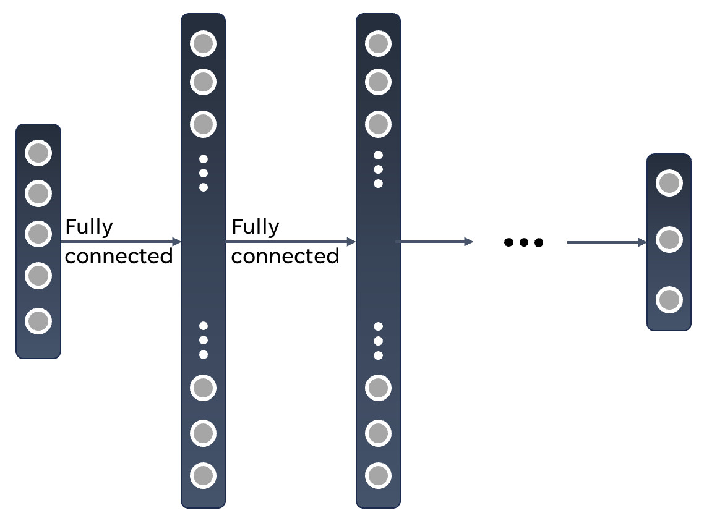
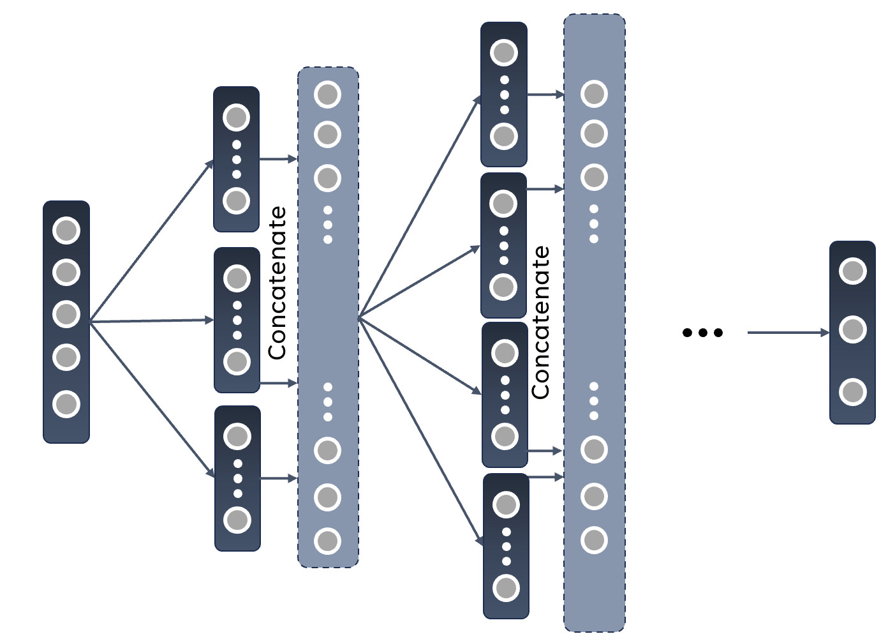

Partitioning of Feedforward SNNs
================================

In this tutorial we will discuss network partitioning for feedforward networks on BrainScaleS-2 (BSS-2) [1].
We will create a spiking neural network (SNN) in ``hxtorch.snn`` [2] based on the output of a partitioning algorithm and train it with BSS-2 in-the-loop with the surrogate gradient (SG) method [3] to solve the MNIST [4] task.
This experiment has been published in [5].

If you are not familiar with ``hxtorch.snn`` or the BSS-2 system, you might want to do previous tutorials first or take a look at the following references.
This tutorial will not detail their corresponding working principles.

References and further reading
------------------------------

[1] Pehle, C., Billaudelle, S., Cramer, B., Kaiser, J., Schreiber, K.,
Stradmann, Y., Weis, J., Leibfried, A., Müller, E., and Schemmel, J. The
BrainScaleS-2 accelerated neuromorphic system with hybrid plasticity.
Frontiers in Neuroscience, 16, 2022. ISSN 1662-453X. `doi:
10.3389/fnins.2022.795876 <https://www.frontiersin.org/articles/10.3389/fnins.2022.795876/full>`__

[2] Spilger, P., Arnold, E., Blessing, L., Mauch, C., Pehle, C., Müller,
E., and Schemmel, J. hxtorch.snn: Machine- learning-inspired spiking
neural network modeling on BrainScaleS-2. 2023. `doi:
10.48550.2212.12210 <https://doi.org/10.48550/arXiv.2212.12210>`__

[3] Emre O. Neftci, Hesham Mostafa, and Friedemann Zenke. 2019.
Surrogate gradi- ent learning in spiking neural networks: Bringing the
power of gradient-based optimization to spiking neural networks. IEEE
Signal Processing Magazine 36, 6 (2019),51–63.
https://doi.org/10.1109/MSP.2019.2931595

[4] Yann LeCun and Corinna Cortes. The MNIST database of handwritten
digits. 1998.

[5] Arnold, E., Spilger, P., Straub, J. V., Müller, E., Dold, D., Meoni,
G., Schemmel, J. Scalable Network Emulation on Analog Neuromorphic
Hardware. Frontiers in Neuroscience. 2025. `doi:
10.3389/fnins.2024.1523331 <https://doi.org/10.3389/fnins.2024.1523331>`__

A Partitioning Algorithm
~~~~~~~~~~~~~~~~~~~~~~~~

When working with feedforward neural networks, the typical network structure that arises will look like this:

The marked regions represent layers of the network and the dots the neurons within them.
We will work with an input layer, some hidden layers and an output layer with dense synaptic connections between the neurons of consecutive layers.

The BSS-2 System consists of 512 AdEx-neuron circuits with a fan-in of 256 individual synaptic connections to each of them.
The weights of these synaptic connections can be either excitatory (positive) or inhibitory (negative) and can in each case be configured within 6 bit (inhibitory: :math:`[-63, ..., 0]`, excitatory: :math:`[0, ..., 63]`).
To work with signed weights, we can combine two synaptic rows, one for each input type.
This, in return, reduces the fan-in per neuron circuit to 128.
A higher fan-in can be achieved by connecting neuron circuits on BSS-2 such that they share their membrane voltage and add their respective fan-in.
This decreases the number of available neurons on chip.

Networks requiring more neuron resources than the chip provides, need to be partitioned into subnetworks, each fitting on a single BSS-2 instance.
As the neurons of any given layer are not interconnected and the information is propagated through the network in one direction only (feedforward), a postsynaptic layer can be split into multiple independent sublayers, each receiving all inputs from the presynaptic layer (in case of dense connections in between).
Making use of this characteristic, we can turn this into a multi-step-process and run all the sublayers consecutively on the current single-chip BSS-2 hardware
In the future, all parts are run in parallel on multi-chip hardware.
After all the runs in a particular layer, we can combine their outputs and can move on to the next layer and then repeat the partitioning process
The following image showcases this procedure:

We will now try to find an optimal partition for a given network.
Let’s say it consists of :math:`L \in\mathbb{N}` layers with :math:`N_l \in\mathbb{N}` neurons in layer :math:`l \leq L`.
For the fully connected structure, every neuron in a following layer will have to be provided with a fan-in of the number of neurons in the previous layer (:math:`N_{ l-1 }`).
We can calculate how many neurons circuits :math:`c_l` have to be connected in order to achieve this fan-in:

.. math::

   c_l = \left\lceil \frac{N_{l-1}}{128}\right\rceil.

In the next step, we want to know how many neurons of this size fit on one chip:

.. math::

   N^\text{BSS-2}_l = N(c_l) = \left\lfloor \frac{512}{c_l}\right\rfloor.

Last but not least, this implies the number of necessary partitions for a given layer:

.. math::

   p_l = \left\lceil\frac{N_l}{N(c_l)} \right\rceil.

We can calculate this for each layer :math:`l`.
If several consecutive layers do not need to be partitioned  (:math:`p_l = p_{l+1} = … = p_{l+n} = 1`), we can also check if these parts of the network can be executed in one hardware run, i.e. fit on the chip together.

Example with the MNIST data set
~~~~~~~~~~~~~~~~~~~~~~~~~~~~~~~

We are now going to implement an SNN in ``hxtorch.snn`` and put it to the test by training the resulting network on BSS-2.
Before we can actually train a network, a few more steps have to be considered.

In this example we will make use of the MNIST data set [4].
It contains :math:`28 \times 28` gray scale images of the numbers from zero up to nine.
The goal of our trained network will be to classify these images correctly.
To do that, lets set the input space of the network to the image size: :math:`28 \times 28 = 784` and use a hidden layer consisting of 256 leaky-integrate-and-fire (LIF) neurons.
The 10 leaky integrators in our output layer correspond to the ten classes of the data set.
For this network architecture, partitioning results in 5 subnetworks.
The input space of :math:`784` neurons requires connecting 7 neuron circuits; for convenience, we use 8, which simplifies the mapping process.
This configuration reduces the number of "logical" neurons per BSS-2 chip to 64, so the hidden layer is divided into 4 partitions.
In the output layer, 2 neuron circuits are connected, allowing the entire layer to be executed on a single BSS-2 instance.

Let’s load the data set before we continue with the encoding:

.. code:: ipython3

    # set up hardware client
    from _static.common.helpers import setup_hardware_client
    setup_hardware_client()

    import os
    import torch
    import torchvision
    from torch.utils.data import DataLoader
    from _static.tutorial.partitioning_helpers import RandomRandomRotation
    torch.manual_seed(42)

.. code:: ipython3

    batch_size = 100
    dataset_size = 0.1
    dev = torch.device("cuda" if torch.cuda.is_available() else "cpu")
    print("device:", dev)

.. code-block:: ipython3
    :class: test, html-display-none

    dataset_size = 0.01
    batch_size = 32

.. code:: ipython3

    # define the rotation that is applied
    RotationTransform = RandomRandomRotation(dmin=-25, dmax=25, prob=0.5)
    transform_train = torchvision.transforms.Compose(
        [torchvision.transforms.ToTensor(), RotationTransform])
    transform_test = torchvision.transforms.ToTensor()

    # We either use existing MNIST dataset or download into "./mnist"
    dataset_location = "/loh/data/mnist" if os.path.exists("/loh/data/mnist") else "./mnist"

    train_data = torchvision.datasets.MNIST(
        root=dataset_location, train=True, download=True, transform=transform_train)
    test_data = torchvision.datasets.MNIST(
        root=dataset_location, train=False, download=True, transform=transform_test)

    # We only train on 10% of the data to increase execution speed
    # ... comment this out if you want to train on the whole dataset
    train_data = torch.utils.data.Subset(
        train_data, torch.arange(int(len(train_data) * dataset_size)))
    test_data = torch.utils.data.Subset(
        test_data, torch.arange(int(len(test_data) * dataset_size)))
    train_loader = DataLoader(train_data, batch_size=batch_size, shuffle=True)
    test_loader = DataLoader(test_data, batch_size=batch_size)

As you can see, we can augment the data set by applying random rotations to some of the data to counteract overfitting.
The probability with which these are applied and the angle range can be specified here.

Encoding
--------

We have to encode the real valued input data into spike trains in order for the LIF neurons to be able to work with it.
An efficient encoding approach is a time-to-first-spike (TTFS) encoding where each pixel is translated to single spike event.
We will implement it a linear manner:

As hxtorch computes gradients by representing the network dynamics on a discrete time grid of length :math:`T` time steps, each value of each pixel will be mapped to a discrete time-index :math:`t_{\text{idx}} \in\mathbb{N}` along a spike train of length :math:`T \in\mathbb{N}` at which a spike will be placed.

.. math::
   x \mapsto T\cdot \frac{x-x_{\text{min}}}{x_{\text{max}}- x_{\text{min}}} =: t_1, \quad
   t_1 \mapsto T - \left\lfloor{t}_1\right\rceil =: t_{\text{idx}},

where :math:`x_{\text{ min/max }}` is the minimum/maximum value of the data set.
The mixed flooring and ceiling brackets indicate rounding to the next integer.
With an encoding like this, high values are represented by early spikes and (while decreasing linearly) values close to :math:`x_{\text{min}}` result in spike times near to :math:`T`.

.. code:: ipython3

    def ttfs_encode(x: torch.Tensor, sequence_length: int, x_min: float = 0.,
                    x_max: float = 1.) -> torch.Tensor:
        """
        Translate the image into a time-to-first-spike representation.

        :param x: The image to encode into spikes.
        :param sequence_length: The length of time sequence, i.e. number of time steps.
        :param x_min: The minimum pixel value to still resulting in a spike.
        :param x_max: The pixel value for which (and above) the spike time is at time step 0.
        :return: The spiking representation of the image.
        """
        indx = sequence_length - torch.round(
            (sequence_length) * (x - x_min) / (x_max - x_min))
        x_enc = torch.zeros([sequence_length] + list(x.shape), device=x.device)

        for i in range(sequence_length):
            x_enc[i] = torch.where(indx == i, 1, 0)

        return x_enc

The full pre-processing of an image is shown in the following figure:

.. code:: ipython3

    from functools import partial
    from _static.tutorial.partitioning_plots import show_transforms
    fig = show_transforms(train_data, RotationTransform, partial(
        ttfs_encode, sequence_length=30))

Note that the image in the middle might be the same as the initial image, depending on the probability of the application given to ``RandomRandomRotation(..., ..., prob=...)``.

Decoding
--------

As we chose leaky integrators in the last layer of the network, there will be no spiking behavior in this output layer.
We will have to apply some kind of decoding to the membrane traces that are being recorded on BSS-2 to turn them into class scores in order to infer a prediction.
A simple method to achieve this is a max-over-time decoding: the maximum value of each membrane trace will used to derive a probability for each class label.
For that we use the log-softmax function in conjunction with ``PyTorch``\ ’s ``torch.nn.functional.nll_loss``, which corresponds to the Cross Entropy Loss.

.. code:: ipython3

    def decode(x: torch.Tensor, trace_scaling: float = 1) -> torch.Tensor:
        """
        Decode the output membrane traces into class scores.

        :param x: Membrane traces from the output layer.
        :param trace_scaling: Scaling factor for the traces.
        :return: Log-probabilities for each class.
        """
        x = torch.amax(x * trace_scaling, 0)
        log_p_y = torch.nn.functional.log_softmax(x, dim=1)
        return log_p_y

The Model
---------

The class ``SNN`` creates a model in a similar fashion to the known ``PyTorch`` formulation.
It defines the projections and neuron layers of the network.
In the ``forward``-method, an input is traversed through the network and the respective output is returned.

The class ``Model`` puts together what we already have and creates a complete model with encoder, network and decoder.
It even consists of a regularization method that might come in handy later on.
When creating the synapses, the parameter ``transforms`` allows us to apply a function to the weights before they are used in the networks calculations.
To ensure compatibility with the physical constraints of BSS-2, we apply a weight saturation function that limits weights to the hardware boundaries.
Additionally, in the Synapse module's numerical implementation (see ``forward_func``), we use a clamping function with exponential decay near the extreme values (:math:`-63` and :math:`63`).
This approach prevents weight over-saturation and helps maintain consistency between software and hardware weights.

.. code:: ipython3

    import hxtorch
    import hxtorch.spiking as hxsnn
    import hxtorch.spiking.functional as F

    from hxtorch.spiking.transforms import weight_transforms
    from typing import Optional, Tuple

.. code:: ipython3

    class Synapse(hxsnn.Synapse):
        def __init__(self, *args, cap: float, weight_exp_rolloff: float,
                    use_quantization: bool, **kwargs):
            """
            Initialize the Synapse.

            :param use_quantization: Whether to use quantized weights in the numerical
                forwardpass.
            :param cap: Maximum allowed weight value for the model weights (saturation cap).
            :param weight_exp_rolloff: Start of exponential rolloff for weights towards
                saturation cap.
            :param args: Additional positional arguments for parent class.
            :param kwargs: Additional keyword arguments for parent class.
            """
            super().__init__(*args, **kwargs)
            self.cap = cap
            self.weight_exp_rolloff = weight_exp_rolloff
            self.use_quantization = use_quantization

        def forward_func(self, inputs: hxsnn.LIFObservables) -> hxsnn.SynapseHandle:
            return hxsnn.SynapseHandle(
                graded_spikes=F.linear_exponential_clamp(
                    inputs.spikes, self.weight, cap=self.cap, start_weight=self.weight_exp_rolloff,
                    quantize=self.use_quantization))

    class SNN(torch.nn.Module):
        """
        SNN consiting of a hidden LIF layer and subseqent LI output layer
        """

        def __init__(
                self,
                lif_params: dict,
                li_params: dict,
                mock: bool = True,
                dt: float = 1.0e-6,
                use_quantization: bool = True,
                trace_shift_hidden: int = 1,
                trace_shift_out: int = 1,
                weight_init_hidden: Optional[Tuple[float, float]] = None,
                weight_init_output: Optional[Tuple[float, float]] = None,
                weight_scale_hidden: float = 1.,
                weight_scale_output: float = 1.,
                trace_scale_hidden: float = 1.,
                trace_scale_output: float = 1.,
                weight_exp_rolloff: float = 0.,
                device: torch.device = torch.device("cpu")) -> None:

            """
            Initialize the SNN.

            :param lif_params: Params for LIF neurons. Also used for calibration.
            :param li_params: Params for LI neurons. Also used for calibration.
            :param mock: Indicating whether to train in software or on
            :param dt: Time-binning width.
            :param use_quantization: Wether to use discrete weights in
                simulation forward.
            :param weight_init_hidden: Weight initialization mean
                and standard deviation.
            :param weight_init_output: Output layer weight initialization mean
                and standard deviation.
            :param weight_scale_hidden: The factor with which the hidden
                software weights are scaled when mapped to hardware.
            :param weight_scale_output: The factor with which the output
                software weights are scaled when mapped to hardware.
            :param trace_scale_hidden: The factor with which the membrane
                traces of the hidden neurons are scaled when mapped from
                hardware measurements to software.
            :param trace_scale_output: The factor with which the membrane
                traces of the readout neurons are scaled when mapped from
                hardware measurements to software.
            :param weight_exp_rolloff: Weights with higher absolutes are rolled off
                exponentially in software.
            :param device: The used PyTorch device used for tensor operations
                in software.
            """
            super().__init__()

            self.exp = hxsnn.Experiment(mock=mock, dt=dt)
            self.exp.inter_batch_entry_wait = 125 * 50  # 50 us

            morph_hidden = hxsnn.morphology.SingleCompartmentNeuron(
                size=8, expand_horizontally=False)

            # Hidden Layers
            self.hidden_size = 256
            self.linear_hidden, neurons_hidden = [], []
            for i in range(4):
                inst = hxsnn.ExecutionInstance()
                linear = Synapse(
                    in_features=784,
                    out_features=64,
                    experiment=self.exp,
                    execution_instance=inst,
                    cap=1. if mock else 63. / weight_scale_hidden,
                    weight_exp_rolloff=weight_exp_rolloff,
                    use_quantization=use_quantization,
                    transform=partial(
                        weight_transforms.linear_saturating,
                        scale=weight_scale_hidden))
                self.linear_hidden.append(linear)
                setattr(self, f"linear_hidden_{i}", linear)

                neuron = hxsnn.LIF(
                    size=64,
                    **lif_params,
                    experiment=self.exp,
                    execution_instance=inst,
                    trace_scale=trace_scale_hidden,
                    cadc_time_shift=trace_shift_hidden,
                    shift_cadc_to_first=True,
                    neuron_structure=morph_hidden)
                setattr(self, f"neuron_hidden_{i}", neuron)
                neurons_hidden.append(neuron)

            # Output Layer
            morph_out = hxsnn.morphology.SingleCompartmentNeuron(
                size=2, expand_horizontally = False)

            inst = hxsnn.ExecutionInstance()
            self.linear_output = []
            for i in range(4):
                linear = Synapse(
                    in_features=64,
                    out_features=10,
                    execution_instance=inst,
                    experiment=self.exp,
                    cap=1. if mock else 63. / weight_scale_output,
                    weight_exp_rolloff=weight_exp_rolloff,
                    use_quantization=use_quantization,
                    transform=partial(
                        weight_transforms.linear_saturating,
                        scale=weight_scale_output))
                self.linear_output.append(linear)
                setattr(self, f"linear_output_{i}", linear)

            self.neuron_output = hxsnn.LI(
                size=10,
                **li_params,
                experiment=self.exp,
                execution_instance=inst,
                trace_scale=trace_scale_output,
                cadc_time_shift=trace_shift_out,
                shift_cadc_to_first=True,
                neuron_structure=morph_out)

            # initialize weights
            for i, linear in enumerate(self.linear_hidden):
                torch.nn.init.normal_(linear.weight.data, *weight_init_hidden)
            for i, linear in enumerate(self.linear_output):
                torch.nn.init.normal_(linear.weight.data, *weight_init_output)

            # Device
            self.device = device
            self.to(device)

            # placeholder for (hidden) spikes
            self.spikes = []

            # placeholder for current encoded inputs and output traces
            self.encoded_input = None
            self.traces = []

        def forward(self, spikes: torch.Tensor) -> torch.Tensor:
            """
            Perform a forward path.

            :param spikes: LIFObservables holding spikes as input.

            :return: Returns the output of the network, i.e. membrane traces of
                the readout neurons.
            """
            # clear spike list and traces list for each iteration
            self.spikes = []
            self.traces = []

            # Spike input
            inputs = spikes.view(spikes.shape[0], spikes.shape[1], -1)

            # Input -> hidden
            g1 = self.linear_hidden_0(hxsnn.LIFObservables(spikes=inputs))
            s1 = self.neuron_hidden_0(g1)
            g2 = self.linear_hidden_1(hxsnn.LIFObservables(spikes=inputs))
            s2 = self.neuron_hidden_1(g2)
            g3 = self.linear_hidden_2(hxsnn.LIFObservables(spikes=inputs))
            s3 = self.neuron_hidden_2(g3)
            g4 = self.linear_hidden_3(hxsnn.LIFObservables(spikes=inputs))
            s4 = self.neuron_hidden_3(g4)

            # Hidden -> output
            g5 = self.linear_output_0(s1)
            g6 = self.linear_output_1(s2)
            g7 = self.linear_output_2(s3)
            g8 = self.linear_output_3(s4)
            y = self.neuron_output(g5)
            y = self.neuron_output(g6)
            y = self.neuron_output(g7)
            y = self.neuron_output(g8)

            # runtime 2 µs seconds longer for buffer
            hxsnn.run(self.exp, inputs.shape[0] + 2)

            # Concat tensors of partitioned hidden layer
            s_h = [s1, s2, s3, s4]
            hidden_traces = torch.cat([s_h[i].membrane_cadc for i in range(4)], 2)
            hidden_spikes = torch.cat([s_h[i].spikes for i in range(4)], 2)

            self.traces = [hidden_traces] + [y.membrane_cadc]
            self.spikes = [hidden_spikes]

            return self.traces[-1]

        def get_proj_attrs(self):
            return self.proj_attrs

        def get_rate(self): # spikes per input per neuron
            """
            Calculates (and returns) the rate at which neurons fire.

            :returns: Firing rate per neuron and input image for all spiking
                neurons in the network.
            """
            rate = torch.tensor(0.)
            batch_size = self.spikes[0].shape[1]
            for spikes in self.spikes:
                rate += spikes.sum() / batch_size / self.hidden_size
            return rate

.. code:: ipython3

    class Model(torch.nn.Module):
        """ Complete model with encoder, network (snn) and decoder """

        def __init__(self, encoder: torch.nn.Module,
                    network: torch.nn.Module,
                    decoder: torch.nn.Module) -> None:
            """
            Initialize the model by assigning encoder, network and decoder

            :param encoder: Module to encode input data
            :param network: Network module containing layers and
                parameters / weights
            :param decoder: Module to decode network output
            """
            super().__init__()
            self.encoder = encoder
            self.network = network
            self.decoder = decoder

        def forward(self, inputs: torch.Tensor) -> torch.Tensor:
            """
            Perform forward pass through whole model, i.e.
            data -> encoder -> network -> decoder -> output

            :param inputs: tensor input data

            :returns: Returns tensor output
            """
            spikes = self.encoder(inputs)
            traces = self.network(spikes)
            self.scores = self.decoder(traces).clone()

            return self.scores

        def regularize(self, reg_readout: float = 0, reg_bursts: float = 0,
                reg_w_hidden: float = 0, reg_w_output: float = 0,
                exponent: int = 2) -> torch.Tensor:
            """
            Compute regularization loss for spiking activity, magnitude of
            weights and magnitude of max-over-time values.

            :param reg_bursts: prefactor of burst / hidden spike regulaization
            :param reg_weights_hidden: prefactor of hidden weight regularization
            :param reg_weights_output: prefactor of output weight regularization
            :param exponent: exponent in regularization terms
            :returns: Returns regularization terms in a tensor and their sum
            """
            reg = torch.tensor(0., device=self.scores.device)

            # Reg readout
            reg_scores = reg_readout * torch.mean(self.scores ** exponent)
            reg += reg_scores

            # bursts (hidden spikes) regularization
            reg_spikes = torch.tensor(0., device=self.scores.device)
            for spikes in self.network.spikes:
                reg_spikes += reg_bursts * torch.mean(
                    torch.sum(spikes, dim=0) ** exponent)
            reg += reg_spikes

            # weight regularization
            reg_weight = torch.tensor(0., device=self.scores.device)
            for linear in self.network.linear_hidden:
                reg_weight += reg_w_hidden * \
                    torch.mean(linear.weight ** exponent)

            for linear in self.network.linear_output:
                reg_weight += reg_w_output * \
                    torch.mean(linear.weight ** exponent)
            reg += reg_weight

            return reg, torch.tensor(
                [reg_scores.item(), reg_spikes.item(), reg_weight.item()])

        def get_rate(self):
            """
            Calculates (and returns) the rate at which neurons fire.

            :returns: Firing rate per neuron and input image for all spiking
                neurons in the network.
            """
            return self.network.get_rate()

Calibrations and Parameters
---------------------------

Before we set up the training functions for our model, lets take a step back and realize that the neuron parameters that are set in the model above have to be calibrated on hardware - if we are not using the mock-mode.
We will just have to set some parameters and the BSS-2 system will be calibrated implicitly.
Changing neuron parameters like the leak or threshold potential requires recalibration which takes some minutes.
Parameterizing neurons on BSS-2 is discussed in more detail in the tutorials :doc:`ts_00-single_neuron` and :doc:`ts_12-hxtorch_snn_intro`.

.. code:: ipython3

    from hxtorch.snn.parameter import HXParameter, MixedHXModelParameter

    # Neuron parameters
    lif_params = {
        "tau_syn": HXParameter(5.7e-6),
        "tau_mem": HXParameter(6e-6),
        "leak": MixedHXModelParameter(0., 80),
        "reset": MixedHXModelParameter(0., 80),
        "threshold": MixedHXModelParameter(1., 120),
        "alpha": 50
    }

    li_params = {
        "tau_syn": HXParameter(5.7e-6),
        "tau_mem": HXParameter(6e-6),
        "leak": MixedHXModelParameter(0., 80),
        "reset": MixedHXModelParameter(0., 80),
        "threshold": MixedHXModelParameter(1., 120),
        "alpha": 50
    }

    # Simulation
    mock = False
    weight_scale = 1.
    trace_scale = 1.

    # Regularization parameters
    reg_bursts = 0.0025
    reg_weights_hidden = 0.0033
    reg_readout = 1.6e-4
    reg_weights_output = 0.0033
    reg_gamma = 0.985
    reg_step_size = 1

    # Training parameters
    epochs = 100
    lr = 0.002

.. code-block:: ipython3
    :class: test, html-display-none

    epochs = 2

You might also return to these parameters later and choose different regularization values.

Training and Testing
--------------------

We will now set up the training and testing methods for any model that we might choose.
The loss function will consist of the cross-entropy loss as well as the regularization terms.

.. code:: ipython3

    from typing import Callable

    def run_epoch(model: torch.nn.Module, loader: DataLoader,
              optimizer: torch.optim.Optimizer, epoch: int, train: bool,
              update_func: Callable) -> Tuple[float, float]:
        """
        Perform training or testing for one epoch.

        :param model: The model to train/test.
        :param loader: Pytorch DataLoader instance providing training/testing
            data.
        :param optimizer: The optimizer used for weight optimization.
        :param epoch: Current epoch for logging.
        :param train: Bool indicating whether we train or evaluate the model.
        :update_func: A function to track data for plotting.
        :returns: Tuple (loss, accuracy, mean rate)
        """
        # define loss function
        loss_func = torch.nn.functional.nll_loss
        model.train(mode=train) # sets model in training / eval mode
        dev = model.network.device

        total_loss, total_reg_loss, total_acc, total_rate = [], [], [], []

        pbar = tqdm(total=len(loader), unit="batch", leave=False)
        for data, target in loader:
            if train:
                optimizer.zero_grad()

            scores = model(data.to(dev))
            # compute regularization loss and add up
            reg_loss_b, _ = model.regularize(
                reg_readout, reg_bursts * reg_gamma **\
                                ((int)((epoch - 1) / reg_step_size)),
                reg_weights_hidden, reg_weights_output, exponent=4)
            total_reg_loss.append(reg_loss_b.detach().flatten())

            # compute total loss
            loss = loss_func(scores, target.to(dev)) + reg_loss_b
            total_loss.append(loss.detach().flatten())

            if train: # backpropagation
                loss.backward()
                optimizer.step()

            # Train accuracy
            pred = scores.cpu().argmax(dim=1)
            acc = pred.eq(target.view_as(pred)).float()
            total_acc.append(acc.detach().flatten())

            # Firing rates
            rate = model.get_rate()
            total_rate.append(rate.detach().flatten())

            pbar.set_postfix(
                loss=f"{loss.mean().item():.3f}", loss_reg=f"{reg_loss_b.mean().item():.3f}",
                acc=f"{(acc.mean().item() * 100):.0f}%", rate=f"{rate}")
            pbar.update()
        pbar.close()

        total_loss = torch.cat(total_loss).mean().cpu()
        total_acc = torch.cat(total_acc).mean().cpu()
        total_rate = torch.cat(total_rate).mean().cpu()
        total_reg_loss = torch.cat(total_reg_loss).mean().cpu()

        # Update data for plotting
        update_func(loss=total_loss, acc=total_acc, rate=total_rate)
        print(f"Train: {train}, Epoch {epoch}, Loss {total_loss:.4f}, Accuracy {total_acc:.4f}")
        return total_loss, total_acc, total_rate, total_reg_loss

Final Setup And The Training Loop
---------------------------------

We can now approach the final setup for our training.
For the mapping between the hardware measurements and the software simulation, we will initiate a calibration and measure the scaling of the weights and traces.
This is necessary as we assume ``threshold = 1`` and ``leak, reset = 0`` in software.
To ensure a correspondance between the gradient in software and the neural dynamics on hardware, a transformation of the software weights to hardware weights and a transformation of membrane observables on hardware to membrane traces in software need to be found (therefore: ``get_weight_scaling(...)``).
The mapping between hardware dynamics and the dynamics assumed for computing gradients in explained and visualized in :doc:`ts_12-hxtorch_snn_intro`.

The calibration might take a while so feel free to read on until it is finished.

.. code:: ipython3

    from hxtorch.spiking.utils.dynamic_range.weight_scaling import get_weight_scaling
    from hxtorch.spiking.utils.dynamic_range.threshold import get_trace_scaling

.. code:: ipython3

    hxtorch.logger.set_loglevel(
        hxtorch.logger.get("grenade"), hxtorch.logger.LogLevel.ERROR)

    if not mock:
        # Measure weight scaling SW - HW weight
        weight_scale_hidden = get_weight_scaling(
            lif_params, weight_step=10,
            neuron_structure=hxsnn.morphology.SingleCompartmentNeuron(
                size=8, expand_horizontally=False))
        weight_scale_output = get_weight_scaling(
            lif_params, weight_step=10,
            neuron_structure=hxsnn.morphology.SingleCompartmentNeuron(
                size=2, expand_horizontally=False))
        print(f"Weight scale hidden {weight_scale_hidden}, "
            + f"weight scale out {weight_scale_output}.")

        # Measure trace scaling SW - HW
        trace_scale_hidden = get_trace_scaling(
            lif_params, neuron_structure=hxsnn.morphology.SingleCompartmentNeuron(
                size=8, expand_horizontally=False)).item()
        trace_scale_output = get_trace_scaling(
            lif_params, neuron_structure=hxsnn.morphology.SingleCompartmentNeuron(
                size=2, expand_horizontally=False)).item()
        print(f"Trace scale hidden {trace_scale_hidden}, "
            + f"trace scale out {trace_scale_output}.")

.. code:: ipython3

    import matplotlib.pyplot as plt
    %matplotlib inline
    import ipywidgets as w
    from _static.tutorial.partitioning_plots import plot_training

    model = Model(
        partial(ttfs_encode, sequence_length=30),
        SNN(lif_params=lif_params,
            li_params=li_params,
            mock=mock,
            dt=1e-6,
            weight_init_hidden=(-0.05, 0.2),
            weight_init_output=(0.01, 0.2),
            weight_scale_hidden=weight_scale_hidden,
            weight_scale_output=weight_scale_output,
            trace_scale_hidden=trace_scale_hidden,
            trace_scale_output=trace_scale_output,
            device=dev),
        partial(decode, trace_scaling=3.))

    optimizer = torch.optim.Adam(model.parameters(), lr=lr)
    scheduler = torch.optim.lr_scheduler.StepLR(
        optimizer, step_size=1, gamma=0.97)

The Training Loop
-----------------

.. code:: ipython3

    import matplotlib.pyplot as plt
    %matplotlib inline
    import ipywidgets as w

    from tqdm.auto import tqdm
    from _static.tutorial.partitioning_plots import plot_training

    # initialize hardware
    hxtorch.init_hardware()

    # plotting during training
    update_plot, update_train_data, update_test_data = plot_training(epochs)
    plt.close()
    output = w.Output()
    display(output)
    with output:
        update_plot()

    pbar = tqdm(total=epochs, unit="epoch")
    for epoch in range(1, epochs + 1):

        loss_train, acc_train, rate_train, regs_train = run_epoch(
            model, train_loader, optimizer, epoch, True, update_train_data)
        loss_test, acc_test, rate_test, regs_test = run_epoch(
            model, test_loader, optimizer, epoch, False, update_test_data)

        scheduler.step()

        # Refresh plot
        output.clear_output(wait=True)
        with output:
            update_plot()

        pbar.set_postfix(
            loss_test=f"{loss_test:.4f}", acc_test=f"{acc_test:.4f}")
        pbar.update()
    pbar.close()

    hxtorch.release_hardware()
