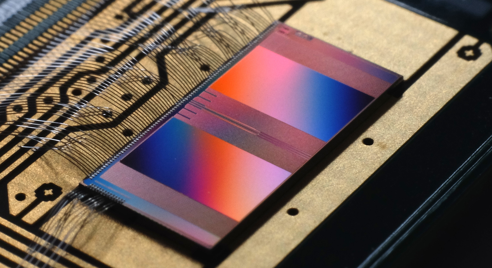

Welcome to the BrainScaleS-2 Tutorial
=====================================

Hello and welcome to this tutorial that will interactively guide you through your first experiments on the BrainScaleS-2 system!

You will learn the basic tools for running experiments on the BrainScaleS-2 platform.
For inspiration, please refer to the following list for examples of previous scientific work done on the system:

* `Versatile emulation of spiking neural networks on an accelerated neuromorphic substrate <https://ieeexplore.ieee.org/document/9180741>`_
* `Surrogate gradients for analog neuromorphic computing <https://www.pnas.org/doi/full/10.1073/pnas.2109194119>`_
* `hxtorch: PyTorch for BrainScaleS-2 – Perceptrons on Analog Neuromorphic Hardware <https://link.springer.com/chapter/10.1007/978-3-030-66770-2_14>`_
* `Control of criticality and computation in spiking neuromorphic networks with plasticity <https://www.nature.com/articles/s41467-020-16548-3>`_
* `Demonstrating Advantages of Neuromorphic Computation: A Pilot Study <https://www.frontiersin.org/articles/10.3389/fnins.2019.00260>`_
* `Fast and energy-efficient neuromorphic deep learning with first-spike times <https://www.nature.com/articles/s42256-021-00388-x>`_
* `Inference with Artificial Neural Networks on Analog Neuromorphic Hardware <https://link.springer.com/chapter/10.1007/978-3-030-66770-2_15>`_
* `Spiking neuromorphic chip learns entangled quantum states <https://arxiv.org/abs/2008.01039>`_
* `Structural plasticity on an accelerated analog neuromorphic hardware system <https://www.sciencedirect.com/science/article/pii/S0893608020303555>`_
* `Emulating dendritic computing paradigms on analog neuromorphic hardware <https://www.sciencedirect.com/science/article/pii/S0306452221004218>`_

In this session, we will cover the following topics:

.. toctree::
   :maxdepth: 1

   ts_00-single_neuron
   ts_01-superspike
   tp_00-introduction
   tp_01-properties
   tp_02-yin_yang
   ts_02-plasticity_rate_coding
   ts_03-multicompartment
   ts_04-mc_genetic_algorithms
   ts_05-yin_yang

In this section of the tutorial, we will go through the technical details and make sure that you are correctly set up for accessing our hardware resources.

Executing the Notebooks
-----------------------
If you want to execute the notebooks yourself, you can clone them from our
`github repository <https://github.com/electronicvisions/brainscales2-demos/tree/jupyter-notebooks-experimental>`_ and
execute them on the `EBRAINS Platform <https://wiki.ebrains.eu>`_.
Simply use an existing collabatory or create a new one in which you can clone the notebooks, e.g., via:

.. code-block:: bash

   !git clone https://github.com/electronicvisions/brainscales2-demos.git --branch jupyter-notebooks-experimental

in a notebook of your JupyterLab session.

To be able to use the EBRAINS software environment for your notebook, please select the ``EBRAINS-experimental`` kernel.
The currently used kernel is shown in the status line at the bottom of the notebook and in the upper right hand corner of the notebook. The default is ``Python 3 (ipykernel)``, which does not have the EBRAINS software environment installed. To select a different kernel, please klick the kernel name, then select from the appearing list.

Shared Hardware Resources
--------------------------
We utilize the intrinsic speed of the system to offer you an interactive experience that is as smooth as possible even though multiple participants will access the same chip at any given point in time.

This process is hidden by a custom microscheduler (*quiggeldy*), a conceptual view of which you can see in the following figure.
The actual hardware execution time has been colored in blue.

.. image:: _static/tutorial/daas_multi.png
    :width: 80%
    :align: center

Please note that the hardware performance you will experience is affected by other users in this tutorial and can not be perceived as an accurate representation of the expected performance for single-user workloads.

For the microscheduler to work we have to set some environment variables:

.. include:: common_quiggeldy_setup.rst

Final test: Hardware Execution
------------------------------
Before we start with the actual tutorial, we'd like to ensure that you are correctly set up for running experiments on the BrainScaleS-2 platform.
To do so, simply run the following minimal PyNN-experiment.
It should terminate without errors.

.. code-block:: python3

    import pynn_brainscales.brainscales2 as pynn

    pynn.setup()
    neurons_1 = pynn.Population(2, pynn.cells.HXNeuron())
    neurons_2 = pynn.Population(3, pynn.cells.HXNeuron())
    pynn.Projection(neurons_1, neurons_2, pynn.AllToAllConnector())
    pynn.run(0.2)
    pynn.end()

