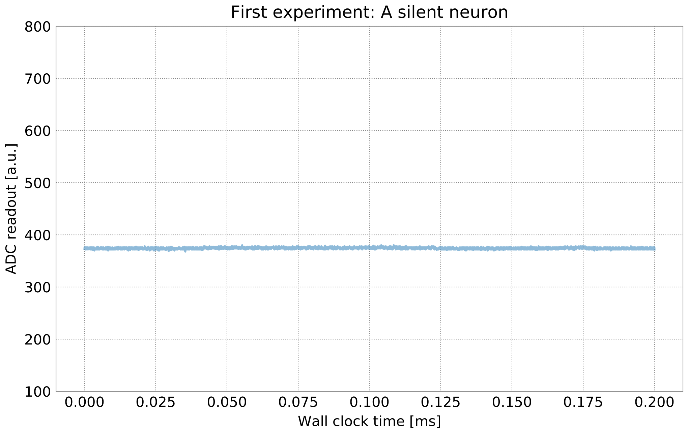
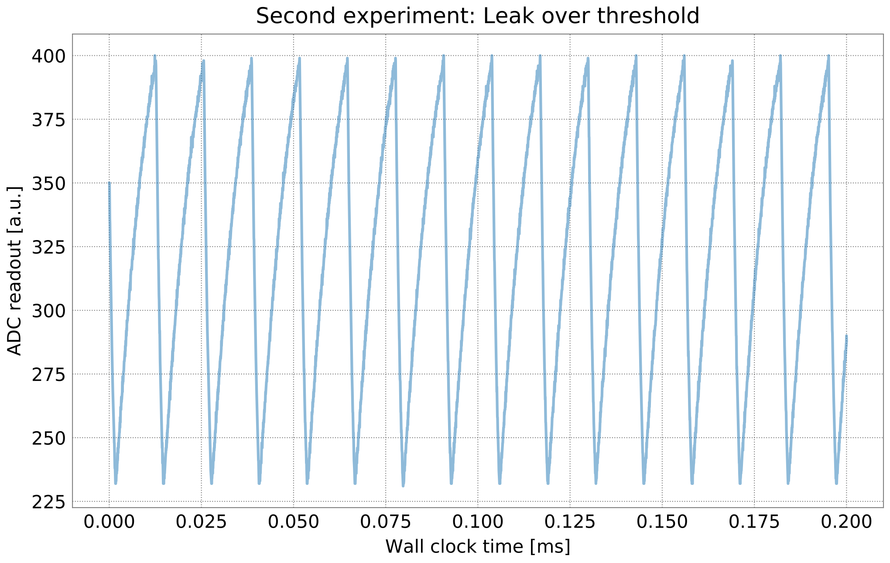
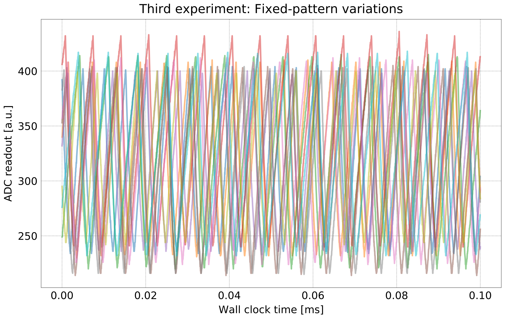
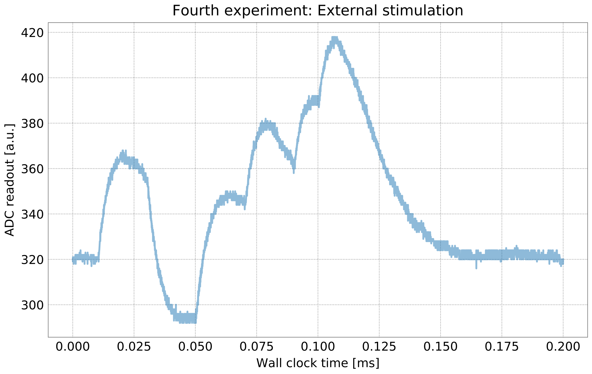

BrainScaleS-2 single neuron experiments
=======================================

In order to use the microscheduler we have to set some environment variables first:

.. include:: common_quiggeldy_setup.rst

.. code:: ipython3

    %matplotlib inline
    import numpy as np
    from ipywidgets import interact, IntSlider
    from functools import partial
    IntSlider = partial(IntSlider, continuous_update=False)
    import matplotlib.pyplot as plt
    plt.style.use("_static/matplotlibrc")

    import pynn_brainscales.brainscales2 as pynn
    from pynn_brainscales.brainscales2 import Population
    from pynn_brainscales.brainscales2.standardmodels.cells import SpikeSourceArray
    from pynn_brainscales.brainscales2.standardmodels.synapses import StaticSynapse

    def plot_membrane_dynamics(population: Population, segment_id=-1, ylim=None):
        """
        Plot the membrane potential of the neuron in a given population view. Only
        population views of size 1 are supported.
        :param population: Population, membrane traces and spikes are plotted for.
        :param segment_id: Index of the neo segment to be plotted. Defaults to
                           -1, encoding the last recorded segment.
        :param ylim: y-axis limits for the plot.
        """
        if len(population) != 1:
            raise ValueError("Plotting is supported for populations of size 1.")
        # Experimental results are given in the 'neo' data format
        mem_v = population.get_data("v").segments[segment_id].irregularlysampledsignals[0]

        plt.plot(mem_v.times, mem_v, alpha=0.5)
        print(f"Mean membrane potential: {mem_v.mean()}")
        plt.xlabel("Wall clock time [ms]")
        plt.ylabel("ADC readout [a.u.]")
        if ylim:
            plt.ylim(ylim)

In this part we will explore some of the spiking capabilities of the
BrainScaleS-2 neuromorphic accelerator using our implementation of the
pyNN interface.

There are 512 neuron compartments emulating the leaky integrate and fire
model and 131,072 STP/STDP synapses in one HICANN-X chip, but we will stick
to a single neuron for now.

A silent neuron
---------------

As a first experiment, we will record the membrane of a single, silent
neuron on the analog substrate. We use pyNN as an interface, which can
be used similarly to existing simulators and other neuromorphic
platforms.

While we provide calibrated neurons that have their hardware parameters
set to match high-level targets, e.g., time-constants, we will start
with modifying a few circuit parameters directly. These control the
dynamic behavior of the neuron as well as static configuration. Most of
them are either boolean or given in units of ‘LSB’ for chip-internal
Digital-to-Analog converters, providing voltages and currents - they
have no direct biological translation.

For this first example, you may alter the leak potential via the slider
and observe the response of the analog neuron’s resting potential.

We first define a population of one neuron and let its membrane
potential be recorded. The experiment is executed by calling
``pynn.run(time_in_ms)``. The network is evolved for a given amount of
time and neurons are stimulated by any given stimuli.

The time is given in units of milliseconds (wall clock time),
representing the hardware’s intrinsic 1000-fold speed-up compared to
biological systems.

.. code:: ipython3

    @interact(v_leak=IntSlider(min=400, max=1022, step=1, value=700))
    def experiment(v_leak):
        plt.figure()
        plt.title("First experiment: A silent neuron")

        pynn.setup()

        pop = pynn.Population(1, pynn.cells.HXNeuron(
            # Leak potential, range: 400-1000
            leak_v_leak=v_leak,
            # Leak conductance, range: 0-1022
            leak_i_bias=1022))

        # The chip contains a fast Analog-to-Digital converter. It can be used to
        # record different observables of a single analog neuron - most importantly
        # the membrane potential.
        pop.record(["v"])

        # Execute experiment
        pynn.run(0.2)

        plot_membrane_dynamics(pop, ylim=(100, 800))
        plt.show()

        # Reset the pyNN internal state and prepare for the following experiment.
        pynn.end()

Leak over threshold
-------------------

As a second experiment, we will let the neurons on BrainScaleS-2 spike
by setting a ‘leak-over-threshold’ configuration. The leak potential is
set high, above the spike threshold, so that the membrane charges
exponentially until a spike is triggered. The potential is then reset to
a lower voltage.

The parametrization of the different potentials is not equal, a lower
threshold setting of 300 may correspond to a higher leak potential of
700.

.. code:: ipython3

    @interact(
        v_leak=IntSlider(min=400, max=1022, step=1, value=1000),
        v_threshold=IntSlider(min=0, max=500, step=1, value=300),
        v_reset=IntSlider(min=300, max=1022, step=1, value=400),
        i_bias_leak=IntSlider(min=0, max=1022, step=1, value=150),
    )
    def experiment(v_leak, v_threshold, v_reset, i_bias_leak):
        """
        Set up a leak over threshold neuron.

        :param v_leak: Leak potential.
        :param v_threshold: Spike threshold potential.
        :param v_reset: Reset potential.
        :param i_bias_leak: Controls the leak conductance (membrane time constant).
        """

        plt.figure()
        plt.title("Second experiment: Leak over threshold")

        pynn.setup()

        pop = pynn.Population(1, pynn.cells.HXNeuron(
            # Leak potential, range: 400-1000
            leak_v_leak=v_leak,
            # Leak conductance, range: 0-1022
            leak_i_bias=i_bias_leak,
            # Threshold potential, range: 0-500
            threshold_v_threshold=v_threshold,
            # Reset potential, range: 300-1000
            reset_v_reset=v_reset,
            # Membrane capacitance, range: 0-63
            membrane_capacitance_capacitance=63,
            # Refractory time (counter), range: 0-255
            refractory_period_refractory_time=255,
            # Enable reset on threshold crossing
            threshold_enable=True,
            # Reset conductance, range: 0-1022
            reset_i_bias=1022,
            # Increase reset conductance
            reset_enable_multiplication=True))

        pop.record(["v", "spikes"])
        pynn.run(0.2)
        plot_membrane_dynamics(pop, ylim=(100, 800))
        plt.show()
        pynn.end()

The neuron has many more parameters you may play around with.
Some documentation for these parameters is available in our `Lower-level API documentation <https://electronicvisions.github.io/documentation-brainscales2/api_lola.html>`_.
The kewords you set in PyNN are generated from a hierarchical structure – search for the last part of a parameter (e.g. ``capacitance``).

.. code:: ipython3

   pynn.cells.HXNeuron().get_parameter_names()

Fixed-pattern variations
------------------------

Due to the analog nature of the BrainScaleS-2 platform, the inevitable
mismatch of semiconductor fabrication results in inhomogeneous
properties of the computational elements.

We will visualize these effects by recording the membrane potential of
multiple neurons in leak-over-threshold configuration. You will notice
different resting, reset and threshold potentials as well as varying
membrane time constants.

.. code:: ipython3

    plt.figure()
    plt.title("Third experiment: Fixed-pattern variations")

    pynn.setup()

    pop = pynn.Population(10, pynn.cells.HXNeuron(
        # Leak potential, range: 400-1000
        leak_v_leak=1000,
        # Leak conductance, range: 0-1022
        leak_i_bias=200,
        # Threshold potential, range: 0-600
        threshold_v_threshold=500,
        # Reset potential, range: 300-1000
        reset_v_reset=400,
        # Membrane capacitance, range: 0-63
        membrane_capacitance_capacitance=63,
        # Refractory time, range: 0-255
        refractory_period_refractory_time=255,
        # Enable reset on threshold crossing
        threshold_enable=True,
        # Reset conductance, range: 0-1022
        reset_i_bias=1022,
        # Increase reset conductance
        reset_enable_multiplication=True))

    for neuron_id in range(len(pop)):
        print(f"Recording fixed-pattern variations: Run {neuron_id}")
        p_view = pynn.PopulationView(pop, [neuron_id])
        p_view.record(["v"])
        pynn.run(0.1)
        plot_membrane_dynamics(p_view, ylim=(100, 800))
        pynn.reset()
        pop.record(None)

    plt.show()
    pynn.end()

The plot shows the recorded membrane traces of multiple different
neurons. Due to the time-continuous nature of the system, there is no
temporal alignment between the individual traces, so the figure shows
multiple independent effects:

-  Temporal misalignment: From the system’s view, the recording happens
   in an arbitrary time frame during the continuously evolving
   integration. Neurons are not synchronized to each other.
-  Circuit-level mismatch: Each individual neurons shows slightly
   different analog properties. The threshold is different for all
   traces; as is the membrane time constant (visible as slope) and the
   reset potentials (visible as plateaus during the refractory time).

Summary
-------

The analog neurons on BrainScaleS-2 feature many hardware parameters
that can be set to achieve different operating points and to equalize
the behaviour of different neurons.

We will employ an automated calibration to get the neurons in the
desired operating mode. \* In the next notebook, we will show spiking
operation and learning. \* Later, we will change the target parameters
and use integrator neurons for executing multiply-accumulate operations.

Outlook: External stimulation
-----------------------------

We will continue the tutorial in the next notebook using external
stimulation on the neurons. You may play around a bit already here, but
we will revisit the following later.

Up to now, we have observed analog neurons without external stimulus. In
this experiment, we will introduce the latter and examine post-synaptic
pulses on the analog neuron’s membrane.

Preparing the neuron to receive synaptic inputs requires the
configuration of additional circuits. The additional settings include
technical parameters for bringing the circuit to its designed operating
point as well as configuration with a direct biological equivalent. For
simplicity, we will turn to a calibration which yields all required
parameters and counters the fixed pattern noise between different
neurons observed previously.

We represent projections as entries in the synapse matrix on the
neuromorphic chip. Weights are stored in digital 6bit values (plus
sign), the value range for on-chip weights is therefore -63 to 63. With
this first projection, we connect the external spike source to the
observed on-chip neuron population.

.. include:: common_nightly_calibration.rst

Now we can continue by defining our experiment:

.. code:: ipython3

    @interact(exc_weight=IntSlider(min=0, max=63, step=1, value=31),
              inh_weight=IntSlider(min=0, max=63, step=1, value=31),
              isi=IntSlider(min=10, max=100, step=5, value=50))
    def run_experiment(exc_weight: int, inh_weight: int, isi: float):
        '''
        Run external input demonstration on BSS-2.

        Adjust weight of projections, set input spikes and execute experiment
        on BSS-2.

        :param exc_weight: Weight of excitatory synaptic inputs, value range
            [0,63].
        :param inh_weight: Weight of inhibitory synaptic inputs, value range
            [0,63].
        :param isi: Time between synaptic inputs in microsecond (hardware
            domain)
        '''

        plt.figure()
        plt.title("Fourth experiment: External stimulation")

        pynn.setup(initial_config=calib)

        # use calibrated parameters for neuron
        stimulated_p = pynn.Population(1, pynn.cells.HXNeuron())
        stimulated_p.record(["v", "spikes"])

        # calculate spike times
        wait_before_experiment = 0.01  # ms (hw)
        isi_ms = isi / 1000  # convert to ms
        spiketimes = np.arange(6) * isi_ms + wait_before_experiment

        # all but one input are chosen to be exciatory
        excitatory_spike = np.ones_like(spiketimes, dtype=bool)
        excitatory_spike[1] = False

        # external input
        exc_spikes = spiketimes[excitatory_spike]
        exc_stim_pop = pynn.Population(2, SpikeSourceArray(spike_times=exc_spikes))
        exc_proj = pynn.Projection(exc_stim_pop, stimulated_p,
                                   pynn.AllToAllConnector(),
                                   synapse_type=StaticSynapse(weight=exc_weight),
                                   receptor_type="excitatory")

        inh_spikes = spiketimes[~excitatory_spike]
        inh_stim_pop = pynn.Population(2, SpikeSourceArray(spike_times=inh_spikes))
        inh_proj = pynn.Projection(inh_stim_pop, stimulated_p,
                                   pynn.AllToAllConnector(),
                                   synapse_type=StaticSynapse(weight=-inh_weight),
                                   receptor_type="inhibitory")

        # run experiment
        pynn.run(0.6)
        plot_membrane_dynamics(stimulated_p, ylim=(100, 600))
        plt.show()
        pynn.end()

You may play around with the parameters in this experiment to achieve
different traces. Try to stack multiple PSPs, try to make the neuron
spike more often, be creative!
