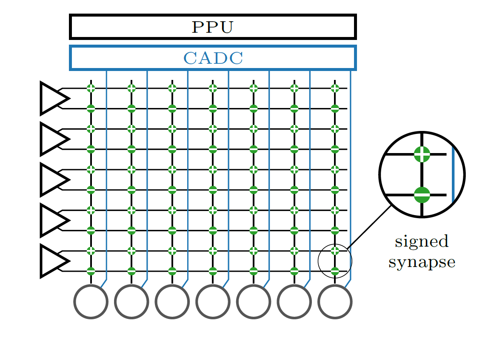
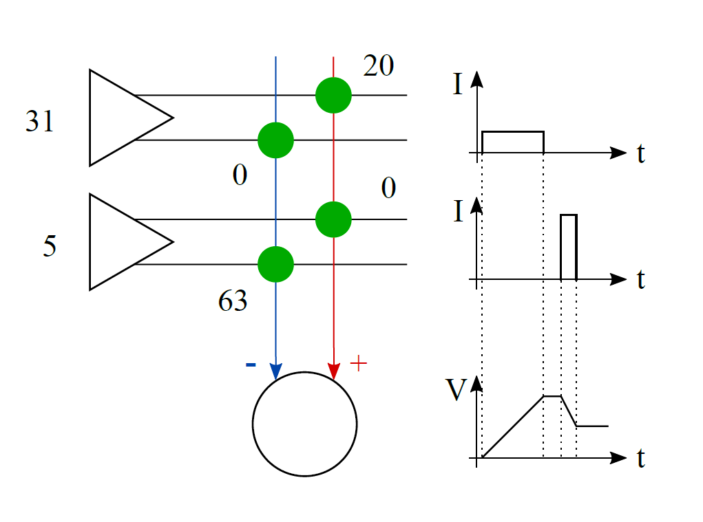
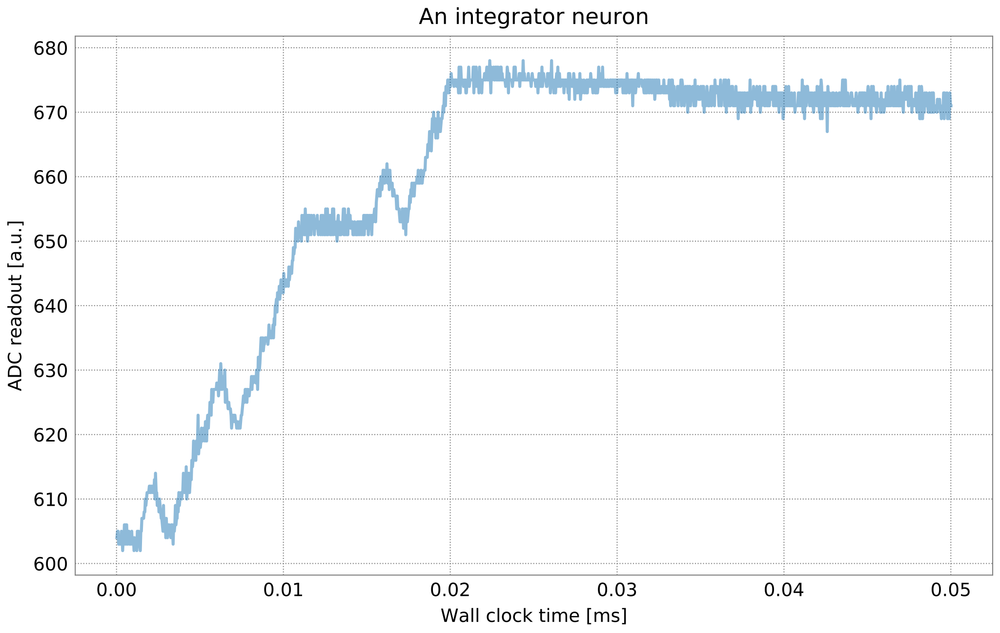

Introduction to matrix multiplication
=====================================

BrainScaleS-2 is capable of performing multiply-accumulate (MAC)
operations within the analog network core. To multiply a vector with a
matrix, the matrix is configured as synapse weights. The vector is
encoded as pulse widths which stimulate synapse rows, therefore each
synapse multiplies its weight with a vector entry. Neurons accumulate
synaptic inputs from their column, thus accumulate the multiplication
results from a matrix column.

Principles
----------

The analog network core consists of a synapse matrix (green dots), a row
of neurons (circles on bottom), and a column of synapse drivers
(triangles on the left). The synapse drivers stimulate twin-rows of
synapses for a variable time. By combining an excitatory and inhibitory
synapse, we can allow for signed values in the weight matrix. The
synapses send their charge output to the neurons at the bottom, which
integrate the currents on the membrane. A columnar analog-to-digital
converter (CADC) can digitize the membrane potentials of all neurons in
parallel. The on-chip processor (PPU) will then read the result vector
obtained by the CADC and could perform further operations with it.

In this example MAC operation, a vector (31, 5) is to be multiplied with
a column of weights (20, -63).

To process the first vector entry, the top synapse driver activates the
top twin-row of synapses for a long time as the vector value is 31 (=
maximum of our 5-bit range). The positively signed synapse creates a low
current as the weight is 20 (maximum would be 63 in our 6-bit range).
The neuron receives a long but small current input and the membrane
voltage rises.

For the next vector entry, the second synapse driver enables the
synapses much shorter as the vector value is only 5. The current
generated by the synapse is higher as its weight is maximum. The neuron
receives a short but strong current input, but subtracts it from the
membrane voltage as the synapse attaches to its inhibitory input.

.. admonition:: References for further reading

    The hardware perspective and a benchmark on MNIST handwritten digits is
    published in:

    Weis J. et al. (2020) Inference with Artificial Neural Networks on
    Analog Neuromorphic Hardware. In: Gama J. et al. (eds) IoT Streams for
    Data-Driven Predictive Maintenance and IoT, Edge, and Mobile for
    Embedded Machine Learning. ITEM 2020, IoT Streams 2020. Communications
    in Computer and Information Science, vol 1325. Springer, Cham.
    https://doi.org/10.1007/978-3-030-66770-2_15

    The integration into the PyTorch software frontend ``hxtorch`` and a
    benchmark on the human activity recognition dataset is published in:

    Spilger P. et al. (2020) hxtorch: PyTorch for BrainScaleS-2. In: Gama J.
    et al. (eds) IoT Streams for Data-Driven Predictive Maintenance and IoT,
    Edge, and Mobile for Embedded Machine Learning. ITEM 2020, IoT Streams
    2020. Communications in Computer and Information Science, vol 1325.
    Springer, Cham. https://doi.org/10.1007/978-3-030-66770-2_14

Example
-------

First, we demonstrate how a neuron responds to synaptic currents in
integration mode.

By altering the target parameters for calibration, we set the neurons to
short synaptic time constants and long membrane time constants. When
observing the membrane at the typical time ranges of many milliseconds
biological time, we can observe step-like changes in the membrane
potential for each synaptic stimulus. Since vector-matrix multiplication
has no continuous time, we can send the vector entries much faster than
biological spikes, at up to 125 MHz (hardware time, biological
equivalent: 125 kHz).

In this example, we generate a few inputs and observe the neuron
membrane during integration.

In order to use the microscheduler we have to set some environment variables first:

.. include:: common_quiggeldy_setup.rst

.. code:: ipython3

    %matplotlib inline
    import matplotlib.pyplot as plt
    import numpy as np
    import ipywidgets as widgets
    
    import pynn_brainscales.brainscales2 as pynn
    from pynn_brainscales.brainscales2 import Population
    from pynn_brainscales.brainscales2.standardmodels.cells import SpikeSourceArray
    from pynn_brainscales.brainscales2.standardmodels.synapses import StaticSynapse
    
    
    def plot_membrane_dynamics(population: Population, segment_id=-1, ylim=None):
        """
        Plot the membrane potential of the neuron in a given population view. Only
        population views of size 1 are supported.
        :param population: Population, membrane traces and spikes are plotted for.
        :param segment_id: Index of the neo segment to be plotted. Defaults to
                           -1, encoding the last recorded segment.
        :param ylim: y-axis limits for the plot.
        """
        if len(population) != 1:
            raise ValueError("Plotting is supported for populations of size 1.")
        # Experimental results are given in the 'neo' data format
        mem_v = population.get_data("v").segments[segment_id].irregularlysampledsignals[0]

        plt.plot(mem_v.times, mem_v, alpha=0.5)
        print(f"Mean membrane potential: {np.mean(np.array(mem_v.base))}")
        plt.xlabel("Wall clock time [ms]")
        plt.ylabel("ADC readout [a.u.]")
        if ylim:
            plt.ylim(ylim)

Next we load a nightly calibration which is specifically tuned for the integration of synaptic inputs, for example it targets long membrane time constants.
We save this calibration in two variables and use it later to define our neural network:

.. code:: ipython3

        from _static.common.helpers import get_nightly_calibration
        calib = get_nightly_calibration("hagen_cocolist.pbin")

Now we define our experiment:

.. code:: ipython3

    def generate_external_inputs(stimulated_population):
        """
        Create off-chip populations serving as excitatory/inhibitory spike sources.
    
        Feel free to modify the `{exc,inh}_spiketimes` and the `weight` of the stimulation.
    
        :param simulated_population: Population to map inputs to.
        """
        exc_spiketimes = [1, 3, 4, 5, 7, 8, 9, 10, 15, 17, 18, 19]  # us
        exc_spiketimes = np.array(exc_spiketimes) / 1e3
        exc_stim_pop = pynn.Population(1, SpikeSourceArray(spike_times=exc_spiketimes))
        pynn.Projection(exc_stim_pop, stimulated_p,
                        pynn.AllToAllConnector(),
                        synapse_type=StaticSynapse(weight=63),
                        receptor_type="excitatory")
    
        inh_spiketimes = [2, 6, 16]  # us (bio: ms)
        inh_spiketimes = np.array(inh_spiketimes) / 1e3
        inh_stim_pop = pynn.Population(1, SpikeSourceArray(spike_times=inh_spiketimes))
        pynn.Projection(inh_stim_pop, stimulated_p,
                        pynn.AllToAllConnector(),
                        synapse_type=StaticSynapse(weight=-63),
                        receptor_type="inhibitory")
    
    plt.figure()
    plt.title("An integrator neuron")
    
    # reset membrane potential before beginning of experiment (it floats otherwise)
    pynn.setup(initial_config=calib)
    
    # use calibrated parameters for neuron
    silent_p = pynn.Population(2, pynn.cells.HXNeuron())
    stimulated_p = pynn.Population(1, pynn.cells.HXNeuron())
    generate_external_inputs(stimulated_p)
    stimulated_p.record(["v", "spikes"])
    
    pynn.run(50e-3)  # run for 50 us
    plot_membrane_dynamics(stimulated_p)
    plt.show()

In the plot, you can see the integration phase in the beginning and a
random drift after all inputs are received. Since the leakage is
disabled, we do not decay to a controlled leak potential.

For practial usage, the vector entries will be sent much faster, at a
rate of up to 125 MHz, so the membrane has much less time to drift than
here. In the beginning, the membrane potential is reset to a known
starting voltage and in the end, the potential is digitized immediately
after all inputs are received.

We will now use the ``hxtorch`` software frontend which provides a
vector-matrix multiplication on chip and supports the standard layers
used in deep neural networks. First, we investigate the characteristics
of the analog MAC operation.

