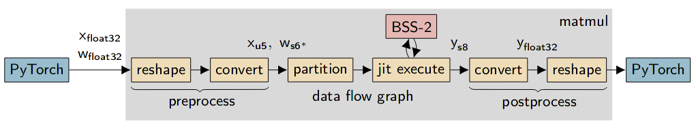
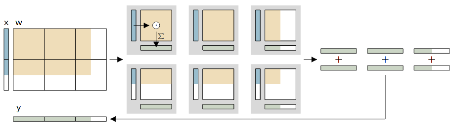
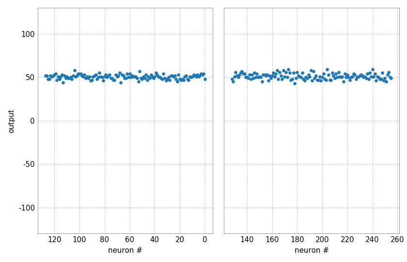
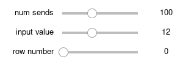

Exploring the analog MAC operation
==================================

.. note::
   Currently, this code is not executable on the EBRAINS platform.

This example presents the non-spiking mode of the BrainScaleS-2 ASIC and
some of its characteristics. The operation of this so-called hagen mode
is explained in more detail in the matrix multiplication introduction.

In order to use the microscheduler we have to set some environment variables first:

.. include:: common_quiggeldy_setup.rst

First, we import some things needed later:

.. code:: ipython3

    %matplotlib inline
    import numpy as np
    import torch
    import hxtorch

    import matplotlib as mpl
    import matplotlib.pyplot as plt
    from contextlib import suppress
    with suppress(IOError):
        plt.style.use("_static/matplotlibrc")

    from _static.common.helpers import save_nightly_calibration

    import ipywidgets as w
    from functools import partial
    IntSlider = partial(w.IntSlider, continuous_update=False)

The ``hxtorch`` API
-------------------

The hagen mode provides an analog multiply accumulate operation (MAC)
which is performed on the ASIC.

**hxtorch** provides a high-level API for this operation mode that
integrates this functionality into `PyTorch <https://pytorch.org/>`__.
In analogy to some functions of this  machine-learning framework,
operations with similar API are provided, e.g. ``matmul`` for
multiplication of two matrices:

.. code:: ipython3

    print(hxtorch.matmul.__doc__)

.. parsed-literal::
    :class: solution

    matmul(input: at::Tensor, other: at::Tensor, num_sends: int = 1,
           wait_between_events: int = 5, mock: bool = False) -> at::Tensor

    Drop-in replacement for :meth:`torch.matmul` that uses HICANN-X.
    The current implementation only supports ``other`` to be 1D or 2D.

    :param input: First input tensor, allowed range [0, 31]
    :param other: Second input tensor, allowed range: [-63, 63]
    :param num_sends: How often to send the (same) input vector
    :param wait_between_events: How long to wait (in FPGA cycles) between events
    :returns: Resulting tensor

Before the hardware can be used, we have to allocate a connection and to
load a calibration. This can be achieved using ``hxtorch.init_hardware``:

.. code:: ipython3

    # download claibration and initialize hardware configuration
    save_nightly_calibration('hagen_cocolist.pbin')
    hxtorch.init_hardware(hxtorch.CalibrationPath('hagen_cocolist.pbin'))

This already enables us to multiply matrices using the BSS-2 accelerator:

.. code:: ipython3

    M1 = torch.full((100,), 15.)
    M2 = torch.full((100, 10), 21.)
    hxtorch.matmul(M1, M2)

.. parsed-literal::
    :class: solution

    tensor([55., 60., 59., 56., 60., 63., 57., 58., 56., 62.])

``hxtorch`` integrates the MAC operation into PyTorch on a per-operation
basis (but also supports the combination of multiple operations) and is
executed just-in-time on the BrainScaleS-2 hardware.

A decisive advantage of the matrix multiplication mode is the possibility
to decompose large operations and smaller parts and either multiplex them
in time or even divide them among several BrainScaleS-2 ASICs:

Noise and fixed-pattern deviations
----------------------------------

Despite calibration and even with the same inputs and weights, the
outputs of the different neurons are not identical. On the one hand,
each output has a statistical noise due to the analog nature of the
neuron, on the other hand, fixed-pattern deviations show up between the
individual neurons. Especially in the case of small inputs, a spatial
correlation may also become apparent, resulting from different distances
to the synapse drivers.

.. code:: ipython3

    # prepare output figure
    neurons = torch.arange(0, 256)
    slices = [slice(0, 128), slice(128, 256)]
    fig, axes = plt.subplots(1, 2, sharey=True)
    for ax, s in zip(axes, slices):
        ax.plot(neurons[s], torch.zeros_like(neurons[s]), ".", c="C0")
        ax.set_xlim(s.start, s.stop); ax.set_ylim(-130, 130)
        ax.xaxis.set_major_locator(mpl.ticker.MultipleLocator(32))
        ax.set_xlabel("neuron #"); ax.set_ylabel("output"); ax.label_outer()
    axes[0]; axes[0].invert_xaxis()
    plt.close()
    output = w.Output()

    @w.interact(
        num_sends=IntSlider(100, 1, 256, description="num sends"),
        input_value=IntSlider(12, 0, 31, description="input value"),
        weight_value=IntSlider(21, -63, 63, description="weight value"),
        row_number=IntSlider(0, 0, 127, description="row number"),
    )
    def experiment(num_sends, input_value, weight_value, row_number):
        """ Updates the plot with the outputs from the hardware """
        result = hxtorch.matmul(
            torch.tensor([0.] * row_number + [input_value], dtype=torch.float),
            torch.full((row_number + 1, 256), weight_value, dtype=torch.float),
            num_sends=num_sends)
        for ax, s in zip(axes, slices):
            ax.lines[0].set_ydata(result[s])
        output.clear_output(wait=True)
        with output:
            display(fig)
    experiment(100, 12, 21, 0)  # needed for testing
    display(output)

.. image:: _static/tutorial/hagen_properties_sliders1.png
   :width: 300px
   :class: solution

Linearity of the MAC operation
------------------------------

The next plot shows the linear relationship between input, weight and
output. For this purpose, a constant input is multiplied by a linearly
increasing weight vector.

.. code:: ipython3

    weight = torch.arange(-63, 64.).repeat_interleave(2)

    # prepare output figure
    fig, ax = plt.subplots(1, 1)
    ax.plot(weight, torch.zeros_like(weight), ".", c="C0")
    ax.set_xlim(-64, 64); ax.set_ylim(-130, 130)
    ax.xaxis.set_major_locator(mpl.ticker.MultipleLocator(16))
    ax.set_xlabel("weight"); ax.set_ylabel("output")
    plt.close()
    output = w.Output()

    @w.interact(
        num_sends=IntSlider(100, 1, 256, description="num sends"),
        input_value=IntSlider(12, 0, 31, description="input value"),
        row_number=IntSlider(0, 0, 127, description="row number"),
    )
    def experiment(num_sends, input_value, row_number):
        """ Updates the plot with the outputs from the hardware """
        result = hxtorch.matmul(
            torch.tensor([0.] * row_number + [input_value], dtype=torch.float),
            weight.unsqueeze(0).expand(row_number + 1, -1),
            num_sends=num_sends)
        ax.lines[0].set_ydata(result)
        output.clear_output(wait=True)
        with output:
            display(fig)
    experiment(100, 12, 0)  # needed for testing
    display(output)

.. image:: _static/tutorial/hagen_properties_fig2.png
   :width: 90%
   :align: center
   :class: solution

At output values of about -80 to 80 a good linear correlation can be
observed. For smaller or larger values, the used ADC saturates; this
happens earlier for some neurons and later for others.

Possible questions:
~~~~~~~~~~~~~~~~~~~

How does the result change with several successive calls to ``hxtorch.matmul``?
^^^^^^^^^^^^^^^^^^^^^^^^^^^^^^^^^^^^^^^^^^^^^^^^^^^^^^^^^^^^^^^^^^^^^^^^^^^^^^^

Due to its analog nature, the BrainScaleS-2 ASIC provides slightly
different values for each call. Quantify the noise on each neuron!

What is the relationship between input and output? Is it linear?
^^^^^^^^^^^^^^^^^^^^^^^^^^^^^^^^^^^^^^^^^^^^^^^^^^^^^^^^^^^^^^^^

We have seen that the relationship between weight and output is quite
linear at intermediate values. How, on the other hand, does the output
change with changing inputs and constant weight? Is the relationship
linear?

Negative inputs?
^^^^^^^^^^^^^^^^

The inputs to the multiply accumulate operation correspond to the time a
current flows on neuron membranes, which means they must be positive
only. How would it still be possible to allow negative inputs in a
calculation?

.. jupyter::
    :cell-break:

The integration with PyTorch allows the MAC to be used very easily for
conventional machine learning. For this, the forward pass is computed with
the ASIC, the backward pass on the host computer. The example for training
DNNs shows such a usage.
