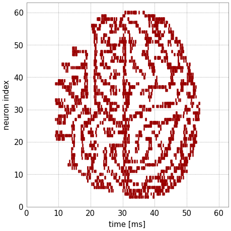

BrainScaleS-2 on-chip plasticity experiment
===========================================

In addition to the analog neural network core, BrainScaleS-2 features two embedded
general-purpose processors, called PPUs (Plasticity Processing Units).
They can be used for experiment control and alterations of configuration during
the run-time of an experiment.
This example makes use of this feature by show-casing synaptic plasticity.

.. code:: ipython3

    %matplotlib inline
    from os.path import join
    import numpy as np
    import matplotlib.pyplot as plt
    import pynn_brainscales.brainscales2 as pynn
    from dlens_vx_v3 import hal, lola, halco, sta

We want to show how the PPUs can be used to rate-code an image in the activity of
neurons (our canvas will be the activity of the neurons over time).
This is done by switching synapses on and off using a predefined data sequence.
Each PPU has 16kiB on-chip memory. For a quadratic image to fit, it is therefore
limited to 64x64 pixels. For simplicity, only one of the two PPUs is used.

For loading and converting an image, some helpers are required:

.. code:: ipython3

    def read_image(path: str) -> np.array:
        """
        Read image from file and scale it to the weight range.
        :param path: Path to image file
        :return: Image data as numpy array normalised to hardware weight range
        """
        image = np.asarray(plt.imread(path))
        # Scale to weight range [0, 63)
        image = image / image.max() * hal.SynapseWeightQuad.Value.max
        return image

Controlling the on-chip plasticity processor
--------------------------------------------

Later, we will define the network topology using the pyNN interface.
During the experiment, the PPUs execute an earliest-deadline-first scheduler for
tasks to be performed. In PyNN, execution of a plasticity rule is such a task.
A plasticity rule is injected via the synapse type of a projection and upon execution
is provided with the locations of the synapses in the projection(s) created with this
plastic synapse type. The plasticity rule features a method yielding C++-code to be
executed as a task on the PPU given the synapse location information.
Tasks can be executed periodically, for which a timer object is to be supplied.

For our experiment, we first load an image to be rate-encoded later.

.. image:: _static/tutorial/visions.png
   :width: 10%
   :align: center

.. code:: ipython3

    # Read image into 2d numpy array
    image = read_image(join("_static", "tutorial", "visions.png"))

Furthermore, we set some environment variables for our microscheduler:

.. include:: common_quiggeldy_setup.rst

The plasticity kernel
---------------------

We now define the plasticity rule type with the C++-code which imprints the image
onto the spike-trains by alteration of the synaptic weights.
The image data is transferred into a global object ``image``.
The entry point of the plastic task is called ``PLASTICITY_RULE_KERNEL``
and is supplied with synapse location information corresponding the the projection
in PyNN. Within the task function, the program writes synapse weight values
row-wise via ``set_weights(weight_row, row)``.
Since the task is scheduled periodically configured via the ``Timer`` object, after
each write, the period duration is waited before the next row of the image is written.
Over time, this leads to each row of the image being present and imprinting itself
onto the neurons' firing rate.

.. code:: ipython3

    import textwrap

    class PlasticityRule(pynn.PlasticityRule):
        def __init__(self, timer: pynn.Timer, image: np.array):
            """
            Initialize plastic synapse with execution timing information,
            the image pixels and initial weight.
            """
            pynn.PlasticityRule.__init__(self, timer)
            self.image = image
            assert self.timer.num_periods == len(self.image)

        def generate_kernel(self) -> str:
            """
            Generate plasticity rule kernel to be compiled into PPU program.

            :return: PPU-code of plasticity-rule kernel as string.
            """
            return textwrap.dedent("""
            #include "grenade/vx/ppu/synapse_array_view_handle.h"
            #include "grenade/vx/ppu/neuron_view_handle.h"
            #include "libnux/vx/dls.h"

            using namespace grenade::vx::ppu;
            using namespace libnux::vx;

            /**
             * PPU currently executing this code (top/bottom).
             */
            extern volatile PPUOnDLS ppu;

            /**
             * Image data.
             */
            uint8_t const image[{image_h}][{image_w}] = {{
                {image_pixels}
            }};

            /**
             * Currently to be presented row in image.
             */
            uint32_t current_row = 0;

            void PLASTICITY_RULE_KERNEL(
                std::array<SynapseArrayViewHandle, 1>& synapses,
                std::array<NeuronViewHandle, 0>&)
            {{
                // only update weights when code is executed on the correct PPU
                if (synapses[0].hemisphere != ppu) {{
                    return;
                }}
                for (size_t row = 0; row < synapses[0].rows.size; ++row) {{
                    if (synapses[0].rows.test(row)) {{
                        // load new vertical line of image
                        vector_row_t weight_row;
                        size_t w = 0;
                        for (size_t column = 0;
                             column < synapses[0].columns.size; ++column) {{
                            if (synapses[0].columns.test(column)) {{
                                weight_row[column] = image[w][current_row];
                                w++;
                            }}
                        }}

                        // alter weights in synapse memory
                        synapses[0].set_weights(weight_row, row);
                    }}
                }}
                current_row++;
            }}
            """.format(image_h=len(self.image), image_w=len(self.image[0]),
                       image_pixels=",".join(["{" + ", ".join(
                           [str(int(pixel)) for pixel in row]) + "}"
                                for row in self.image])))

The experiment
--------------

For this simple binary on-off plasticity, we don't need the full-fledged capabilities
of the neurons and therefore configure them to bypass-mode, where every incoming spike
elicits an output spike.

.. code:: ipython3

    pynn.setup(enable_neuron_bypass=True)

Our network uses a single-layer feed-forward structure.
External Poisson stimulus is generated with a constant rate.
We use multiple sources for decorrelation of the neurons' spikes in order to prevent
congestion effects due to the neuron bypass mode.

.. code:: ipython3

    bg_props = dict(
        start=0,  # ms
        rate=4000,  # Hz
        duration=64  # ms
    )
    external_input = pynn.Population(64, pynn.cells.SpikeSourcePoisson(**bg_props))

The target population consists of 64 neurons, spikes are recorded.

.. code:: ipython3

    neurons = pynn.Population(64, pynn.cells.HXNeuron())
    neurons.record(["spikes"])

Since the external stimulus population's size matches the internal population's size,
a one-to-one connector is used as projection.
Initially the weight is set to zero, the PPU will alter it during the experiment.

.. code:: ipython3

    timer = pynn.Timer(
        start=0., # ms
        period=1., # ms
        num_periods=len(image))
    plasticity_rule = PlasticityRule(timer=timer, image=image)
    synapse = pynn.standardmodels.synapses.PlasticSynapse(
        plasticity_rule=plasticity_rule, weight=0)
    pynn.Projection(external_input,
                    neurons,
                    pynn.OneToOneConnector(),
                    synapse_type=synapse)

We run the experiment for 64 ms, during which we expect a weight change every ms
leading to all image columns being present as weights for this duration one after
the other.

.. code:: ipython3

    pynn.run(64) # ms

Last, the recorded spike-trains are visualized.

.. code:: ipython3

    spikes = neurons.get_data("spikes").segments[0]
    spiketrains = []
    for spiketrain in spikes.spiketrains:
        spiketrains.append(spiketrain.base)

    fig = plt.gcf()
    fig.set_size_inches(4, 4)

    plt.eventplot(spiketrains, color='#990000')
    plt.xlim(0,64)
    plt.ylim(0,63)
    plt.xlabel("time [ms]")
    plt.ylabel("neuron index")
    fig.show()

We see a replicated version of the original image encoded in the time evolution of
the neurons' firing rates.

